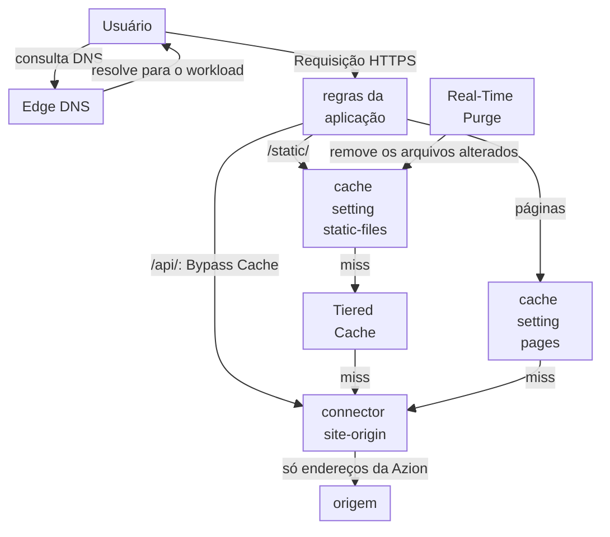
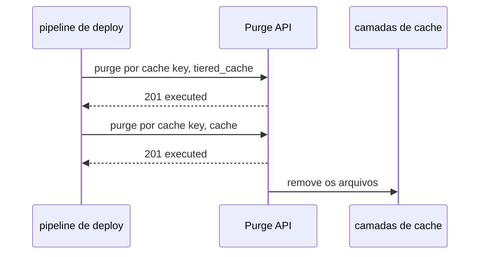

import DocCardGroup from '@aziontech/webkit/doc-card-group'
import DocCard from '@aziontech/webkit/doc-card'

Um time de engenharia ou de SRE executa um site e as suas APIs em uma origem que ele opera, em uma região de nuvem ou em um data center. Os usuários longe dessa origem veem páginas lentas, e os picos de tráfego a sobrecarregam. Arquivos estáticos e páginas são os mesmos para todos os usuários, enquanto as chamadas de API são diferentes para cada um e precisam sempre chegar à origem. Esta página configura uma aplicação na frente da origem que cacheia arquivos estáticos e páginas, com Tiered Cache para os arquivos estáticos, repassa as chamadas de API à origem e faz a origem aceitar conexões só da Azion. O resultado é medido pelo time to first byte e pelo tempo de carregamento de página para os usuários, pela parcela das requisições respondidas pelo cache e pela queda nas requisições e nos dados que chegam à origem.

Este caso de uso não cobre a saída do site da sua origem, o failover entre origens nem a otimização de imagens. Para failover, consulte [Manter uma aplicação no ar quando uma origem falha](/pt-br/documentacao/casos-de-uso/melhorar-performance-e-confiabilidade/manter-uma-aplicacao-no-ar-quando-uma-origem-falha/). Para imagens, consulte [Otimizar imagens para sites e aplicações móveis](/pt-br/documentacao/casos-de-uso/melhorar-performance-e-confiabilidade/otimizar-imagens-para-sites-e-aplicacoes-moveis/). Para um site de marketing em um CMS, consulte [Criar e operar sites de marketing](/pt-br/documentacao/casos-de-uso/construir-e-executar-aplicacoes/criar-e-operar-sites-de-marketing/).

## Pré-requisitos

- Uma conta Azion. Se você ainda não tem uma, [crie uma conta](https://console.azion.com/signup).
- Uma aplicação que serve o seu site por meio de um connector e de um workload, com uma regra cujo behavior **Set Connector** envia todas as requisições ao connector. Para criá-los, consulte [Primeiros passos com Applications](/pt-br/documentacao/plataforma/applications/primeiros-passos/).
- Application Accelerator nessa aplicação, que o behavior **Bypass Cache** e os métodos `POST`, `PUT`, `PATCH`, `DELETE` e `OPTIONS` da API exigem. Para ativá-lo, consulte [Ative Application Accelerator](/pt-br/documentacao/guias/performance-e-confiabilidade/cache-e-purge/cache-settings/#ative-application-accelerator).
- Acesso ao firewall na frente da sua origem, onde fica a allowlist.

---

## Produtos necessários

| O site precisa de | O que significa | Produto | Documentado em |
| --- | --- | --- | --- |
| O domínio respondido pela Azion em vez da origem | Um registro `CNAME` para um subdomínio, ou um registro `ANAME` no apex, apontando para o domínio do workload em uma zona do Edge DNS | Edge DNS | [Aponte um domínio para um workload](/pt-br/documentacao/guias/plataforma/migracao/apontar-dominio-para-a-azion/) |
| Arquivos estáticos e páginas servidos perto do usuário | Duas cache settings, cada uma aplicada por uma regra que corresponde aos seus caminhos | Cache | [Crie um cache setting](/pt-br/documentacao/guias/performance-e-confiabilidade/cache-e-purge/ajustar-cache-settings/) |
| Menos requisições chegando à origem quando um data center tem um miss | Tiered Cache na cache setting dos arquivos estáticos | Cache | [Tiered Cache](/pt-br/documentacao/plataforma/applications/cache/tiered-cache/) |
| Chamadas de API que sempre chegam à origem, com todos os métodos | Uma regra que faz bypass do cache no caminho da API | Application Accelerator | [Bypass Cache](/pt-br/documentacao/plataforma/applications/rules-engine/#bypass-cache) |
| Uma origem que aceita conexões só da Azion | Origin IP ACL no connector, e a lista `Azion Origin Shield` no firewall da origem | Origin Shield | [Restrinja uma origem à Azion com Origin IP ACL](/pt-br/documentacao/guias/seguranca-de-aplicacoes/bots-e-rede/restringir-uma-origem-a-azion-com-origin-ip-acl/) |
| Parcela das requisições respondidas pelo cache e carga na origem | Os dashboards **Requests**, **Data Transferred** e **Tiered Cache**, filtrados pelo domínio | Real-Time Metrics | [Meça o offload de cache de um domínio](/pt-br/documentacao/guias/plataforma/observabilidade/medir-offload-de-cache/) |

Apontar o domínio para a Azion é igual para todos os sites, então não tem seção nesta página. Para criar o registro, consulte [Aponte um domínio para um workload](/pt-br/documentacao/guias/plataforma/migracao/apontar-dominio-para-a-azion/), e para o apex, [Aponte um domínio raiz com ANAME](/pt-br/documentacao/guias/seguranca-de-aplicacoes/dns/acessar-root-domain/).

---

## Arquitetura de referência

Esta página constrói o *Proxy reverso com cache na frente de uma origem*: uma aplicação que responde do cache tudo o que pode e só chega à origem em um miss.

Leia o diagrama como uma cadeia de camadas que tentam responder, cada uma, antes que a seguinte seja consultada. O cache do data center responde primeiro, a camada do Tiered Cache responde os arquivos estáticos que o data center não tem, e só um miss em todas as camadas chega à origem pelo connector. As chamadas de API pulam as camadas e vão direto ao connector. A origem fica atrás de uma allowlist, então o connector é a única entrada. Real-Time Purge age no cache pelo lado, removendo o conteúdo que a origem mudou antes que o seu TTL termine.

### Fluxo de dados

1. Edge DNS resolve `www.example.com` para o workload, e a requisição do usuário chega à aplicação em um data center próximo.
2. As regras da aplicação leem o caminho na Request Phase e aplicam uma cache setting: `static-files` a um arquivo de `/static/`, `pages` a uma página. Uma cópia válida no cache do data center responde a requisição, e a origem não é consultada.
3. Em um miss de um arquivo estático, o data center consulta a camada do Tiered Cache, que é compartilhada por todos os data centers e guarda objetos por mais tempo. Uma cópia ali responde a requisição sem chegar à origem.
4. Uma chamada de `/api/` faz bypass do cache e chega à origem pelo connector `site-origin`, com todos os métodos HTTP. Qualquer outro miss também chega à origem por `site-origin`, e a resposta é guardada para a requisição seguinte.
5. O connector chega à origem a partir de um endereço da lista `Azion Origin Shield`, e o firewall da origem recusa todas as outras fontes.
6. Quando um deploy muda arquivos estáticos, um purge por cache key os remove antes que o seu TTL termine, primeiro da camada do Tiered Cache e depois do Cache, e a requisição seguinte busca a nova versão. Um purge por cache key é o único tipo que chega à camada do Tiered Cache.

### Recursos de Plataforma

- **Edge DNS**: resolve o domínio para o workload. Um subdomínio como `www.example.com` aponta para o domínio do workload com um registro `CNAME`, e o apex com um registro `ANAME`.
- **aplicação**: o Platform Resource que guarda as cache settings `static-files` e `pages` e as regras que as aplicam, caminho por caminho, ao lado da regra que faz bypass do cache em `/api/`.
- **Application Accelerator**: o Product que o behavior **Bypass Cache** exige, para que a aplicação envie cada chamada em `/api/` à origem sem guardar a resposta.
- **Cache**: guarda as respostas no data center que as buscou e responde às requisições repetidas com a cópia, pelo TTL da cache setting.
- **Tiered Cache**: a Feature que adiciona uma segunda camada de cache entre o Cache e a origem, na região que a sua topologia nomeia. Ela exige _Override cache behavior_ e um **Max Age** de pelo menos 3 segundos, e nesta página cobre só os arquivos estáticos.
- **connector**: o Platform Resource que chega à origem em um miss em todas as camadas de cache e em todas as chamadas de API. Nesta página, é `site-origin`.
- **Origin Shield**: com Origin IP ACL no connector, o próprio firewall da origem permite os prefixos da lista `Azion Origin Shield` e recusa todas as outras fontes.
- **Real-Time Purge**: o Platform Resource que remove do cache o conteúdo alterado antes que o seu TTL termine.
- **Real-Time Metrics**: mostra a parcela das requisições e dos dados respondidos pelo cache, o que chegou à origem e o que a camada do Tiered Cache absorveu.

### Outros designs para este caso de uso

- *Proxy reverso de aceleração para APIs dinâmicas*: para times cujas respostas são personalizadas ou transacionais e não podem ser cacheadas. Toda requisição em um caminho dinâmico vai até a origem, então o tempo de resposta da origem sempre faz parte do tempo de resposta, e as decisões são o tratamento das conexões e o bypass de cache em vez de TTLs e purge.

---

## Como o design funciona

Esta seção explica as quatro partes do design que são específicas deste site: o cache para arquivos estáticos e páginas, o repasse da API, Origin Shield no connector e o purge no deploy.

### Cache para arquivos estáticos e páginas

O cache deste site são duas cache settings, uma por tipo de conteúdo, cada uma aplicada pela sua própria regra. Os arquivos estáticos só mudam quando você faz deploy, então ficam em cache por muito tempo e passam pelo Tiered Cache. As páginas mudam entre deploys, então ficam em cache por pouco tempo.

A setting `static-files` usa _Override cache behavior_ com um **Max Age** de `86400` segundos, um dia. O purge no deploy remove um arquivo alterado no momento do deploy, então o dia só limita quanto tempo um arquivo fica desatualizado quando um purge não é enviado. **Tiered Cache** fica ativo, com a região mais próxima como topologia: o Tiered Cache foi projetado para objetos que ficam em cache por muito tempo, e exige _Override cache behavior_. O cache do navegador respeita o `Cache-Control` que a origem envia para cada arquivo.

A setting `pages` usa um **Max Age** de `300` segundos, então uma página editada na origem chega aos usuários em até cinco minutos sem purge. O cache do navegador dela é sobrescrito para `0` segundos, porque uma cópia no navegador do usuário não pode ser purgada. Ela não tem Tiered Cache, porque um objeto de cinco minutos ganha pouco com uma segunda camada.

As duas settings mantêm **Stale cache** ativo, como o Azion Console o define para uma nova setting. Uma cópia expirada então responde por até 300 segundos quando a origem retorna um erro `5xx` ou excede o tempo limite.

### Repasse da API

As respostas da API são diferentes para cada chamador, então o caminho da API faz bypass do cache e todas as chamadas chegam à origem. A regra corresponde a `/api/` e carrega **Bypass Cache**. Application Accelerator, já ativo na aplicação, é o que faz a aplicação aceitar as chamadas `POST`, `PUT`, `PATCH`, `DELETE` e `OPTIONS` da API, além de `GET` e `HEAD`. Uma requisição com bypass mantém as otimizações de protocolo e, quando possível, uma conexão keep-alive com a origem, então cada chamada evita abrir uma nova conexão.

O caminho da API não tem cache setting com Tiered Cache, então nenhuma resposta dele vai parar na camada do Tiered Cache: **Bypass Cache** age no cache da Azion, e não nessa camada.

### Origin Shield no connector

Origin IP ACL faz a origem aceitar conexões só da Azion, então um cliente que descobre o endereço da origem não consegue alcançá-la contornando a aplicação. A verificação tem duas metades. O connector ativa Origin IP ACL, o que disponibiliza a lista de rede `Azion Origin Shield` para a sua conta. O firewall da sua origem então permite os prefixos dessa lista e nega todas as outras fontes. A Azion não aplica a allowlist: o seu firewall aplica.

As duas metades são executadas em `site-origin` e no firewall na frente da sua origem. A allowlist guarda os prefixos IPv4 e IPv6 da lista, e a regra de negação só vem depois que todos os prefixos são permitidos.

A Azion muda a lista de tempos em tempos e envia um email para a sua conta a cada vez. Os servidores atrás de um prefixo adicionado entram em produção 7 dias depois que a Azion publica a mudança, então um job que lê a lista com uma frequência menor que 7 dias mantém a sua allowlist atualizada.

### Purge no deploy

Um deploy que muda arquivos estáticos envia um purge, para que os usuários recebam os novos arquivos sem esperar o **Max Age** de um dia. A setting `static-files` tem o Tiered Cache ativo, e um purge por cache key é o único tipo que chega à camada do Tiered Cache. Por isso, o deploy purga cada arquivo alterado por cache key, primeiro na camada do Tiered Cache e depois no Cache, para que a primeira camada não se reabasteça com uma cópia desatualizada do Tiered Cache.

1. O deploy publica os novos arquivos na origem.
2. Ele envia um purge por cache key para cada arquivo alterado, com `layer` igual a `tiered_cache`.
3. Ele envia o mesmo purge com `layer` igual a `cache`.
4. A requisição seguinte por cada arquivo tem miss nas duas camadas, chega à origem e guarda a nova versão.

Uma cache key é o esquema, o host e o caminho, sem separador entre eles.

Um purge por cache key aceita até 50 chaves por requisição, então um deploy que muda mais arquivos os divide em várias requisições. Uma página que muda sem deploy não precisa de purge: o seu **Max Age** de cinco minutos a atualiza.

---

## Medindo resultados

| Métrica | Onde ler | Como fica quando funciona |
| --- | --- | --- |
| Parcela das requisições respondidas pelo cache | **Requests Offloaded** no Real-Time Metrics, filtrado pelo host. Consulte [Meça o offload de cache de um domínio](/pt-br/documentacao/guias/plataforma/observabilidade/medir-offload-de-cache/) | Sobe depois que as regras de cache se propagam e se mantém durante os picos de tráfego |
| Requisições e dados que chegam à origem | **Missed Requests** e **Missed Data**, filtrados pelo host, e **Tiered Cache Offload** na aba **Tiered Cache** | Caem depois que as regras de cache se propagam; Tiered Cache Offload mostra os misses que a segunda camada absorveu |
| Time to first byte e tempo de carregamento de página para os usuários | Os campos `ttfb` e `pageloadtime` das medições do Edge Pulse, feitas nos navegadores dos usuários. Consulte [Primeiros passos com Edge Pulse](/pt-br/documentacao/plataforma/edge-pulse/primeiros-passos/) | Menores depois que o domínio aponta para a Azion, em todas as páginas que carregam a tag do Edge Pulse |

---

## Boas práticas

- **Mantenha o Tiered Cache desligado em qualquer caminho com bypass.** **Bypass Cache** age no cache da Azion, e não na camada do Tiered Cache, então um caminho cuja cache setting tem o Tiered Cache ativo continua respondendo dessa camada. Nesta página, o caminho `/api/` com bypass não tem nenhuma cache setting. Para o sintoma, consulte [Solucionar problemas de Applications](/pt-br/documentacao/plataforma/applications/solucao-de-problemas/#cache).
- **Purgue no deploy em vez de encurtar o Max Age.** Um **Max Age** curto envia mais requisições à origem e ainda deixa uma janela de conteúdo desatualizado. O deploy sabe quais arquivos mudaram, então ele os purga, e o **Max Age** fica como um limite de segurança.
- **Use Bypass Cache para a API, e não um Max Age de 0.** Um **Max Age** de `0` junta requisições simultâneas para um caminho em uma única requisição à origem, e dois chamadores de uma API precisam de duas respostas. Para a diferença, consulte [Variação de cache](/pt-br/documentacao/plataforma/applications/application-accelerator/variacao-de-cache/#bypass-cache-e-um-ttl-de-0).
- **Permita as duas famílias de endereços na origem.** A lista `Azion Origin Shield` traz prefixos IPv6 ao lado dos seus prefixos IPv4, e a Azion se conecta às origens pelas duas. Uma allowlist só com os prefixos IPv4 recusa as conexões que a Azion abre por IPv6.

---

## Guias deste caso de uso

<DocCardGroup cols={2}>
  <DocCard title="Crie um cache setting" href="/pt-br/documentacao/guias/performance-e-confiabilidade/cache-e-purge/ajustar-cache-settings/" label="Cria as cache settings static-files e pages, com Tiered Cache nos arquivos estáticos, e as regras que as aplicam." />
  <DocCard title="Restrinja uma origem à Azion com Origin IP ACL" href="/pt-br/documentacao/guias/seguranca-de-aplicacoes/bots-e-rede/restringir-uma-origem-a-azion-com-origin-ip-acl/" label="Ativa Origin IP ACL em site-origin e permite só a lista Azion Origin Shield no firewall da origem." />
  <DocCard title="Configure políticas de cache para uma aplicação" href="/pt-br/documentacao/guias/performance-e-confiabilidade/cache-e-purge/cache-settings/" label="Cria a regra cdn - api pass-through, que faz bypass do cache em /api/, no Azion Console ou pela API." />
  <DocCard title="Purgue conteúdo em cache" href="/pt-br/documentacao/guias/performance-e-confiabilidade/cache-e-purge/purgar-conteudo-em-cache/" label="Envia os purges por cache key de um deploy à camada do Tiered Cache e ao Cache, e os confirma." />
  <DocCard title="Aponte um domínio para um workload" href="/pt-br/documentacao/guias/plataforma/migracao/apontar-dominio-para-a-azion/" label="Aponta www.example.com para o workload e confirma que o hostname resolve." />
  <DocCard title="Verifique o status de cache de uma resposta" href="/pt-br/documentacao/guias/performance-e-confiabilidade/cache-e-purge/verificar-tempo-de-cache-da-pagina/" label="Lê os headers x-cache e x-cache-key em que as verificações de cache se apoiam." />
</DocCardGroup>
