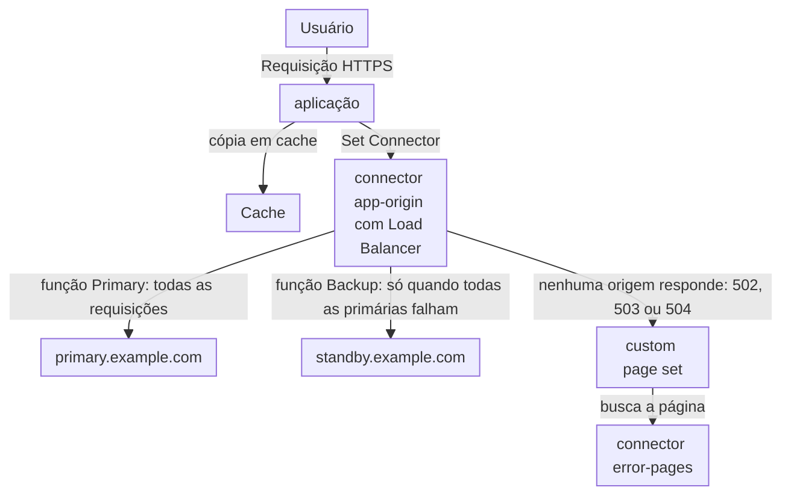

import DocCardGroup from '@aziontech/webkit/doc-card-group'
import DocCard from '@aziontech/webkit/doc-card'

Um time de SRE executa uma aplicação em uma origem primária e mantém uma cópia de reserva dela em um segundo data center, nuvem ou região. Os usuários precisam continuar sendo atendidos quando a primária falha, e a troca precisa acontecer do lado da Azion, sem mudança de DNS e sem lógica no cliente. Esta página agrupa as duas origens em um connector com Load Balancer, para que a origem de reserva só receba requisições quando a primária falha, e substitui a página de erro padrão da Azion pela sua quando nenhuma origem pode responder. O resultado é medido pela parcela das requisições que continuam com sucesso durante um incidente de origem e pela taxa de erro que os usuários veem enquanto o tráfego passa para a origem de reserva.

Este caso de uso não cobre a replicação de dados entre as origens nem a performance de uma única origem. Para uma única origem, consulte [Acelerar sites e APIs com uma CDN](/pt-br/documentacao/casos-de-uso/melhorar-performance-e-confiabilidade/acelerar-sites-e-apis-com-uma-cdn/).

## Pré-requisitos

- Uma aplicação que serve o seu site por meio de um workload, com uma regra cujo behavior **Set Connector** envia as suas requisições a um connector da sua origem primária. Para criá-los, consulte [Primeiros passos com Applications](/pt-br/documentacao/plataforma/applications/primeiros-passos/).
- Uma origem de reserva que guarda o mesmo conteúdo da primária e está configurada da mesma forma para a aplicação.
- Um segundo connector que serve a sua página de erro em `/errors/503.html` e não alcança nenhuma das origens, como um connector do tipo `storage` que lê um bucket do [Object Storage](/pt-br/documentacao/plataforma/object-storage/). Para os seus campos, consulte [Configurações de connector](/pt-br/documentacao/plataforma/connectors/configuracoes/#storage).
- Um personal token, para os passos pela API. Para criar um, consulte [Gerencie personal tokens](/pt-br/documentacao/guias/plataforma/conta-e-billing/personal-tokens/).
- Os nomes das suas origens e do seu domínio. Esta página usa `app-origin` para o connector da origem primária, `primary.example.com` para a origem primária, `standby.example.com` para a origem de reserva, `error-pages` para o connector da página de erro e `www.example.com` para o domínio. Cada origem adiciona um header de resposta `X-Origin-Site` com o valor `primary` ou `standby`, para que uma resposta nomeie a origem que respondeu. Substitua cada valor pelo seu em todos os passos.

---

## Produtos necessários

| A aplicação precisa de | O que significa | Produto | Documentado em |
| --- | --- | --- | --- |
| Uma origem de reserva que recebe o tráfego quando a primária falha | Load Balancer no connector, com a origem primária como endereço _Primary_ e a de reserva como endereço _Backup_ | Load Balancer | [Adicione uma origem de backup a um connector](/pt-br/documentacao/guias/performance-e-confiabilidade/disponibilidade/adicionar-uma-origem-de-backup-a-um-connector/) |
| Uma página própria quando nenhuma origem pode responder | Um custom page set para `502`, `503` e `504`, atribuído no deployment do workload | Workloads | [Mostre a sua própria página quando nenhuma origem responde](/pt-br/documentacao/guias/performance-e-confiabilidade/disponibilidade/mostrar-a-sua-propria-pagina-quando-nenhuma-origem-responde/) |
| Conteúdo em cache que continua respondendo enquanto as origens mudam | As cache settings da aplicação, e o stale cache para as cópias expiradas | Cache | [Expiração e atualização](/pt-br/documentacao/plataforma/applications/cache/expiracao-e-atualizacao/#stale-cache) |
| Erros e tráfego por origem, durante e depois de um incidente | O dashboard **Status Codes** e o endereço upstream de cada requisição | Real-Time Metrics | [Dashboards de Build](/pt-br/documentacao/plataforma/real-time-metrics/dashboards-build/#status-codes) |

---

## Arquitetura de referência

Esta página constrói o *Pool de origens ativo-passivo*: um connector que agrupa uma origem primária e uma de reserva, com a origem de reserva atendendo só quando a primária falha.



Leia o diagrama a partir da aplicação. O Cache responde o que já guarda, e todas as outras requisições chegam a um connector, que guarda as duas origens. Dentro do connector, a função de cada endereço decide quem atende: a primária na operação normal, a de reserva só depois que a primária falha. O custom page set fica no fim do caminho de falha, para o momento em que nenhuma das origens pode responder.

### Fluxo de dados

1. A requisição de um usuário chega à aplicação, e uma cópia válida que o Cache guarda a responde sem chegar a nenhuma das origens.
2. Qualquer outra requisição vai para o connector `app-origin` pela regra **Set Connector** da aplicação.
3. Load Balancer envia a requisição para `primary.example.com`, o único endereço _Primary_. A origem de reserva não recebe nada enquanto a primária responde, então só uma origem grava dados por vez.
4. Quando todos os endereços _Primary_ falham, o que é detectado a partir de conexões que falharam ou excederam o tempo limite, Load Balancer envia a requisição para `standby.example.com`, o endereço _Backup_. A troca para a origem de reserva não precisa de mudança de DNS.
5. Quando nenhuma origem pode ser selecionada ou nenhuma responde a tempo, a Azion retorna `502`, `503` ou `504`, e o custom page set substitui essa resposta pela página que o connector `error-pages` serve, fora do pool.
6. Real-Time Metrics conta os status codes do domínio e, por requisição, a origem que respondeu, enquanto o tráfego passa para a origem de reserva e volta.

### Componentes

- **connector**: o Platform Resource que agrupa as origens. Um connector, `app-origin`, guarda a primária e a de reserva, então a regra que o nomeia não precisa de mudança quando o tráfego passa de uma para a outra.
- **Load Balancer**: atribui a cada endereço a função _Primary_ ou _Backup_. Os endereços _Primary_ sempre têm preferência, e um endereço _Backup_ só recebe requisições quando todos os endereços _Primary_ falham. **Max Retries**, **Connection Timeout** e **Read/Write Timeout** decidem por quanto tempo uma conexão que falha segura uma requisição. O método _IP Hash_ recusa endereços _Backup_.
- **aplicação**: o Platform Resource que roteia as requisições para `app-origin` com uma regra **Set Connector** e aplica as cache settings.
- **Cache**: continua respondendo o conteúdo que guarda enquanto as origens mudam. Com **Stale cache** ativo, ele também serve uma cópia expirada quando a origem retorna um erro `5xx` ou excede o tempo limite.
- **Custom Pages**: o Platform Resource que substitui as respostas de erro da Azion por uma página sua. Cada página é buscada de um connector, então a página fica em `error-pages`, um connector que não alcança nenhuma das origens.
- **Real-Time Metrics**: mostra o tráfego por origem e os erros que os usuários veem, pelos status codes e pelo endereço upstream de cada requisição.

### Outros designs para este caso de uso

- *Pool de origens ativo-ativo entre nuvens*: para times que atendem a partir de duas ou mais origens ao mesmo tempo, para distribuir a carga ou o custo. Todas as origens atendem tráfego ao vivo, então o design precisa de estado replicado ou compartilhado e de uma decisão de afinidade de sessão, e uma falha remove capacidade em vez de trocar de lado.
- *Origem única com fallback para cache expirado*: para aplicações com uma origem cujo conteúdo tolera ficar desatualizado por pouco tempo. Não há segunda origem, então o fluxo de falha serve conteúdo expirado em vez de trocar de origem, e só o conteúdo que já está em cache sobrevive à falha.

---

## Configure o pool de origens

O pool de origens é o connector `app-origin` com Load Balancer ativo e dois endereços. A origem primária recebe a função _Primary_, então recebe todas as requisições enquanto responde. A origem de reserva recebe a função _Backup_, então fica em espera, fora do tráfego diário, e só recebe requisições quando todos os endereços _Primary_ falham.

O pool é o procedimento que [Adicione uma origem de backup a um connector](/pt-br/documentacao/guias/performance-e-confiabilidade/disponibilidade/adicionar-uma-origem-de-backup-a-um-connector/) descreve, executado em `app-origin` com estes valores:

- **Addresses** `primary.example.com` com **Server Role** _Primary_, e `standby.example.com` com _Backup_ e **Active** ligado.
- **Method** _Round Robin_. Com um único endereço _Primary_, não há o que alternar, e _IP Hash_ recusa endereços _Backup_ com `28005`.
- **Max Retries** `1`. Uma conexão com a origem que falha é tentada de novo uma vez. O usuário espera por todas as novas tentativas antes de receber uma resposta, então uma nova tentativa limita essa espera.
- **Connection Timeout** `10` segundos. Uma origem que não aceita conexão em 10 segundos faz a conexão falhar, em vez de segurar o usuário pelos 60 segundos padrão da API.
- **Read/Write Timeout** `60` segundos, o valor que o Console preenche. Ele limita a espera por dados em uma conexão aberta com uma origem que parou de responder.

Load Balancer não tem health check: nenhuma sonda e nenhum intervalo, então nada testa nenhuma das origens entre as requisições. O padrão da API para **Max Retries** é `0`, então um corpo de API ou de CLI define todos os valores explicitamente, como neste `config`:

```json
{"method": "round_robin", "max_retries": 1, "connection_timeout": 10, "read_write_timeout": 60}
```

O connector guarda a origem primária e a de reserva, e a regra que nomeia `app-origin` não precisa de mudança. Uma mudança de connector chega à infraestrutura distribuída da Azion ao longo de vários minutos, e os data centers a aplicam em momentos diferentes.

Os dois endereços recebem do connector o mesmo header `Host`, o mesmo prefixo de caminho e o mesmo protocolo. Quando a origem de reserva responde com outro nome que não o da primária, defina o **Host** do connector como `${host}`, que envia o host que o usuário solicitou. Para as opções de conexão, consulte [Configurações de connector](/pt-br/documentacao/plataforma/connectors/configuracoes/#opcoes-de-conexao).

---

## Configure a página de erro quando nenhuma origem responde

Quando nenhuma origem pode responder, a Azion retorna um status code próprio: `502` quando nenhum servidor de origem pode ser selecionado ou a origem retorna uma resposta inválida, e `504` quando a origem não responde a tempo. Sem uma custom page, o usuário recebe a página intitulada `Azion - Default error page`. Um custom page set substitui essas respostas pela sua página.

O set desta seção liga `502`, `503` e `504` a `/errors/503.html` no connector `error-pages` e responde cada um com `503`. O status `503` marca uma condição temporária, que é o que uma falha de origem é. O **Response TTL** da página é `86400` segundos, um dia: uma página de erro é estática e raramente muda, e um TTL longo mantém as requisições longe do connector `error-pages`. A página vem de um connector que não alcança nenhuma das origens, porque uma página buscada do pool que falha falharia junto com ele.

O set é o que [Mostre a sua própria página quando nenhuma origem responde](/pt-br/documentacao/guias/performance-e-confiabilidade/disponibilidade/mostrar-a-sua-propria-pagina-quando-nenhuma-origem-responde/) cria e atribui, com estes valores:

| Campo | Valor |
| --- | --- |
| **Name** | `origin-down` |
| **Page Code** | `502`, `503` e `504`, uma página cada |
| **Connector** | `error-pages` |
| **Page Path (URI)** | `/errors/503.html` |
| **Response TTL** | `86400` |
| **Response Custom Status Code** | `503` |
| **Custom Page** do deployment | `origin-down`, no workload que serve `www.example.com` |

O deployment do workload nomeia o set `origin-down`. Uma mudança de deployment leva vários minutos para chegar à infraestrutura distribuída da Azion, e as requisições podem receber a página padrão da Azion até que ela chegue.

---

## Verifique a configuração

Cada verificação lê o header `X-Origin-Site` que as suas origens definem. Rode as verificações de falha em uma janela de manutenção, porque elas tiram uma origem de serviço.

- **A primária atende enquanto responde.** Envie várias requisições:

  ```bash
  curl -s -D - -o /dev/null https://www.example.com/
  ```

  Todas as respostas carregam `x-origin-site: primary`. Em HTTP/2, os nomes dos headers chegam em minúsculas.

- **A origem de reserva assume quando a primária falha.** Pare o servidor web em `primary.example.com`, ou bloqueie as conexões da Azion no firewall dela. Envie a requisição de novo, várias vezes. As respostas carregam `x-origin-site: standby`, sem mudança de DNS do seu lado.
- **A primária recebe o tráfego de volta.** Inicie de novo o servidor web em `primary.example.com` e envie a requisição várias vezes. As respostas voltam a carregar `x-origin-site: primary`, porque os endereços _Primary_ sempre têm preferência sobre os endereços _Backup_.
- **Os usuários recebem a sua página quando nenhuma origem responde.** Pare as duas origens e envie a requisição. A resposta carrega o status `503` e o corpo de `/errors/503.html`, e não a página intitulada `Azion - Default error page`. Inicie as duas origens de novo.

Uma resposta de um data center que ainda não recebeu uma mudança de connector ou de deployment ainda pode mostrar o comportamento anterior. Repita a requisição até que as respostas concordem.

---

## Medindo resultados

| Métrica | Onde ler | Como fica quando funciona |
| --- | --- | --- |
| Parcela das requisições com sucesso durante um incidente de origem | Os gráficos **HTTP Status Codes 2XX** e **HTTP Status Codes 5XX** do Real-Time Metrics, filtrados pelo host, durante o incidente | As respostas 2XX continuam durante o incidente, atendidas pela origem de reserva |
| Taxa de erro que os usuários veem enquanto o tráfego muda | **Requests by Status and Upstream Status**, no dashboard **Status Codes**. O upstream status `502` marca uma requisição para a qual nenhum servidor de origem pôde ser selecionado. Consulte [Dashboards de Build](/pt-br/documentacao/plataforma/real-time-metrics/dashboards-build/#status-codes) | As respostas 5XX só sobem enquanto a primária falha e caem quando a origem de reserva responde |
| Tráfego por origem | O campo `upstreamAddr` do dataset `workloadBreakdownMetrics`, que guarda o endereço e a porta da origem que respondeu, somado por hora. Consulte [Campos do Real-Time Metrics](/pt-br/documentacao/devtools/graphql/campos-gql-real-time-metrics/#workloadbreakdownmetrics) | Só o endereço da primária fora dos incidentes; o endereço da origem de reserva durante um incidente |

---

## Boas práticas

- **Teste a origem de reserva em toda janela de manutenção.** Um endereço _Backup_ não recebe tráfego enquanto a primária responde, então nada o exercita. Rode a verificação de falha desta página em cada janela de manutenção, para que uma origem de reserva que se afastou da primária seja encontrada antes de um incidente.
- **Defina Max Retries e os timeouts em toda chamada de API.** Um connector cuja configuração de Load Balancer é criada pela API recebe `max_retries` `0`, `connection_timeout` `60` e `read_write_timeout` `120` para toda chave que o corpo deixa de fora. Um pool sem novas tentativas faz uma requisição falhar na primeira falha de conexão.
- **Nunca coloque a página de erro atrás do pool que ela cobre.** Uma custom page busca o seu conteúdo de um connector. Uma página servida por `app-origin` falha no mesmo incidente em que deveria aparecer.
- **Deixe o Cache responder o que puder durante a troca.** Uma requisição que uma cópia válida em cache responde nunca chega a nenhuma das origens. Com **Stale cache** ativo em uma cache setting, a Azion também serve uma cópia expirada quando a origem retorna um erro `5xx` ou excede o tempo limite, por 300 segundos com _Override cache behavior_, e a resposta informa `STALE`. Para saber quando isso se aplica, consulte [Expiração e atualização](/pt-br/documentacao/plataforma/applications/cache/expiracao-e-atualizacao/#stale-cache).
- **Não use IP Hash neste pool.** _IP Hash_ mantém um cliente em um endereço e recusa endereços _Backup_ com `28005`. Um pool que precisa de afinidade de sessão entre várias origens ao vivo é o design *Pool de origens ativo-ativo entre nuvens*, e não este.

---

## Guias deste caso de uso

<DocCardGroup cols={2}>
  <DocCard title="Adicione uma origem de backup a um connector" href="/pt-br/documentacao/guias/performance-e-confiabilidade/disponibilidade/adicionar-uma-origem-de-backup-a-um-connector/" label="Ativa Load Balancer em app-origin, com a primária como endereço Primary e a origem de reserva como endereço Backup." />
  <DocCard title="Mostre a sua própria página quando nenhuma origem responde" href="/pt-br/documentacao/guias/performance-e-confiabilidade/disponibilidade/mostrar-a-sua-propria-pagina-quando-nenhuma-origem-responde/" label="Cria o custom page set origin-down e o atribui no deployment do workload." />
</DocCardGroup>
