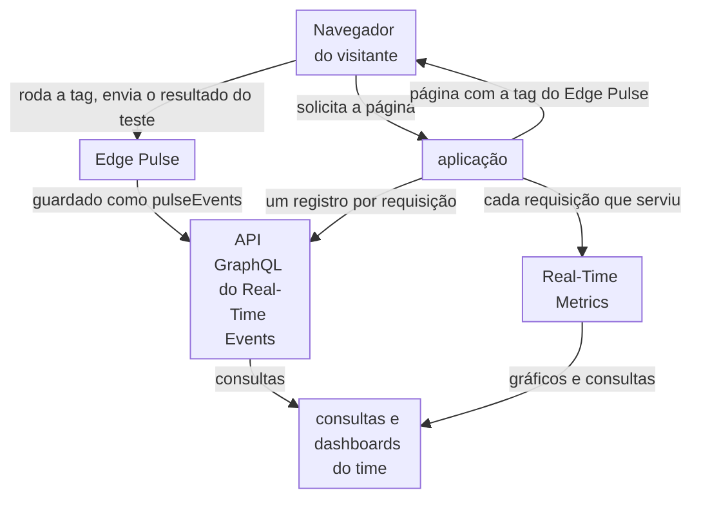
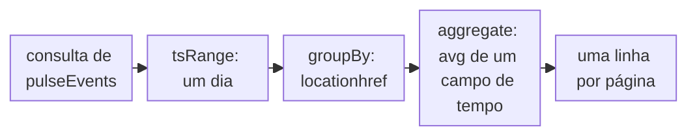

import DocCardGroup from '@aziontech/webkit/doc-card-group'
import DocCard from '@aziontech/webkit/doc-card'

Um time de SRE, de performance ou de web executa um site e as suas APIs atrás da Azion e precisa ver quão rápidas as páginas são para visitantes reais e de onde vêm os erros, sem instalar agentes nos seus servidores. O dispositivo, a rede e o navegador do visitante decidem como um carregamento de página parece, e nenhum deles é visível a partir do servidor. Esta página coloca a tag do Edge Pulse nas páginas que importam, consulta as medições que os navegadores dos visitantes enviam e lê o lado da Azion do mesmo domínio no Real-Time Metrics e no Real-Time Events. O resultado é medido pelo tempo de carregamento de cada página com a tag ao longo do tempo, pela parcela das páginas com a tag que informam medições e pela taxa de erro do domínio.

Este caso de uso não cobre a análise de eventos de segurança nem o tracing dentro do seu backend.

## Pré-requisitos

- Uma conta Azion. Se você ainda não tem uma, [crie uma conta](https://console.azion.com/signup).
- Uma aplicação que serve o seu site por meio de um workload. Para criá-los, consulte [Primeiros passos com Applications](/pt-br/documentacao/plataforma/applications/primeiros-passos/).
- Acesso para editar e publicar o HTML das páginas que você monitora, ou ao sistema de gerenciamento de tags que publica scripts nelas.

---

## Produtos necessários

| O time precisa de | O que significa | Produto | Documentado em |
| --- | --- | --- | --- |
| Tempos de carregamento medidos nos navegadores de visitantes reais | A tag JavaScript do Edge Pulse em cada página monitorada | Edge Pulse | [Adicione a tag do Edge Pulse às suas páginas](/pt-br/documentacao/guias/plataforma/observabilidade/adicionar-a-tag-do-edge-pulse-as-suas-paginas/) |
| Essas medições lidas por página, ao longo do tempo | Consultas GraphQL no dataset `pulseEvents` da API do Real-Time Events | Real-Time Events | [Consulte as medições do Edge Pulse com GraphQL](/pt-br/documentacao/guias/plataforma/observabilidade/consultar-medicoes-do-edge-pulse-com-graphql/) |
| O lado da Azion do mesmo tráfego: tempo de requisição e erros | Os dashboards **Requests** e **Status Codes**, filtrados pelo domínio | Real-Time Metrics | [Dashboards de Build](/pt-br/documentacao/plataforma/real-time-metrics/dashboards-build/#requests) |
| Uma requisição lenta ou com falha rastreada até a sua causa | Os registros HTTP Requests do domínio, com o tempo de resposta e o status da origem | Real-Time Events | [Fontes de dados de Real-Time Events](/pt-br/documentacao/plataforma/real-time-events/fontes-de-dados/#http-requests) |

---

## Arquitetura de referência

Esta página constrói o *Pipeline de monitoramento de usuários reais*: a tag do Edge Pulse nas páginas, com as medições lidas por GraphQL e comparadas com o que a Azion serviu.

Leia o diagrama a partir do navegador do visitante. A aplicação entrega a página, e a página carrega a tag do Edge Pulse, então a medição começa no navegador, e não em um servidor. Dois fluxos de dados saem do design: os resultados de teste do navegador, guardados pelo Edge Pulse, e as requisições que a aplicação serviu, contadas pelo Real-Time Metrics e registradas uma a uma no Real-Time Events. Os dois são lidos por GraphQL, que é onde as consultas e os dashboards do time os juntam. Os dados do navegador medem a experiência do visitante, incluindo o dispositivo, a rede e os scripts da página, e não a visão que o servidor tem da requisição.

### Fluxo de dados

1. Um visitante solicita uma página com a tag, e a aplicação a serve com a tag do Edge Pulse antes do fechamento da tag `body`.
2. O navegador do visitante roda a tag, que mede o carregamento da página e testa três endereços da infraestrutura distribuída da Azion.
3. O navegador envia o resultado para a Azion, e o Edge Pulse o guarda no dataset `pulseEvents`. Esse navegador só é testado de novo depois de 30 minutos.
4. Real-Time Metrics conta cada requisição que a aplicação serviu para o mesmo domínio, com o seu tempo de requisição e o seu status code.
5. O time consulta `pulseEvents` no endpoint GraphQL do Real-Time Events, agrupado por página, e as métricas de requisição no endpoint GraphQL do Real-Time Metrics.
6. Quando uma página fica lenta ou falha, os registros HTTP Requests do Real-Time Events mostram cada requisição, o tempo de resposta da origem e o status code da origem.

### Recursos de Plataforma

- **Edge Pulse**: coleta as medições do navegador. A sua tag roda no navegador do visitante depois do evento de carregamento, ou antes dele com a **Pre-loading Tag**, e as medições, como `pageloadtime`, `ttfb` e `locationhref`, ficam no dataset `pulseEvents` da API GraphQL do Real-Time Events por 7 dias.
- **Real-Time Events**: guarda o dataset `pulseEvents`, e a sua API GraphQL é o único lugar de onde as medições do navegador são lidas.
- **Real-Time Metrics**: mostra em gráficos as requisições que a aplicação serviu e as serve por GraphQL. Ele guarda o lado da Azion do mesmo tráfego, como **Average Request Time** e os status codes, com os quais a visão do navegador é comparada.
- **Grafana**: a integração que desenha os dashboards do time, uma opção de design. O plugin da Azion lê o Real-Time Metrics e o Real-Time Events pela API GraphQL.
- **aplicação**: o Platform Resource que serve o site monitorado. Ela entrega as páginas que carregam a tag, e as suas requisições são o que o Real-Time Metrics conta.

### Outros designs para este caso de uso

- *Pipeline de logs de entrega para uma plataforma de observabilidade*: para times que analisam e criam alertas nas próprias ferramentas, como Datadog, Splunk ou Elasticsearch. Data Stream envia o log da Azion de cada requisição para essa plataforma, então os dados vêm do lado da Azion de cada requisição, e as decisões de retenção, de alertas e de correlação passam para a plataforma do time.

---

## Como o design funciona

Esta seção explica as duas partes do design que produzem e leem as medições de usuários reais: a tag do Edge Pulse nas páginas monitoradas e as consultas dessas medições.

### Tag do Edge Pulse nas páginas monitoradas

O Edge Pulse só mede uma página quando essa página carrega a tag, e uma página sem ela não produz medição. Para este site, a tag vai na página inicial `/` e na página de busca `/search`. A tag não tem configurações: nenhuma taxa de amostragem, nenhum campo para excluir e nenhuma forma de deixar o seu próprio tráfego de fora.

Escolha a tag pela página, e não por preferência. A **Default Tag** roda depois que o evento de carregamento termina, então nunca atrasa o carregamento que mede. A **Pre-loading Tag** roda antes que o evento de carregamento dispare, e existe para páginas cuja Content Security Policy não permite JavaScript inline. Um visitante que sai antes que o evento de carregamento termine nunca é medido pela **Default Tag**.

Os primeiros resultados acompanham o seu tráfego, e não o momento em que você publicou: nada é coletado até que um visitante carregue uma página com a tag. A tag não informa erro quando não consegue rodar, então uma página que não coleta nada parece igual a uma página que coleta normalmente.

Uma single-page application é medida uma vez por carregamento completo de página. A tag não observa mudanças de rota, então os seus números descrevem a entrada na aplicação.

### Consultas das medições de usuários reais

Nenhuma página do Azion Console mostra gráficos das medições do Edge Pulse. Elas são lidas com consultas GraphQL no dataset `pulseEvents`, no endpoint do Real-Time Events `https://api.azion.com/v4/events/graphql`. Uma consulta agrupa as medições por `locationhref`, o endereço da página em que foram feitas, e calcula a média de um campo de tempo. O Real-Time Events guarda um registro por 7 dias, então uma consulta alcança no máximo 7 dias para trás.

1. A consulta limita o período com `tsRange`.
2. Ela agrupa as medições desse período pelo endereço da página.
3. Ela calcula a média de um campo, como `pageloadtime`, dentro de cada grupo e retorna uma linha por página.

O design lê três consultas, cada uma por um motivo:

- **Tempo de carregamento por página**: a média de `pageloadtime` por `locationhref`, a leitura diária de `https://www.example.com/` e de `https://www.example.com/search`.
- **Time to first byte por página**: a média de `ttfb` e a contagem de linhas por `locationhref`, o tempo até a chegada do primeiro byte de cada página, uma parte do seu tempo de carregamento.
- **Tempo de carregamento da página inicial por conexão**: a média de `pageloadtime` e a contagem de linhas por `effectivetype`, só para `https://www.example.com/`, que mostra se uma classe de conexão deixa a página inicial mais lenta.

Para mostrar essas consultas em gráficos ao lado do Real-Time Metrics, o [plugin da Azion para Grafana](/pt-br/documentacao/guias/plataforma/observabilidade/integrar-grafana/) lê o Real-Time Metrics e o Real-Time Events pela API GraphQL.

---

## Medindo resultados

| Métrica | Onde ler | Como fica quando funciona |
| --- | --- | --- |
| Tempo de carregamento de cada página com a tag | O `avg` de `pageloadtime` por `locationhref` em `pulseEvents`, uma consulta por dia | Estável de um dia para outro em cada página; uma alta em uma página depois de um release aponta para esse release |
| Parcela das páginas com a tag que informam medições | As páginas nas linhas de `pulseEvents`, comparadas com a lista de páginas em que você colocou a tag | Todas as páginas com a tag que têm tráfego aparecem nas linhas |
| Taxa de erro do domínio | O dashboard **Status Codes** do Real-Time Metrics, filtrado pelo host, e a sua tabela **Requests by Status and Upstream Status** | As respostas 5XX continuam raras, e a tabela mostra se um erro veio da origem ou da Azion. Consulte [Dashboards de Build](/pt-br/documentacao/plataforma/real-time-metrics/dashboards-build/#status-codes) |
| Tempo que a Azion leva para responder, ao lado do que os visitantes medem | **Average Request Time** no dashboard **Requests**, filtrado pelo host | Acompanha o tempo de carregamento dos visitantes quando a causa está do lado do servidor; fica estável quando a causa está do lado dos visitantes |

---

## Boas práticas

- **Coloque a tag nos templates, e não em páginas avulsas.** O Edge Pulse só mede as páginas que carregam a tag, e a tag não é herdada de um caminho pai. Colocá-la no template que renderiza um tipo de página cobre todas as páginas desse tipo, incluindo as publicadas depois.
- **Leia uma página ausente como uma tag ausente antes de lê-la como tráfego ausente.** A tag não informa erro quando não consegue rodar. Uma página com a tag que tem visitas e nenhuma linha em `pulseEvents` é o único sinal de que algo bloqueia a tag, como uma Content Security Policy que precisa da **Pre-loading Tag**.
- **Compare a visão do navegador com a visão do servidor antes de agir.** Um `pageloadtime` mais lento com um **Average Request Time** estável coloca a causa do lado dos visitantes, como a rede deles ou um script na página. Os dois subindo juntos colocam a causa do lado do servidor, e o Real-Time Events mostra se o tempo de resposta da origem subiu com eles.
- **Consulte um intervalo estreito.** O Real-Time Events limita as linhas que uma consulta lê, e uma busca nos 7 dias inteiros sem filtro é a forma comum de chegar a esse limite. Consulte um dia por vez e adicione um filtro quando puder. Para o limite, consulte [Limites de Real-Time Events](/pt-br/documentacao/plataforma/real-time-events/limites/).

---

## Guias deste caso de uso

<DocCardGroup cols={2}>
  <DocCard title="Adicione a tag do Edge Pulse às suas páginas" href="/pt-br/documentacao/guias/plataforma/observabilidade/adicionar-a-tag-do-edge-pulse-as-suas-paginas/" label="Copia a tag do Edge Pulse e a adiciona aos templates da página inicial e da página de busca." />
  <DocCard title="Consulte as medições do Edge Pulse com GraphQL" href="/pt-br/documentacao/guias/plataforma/observabilidade/consultar-medicoes-do-edge-pulse-com-graphql/" label="Roda as consultas de pulseEvents que leem o tempo de carregamento de cada página com a tag." />
  <DocCard title="Meça o offload de cache de um domínio" href="/pt-br/documentacao/guias/plataforma/observabilidade/medir-offload-de-cache/" label="Filtra o Real-Time Metrics por www.example.com, onde o dashboard Requests mostra Average Request Time." />
  <DocCard title="Filtrar eventos" href="/pt-br/documentacao/guias/plataforma/observabilidade/adicionar-filtros-events/" label="Filtra o Real-Time Events pelas requisições HTTP do domínio, para rastrear uma requisição." />
  <DocCard title="Instale o plugin da Azion para Grafana" href="/pt-br/documentacao/guias/plataforma/observabilidade/integrar-grafana/" label="Mostra as consultas de pulseEvents ao lado do Real-Time Metrics pela API GraphQL." />
</DocCardGroup>
