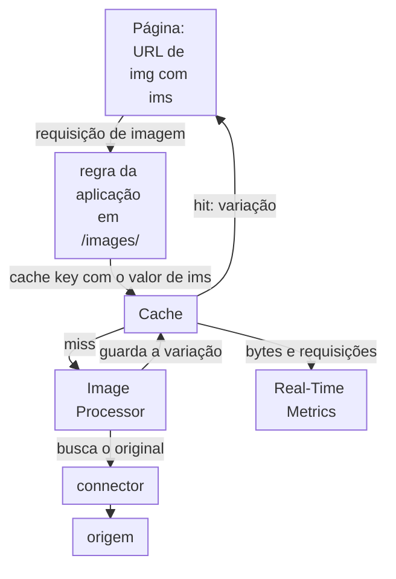

import DocCardGroup from '@aziontech/webkit/doc-card-group'
import DocCard from '@aziontech/webkit/doc-card'

Um time de comércio, de mídia ou de marketing mantém uma grande biblioteca de imagens na sua própria origem ou CMS, e as páginas que carregam imagens em tamanho original ficam lentas em redes móveis. Cada dispositivo precisa da mesma imagem em um tamanho diferente, e produzir e guardar cada tamanho com antecedência não escala com a biblioteca. Esta página configura uma aplicação que redimensiona e converte cada imagem sob demanda a partir do original na origem, cacheia cada variação que produz e faz as páginas solicitarem um conjunto pequeno e fixo de tamanhos. O resultado é medido pelos bytes de imagem entregues em comparação com os originais e pela parcela das requisições de imagem respondidas pelo cache.

Este caso de uso não cobre vídeo nem fluxos de edição de imagem.

## Pré-requisitos

- Uma conta Azion. Se você ainda não tem uma, [crie uma conta](https://console.azion.com/signup).
- Uma aplicação que serve as suas imagens a partir da sua origem por meio de um connector e de um workload. Para criá-los, consulte [Primeiros passos com Applications](/pt-br/documentacao/plataforma/applications/primeiros-passos/).
- Image Processor e Application Accelerator nessa aplicação. O Image Processor transforma as imagens, e o Application Accelerator é dono da variação por query string que cacheia cada transformação separadamente. Para ativar os dois, consulte [Primeiros passos com Image Processor](/pt-br/documentacao/plataforma/applications/image-processor/primeiros-passos/).
- Acesso aos templates que renderizam os elementos `img` das suas páginas.

---

## Produtos necessários

| As páginas precisam de | O que significa | Produto | Documentado em |
| --- | --- | --- | --- |
| Cada imagem no tamanho e no formato que a página pede, a partir de um original | Uma regra com **Optimize Images** no caminho das imagens, e uma query string `ims` em cada URL de imagem | Image Processor | [Configure Image Processor em uma aplicação](/pt-br/documentacao/guias/performance-e-confiabilidade/otimizacao-de-entrega/processar-imagens/) e [Parâmetros de URL do Image Processor](/pt-br/documentacao/plataforma/applications/image-processor/parametros-de-url/) |
| Cada variação servida do cache depois da sua primeira requisição | Uma cache setting que varia a cache key pelo argumento `ims` | Cache | [Entrega de imagens](/pt-br/documentacao/plataforma/applications/image-processor/entrega-de-imagens/#uma-entrada-de-cache-por-transformacao) |
| Uma cache key por valor de `ims` | **Cache vary by Query String**, com `ims` em uma allowlist | Application Accelerator | [Configure a Advanced Cache Key para uma aplicação](/pt-br/documentacao/guias/performance-e-confiabilidade/cache-e-purge/advanced-cache-key/#varie-o-cache-por-um-argumento-de-query-string) |
| Bytes economizados e requisições de imagem servidas | O dashboard **Bandwidth Saving** e a aba **Image Processor**, filtrados pelo domínio | Real-Time Metrics | [Dashboards de Build](/pt-br/documentacao/plataforma/real-time-metrics/dashboards-build/#bandwidth-saving) |

---

## Arquitetura de referência

Esta página constrói o *Proxy de otimização de imagens apoiado na origem*: rotas de imagem em uma aplicação que transformam os originais buscados da sua origem e cacheiam cada variação.

Leia o diagrama a partir da regra de imagem. A regra no caminho das imagens envia a requisição primeiro ao Cache, e uma variação já guardada a responde sem processamento e sem requisição à origem. Só um miss chega ao Image Processor, que busca o original pelo connector, o transforma e guarda o resultado para a próxima requisição da mesma variação. A origem fica no caminho de todo miss.

### Fluxo de dados

1. Uma página solicita uma imagem em `/images/` com uma query string `ims` que nomeia o tamanho, como `?ims=fit-in/800x800/filters:quality(85)`.
2. A regra da aplicação em `/images/` aplica a cache setting `images`, cuja cache key varia por `ims`, e o behavior **Optimize Images**.
3. Uma variação que já está em cache responde a requisição sem processamento, e uma variação servida do cache não é contada no medidor de Images.
4. Em um miss, a aplicação busca o original na sua origem pelo connector, então a disponibilidade e o egress da origem ficam no fluxo de dados de todo miss.
5. O Image Processor redimensiona o original e o converte para WEBP para os navegadores que aceitam esse formato. Ele nunca modifica o original e não guarda a variação como um asset da conta.
6. O Cache guarda a variação sob uma chave que carrega o valor de `ims` e, para uma imagem convertida, o formato entregue. A próxima requisição do mesmo tamanho e formato é respondida pelo cache, e a origem só serve um original em um miss.

### Recursos de Plataforma

- **aplicação**: o Platform Resource que guarda a rota de imagem, a regra `images - optimize` que corresponde a `/images/` e aplica a cache setting `images` e **Optimize Images**.
- **Image Processor**: transforma o original na variação que a query string `ims` pede, e escolhe WEBP para os navegadores que o aceitam.
- **connector**: o Platform Resource que chega à origem dos originais em cada miss de cache.
- **Cache**: guarda cada variação sob a sua própria chave. A chave varia por `ims` pela allowlist de query string da cache setting, que pertence ao Application Accelerator.
- **Real-Time Metrics**: mostra os bytes que o Image Processor economizou, as requisições de imagem servidas e a parcela respondida pelo cache.

### Outros designs para este caso de uso

- *Proxy de otimização de imagens apoiado no Object Storage*: para times que movem os seus originais para a Azion, como uploads de usuários ou um catálogo de produtos. Os originais ficam no Object Storage, enviados com a Azion CLI ou com a API compatível com S3, então o design adiciona um caminho de upload e o fluxo de requisição não tem origem do cliente.

---

## Como o design funciona

Esta seção explica as três partes do design que fazem cada variação de imagem ser processada uma vez e depois servida do cache: a cache setting para as variações de imagem, a regra de imagem e as URLs de imagem nas suas páginas.

### Cache setting para as variações de imagem

A cache setting `images` dá a cada valor de `ims` a sua própria cache key, para que uma requisição da imagem de 400 pixels nunca seja respondida com a de 800 pixels. **Cache vary by Query String** usa uma _Allowlist_ só com `ims`, para que outro argumento, como uma tag de campanha, não crie outra cópia da mesma imagem.

**Max Age** é `31536000` segundos, o teto que uma cache setting aceita. Uma variação servida do cache não roda nenhuma transformação e não soma nada ao medidor mensal de Images, enquanto um **Max Age** curto repete a mesma transformação em um intervalo que não tem nada a ver com mudanças na origem. O cache do navegador respeita o `Cache-Control` que a sua origem envia para cada imagem.

### Regra de imagem

A regra de imagem corresponde a todas as requisições em `/images/`, aplica a cache setting `images` e adiciona **Optimize Images**, que entrega a requisição ao Image Processor. Uma requisição que a regra não corresponde é entregue sem processamento, então a regra é o que dá sentido à query string `ims`.

A regra não adiciona nenhum header `Accept`. O Image Processor detecta se o navegador suporta WEBP pelo próprio header `Accept` do navegador e converte a imagem quando ele suporta, para que cada navegador receba um formato que lê. Forçar `Accept: image/webp` enviaria WEBP a navegadores que nunca o pediram.

### URLs de imagem nas suas páginas

Cada string `ims` distinta é um objeto distinto em cache, e uma transformação distinta na sua primeira requisição. Uma página que pede qualquer largura que o layout calcule guarda um objeto por largura, enquanto uma página que pede três larguras fixas guarda três. Por isso, os templates solicitam só `400`, `800` e `1200` pixels.

Cada URL usa `fit-in`, que mantém as proporções da imagem dentro da caixa e nunca a amplia, então nenhuma parte de uma foto de produto é cortada. Cada URL também aplica `quality(85)`, o valor que a Azion recomenda, que otimiza o arquivo sem perda perceptível de qualidade visual. A caixa de 1.200 pixels fica abaixo do limite padrão de largura de 3.840 pixels.

Mantenha `ims` como o último argumento da query string. Um parâmetro colocado depois dele pode fazer a requisição retornar um erro `504`, então um script que acrescenta um valor de cache-busting ou de rastreamento o insere antes de `ims`.

---

## Medindo resultados

| Métrica | Onde ler | Como fica quando funciona |
| --- | --- | --- |
| Bytes de imagem economizados em comparação com os originais | O dashboard **Bandwidth Saving** do Real-Time Metrics, filtrado pelo host, ou `bandwidthImagesProcessedSavedData` no dataset `workloadMetrics`. Consulte [Dashboards de Build](/pt-br/documentacao/plataforma/real-time-metrics/dashboards-build/#bandwidth-saving) | Cresce com o tráfego de imagens depois que os templates solicitam os três tamanhos |
| Requisições de imagem servidas | A aba **Image Processor** do Real-Time Metrics, **Total Requests** | Acompanha o tráfego de imagens das páginas construídas a partir dos templates |
| Parcela das requisições de imagem respondidas pelo cache | **Requests Offloaded** no dashboard **Requests**, filtrado pelo host. Consulte [Meça o offload de cache de um domínio](/pt-br/documentacao/guias/plataforma/observabilidade/medir-offload-de-cache/) | Sobe à medida que cada variação é cacheada, porque cada uma é processada uma vez e servida do cache depois |

---

## Boas práticas

- **Solicite um conjunto pequeno e fixo de tamanhos.** Cada string `ims` distinta é um objeto distinto em cache e uma transformação distinta contada no medidor de Images. Três larguras por imagem custam três transformações, não importa quantos visitantes as carreguem.
- **Purgue todas as variações quando um original for substituído.** Um original substituído deixa as suas variações em cache por até um ano, uma chave por tamanho e por formato. Um purge por URL não chega às variações `@@webp`, então purgue-as com um wildcard que termina o caminho com `*`, como `www.example.com/images/blue-shirt*`. Para o purge por wildcard e o seu limite diário, consulte [Purgue páginas quando a origem publica uma mudança](/pt-br/documentacao/guias/performance-e-confiabilidade/cache-e-purge/purgar-ao-publicar/).
- **Mantenha `ims` como o único argumento da allowlist.** Uma allowlist que nomeia só `ims` mantém todos os outros argumentos fora da cache key, então os valores de rastreamento não multiplicam as variações. Para saber por quê, consulte [Boas práticas de Applications](/pt-br/documentacao/plataforma/applications/boas-praticas/#image-processor).
- **Use fit-in quando nenhuma borda pode ser perdida.** `?ims=800x800` preenche a caixa exatamente e corta automaticamente o eixo que transborda. `fit-in` mantém a imagem inteira dentro da caixa, então use a forma simples só onde o layout precisa da caixa preenchida.

---

## Guias deste caso de uso

<DocCardGroup cols={2}>
  <DocCard title="Configure a Advanced Cache Key para uma aplicação" href="/pt-br/documentacao/guias/performance-e-confiabilidade/cache-e-purge/advanced-cache-key/" label="Cria a cache setting images, que guarda um objeto em cache por valor de ims." />
  <DocCard title="Configure Image Processor em uma aplicação" href="/pt-br/documentacao/guias/performance-e-confiabilidade/otimizacao-de-entrega/processar-imagens/" label="Cria a regra images - optimize, que aplica a cache setting e entrega cada requisição de imagem ao Image Processor." />
</DocCardGroup>
