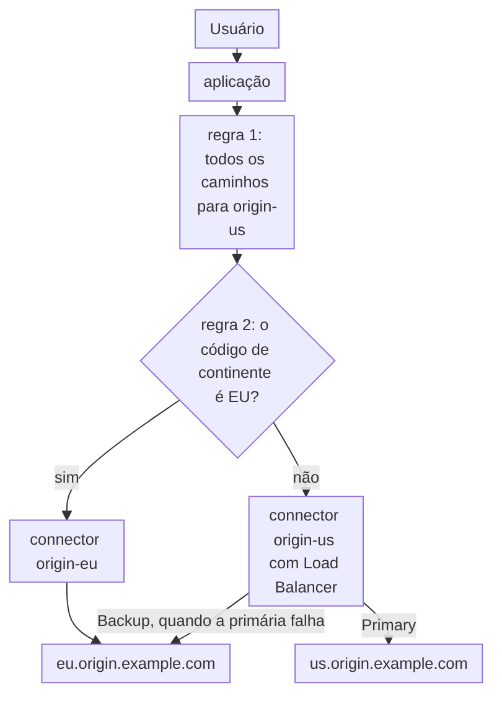
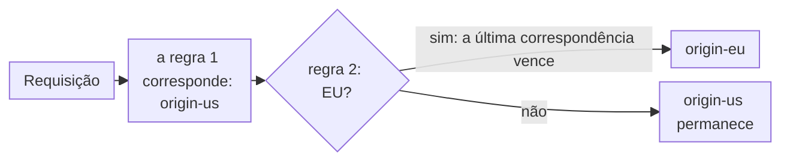

import DocCardGroup from '@aziontech/webkit/doc-card-group'
import DocCard from '@aziontech/webkit/doc-card'

Um time de engenharia executa a sua aplicação em várias regiões, por latência ou porque os dados de alguns usuários precisam ficar na região deles por leis como a LGPD ou o GDPR. Cada usuário precisa chegar à região certa sem nenhuma lógica no cliente, e uma falha regional só pode recorrer a outra região onde as regras de residência do time permitem. Esta página envia cada requisição ao connector da região do usuário com uma regra de geolocalização, mantém uma região padrão para os usuários de qualquer outro lugar e dá à região padrão uma origem de backup em outra região. O resultado é medido pela latência por região, pela parcela das requisições atendidas pela região de origem do usuário e pela contagem de requisições de uma região restrita que chegam a uma origem fora dela, que fica em zero.

Este caso de uso não cobre a aceleração de uma única origem nem o failover entre origens idênticas. Para failover, consulte [Manter uma aplicação no ar quando uma origem falha](/pt-br/documentacao/casos-de-uso/melhorar-performance-e-confiabilidade/manter-uma-aplicacao-no-ar-quando-uma-origem-falha/).

## Pré-requisitos

- Uma aplicação que serve o seu site por meio de um workload. Para criar uma, consulte [Primeiros passos com Applications](/pt-br/documentacao/plataforma/applications/primeiros-passos/).
- Dois connectors, um por região. Para criar um connector, consulte [Primeiros passos com Connectors](/pt-br/documentacao/plataforma/connectors/primeiros-passos/).
- Uma regra na aplicação cujo behavior **Set Connector** envia todas as requisições, `${uri}` _starts with_ `/`, ao connector da região padrão. É a regra que [Primeiros passos com Applications](/pt-br/documentacao/plataforma/applications/primeiros-passos/) cria.
- Um personal token, para os passos pela API. Para criar um, consulte [Gerencie personal tokens](/pt-br/documentacao/guias/plataforma/conta-e-billing/personal-tokens/).
- Os nomes das suas regiões e origens. Esta página usa `origin-us` para o connector da região padrão, com o endereço `us.origin.example.com`, e `origin-eu` para o connector da região europeia, com o endereço `eu.origin.example.com`. As requisições da Europa precisam ficar em origens europeias. As requisições de qualquer outro lugar podem recorrer à Europa quando a região padrão falha. Cada origem adiciona um header de resposta `X-Origin-Region` com o valor `us` ou `eu`, para que uma resposta nomeie a região que respondeu. O domínio é `www.example.com`. Substitua cada valor pelo seu em todos os passos.

---

## Produtos necessários

| A aplicação precisa de | O que significa | Produto | Documentado em |
| --- | --- | --- | --- |
| Cada usuário enviado à origem da sua região | Uma regra que lê o código de continente da requisição e define o connector dessa região | Applications | [Roteie requisições por país ou continente](/pt-br/documentacao/guias/performance-e-confiabilidade/disponibilidade/rotear-requisicoes-por-pais-ou-continente/) |
| Um backup em outra região, só onde a residência permite | Load Balancer no connector da região padrão, com a origem da outra região como endereço _Backup_ | Load Balancer | [Adicione uma origem de backup a um connector](/pt-br/documentacao/guias/performance-e-confiabilidade/disponibilidade/adicionar-uma-origem-de-backup-a-um-connector/) |
| Tráfego por região e por origem | O país e o endereço da origem de cada requisição, nas métricas de requisição | Real-Time Metrics | [Campos do Real-Time Metrics](/pt-br/documentacao/devtools/graphql/campos-gql-real-time-metrics/#workloadbreakdownmetrics) |

---

## Arquitetura de referência

Esta página constrói as *Origens multirregionais com roteamento geográfico*: regras de geolocalização que enviam cada requisição ao connector da região do usuário, uma região padrão para todos os outros e uma origem de backup só onde as regras de residência permitem.



Leia o diagrama a partir das regras. Toda requisição corresponde primeiro à regra padrão, e uma requisição cuja geolocalização corresponde a uma região também corresponde à regra dessa região, que vence. Cada connector guarda as origens de uma região. Um backup em outra região só aparece nos connectors cujos usuários podem ser atendidos em outro lugar, então as requisições de uma região restrita não têm caminho para fora dela.

### Fluxo de dados

1. A requisição de um usuário chega à aplicação, que lê as variáveis de geolocalização do endereço IP do cliente na Request Phase, como `${geoip_continent_code}` ou `${geoip_country_code}`.
2. A primeira regra corresponde a todas as requisições e define `origin-us`, o connector da região padrão.
3. A segunda regra, colocada depois da primeira, corresponde a uma requisição cujo `${geoip_continent_code}` é `EU` e define `origin-eu`. **Set Connector** só roda a partir da última regra que correspondeu, então a regra regional sobrepõe a padrão e uma requisição europeia vai para `origin-eu`.
4. `origin-eu` guarda um endereço europeu e nenhum backup, então uma requisição europeia nunca sai da Europa, mesmo quando essa origem falha.
5. `origin-us` envia todas as outras requisições para `us.origin.example.com`, o seu endereço _Primary_, e para `eu.origin.example.com`, o seu endereço _Backup_, só quando a primária falha.

### Componentes

- **aplicação**: o Platform Resource que roteia cada requisição a um connector com as suas regras.
- **Rules Engine**: a Feature que compara as variáveis de geolocalização da requisição. A ordem das suas regras define o padrão: a regra ampla que envia todos os caminhos para `origin-us` primeiro, e a regra regional da Europa depois dela.
- **connectors**: os Platform Resources que guardam as origens, um connector por região: `origin-us` e `origin-eu`. Uma regra nomeia um connector, então mover a origem de uma região significa editar um connector.
- **Load Balancer**: dá a um connector regional uma origem _Backup_, que recebe requisições só quando todas as origens _Primary_ falham. Só `origin-us` tem uma, porque os seus usuários podem ser atendidos a partir da Europa.
- **Real-Time Metrics**: mostra o tráfego por país e o endereço da origem que respondeu cada requisição, que é como se encontra uma requisição que saiu da sua região.

---

## Configure a região de backup do connector padrão

A região padrão recebe os usuários cujos dados podem sair da sua região, então o connector dela ganha um backup na outra região. Load Balancer em `origin-us` mantém `us.origin.example.com` como endereço _Primary_, que recebe todas as requisições enquanto responde. Ele adiciona `eu.origin.example.com` como endereço _Backup_, que recebe requisições só quando todos os endereços _Primary_ falham.

`origin-eu` não ganha backup fora da Europa, porque as requisições dos seus usuários precisam ficar lá. Ele mantém o seu único endereço e não precisa de mudança.

O backup é adicionado como [Adicione uma origem de backup a um connector](/pt-br/documentacao/guias/performance-e-confiabilidade/disponibilidade/adicionar-uma-origem-de-backup-a-um-connector/) descreve, em `origin-us`, com estes valores:

- **Addresses** `us.origin.example.com` com **Server Role** _Primary_, e `eu.origin.example.com` com _Backup_.
- **Method** _Round Robin_.
- **Max Retries** `1`. Uma nova tentativa limita quanto tempo um usuário espera por uma conexão que falha.
- **Connection Timeout** `10` segundos. Ele impede que uma requisição espere os 60 segundos padrão da API por uma origem que não aceita conexão.
- **Read/Write Timeout** `60` segundos.

`origin-us` guarda a origem da região padrão e um backup na Europa, e `origin-eu` guarda só a sua origem europeia. Uma mudança de connector chega à infraestrutura distribuída da Azion ao longo de vários minutos.

Os dois endereços de `origin-us` recebem o mesmo header `Host` do connector. Quando a origem europeia responde com outro nome, defina o **Host** do connector como `${host}`, que envia o host que o usuário solicitou.

---

## Configure a regra de geolocalização

A regra de geolocalização envia os usuários europeus para `origin-eu`. Ela compara `${geoip_continent_code}`, o código de continente de duas letras do endereço IP do cliente, com `EU`, e o seu behavior **Set Connector** nomeia `origin-eu`.

**Set Connector** não se soma entre regras: quando várias regras que correspondem o carregam, só o da última regra que correspondeu roda. A regra padrão que envia todos os caminhos para `origin-us` fica, portanto, em primeiro lugar, e a regra de geolocalização vem depois dela, para sobrepor o padrão nas requisições europeias. Uma nova regra é criada no fim da fase, que é a posição de que ela precisa.



1. Toda requisição corresponde à regra 1, que define `origin-us`.
2. Uma requisição da Europa também corresponde à regra 2, que define `origin-eu`, e a regra posterior vence.
3. Qualquer outra requisição mantém `origin-us`.

A regra é criada e mantida depois da regra padrão como [Roteie requisições por país ou continente](/pt-br/documentacao/guias/performance-e-confiabilidade/disponibilidade/rotear-requisicoes-por-pais-ou-continente/) descreve, com estes valores:

- **Nome da regra**: `geo - europe`.
- **Critério**: `${geoip_continent_code}` _is equal_ `EU`.
- **Behavior**: **Set Connector** com `origin-eu`, cujo ID vai em `attributes.value` na API.
- **Posição**: depois da regra padrão que envia todos os caminhos para `origin-us`, então o seu `order` é maior que o da regra padrão.

As requisições da Europa vão para `origin-eu`, e todas as outras para `origin-us`. Uma nova regra leva alguns minutos para se propagar.

---

## Verifique a configuração

Cada verificação lê o header `X-Origin-Region` que as suas origens definem. A regra lê a localização do endereço IP do cliente, então cada verificação roda a partir de uma máquina na região que ela testa.

- **Os usuários fora da Europa chegam à região padrão.** A partir de uma máquina fora da Europa, envie várias requisições:

  ```bash
  curl -s -D - -o /dev/null https://www.example.com/
  ```

  Todas as respostas carregam `x-origin-region: us`. Em HTTP/2, os nomes dos headers chegam em minúsculas.

- **Os usuários na Europa chegam à região europeia.** A partir de uma máquina na Europa, envie a mesma requisição. Todas as respostas carregam `x-origin-region: eu`.
- **A localização que a Azion leu corresponde à região que respondeu.** Acesse [Azion Console](https://console.azion.com/) > **Real-Time Events**, selecione a fonte de dados _HTTP Requests_ e informe `host='www.example.com'` em **Filter by**. Cada registro das suas requisições carrega **Geoloc Country Name** e **Upstream Addr**, o endereço da origem que respondeu. Para a sintaxe do filtro, consulte [Filtrar eventos](/pt-br/documentacao/guias/plataforma/observabilidade/adicionar-filtros-events/).
- **A região padrão recorre ao backup, e a Europa não.** Em uma janela de manutenção, pare o servidor web em `us.origin.example.com` e repita a requisição a partir de fora da Europa. As respostas carregam `x-origin-region: eu`. Inicie-o de novo. Uma falha da origem europeia, por design, mostra aos usuários europeus um erro em vez de uma resposta de outra região.

Uma mudança de regra ou de connector que parece não ter efeito ainda pode estar se propagando. Quando isso persiste depois de alguns minutos, ative [Debug Rules](/pt-br/documentacao/plataforma/applications/main-settings/#debug-rules) para ver quais regras rodaram na requisição.

---

## Medindo resultados

| Métrica | Onde ler | Como fica quando funciona |
| --- | --- | --- |
| Latência por região | `requestTime` e `upstreamResponseTime` do dataset `workloadMetrics`, agrupados por `geolocCountryName`. Consulte [Campos do Real-Time Metrics](/pt-br/documentacao/devtools/graphql/campos-gql-real-time-metrics/#workloadmetrics) | Estável para cada país de uma semana para outra; uma alta em um país aponta para a origem da sua região |
| Parcela das requisições atendidas pela região de origem do usuário | `requests` do dataset `workloadBreakdownMetrics`, agrupado por `geolocCountryName` e `upstreamAddr`, o endereço da origem que respondeu | Os países europeus aparecem com o endereço da origem europeia, e os outros países com o da região padrão |
| Requisições da Europa que chegaram a uma origem fora dela | O mesmo detalhamento, para os países europeus com o endereço de `us.origin.example.com` | Zero linhas |

---

## Boas práticas

- **Compare com uma lista de países quando uma regra precisa seguir uma jurisdição.** Um código de continente é geografia, não um limite legal: `EU` cobre países da Europa dentro e fora da União Europeia. Quando a regra de residência nomeia países, compare `${geoip_country_code}` com o operador _matches_ e uma expressão regular de códigos de país de duas letras, como `^(DE|FR|IT|ES)$`.
- **Mantenha a regra padrão em primeiro lugar.** **Set Connector** só roda a partir da última regra que correspondeu, então uma lista reordenada pode enviar usuários europeus para a região padrão sem mudança em nenhuma regra. Verifique a ordem da lista **Request** depois de cada mudança nela.
- **Mantenha as respostas regionais fora de uma chave de cache compartilhada.** A chave de cache padrão é o esquema, o host e o caminho, sem geolocalização. Uma resposta que difere por região, ou que carrega dados de um usuário, não recebe cache setting, para que a resposta de uma região nunca seja servida a outra.
- **Dê a uma região restrita um backup dentro da região, se ela precisar de um.** Um endereço _Backup_ na mesma região mantém a região respondendo durante a falha de uma origem sem enviar requisições para outro lugar. Uma região restrita com uma única origem responde aos seus usuários com um erro durante a falha dessa origem.

Esta configuração decide para onde as requisições vão. Ela não estabelece, por si só, conformidade com a LGPD, o GDPR ou qualquer outra lei.

---

## Guias deste caso de uso

<DocCardGroup cols={2}>
  <DocCard title="Adicione uma origem de backup a um connector" href="/pt-br/documentacao/guias/performance-e-confiabilidade/disponibilidade/adicionar-uma-origem-de-backup-a-um-connector/" label="Adiciona a origem europeia a origin-us como endereço Backup da região padrão." />
  <DocCard title="Roteie requisições por país ou continente" href="/pt-br/documentacao/guias/performance-e-confiabilidade/disponibilidade/rotear-requisicoes-por-pais-ou-continente/" label="Cria a regra de geolocalização que envia as requisições europeias para origin-eu, depois da regra padrão." />
</DocCardGroup>
