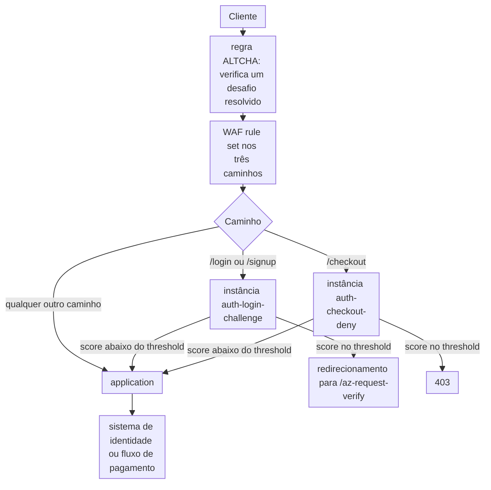

import DocCardGroup from '@aziontech/webkit/doc-card-group'
import DocCard from '@aziontech/webkit/doc-card'
import DocSteps from '@aziontech/webkit/doc-steps'
import DocStep from '@aziontech/webkit/doc-step'
import Tabs from '~/components/webkit/Tabs.vue'

Uma equipe de fraude ou de segurança no varejo, em serviços financeiros ou em games vê credential stuffing, criação de contas falsas e card testing nos seus endpoints de login, cadastro e checkout. Esses três caminhos são onde um cliente automatizado ganha mais por requisição, e onde um cliente recusado custa mais. Esta página configura o Bot Manager no firewall só para esses caminhos: ele pontua cada requisição em busca de automação, envia um cliente sinalizado no login e no cadastro a um desafio que uma pessoa consegue resolver e nega um cliente sinalizado no checkout, enquanto o WAF filtra ataques nos mesmos caminhos. O resultado é medido pela parcela de tentativas automatizadas de login e checkout bloqueadas, pela taxa de falsos positivos em usuários reais e pelo tráfego de ataque que ainda chega à origem.

Este caso de uso não cobre o abuso geral de APIs, que [Proteger APIs públicas contra abuso](/pt-br/documentacao/casos-de-uso/proteger-aplicacoes-e-redes/proteger-apis-publicas-contra-abuso/) cobre.

## Pré-requisitos

- Uma application que serve o site por meio de um connector e de um workload. Para criá-los, consulte [Primeiros passos com Applications](/pt-br/documentacao/plataforma/applications/primeiros-passos/).
- Um firewall vinculado ao deployment desse workload, com WAF e Functions ativados em **Main Settings** › **Modules**. Para vinculá-lo, consulte [Vincule um firewall a um workload](/pt-br/documentacao/guias/seguranca-de-aplicacoes/firewall-e-waf/proteja-seu-dominio/), e para ativar o WAF, consulte [Defina as configurações principais de um firewall](/pt-br/documentacao/guias/seguranca-de-aplicacoes/firewall-e-waf/firewall-definir-main-settings/).
- Bot Manager habilitado na conta, ou Bot Manager Lite instalado pelo Azion Marketplace. Para instalar o Bot Manager Lite, consulte [Instale o Bot Manager Lite](/pt-br/documentacao/guias/desenvolvimento-de-aplicacoes/integracoes/bot-manager-lite/).
- ALTCHA instanciado no mesmo firewall, com a sua regra correspondendo a `/login`, `/signup`, `/az-request-verify` e `/az-request-captcha`, criada antes das regras de Bot Manager desta página. ALTCHA serve o desafio para o qual o Bot Manager redireciona um cliente sinalizado. Para configurá-lo, siga [Proteja uma rota com um desafio ALTCHA](/pt-br/documentacao/guias/desenvolvimento-de-aplicacoes/functions-e-runtime/altcha/) neste firewall, com `/login` e `/signup` como rotas protegidas, e deixe de fora a regra da application: nesta página, a ação `redirect` do Bot Manager envia ao desafio só os clientes sinalizados.
- Um personal token, para as abas de API. Para criar um, consulte [Gerencie personal tokens](/pt-br/documentacao/guias/plataforma/conta-e-billing/personal-tokens/).
- Os valores do seu site. Esta página usa `www.example.com` como domínio, `/login`, `/signup` e `/checkout` como os três caminhos e `auth` como prefixo de cada objeto que cria. Substitua cada valor pelo seu em todos os passos.

---

## Produtos necessários

| Os fluxos precisam de | O que significa | Produto | Documentado em |
| --- | --- | --- | --- |
| Toda requisição a login, cadastro e checkout pontuada em busca de automação | Instâncias do Bot Manager executadas por regras de firewall restritas aos três caminhos | Bot Manager | [Execute Bot Manager em caminhos selecionados](/pt-br/documentacao/guias/seguranca-de-aplicacoes/bots-e-rede/executar-bot-manager-em-caminhos-selecionados/) |
| Um cliente sinalizado no login e no cadastro desafiado em vez de recusado | A action `redirect`, que envia o cliente ao desafio ALTCHA | Bot Manager | [Argumentos](/pt-br/documentacao/plataforma/firewall/bot-manager/argumentos/#action) |
| Um desafio que uma pessoa consegue resolver | A função ALTCHA, executada no firewall antes do Bot Manager | Functions | [Proteja uma rota com um desafio ALTCHA](/pt-br/documentacao/guias/desenvolvimento-de-aplicacoes/functions-e-runtime/altcha/) |
| Payloads de ataque nos mesmos caminhos recusados | Um WAF rule set aplicado por uma regra _Set WAF_ nos três caminhos | WAF | [Primeiros passos com WAF](/pt-br/documentacao/plataforma/firewall/waf/primeiros-passos/) |
| As decisões do Bot Manager nas ferramentas da equipe de fraude | Um stream da fonte de dados _Functions_, que carrega as linhas de report do Bot Manager, para o endpoint da equipe | Data Stream | [Depure functions com o Data Stream](/pt-br/documentacao/guias/plataforma/observabilidade/debugging-functions-data-stream/) |
| Cada decisão explicada, requisição por requisição | A linha de report da requisição, com o seu score e as regras que correspondeu | Real-Time Events | [Leia o report log](/pt-br/documentacao/guias/seguranca-de-aplicacoes/bots-e-rede/ler-o-report-log/) |

---

## Arquitetura de referência

Esta página constrói o *perímetro de pontuação de bots para fluxos de autenticação*: regras de firewall que restringem o Bot Manager aos caminhos de login, cadastro e checkout, onde o score decide se uma requisição passa, é desafiada ou é negada.



Leia o diagrama na divisão por caminho. As regras do firewall entregam ao WAF e ao Bot Manager só os três caminhos sensíveis, então toda outra página é servida sem score. Em `/login`, `/signup` e `/checkout`, o score da instância que aquele caminho executa envia cada requisição por um de três caminhos: direto para a application, para o desafio ALTCHA que uma pessoa consegue resolver ou para uma recusa. Uma instância por tipo de caminho permite que cada um execute o seu próprio threshold e a sua própria action.

### Fluxo de dados

1. Uma requisição chega ao firewall vinculado ao workload. A regra ALTCHA roda primeiro, então um cliente que já resolveu um desafio carrega uma sessão que o ALTCHA valida.
2. A regra de WAF pontua as requisições aos três caminhos em busca de payloads de ataque, como uma injeção em um campo de formulário.
3. Em `/login` e `/signup`, a instância `auth-login-challenge` pontua a requisição. Um score no seu threshold redireciona o cliente ao desafio ALTCHA. Uma pessoa que o resolve continua, e as requisições seguintes passam sem um novo desafio.
4. Em `/checkout`, a instância `auth-checkout-deny` pontua a requisição. Um score no seu threshold recebe `403`, porque uma requisição de checkout que um script envia não tem uma pessoa para responder a um desafio.
5. Uma requisição abaixo do threshold chega à application, e dela ao sistema de identidade ou ao fluxo de pagamento.
6. Cada instância grava uma linha de report por requisição, que o Real-Time Events guarda e o Data Stream envia às ferramentas da equipe de fraude.

### Componentes

- **firewall**: o Platform Resource cujas regras restritas por caminho decidem quais requisições o Bot Manager e o WAF veem. Uma regra por tipo de caminho permite que cada um execute o seu próprio threshold e a sua própria action.
- **Bot Manager**: pontua cada requisição em busca de automação e executa a action que a sua instância define quando o score atinge o threshold. As suas actions incluem `redirect`, que envia um cliente a um desafio, e `deny`, que o recusa com `403`.
- **WAF**: pontua os mesmos caminhos em busca de payloads de ataque, como injeções em campos de formulário de login e checkout.
- **Functions**: executa o desafio, aqui o ALTCHA do Azion Marketplace, antes do Bot Manager, e qualquer verificação que a equipe escreva para o ambiente de execução `firewall` nos mesmos caminhos.
- **Data Stream**: envia a fonte de dados _Functions_, que carrega as linhas de report do Bot Manager, a um endpoint que a equipe de fraude lê.
- **SIEM**: a integração onde a equipe de fraude correlaciona as decisões do Bot Manager com os seus próprios sinais.
- **Real-Time Events**: guarda cada linha de report, com o score e as regras por trás dele, para a investigação de uma decisão.

---

## Configure a janela de observação

Antes que qualquer instância recuse uma requisição, uma instância em modo de observação pontua os três caminhos e não recusa nada: `action` é `allow`, e `internal_logs` é `2`, então toda requisição grava uma linha de report. Execute-a por 24 a 72 horas, tempo suficiente para cobrir os horários de pico, os crawlers semanais e os jobs noturnos. As linhas são a única descrição de como os seus próprios clientes pontuam, e os thresholds da próxima seção vêm delas. `threshold` é `10`, o mais rigoroso dos dois pontos de partida abaixo, então o rótulo `classified` mostra em quais requisições esse threshold agiria. `log_tag` é `auth-observe`, então cada linha nomeia esta instância.

Crie a instância e a regra como [Execute Bot Manager em caminhos selecionados](/pt-br/documentacao/guias/seguranca-de-aplicacoes/bots-e-rede/executar-bot-manager-em-caminhos-selecionados/) descreve, com estes valores:

- **Instância**: `auth-observe`, com estes argumentos:

  ```json
  { "threshold": 10, "action": "allow", "internal_logs": 2, "log_tag": "auth-observe" }
  ```

- **Regra**: `auth - observe authentication paths`, com um bloco de critérios que nomeia os três caminhos, unidos por `or`: `Request Uri` _starts with_ `/login`, `/signup` ou `/checkout`. Na API, o bloco é:

  ```json
  [
    { "variable": "${request_uri}", "conditional": "if", "operator": "starts_with", "argument": "/login" },
    { "variable": "${request_uri}", "conditional": "or", "operator": "starts_with", "argument": "/signup" },
    { "variable": "${request_uri}", "conditional": "or", "operator": "starts_with", "argument": "/checkout" }
  ]
  ```

- **Comportamento**: _Run Function_ com `auth-observe`.

Toda requisição aos três caminhos é pontuada e servida, e cada uma grava uma linha marcada com `auth-observe`. Leia `score` e `matched_rules` nas requisições que você reconhece como de clientes, porque `classified` depende do threshold em vigor. Para o procedimento, consulte [Execute Bot Manager em modo de observação](/pt-br/documentacao/guias/seguranca-de-aplicacoes/bots-e-rede/modo-de-observacao/).

---

## Configure o desafio e a negação por caminho

Uma instância carrega um threshold e uma action, então os dois tipos de caminho exigem uma instância cada. Os thresholds começam onde as [Boas práticas de Firewall](/pt-br/documentacao/plataforma/firewall/boas-praticas/#execute-uma-instancia-mais-rigorosa-do-bot-manager-em-um-caminho-de-alto-valor) os começam para esses caminhos, e a janela de observação os move: para baixo enquanto clientes automatizados passam, para cima enquanto clientes que você reconhece são sinalizados.

| Instância | Caminhos | `threshold` | `action` | Por quê |
| --- | --- | --- | --- | --- |
| `auth-login-challenge` | `/login`, `/signup` | `10` | `redirect` | Uma pessoa sinalizada por engano em um login ou em um cadastro ainda consegue passar pelo desafio. A criação de contas começa em `12` nas Boas práticas de Firewall; esta página usa uma instância para os dois caminhos, no valor mais rigoroso, `10` |
| `auth-checkout-deny` | `/checkout` | `10` | `deny` | O card testing não tem uma pessoa por trás, e uma requisição de checkout que um desafio interrompe perde o pedido de qualquer forma |

`redirect_to` é `/az-request-verify`, o caminho onde o ALTCHA serve o seu desafio. Sem um `redirect_to` válido, o Bot Manager executa `allow` no lugar, então confirme no report log que a instância redireciona. Cada instância tem o seu próprio `log_tag`, então uma recusa pode ser rastreada até o caminho que a produziu.

<Tabs client:visible sharedStore="interface">
<Fragment slot="tab.console">Console</Fragment>
<Fragment slot="tab.api">API</Fragment>

<Fragment slot="panel.console">

Para criar as duas instâncias:

<DocSteps>
  <DocStep title="Abra a aba Functions Instances">

  Acesse [Azion Console](https://console.azion.com/) > **Firewalls**, selecione o firewall e vá para a aba **Functions Instances**.

  </DocStep>
  <DocStep title="Crie a instância de desafio">

  Selecione **+ Function**, insira `auth-login-challenge`, selecione a função do Bot Manager, insira estes argumentos e selecione **Save**:

  ```json
  { "threshold": 10, "action": "redirect", "redirect_to": "/az-request-verify", "internal_logs": 2, "log_tag": "auth-login-challenge" }
  ```

  </DocStep>
  <DocStep title="Crie a instância de negação">

  Selecione **+ Function**, insira `auth-checkout-deny`, selecione a função do Bot Manager, insira estes argumentos e selecione **Save**:

  ```json
  { "threshold": 10, "action": "deny", "internal_logs": 2, "log_tag": "auth-checkout-deny" }
  ```

  </DocStep>
</DocSteps>

Para apontar as regras para elas:

<DocSteps>
  <DocStep title="Edite a regra de observação">

  Na aba **Rules Engine**, abra `auth - observe authentication paths`. Remova o critério `/checkout`, renomeie a regra para `auth - challenge login and signup` e selecione `auth-login-challenge` em **Run Function**. Selecione **Save**.

  </DocStep>
  <DocStep title="Crie a regra de checkout">

  Selecione **+ Rule** e insira `auth - deny on checkout`. Na seção **Criteria**, selecione `Request Uri`, _starts with_ e `/checkout`. Na seção **Behaviors**, selecione **Run Function** e depois `auth-checkout-deny`. Selecione **Save**.

  </DocStep>
</DocSteps>

</Fragment>

<Fragment slot="panel.api">

Para criar a instância de desafio:

```bash
curl --request POST \
  --url https://api.azion.com/v4/workspace/firewalls/<firewall-id>/functions \
  --header 'Authorization: Token <personal-token>' \
  --header 'Content-Type: application/json' \
  --data '{
  "name": "auth-login-challenge",
  "function": <bot-manager-function-id>,
  "active": true,
  "args": { "threshold": 10, "action": "redirect", "redirect_to": "/az-request-verify", "internal_logs": 2, "log_tag": "auth-login-challenge" }
}'
```

Para criar a instância de negação:

```bash
curl --request POST \
  --url https://api.azion.com/v4/workspace/firewalls/<firewall-id>/functions \
  --header 'Authorization: Token <personal-token>' \
  --header 'Content-Type: application/json' \
  --data '{
  "name": "auth-checkout-deny",
  "function": <bot-manager-function-id>,
  "active": true,
  "args": { "threshold": 10, "action": "deny", "internal_logs": 2, "log_tag": "auth-checkout-deny" }
}'
```

Cada chamada responde `202` com um `state` igual a `pending` e o `id` da instância. Depois, crie uma regra por instância. Esta executa a instância de desafio em `/login` e `/signup`:

```bash
curl --request POST \
  --url https://api.azion.com/v4/workspace/firewalls/<firewall-id>/request_rules \
  --header 'Authorization: Token <personal-token>' \
  --header 'Content-Type: application/json' \
  --data '{
  "name": "auth - challenge login and signup",
  "active": true,
  "criteria": [
    [
      { "variable": "${request_uri}", "conditional": "if", "operator": "starts_with", "argument": "/login" },
      { "variable": "${request_uri}", "conditional": "or", "operator": "starts_with", "argument": "/signup" }
    ]
  ],
  "behaviors": [{ "type": "run_function", "attributes": { "value": <challenge-instance-id> } }]
}'
```

A regra de checkout é o mesmo corpo com o nome `auth - deny on checkout`, um critério `${request_uri}` `starts_with` `/checkout` e `<deny-instance-id>` em `value`. Cada chamada responde `202` com um `state` igual a `pending`. Exclua a regra de observação em seguida, com `DELETE /v4/workspace/firewalls/<firewall-id>/request_rules/<observe-rule-id>`.

</Fragment>
</Tabs>

`internal_logs` fica em `2` nas duas instâncias enquanto você as verifica, então toda requisição grava uma linha. O modo de observação grava uma linha para cada requisição, então reduza `internal_logs` quando os thresholds se mantiverem. Uma alteração de argumento chega ao tráfego cerca de 105 segundos depois de salva, e uma regra nova de 6 a 10 minutos depois.

---

## Configure o WAF nos caminhos de autenticação

O WAF rule set `auth-waf` pontua as requisições aos três caminhos em busca de payloads de ataque, como uma injeção em um campo de formulário de login. Ele carrega as oito famílias de ameaças em `medium`, o nível em que toda família começa, e a regra que o aplica começa em _Logging_. Mude-a para _Blocking_ quando 3 dias de **Tuning** não tiverem nenhuma requisição que deveria ter sido servida. A regra corresponde aos caminhos, não à query string, porque um formulário de login envia os seus campos no corpo.

<Tabs client:visible sharedStore="interface">
<Fragment slot="tab.console">Console</Fragment>
<Fragment slot="tab.api">API</Fragment>

<Fragment slot="panel.console">

Para criar o rule set e aplicá-lo:

<DocSteps>
  <DocStep title="Crie o rule set">

  Acesse [Azion Console](https://console.azion.com/) > **Edge Libraries** > **WAF Rules**, selecione **+ WAF Rule**, insira `auth-waf` em **Name**, mantenha toda família em _Sensitivity Medium_ e selecione **Save**.

  </DocStep>
  <DocStep title="Crie a regra">

  Na aba **Rules Engine** do firewall, selecione **+ Rule** e insira `auth - apply auth-waf`.

  </DocStep>
  <DocStep title="Corresponda aos três caminhos">

  Na seção **Criteria**, selecione `Request Uri`, _starts with_ e `/login`. Adicione dois critérios unidos por **Or**: `/signup` e `/checkout`.

  </DocStep>
  <DocStep title="Adicione o comportamento Set WAF">

  Na seção **Behaviors**, selecione **Set WAF**, depois `auth-waf` e _Logging_.

  </DocStep>
  <DocStep title="Selecione Save" />
</DocSteps>

</Fragment>

<Fragment slot="panel.api">

Para criar o rule set, envie o corpo de [Primeiros passos com WAF](/pt-br/documentacao/plataforma/firewall/waf/primeiros-passos/) com `"name": "auth-waf"` para `POST https://api.azion.com/v4/workspace/wafs`. A API responde `202` com o `id` do rule set. Para aplicá-lo:

```bash
curl --request POST \
  --url https://api.azion.com/v4/workspace/firewalls/<firewall-id>/request_rules \
  --header 'Authorization: Token <personal-token>' \
  --header 'Content-Type: application/json' \
  --data '{
  "name": "auth - apply auth-waf",
  "active": true,
  "criteria": [
    [
      { "variable": "${request_uri}", "conditional": "if", "operator": "starts_with", "argument": "/login" },
      { "variable": "${request_uri}", "conditional": "or", "operator": "starts_with", "argument": "/signup" },
      { "variable": "${request_uri}", "conditional": "or", "operator": "starts_with", "argument": "/checkout" }
    ]
  ],
  "behaviors": [{ "type": "set_waf", "attributes": { "waf_id": <waf-id>, "mode": "logging" } }]
}'
```

A API responde `202` com um `state` igual a `pending` e a regra como foi armazenada.

</Fragment>
</Tabs>

As requisições aos três caminhos são pontuadas em busca de payloads de ataque, e o que seria bloqueado é registrado. Para mudar a regra para _Blocking_, consulte [Mude um rule set para blocking](/pt-br/documentacao/guias/seguranca-de-aplicacoes/firewall-e-waf/mudar-para-blocking/).

---

## Verifique a configuração

Uma alteração de argumento chega ao tráfego cerca de 105 segundos depois de salva, e uma regra nova de 6 a 10 minutos depois. Repita cada requisição até a resposta se manter. Cada verificação lê a linha de report no dataset `functionConsoleEvents` do Real-Time Events, como [Leia o report log de uma instância](/pt-br/documentacao/guias/seguranca-de-aplicacoes/bots-e-rede/ler-o-report-log/) descreve.

- **Só os três caminhos são pontuados.** Requisite a página inicial e `/login`:

  ```bash
  curl -s -o /dev/null https://www.example.com/
  curl -s -o /dev/null https://www.example.com/login
  ```

  Uma linha de report aparece para `/login`, e nenhuma para `/`.

- **Uma requisição de checkout sinalizada é negada.** Envie uma requisição sem user agent, que é o que um cliente com script envia:

  ```bash
  curl -s -o /dev/null -w '%{http_code}\n' -A "" https://www.example.com/checkout
  ```

  Quando o score da requisição atinge `10`, o comando imprime `403`, e a linha marcada com `auth-checkout-deny` traz `"action":"deny"`. Um score menor é servido, e a linha mostra o score que a requisição recebeu.

- **Uma requisição de login sinalizada é desafiada.** Envie a mesma requisição a `/login`:

  ```bash
  curl -s -o /dev/null -w '%{redirect_url}\n' -A "" https://www.example.com/login
  ```

  Quando o score atinge `10`, o comando imprime o endereço de `/az-request-verify`, e a linha marcada com `auth-login-challenge` traz `"action":"redirect"`. Uma linha que traz `allow` com um score no threshold significa que `redirect_to` está ausente ou é inválido.

- **Uma pessoa passa pelo desafio.** Abra `https://www.example.com/login` em um navegador, a partir de um cliente que a instância sinaliza, e resolva o desafio. A página de login carrega, e as requisições seguintes passam sem um novo desafio.

- **O WAF pontua os três caminhos.** Envie `https://www.example.com/login?q=1%27%20OR%20%271%27%3D%271`. Em _Logging_, a página carrega. Depois da mudança para _Blocking_, a requisição recebe `400`.

---

## Medindo resultados

| Métrica | Onde ler | Como é o funcionamento correto |
| --- | --- | --- |
| Parcela de tentativas automatizadas de login e checkout bloqueadas | **Top Bot Action** no dashboard de Bot Manager, com **Top Impacted URLs** restringindo-o aos três caminhos. Consulte [Dashboards de Secure](/pt-br/documentacao/plataforma/real-time-metrics/dashboards-secure/#bot-manager) | `Deny` e `Redirect` carregam o tráfego automatizado nos três caminhos. Registre o threshold ao lado de cada número, porque a classificação se move com ele |
| Taxa de falsos positivos em usuários reais | **Bot CAPTCHA** no mesmo dashboard, que divide os desafios em resolvidos e não resolvidos, e o campo `challenge_solved` da linha de report | Um desafio resolvido é um cliente sinalizado que uma pessoa respondeu, então uma parcela que não para de subir indica um threshold dentro dos scores dos seus clientes |
| Tráfego de ataque que ainda chega à origem | As linhas de report dos três caminhos cuja `action` traz `allow`, lidas junto com o seu `score` | Nenhum grupo de clientes automatizados fica logo abaixo do threshold |

---

## Boas práticas

- **Defina cada threshold a partir dos seus próprios scores.** Os valores iniciais são pontos de partida documentados, não descrições do seu tráfego. Um threshold dentro do grupo dos clientes os recusa, e um além do grupo automatizado não age sobre nada. Para o raciocínio, consulte [Defina o limite do Bot Manager pela distribuição de scores do seu tráfego](/pt-br/documentacao/plataforma/firewall/boas-praticas/#defina-o-limite-do-bot-manager-pela-distribuicao-de-scores-do-seu-trafego).
- **Execute o ALTCHA antes do Bot Manager.** Um cliente redirecionado volta ao firewall. Quando o Bot Manager pontua a requisição de retorno antes que o ALTCHA valide a sessão dela, ele redireciona o cliente de novo.
- **Escreva todos os argumentos dos quais a instância depende.** Nada valida o objeto de argumentos. Uma chave escrita errado, como `thresold`, é armazenada sem erro, e a instância executa o seu padrão, que no Bot Manager Lite é `deny` em `30`.
- **Leia o que uma regra correspondeu antes de desativá-la.** `matched_rules` nomeia as regras do Bot Manager por trás de cada score. Desativar uma a interrompe para todos os clientes, então restrinja os caminhos da instância quando uma regra sinalizar clientes em um caminho.
- **Mantenha uma cópia própria das linhas de report.** O Real-Time Events guarda um registro de evento por 7 dias, e uma investigação de fraude muitas vezes olha mais para trás. Envie a fonte de dados _Functions_ ao endpoint da equipe de fraude com [Depure functions com o Data Stream](/pt-br/documentacao/guias/plataforma/observabilidade/debugging-functions-data-stream/).

---

## Guias deste caso de uso

<DocCardGroup cols={2}>
  <DocCard title="Execute Bot Manager em caminhos selecionados" href="/pt-br/documentacao/guias/seguranca-de-aplicacoes/bots-e-rede/executar-bot-manager-em-caminhos-selecionados/" label="Crie as instâncias e as regras que restringem o Bot Manager a login, cadastro e checkout." />
  <DocCard title="Proteja uma rota com um desafio ALTCHA" href="/pt-br/documentacao/guias/desenvolvimento-de-aplicacoes/functions-e-runtime/altcha/" label="Instancie o ALTCHA no firewall, com a regra que serve o desafio para o qual a ação redirect envia um cliente sinalizado." />
</DocCardGroup>
