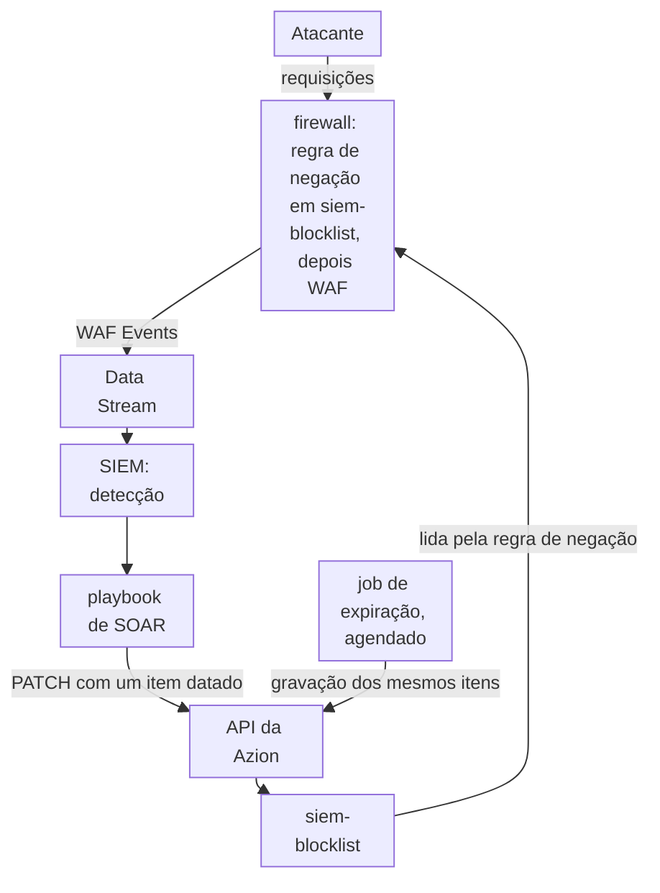
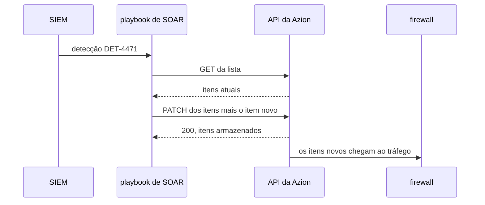

import DocCardGroup from '@aziontech/webkit/doc-card-group'
import DocCard from '@aziontech/webkit/doc-card'

Uma equipe de SOC detecta ameaças no seu SIEM mas aplica bloqueios à mão, então um atacante continua alcançando as aplicações entre a detecção e a mitigação. O firewall já roda WAF, e os seus eventos já chegam ao SIEM, mas nada leva uma decisão de volta. Esta página configura uma network list que uma regra de firewall nega, a chamada que um playbook de SIEM ou SOAR envia para adicionar um endereço a ela com uma expiração e o job que remove os itens expirados. O resultado é medido pelo tempo entre a detecção e o bloqueio e pela parcela de incidentes mitigados sem passos manuais.

Este caso de uso não cobre a lógica de detecção em si, que fica no SIEM da equipe.

## Pré-requisitos

- Uma conta Azion. Se você ainda não tem uma, [crie uma conta](https://console.azion.com/signup).
- Um firewall vinculado ao workload de cada aplicação a proteger, com WAF aplicado por uma regra. Para montar um, consulte [Primeiros passos com WAF](/pt-br/documentacao/plataforma/firewall/waf/primeiros-passos/).
- Um stream dos eventos do WAF para o SIEM. Para criá-lo, consulte [Envie eventos do WAF para um SIEM](/pt-br/documentacao/guias/seguranca-de-aplicacoes/firewall-e-waf/integrar-siems/).
- Uma plataforma de SIEM ou SOAR que consiga enviar uma requisição HTTPS a partir de um playbook e executar um job de forma agendada.

---

## Produtos necessários

| O SOC precisa de | O que significa | Produto | Documentado em |
| --- | --- | --- | --- |
| Eventos do firewall e do WAF no SIEM, onde as detecções rodam | Um stream da fonte de dados _WAF Events_ para o endpoint do SIEM | Data Stream | [Envie eventos do WAF para um SIEM](/pt-br/documentacao/guias/seguranca-de-aplicacoes/firewall-e-waf/integrar-siems/) |
| Os sinais de ataque que as detecções leem | Um WAF rule set que uma regra _Set WAF_ aplica às requisições da aplicação | WAF | [Primeiros passos com WAF](/pt-br/documentacao/plataforma/firewall/waf/primeiros-passos/) |
| Um bloqueio que um playbook consegue aplicar sem alterar uma regra | Uma network list que uma regra de negação lê pelo critério _Network_ | Network Shield | [Network Lists](/pt-br/documentacao/plataforma/firewall/network-shield/network-lists/) |
| Bloqueios que terminam sozinhos | Uma data de vencimento em cada item, aplicada por uma gravação agendada da lista | Network Shield | [Atualize uma network list a partir de uma automação](/pt-br/documentacao/guias/seguranca-de-aplicacoes/bots-e-rede/atualizar-network-list-a-partir-de-automacao/) |

---

## Arquitetura de referência

Esta página constrói o *loop de mitigação no firewall orientado pelo SIEM*: os eventos saem do firewall para o SIEM, e uma detecção volta como um item em uma network list que uma regra de firewall já aplica.

Leia o diagrama como um loop que começa e termina no firewall. Os eventos saem dele pelo Data Stream, a decisão é tomada no SIEM, e a decisão volta como dado, um item em `siem-blocklist`, nunca como uma regra nova. A regra que lê a lista existe antes de qualquer detecção, então o loop altera o que o firewall corresponde sem alterar a sua configuração. O job de expiração fecha o loop pelo outro lado, encerrando cada bloqueio quando o seu prazo passa.

### Fluxo de dados

1. As requisições do atacante chegam ao firewall. O WAF as pontua, e o Data Stream envia os eventos do WAF ao SIEM.
2. Uma detecção no SIEM inicia um playbook de SOAR, que lê `siem-blocklist`, adiciona o endereço do atacante com uma data de vencimento e grava a lista de volta pela API.
3. A regra de negação já lê `siem-blocklist`, então as próximas requisições desse endereço recebem `403` assim que a alteração chega ao tráfego, em cerca de 100 segundos.
4. Uma lista pode ser lida por regras em vários firewalls, então uma gravação bloqueia o endereço em toda aplicação que esses firewalls protegem.
5. Um job agendado grava os itens da lista de volta, e a plataforma descarta todo item cuja data de vencimento passou, o que encerra esse bloqueio.

### Recursos de Plataforma

- **Data Stream**: exporta os eventos do WAF do firewall para o endpoint que o SIEM lê, que é onde o loop começa.
- **SIEM ou SOAR**: a integração que guarda a lógica de detecção e executa o playbook que transforma uma detecção em uma atualização da lista.
- **API e Terraform Provider**: os Platform Resources pelos quais o playbook atualiza a lista. A API substitui os itens da lista a cada gravação, e o Terraform Provider gerencia a lista como um recurso.
- **Network Shield**: adiciona o critério _Network_ que compara cada endereço de cliente com a lista, e guarda a lista com uma data de vencimento e um comentário em cada item.
- **firewall**: o Platform Resource que aplica o bloqueio. A sua regra de negação na lista roda antes do WAF, então um endereço listado é recusado antes de ser pontuado.
- **WAF**: a fonte dos eventos. Os seus scores, as regras correspondidas e as actions são o que as detecções do SIEM leem.

---

## Como o design funciona

Esta seção explica por que o ciclo tem a sua forma: a lista e a regra que a aplica, a gravação do playbook na lista e o job de expiração.

### Lista e regra que a aplica

A regra existe antes de qualquer detecção, então um playbook nunca cria nem altera uma regra. Uma alteração nos itens de uma lista chega ao tráfego em cerca de 100 segundos, enquanto uma regra nova leva de 6 a 10 minutos, e uma lista não soma nada às regras que o seu plano inclui por firewall. A regra ocupa a primeira posição no firewall, então um endereço listado é recusado antes que o WAF o pontue.

A lista começa com um item sem data de vencimento, `192.0.2.10`. Uma gravação em que todos os itens estão vencidos é recusada com `22019`, então um item sem data mantém a lista gravável depois que todas as detecções expiraram.

Para proteger várias aplicações, adicione a mesma regra a cada um dos seus firewalls: toda regra lê a mesma lista, então uma gravação bloqueia o endereço em todos eles.

### Gravação do playbook na lista

O playbook envia duas chamadas para cada detecção: ele lê a lista e depois a grava de volta com o item novo. Um `PATCH` que envia `items` substitui o array inteiro, então um playbook que enviasse só o endereço novo removeria todos os outros itens, inclusive o permanente.

Cada item novo carrega duas anotações. A data de vencimento, `--LT` seguido de uma data e hora UTC em segundos inteiros, marca quando o bloqueio termina, e esta página usa 24 horas depois da detecção. O comentário, `#` seguido do ID da detecção, diz a um analista por que o endereço está ali.

1. O SIEM gera uma detecção para `198.51.100.23` e inicia o playbook.
2. O playbook lê os itens atuais de `siem-blocklist`.
3. O playbook adiciona `198.51.100.23 --LT<due-date> #DET-4471` a esses itens e grava o array inteiro de volta.
4. A API responde `200` e armazena os itens. O firewall nega o endereço assim que a alteração chega ao tráfego.

O playbook valida cada item antes de enviar o array, porque uma gravação recusada nomeia só o primeiro item inválido.

O Azion Terraform Provider também gerencia uma network list, como o recurso `azion_network_list`. Para os seus argumentos, consulte [Recursos de segurança](/pt-br/documentacao/devtools/terraform/security/).

### Job de expiração

Uma data de vencimento nunca remove um item sozinha. A plataforma lê as datas de vencimento só quando os itens de uma lista são gravados: cada gravação descarta os itens já vencidos, e um item cuja data passa depois da gravação continua correspondendo. O job de expiração é essa gravação, enviada de forma agendada. Ele lê os itens e envia os mesmos itens de volta, e a plataforma descarta os expirados.

O agendamento define por quanto tempo um item expirado continua bloqueando. Esta página executa o job a cada hora, então um bloqueio termina no máximo uma hora depois da sua data de vencimento. Uma detecção que dispara de novo antes de o job rodar mantém o endereço listado: a gravação do playbook carrega uma nova data de vencimento para ele.

---

## Medindo resultados

| Métrica | Onde ler | Como é o funcionamento correto |
| --- | --- | --- |
| Tempo entre a detecção e o bloqueio | O timestamp da detecção no SIEM, comparado ao primeiro `403` do endereço na fonte de dados HTTP Requests do [Real-Time Events](/pt-br/documentacao/plataforma/real-time-events/fontes-de-dados/#http-requests), lido por **Remote Address** e **Status** | O tempo de execução do playbook mais cerca de 100 segundos de propagação |
| Parcela de incidentes mitigados sem passos manuais | O **Last Editor** da lista, o usuário cujo token fez a última gravação, e o histórico de execuções do playbook na plataforma de SOAR | Toda gravação em `siem-blocklist` vem do usuário do playbook, e toda detecção do tipo que bloqueia tem uma execução |

---

## Boas práticas

- **Dê um único dono à lista.** Cada gravação substitui o array inteiro e sobrescreve todos os outros editores, então a edição de um analista no Azion Console entre a leitura e a gravação do playbook se perde. Mantenha os bloqueios manuais em uma lista própria, com a sua própria regra.
- **Dê ao playbook o seu próprio usuário e token.** **Last Editor** nomeia o usuário cujo token gravou a lista, então as gravações do playbook e as de pessoas ficam separadas, e o token pode ser revogado sem mexer no acesso de ninguém.
- **Coloque uma data de vencimento em todo item automatizado.** Um item sem data de vencimento bloqueia até alguém removê-lo, e uma lista que um playbook preenche cresce a cada detecção. A data de vencimento faz cada bloqueio automatizado terminar sozinho, na próxima execução do job de expiração.
- **Escreva o ID da detecção no comentário.** O comentário é armazenado com o item e exibido na lista, então um analista que recebe uma reclamação de um cliente bloqueado encontra a detecção por trás dela.
- **Nunca grave as listas mantidas pela Azion.** Qualquer gravação em `Azion IP Tor Exit Nodes` é recusada com `22004`. Referencie-a a partir de uma regra própria e mantenha os endereços do playbook em `siem-blocklist`.

---

## Guias deste caso de uso

<DocCardGroup cols={2}>
  <DocCard title="Bloqueie endereços até uma data" href="/pt-br/documentacao/guias/seguranca-de-aplicacoes/bots-e-rede/bloqueio-temporario/" label="Crie siem-blocklist com o seu primeiro item, e a regra que nega todo endereço nela." />
  <DocCard title="Altere a ordem das regras de firewall" href="/pt-br/documentacao/guias/seguranca-de-aplicacoes/bots-e-rede/alterar-a-ordem-das-regras-de-firewall/" label="Mova a regra de negação para cima da regra que aplica o WAF, para que um endereço listado seja recusado antes de ser pontuado." />
  <DocCard title="Atualize uma network list a partir de uma automação" href="/pt-br/documentacao/guias/seguranca-de-aplicacoes/bots-e-rede/atualizar-network-list-a-partir-de-automacao/" label="Envie a leitura e a gravação que adicionam um item datado a siem-blocklist, e a gravação agendada que descarta os expirados." />
  <DocCard title="Envie eventos do WAF para um SIEM" href="/pt-br/documentacao/guias/seguranca-de-aplicacoes/firewall-e-waf/integrar-siems/" label="Crie o stream de eventos do WAF que as detecções do SIEM leem, e confirme que o endpoint do SIEM o aceita." />
</DocCardGroup>
