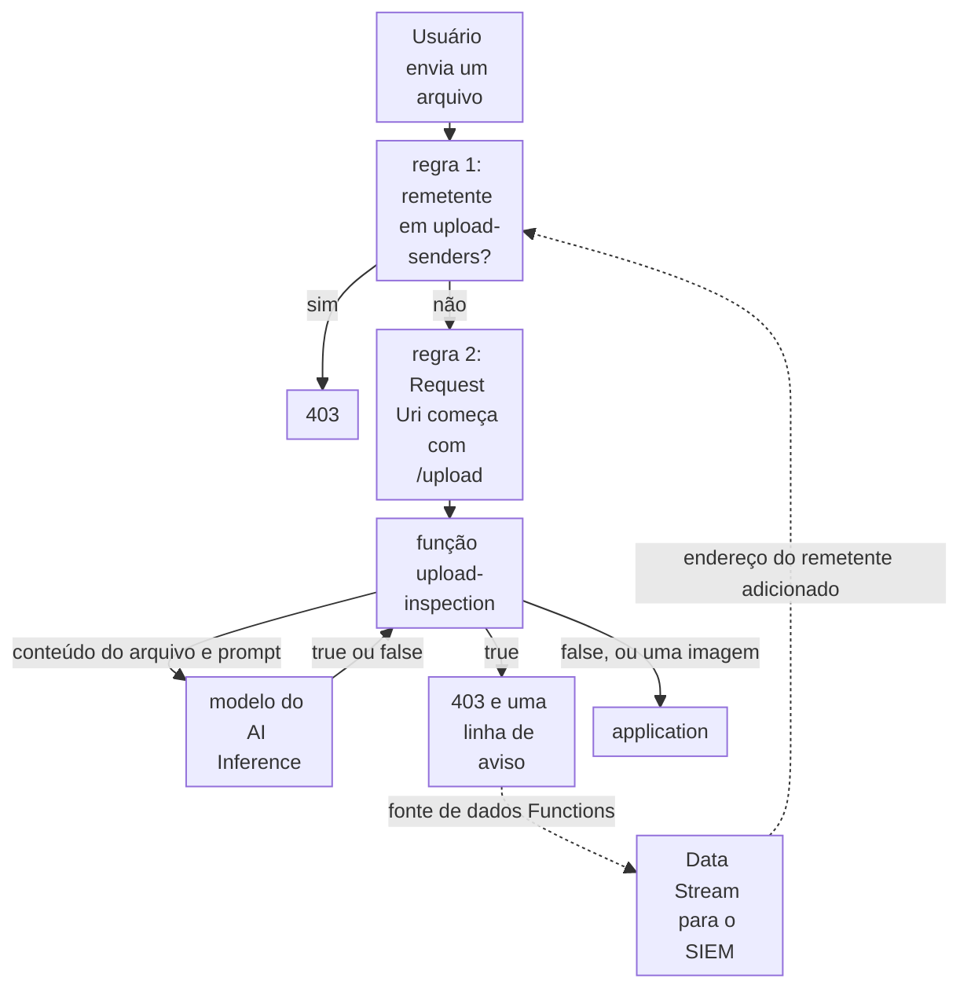

import DocCardGroup from '@aziontech/webkit/doc-card-group'
import DocCard from '@aziontech/webkit/doc-card'
import DocSteps from '@aziontech/webkit/doc-steps'
import DocStep from '@aziontech/webkit/doc-step'
import Tabs from '~/components/webkit/Tabs.vue'

Uma equipe de aplicação aceita documentos de usuários, como PDFs em fluxos de onboarding, de sinistros ou de suporte. Um arquivo pode carregar um payload malicioso, ou um texto escrito para manipular os sistemas de AI que o leem depois, e uma regra que lê só o envelope da requisição não vê nada disso. Esta página configura uma função no firewall que envia cada upload a um modelo no AI Inference e nega os arquivos que o modelo sinaliza, uma network list que bloqueia os seus remetentes e o stream que leva cada veredito ao SIEM. O resultado é medido pelos uploads maliciosos bloqueados antes da aplicação, pela latência adicionada por upload e pela taxa de falsos positivos.

Este caso de uso não cobre a varredura antivírus de arquivos armazenados nem a proteção geral do WAF, que [Proteger aplicações web contra ataques do OWASP Top 10 e zero-day](/pt-br/documentacao/casos-de-uso/proteger-aplicacoes-e-redes/proteger-aplicacoes-web-contra-ataques-do-owasp-top-10-e-zero-day/) cobre.

## Pré-requisitos

- Uma application que serve a rota de upload por meio de um connector e de um workload. Para criá-los, consulte [Primeiros passos com Applications](/pt-br/documentacao/plataforma/applications/primeiros-passos/).
- Um firewall vinculado ao deployment desse workload, com Functions e Network Shield ativados em **Main Settings** › **Modules**. Para vinculá-lo, consulte [Vincule um firewall a um workload](/pt-br/documentacao/guias/seguranca-de-aplicacoes/firewall-e-waf/proteja-seu-dominio/).
- Mistral 3 Small, cujo id é `casperhansen-mistral-small-24b-instruct-2501-awq`, disponível para a conta. Para os modelos que o AI Inference executa, consulte [Modelos de AI](/pt-br/documentacao/plataforma/ai-inference/modelos/).
- Um personal token, para a aba de API. Para criar um, consulte [Gerencie personal tokens](/pt-br/documentacao/guias/plataforma/conta-e-billing/personal-tokens/).
- Os valores da sua aplicação. Esta página usa `www.example.com` como domínio, `/upload` como a rota que recebe arquivos, `198.51.100.42` como o endereço de um remetente que o modelo sinalizou e `upload` como prefixo de cada objeto que cria. Substitua cada valor pelo seu em todos os passos.

---

## Produtos necessários

| A rota de upload precisa de | O que significa | Produto | Documentado em |
| --- | --- | --- | --- |
| Cada upload lido antes que a aplicação o receba | Uma função de firewall, executada por uma regra na rota de upload, que lê o corpo da requisição | Functions | [Analise uploads de arquivos com uma função de firewall do AI Inference](/pt-br/documentacao/guias/ai/inferencia/analisar-uploads-com-ai-inference/) |
| Um veredito sobre o conteúdo de cada arquivo | Uma chamada a um modelo por `Azion.AI.run`, com um prompt que pede `true` ou `false` | AI Inference | [Invocação de modelos](/pt-br/documentacao/plataforma/ai-inference/invocacao-de-modelos/) |
| Os remetentes de arquivos maliciosos recusados em todas as rotas | Uma network list que uma regra de negação lê pelo critério _Network_ | Network Shield | [Network Lists](/pt-br/documentacao/plataforma/firewall/network-shield/network-lists/) |
| Cada veredito no SIEM da equipe | Um stream da fonte de dados _Functions_, que carrega as linhas que a função registra, para o endpoint do SIEM | Data Stream | [Depure functions com o Data Stream](/pt-br/documentacao/guias/plataforma/observabilidade/debugging-functions-data-stream/) |

---

## Arquitetura de referência

Esta página constrói o *pipeline de inspeção de uploads assistida por AI*: o firewall envia cada upload a uma função que pergunta a um modelo se ele é malicioso e aplica o veredito na mesma requisição.



Leia o diagrama a partir da função. As regras antes dela são decisões comuns de firewall, tomadas a partir do envelope da requisição: o endereço do remetente e a rota. A função é onde o design lê o próprio arquivo, e o veredito do modelo é a única dependência nova que o design adiciona ao caminho da requisição. Tudo depois da função decorre desse veredito, e o ciclo pontilhado pelo Data Stream transforma um arquivo malicioso em um bloqueio do seu remetente.

### Fluxo de dados

1. Um usuário envia um arquivo para `/upload`. A primeira regra do firewall compara o endereço do usuário com `upload-senders`, e um remetente listado recebe `403` em todas as rotas.
2. A segunda regra executa a função `upload-inspection` em toda requisição para `/upload`.
3. A função lê o corpo da requisição e o envia ao modelo por `Azion.AI.run`, com um prompt que pede `true` quando o conteúdo é malicioso. Um arquivo cujo `Content-Type` começa com `image/` segue sem chamada ao modelo.
4. Quando o modelo responde `true`, a função grava uma linha de aviso e nega a requisição com `403`, antes que a aplicação a receba. Caso contrário, o upload segue para a aplicação.
5. Data Stream envia as linhas da função ao SIEM.
6. O request ID de um veredito leva ao endereço do remetente, que é então adicionado a `upload-senders`, a lista que a primeira regra lê.

### Componentes

- **firewall**: o Platform Resource que encaminha os uploads à função. Uma regra executa a função na rota de upload, e outra nega os remetentes da network list em todas as rotas.
- **Functions**: executa a função de inspeção no ambiente de execução `firewall`. Ela extrai o conteúdo da requisição, chama o modelo e aplica o veredito na mesma requisição, para que um arquivo recusado fique fora da aplicação.
- **AI Inference**: executa o modelo que classifica o conteúdo. O prompt nos argumentos da função define o que o modelo trata como malicioso, então a política muda sem código novo.
- **Object Storage**: guarda um bucket de quarentena, onde um upload recusado pode ser mantido para um analista revisar em vez de desaparecer. A função desta página nega o arquivo e não o grava em nenhum bucket.
- **Network Shield**: guarda a blocklist de remetentes, a network list cuja regra de negação recusa um remetente sinalizado em todas as rotas.
- **Data Stream**: envia as linhas de veredito da função ao endpoint que o SIEM lê.
- **SIEM**: a integração que correlaciona os vereditos com os registros de requisições e as outras fontes da equipe, e que transforma um veredito em um item da blocklist.

---

## Configure a função de inspeção

A função registra um handler `firewall`, então ela roda no firewall, antes que a requisição chegue à aplicação. Ela lê o corpo como texto e o envia ao modelo como a mensagem do usuário, com o prompt dos argumentos da instância como a mensagem de sistema. `temperature` é `0` e `max_tokens` é `1024`, os valores que o guia de análise de uploads usa: o veredito é uma palavra, então a chamada não pede variação. A função compara a resposta com a string `true`, então o prompt instrui o modelo a responder só com `true` ou `false`.

A função trata três casos sozinha. Um `Content-Type` que começa com `image/` segue sem chamada ao modelo. Um `Content-Type` que nomeia base64 é decodificado antes da chamada. Qualquer erro, na chamada ou no parsing, grava uma linha de erro e deixa a requisição seguir, para que a rota continue funcionando quando o modelo não responde.

Crie a função como [Analise uploads de arquivos com uma função de firewall do AI Inference](/pt-br/documentacao/guias/ai/inferencia/analisar-uploads-com-ai-inference/#crie-a-funcao-de-firewall) descreve, com estes valores:

- **Nome**: `upload-inspection`, que a instância na rota de upload seleciona.
- **Código**: a função do guia, sem alterações. Ela lê `model`, `action` e `prompt` dos argumentos.
- **Argumentos**: o modelo, a action e o prompt:

  ```json
  {
    "model": "casperhansen-mistral-small-24b-instruct-2501-awq",
    "prompt": "You are a security assistant specialized in detecting malicious PDF files. Analyze the provided content carefully and return 'true' only if you identify malicious content, such as embedded scripts, suspicious patterns, or known vulnerabilities. Do not classify a file as malicious based solely on its structure or the presence of a PDF header. If the content is safe or does not contain clear malicious indicators, return 'false'. Do not provide any additional explanation or output.",
    "action": "deny"
  }
  ```

A função é salva e fica disponível para ser instanciada em um firewall. `action` nomeia o método do evento que a função chama para um arquivo malicioso: `deny` responde `403`, e `drop` encerraria a requisição sem resposta. Para todos os campos que `Azion.AI.run` aceita, consulte [Invocação de modelos](/pt-br/documentacao/plataforma/ai-inference/invocacao-de-modelos/).

---

## Configure a função na rota de upload

A função roda só onde uma regra executa a sua instância, então a regra corresponde a `${request_uri}` _starts with_ `/upload`. Todas as outras rotas pulam a chamada ao modelo, o que mantém a latência e o uso do AI Inference restritos aos uploads. Crie esta regra depois da regra de remetentes da próxima seção, ou mova-a para baixo dessa regra, para que um remetente listado seja recusado antes que o modelo leia o seu arquivo.

Para instanciar a função e executá-la:

<DocSteps>
  <DocStep title="Abra a aba Functions Instances">

  Acesse [Azion Console](https://console.azion.com/) > **Firewalls**, selecione o firewall e vá para a aba **Functions Instances**.

  </DocStep>
  <DocStep title="Selecione + Function Instance" />
  <DocStep title="Nomeie a instância">

  Insira `upload-inspection` e selecione a função `upload-inspection`.

  </DocStep>
  <DocStep title="Selecione Save" />
  <DocStep title="Vá para a aba Rules Engine e selecione + Rule" />
  <DocStep title="Nomeie a regra">

  Insira `upload - inspect files`.

  </DocStep>
  <DocStep title="Corresponda à rota de upload">

  Na seção **Criteria**, selecione `Request Uri`, _starts with_ e `/upload`.

  </DocStep>
  <DocStep title="Adicione o comportamento Run Function">

  Na seção **Behaviors**, selecione **Run Function** e depois a instância `upload-inspection`.

  </DocStep>
  <DocStep title="Selecione Save" />
</DocSteps>

Toda requisição cuja URI começa com `/upload` é lida pelo modelo antes que a aplicação a receba. Uma regra nova chega ao tráfego de 6 a 10 minutos depois de salva.

---

## Configure a blocklist de remetentes

Um remetente cujo arquivo o modelo sinalizou é recusado em todas as rotas do workload, `/upload` incluída, por uma regra de negação que lê a lista `upload-senders`. A função registra o veredito, não o endereço. No Data Stream, cada linha da fonte de dados _Functions_ carrega o `$request_id` da requisição, e a fonte de dados _Applications_ carrega `$remote_addr` para o mesmo `$request_id`. Uma pessoa ou o SIEM junta os dois e adiciona o endereço à lista.

Cada item carrega uma data de expiração e um comentário. A data de expiração, 7 dias depois do upload, encerra o bloqueio de um endereço que outro usuário pode usar depois. O comentário nomeia o request ID, para que um analista encontre o veredito por trás do bloqueio. Uma data de expiração só tem efeito na próxima gravação dos itens da lista, como [Bloqueie endereços até uma data](/pt-br/documentacao/guias/seguranca-de-aplicacoes/bots-e-rede/bloqueio-temporario/) explica.

<Tabs client:visible sharedStore="interface">
<Fragment slot="tab.console">Console</Fragment>
<Fragment slot="tab.api">API</Fragment>

<Fragment slot="panel.console">

Para criar a lista:

<DocSteps>
  <DocStep title="Abra a página Network Lists">

  Acesse [Azion Console](https://console.azion.com/) > **Edge Libraries** > **Network Lists** e selecione **Network List**.

  </DocStep>
  <DocStep title="Nomeie a lista e selecione o tipo IP/CIDR">

  Insira `upload-senders` em **Name** e selecione _IP/CIDR_ na seção **Network List Settings**.

  </DocStep>
  <DocStep title="Insira o remetente sinalizado">

  No campo **List**, insira `198.51.100.42 --LT2030-01-01T00:00:00Z #<request-id>`, com a data 7 dias depois do upload no lugar de `2030-01-01T00:00:00Z`.

  </DocStep>
  <DocStep title="Selecione Save" />
</DocSteps>

Para criar a regra que a lê:

<DocSteps>
  <DocStep title="Abra a aba Rules Engine do firewall">

  Acesse **Firewalls**, selecione o firewall, vá para a aba **Rules Engine** e selecione **Rule**.

  </DocStep>
  <DocStep title="Nomeie a regra">

  Insira `upload - deny flagged senders`.

  </DocStep>
  <DocStep title="Corresponda à lista">

  Na seção **Criteria**, selecione a variável _Network_ e o operador _matches_, e depois `upload-senders` em **Select a Network**.

  </DocStep>
  <DocStep title="Na seção Behaviors, selecione Deny (403 Forbidden)" />
  <DocStep title="Selecione Save" />
</DocSteps>

</Fragment>

<Fragment slot="panel.api">

Para criar a lista com o primeiro remetente sinalizado, com a data 7 dias depois do upload no lugar de `2030-01-01T00:00:00Z`:

```bash
curl --request POST \
  --url https://api.azion.com/v4/workspace/network_lists \
  --header 'Authorization: Token <personal-token>' \
  --header 'Content-Type: application/json' \
  --data '{"name":"upload-senders","type":"ip_cidr","items":["198.51.100.42 --LT2030-01-01T00:00:00Z #<request-id>"]}'
```

A API responde `201` com um `state` igual a `executed`. Guarde o `id` da lista:

```json
{"state":"executed","data":{"id":<network-list-id>,"name":"upload-senders","type":"ip_cidr","items":["198.51.100.42 --LT2030-01-01T00:00:00Z #<request-id>"],...}}
```

Para criar a regra que a lê:

```bash
curl --request POST \
  --url https://api.azion.com/v4/workspace/firewalls/<firewall-id>/request_rules \
  --header 'Authorization: Token <personal-token>' \
  --header 'Content-Type: application/json' \
  --data '{
  "name": "upload - deny flagged senders",
  "active": true,
  "criteria": [
    [{ "variable": "${network}", "conditional": "if", "operator": "is_in_list", "argument": <network-list-id> }]
  ],
  "behaviors": [{ "type": "deny" }]
}'
```

A API responde `202` com um `state` igual a `pending`. Para adicionar um remetente posterior, leia `upload-senders` e grave-a de volta com o item novo, como [Adicione um item à lista](/pt-br/documentacao/guias/seguranca-de-aplicacoes/bots-e-rede/atualizar-network-list-a-partir-de-automacao/#adicione-um-item-a-lista) descreve. O item novo é `<sender-address> --LT<upload-date-plus-7-days> #<request-id>`.

</Fragment>
</Tabs>

Um remetente listado recebe `403` em todas as rotas do workload. Uma alteração posterior nos itens chega ao tráfego em cerca de 100 segundos, sem alteração na regra. Para deixar o SIEM gravar a lista, consulte [Bloquear atacantes automaticamente a partir de detecções do SIEM](/pt-br/documentacao/casos-de-uso/proteger-aplicacoes-e-redes/bloquear-atacantes-automaticamente-a-partir-de-deteccoes-do-siem/).

---

## Verifique a configuração

Uma regra nova chega ao tráfego de 6 a 10 minutos depois de salva, e uma alteração nos itens de uma lista em cerca de 100 segundos. Repita cada requisição até a resposta se manter.

- **Um arquivo limpo chega à aplicação.** Envie um documento que você sabe que é seguro:

  ```bash
  curl -s -o /dev/null -w '%{http_code}\n' -X POST --data-binary @safe.pdf -H "Content-Type: application/pdf" https://www.example.com/upload
  ```

  O comando imprime o status que a sua aplicação responde para um upload.

- **Um arquivo malicioso é negado.** Envie um arquivo de teste construído para carregar um indicador malicioso, como um script embutido:

  ```bash
  curl -s -o /dev/null -w '%{http_code}\n' -X POST --data-binary @test-malicious.pdf -H "Content-Type: application/pdf" https://www.example.com/upload
  ```

  Quando o modelo responde `true`, o comando imprime `403`, e o dataset `functionConsoleEvents` do Real-Time Events guarda uma linha de aviso com o texto `[AI] true`.

- **As outras rotas pulam o modelo.** Requisite uma página fora de `/upload`. Nenhuma linha de `upload-inspection` aparece para ela.

- **Um remetente sinalizado é recusado em todas as rotas.** A partir de um endereço em `upload-senders`, requisite a página inicial:

  ```bash
  curl -s -o /dev/null -w '%{http_code}\n' https://www.example.com/
  ```

  O comando imprime `403`.

- **Os vereditos chegam ao SIEM.** No Real-Time Events, a fonte de dados _Data Stream_ lista cada envio do stream de _Functions_, e um **Status Code** `200` significa que o endpoint do SIEM aceitou o lote.

---

## Medindo resultados

| Métrica | Onde ler | Como é o funcionamento correto |
| --- | --- | --- |
| Uploads maliciosos bloqueados antes da aplicação | As linhas de aviso com o texto `[AI] true`, no dataset `functionConsoleEvents` do Real-Time Events ou no SIEM | Cada upload bloqueado tem uma linha, e nenhum arquivo sinalizado aparece no armazenamento da própria aplicação |
| Latência adicionada por upload | **Request Time** das requisições para `/upload`, na fonte de dados [HTTP Requests](/pt-br/documentacao/plataforma/real-time-events/fontes-de-dados/#http-requests), comparado à mesma rota antes da regra | Fica dentro do que o fluxo de upload tolera, abaixo dos [limites](/pt-br/documentacao/plataforma/ai-inference/limites/) do AI Inference |
| Taxa de falsos positivos | Os uploads bloqueados que os analistas da equipe revisam e rotulam como seguros, comparados a todos os uploads bloqueados | Cai à medida que o prompt nos argumentos da instância é ajustado com os arquivos rotulados |

---

## Boas práticas

- **Acompanhe as linhas de erro, porque a função falha aberta.** Em qualquer erro, a função grava uma linha de erro e deixa o upload seguir. Um modelo que para de responder aparece então como linhas de erro, não como uploads bloqueados. Crie um alerta para as linhas com o texto `Error handling request:`.
- **Remova o desvio de imagens quando a rota não aceita imagens.** A função deixa seguir sem chamada ao modelo qualquer requisição cujo `Content-Type` começa com `image/`, e é o cliente que define esse header. Uma rota que recebe só documentos não perde nada quando o desvio sai.
- **Mantenha uma regra de WAF em Blocking fora da rota de upload.** O WAF faz o parsing do corpo de uma requisição só até 131.072 bytes e recusa um corpo maior com `400` em _Blocking_, então uma regra de WAF em `/upload` recusa todo arquivo maior que 128 KiB antes que o modelo o leia. Para o limite, consulte [Parsing do corpo da requisição](/pt-br/documentacao/plataforma/firewall/waf/score-e-modos/#parsing-do-corpo-da-requisicao).
- **Ajuste o prompt, não o código.** O prompt fica nos argumentos da instância, então uma alteração nele chega ao tráfego em cerca de 105 segundos, sem função nova. Realimente o prompt com os arquivos que os analistas rotulam.
- **Coloque uma data de expiração em todo item de remetente.** Um endereço pode passar para outro usuário, e um bloqueio sem fim recusa também esse usuário.

---

## Guias deste caso de uso

<DocCardGroup cols={2}>
  <DocCard title="Atualize uma network list a partir de uma automação" href="/pt-br/documentacao/guias/seguranca-de-aplicacoes/bots-e-rede/atualizar-network-list-a-partir-de-automacao/" label="Adicione cada remetente sinalizado depois à lista a partir de um script ou de um playbook do SIEM." />
  <DocCard title="Analise uploads de arquivos com uma função de firewall do AI Inference" href="/pt-br/documentacao/guias/ai/inferencia/analisar-uploads-com-ai-inference/" label="Crie a função upload-inspection, que envia cada upload ao modelo, e a regra que a executa na rota de upload." />
</DocCardGroup>
