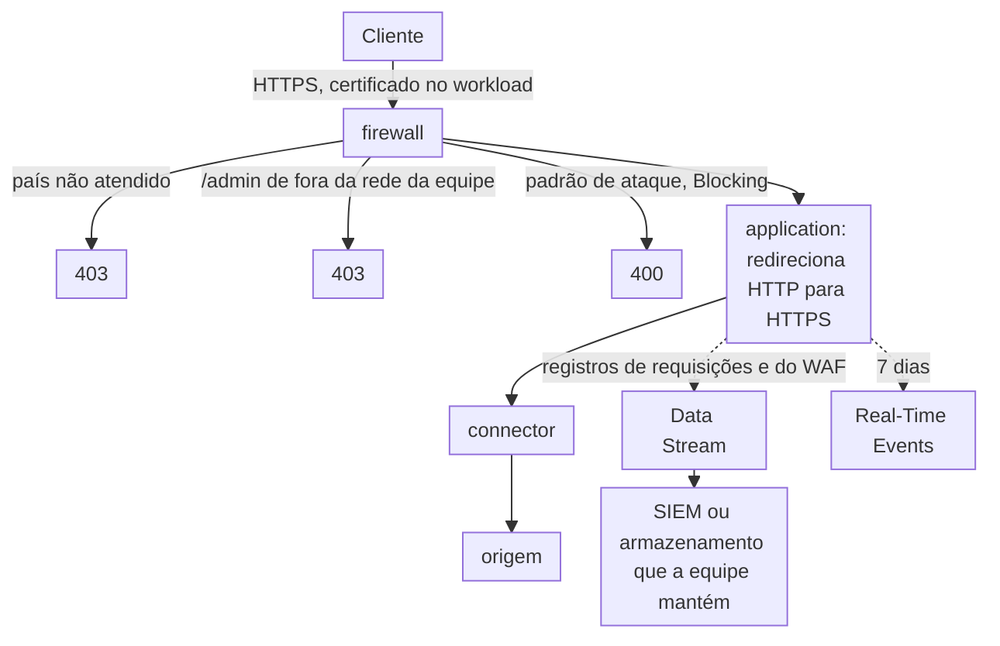

import DocCardGroup from '@aziontech/webkit/doc-card-group'
import DocCard from '@aziontech/webkit/doc-card'
import DocSteps from '@aziontech/webkit/doc-steps'
import DocStep from '@aziontech/webkit/doc-step'
import Tabs from '~/components/webkit/Tabs.vue'

Uma equipe de segurança ou de compliance é responsável por uma aplicação web que trata dados de cartão ou dados pessoais sob um padrão como PCI DSS, SOC 2, LGPD ou GDPR. Ela precisa mostrar aos auditores que o tráfego é criptografado, que os ataques na camada de aplicação são filtrados, que o acesso é restrito e que os eventos de segurança são guardados. Esta página configura o redirecionamento para HTTPS na application, as restrições por país e por endereço no seu firewall e um stream que exporta cada requisição e cada evento do WAF a um destino que a equipe mantém. O resultado é medido por cada controle auditado mapeado a uma configuração da plataforma, pela completude e pelo período de retenção dos logs de segurança e pelo tempo necessário para preparar as evidências de auditoria.

Este caso de uso não cobre as certificações da própria Azion como fornecedora, para as quais consulte [Compliance PCI](/pt-br/documentacao/fundamentos/pci-dss-certification/) e [Compliance SOC](/pt-br/documentacao/fundamentos/soc/), nem onde os bancos de dados da equipe armazenam dados regulados.

## Pré-requisitos

- Uma application que serve a aplicação web por meio de um connector e de um workload. Para criá-los, consulte [Primeiros passos com Applications](/pt-br/documentacao/plataforma/applications/primeiros-passos/).
- HTTPS ativado nas configurações de protocolo do workload, com um certificado que cobre os seus domínios. Para que a Azion solicite e renove um, consulte [Solicite um certificado Let's Encrypt](/pt-br/documentacao/guias/seguranca-de-aplicacoes/tls-e-certificados/como-gerar-um-certificado-lets-encrypt/), e para enviar um certificado próprio, consulte [Primeiros passos com Certificate Manager](/pt-br/documentacao/plataforma/workloads/certificate-manager/primeiros-passos/).
- Um firewall vinculado ao deployment do workload, com WAF aplicado a toda requisição. Para construí-lo, consulte [Vincule um firewall a um workload](/pt-br/documentacao/guias/seguranca-de-aplicacoes/firewall-e-waf/proteja-seu-dominio/) e [Aplique um rule set a toda requisição](/pt-br/documentacao/guias/seguranca-de-aplicacoes/firewall-e-waf/aplicar-rule-set/).
- Um endpoint que guarda os eventos pelo período que o seu padrão exige, como um SIEM ou um bucket de armazenamento. Para os endpoints aos quais um stream envia, consulte [Endpoints](/pt-br/documentacao/plataforma/data-stream/endpoints/).
- Um personal token, para as abas de API. Para criar um, consulte [Gerencie personal tokens](/pt-br/documentacao/guias/plataforma/conta-e-billing/personal-tokens/).
- Os valores da sua aplicação. Esta página usa `www.example.com` como domínio, `BR` e `US` como os países que a aplicação atende, `/admin` como o seu caminho de administração, `203.0.113.0/24` como a rede da sua equipe, um cluster Apache Kafka em `kafka1.example.com:9092` com o tópico `azion.audit` como endpoint e `audit` como prefixo de cada objeto que cria. Substitua cada valor pelo seu em todos os passos.

---

## Produtos necessários

| A auditoria pede | O que significa | Produto | Documentado em |
| --- | --- | --- | --- |
| Tráfego criptografado em trânsito | Um certificado no workload e uma regra _Redirect HTTP to HTTPS_ na application | Certificate Manager | [Primeiros passos com Certificate Manager](/pt-br/documentacao/plataforma/workloads/certificate-manager/primeiros-passos/) e [Redirecione HTTP para HTTPS](/pt-br/documentacao/guias/seguranca-de-aplicacoes/tls-e-certificados/redirecionar-http-para-https/) |
| Ataques na camada de aplicação filtrados | Um WAF rule set que uma regra _Set WAF_ aplica a toda requisição | WAF | [Aplique um rule set a toda requisição](/pt-br/documentacao/guias/seguranca-de-aplicacoes/firewall-e-waf/aplicar-rule-set/) |
| Acesso restrito por país e por rede | Network lists que regras de negação leem pelo critério _Network_ | Network Shield | [Network Lists](/pt-br/documentacao/plataforma/firewall/network-shield/network-lists/) |
| Eventos de segurança guardados fora da plataforma | Um stream da fonte de dados _Applications_, com as variáveis do WAF, para o endpoint da equipe | Data Stream | [Envie registros de requisições e do WAF a um SIEM](/pt-br/documentacao/guias/plataforma/observabilidade/enviar-registros-de-requisicoes-e-waf-a-um-siem/) |
| Um incidente revisado requisição por requisição | O registro de cada requisição, com os seus campos de WAF | Real-Time Events | [Fontes de dados](/pt-br/documentacao/plataforma/real-time-events/fontes-de-dados/#http-requests) |

DDoS Protection mitiga ataques DoS e DDoS em todo workload, sem nada para configurar. Para os tipos de ataque que cobre, consulte [Mitigação de ataques](/pt-br/documentacao/plataforma/workloads/ddos-protection/ddos-mitigation/).

---

## Arquitetura de referência

Esta página constrói o *perímetro de compliance com retenção de eventos de segurança*: criptografia, filtragem e restrições de acesso na frente da aplicação, e uma exportação de cada evento de segurança a um destino que a equipe mantém.



Leia o diagrama como dois caminhos. O caminho contínuo é a requisição: criptografada na chegada, filtrada pelas regras do firewall e entregue à origem pelo connector. O caminho pontilhado é a evidência: um registro de cada requisição, com a sua decisão do WAF, sai para um destino que a equipe mantém, enquanto o Real-Time Events guarda uma janela curta para revisão. Uma auditoria pergunta sobre os dois caminhos, e cada controle do primeiro tem um registro no segundo.

### Fluxo de dados

1. Um cliente se conecta por HTTPS, e o workload apresenta o certificado que o Certificate Manager guarda para o domínio. DDoS Protection avalia o tráfego antes de qualquer regra de firewall rodar.
2. As regras do firewall negam, por meio de listas do Network Shield, um cliente cujo país não está na lista atendida e uma requisição a `/admin` de fora da rede da equipe.
3. O WAF pontua toda requisição e, em _Blocking_, recusa uma cujo score atinge o threshold de uma família.
4. Uma requisição que passa chega à application, que redireciona HTTP simples para HTTPS e encaminha a requisição à origem pelo connector.
5. Data Stream exporta o registro de cada requisição, com as suas variáveis do WAF, ao SIEM ou ao armazenamento que a equipe mantém pelo período que o seu padrão exige.
6. Real-Time Events guarda cada registro por 7 dias, para a revisão de um incidente recente.

### Componentes

- **Certificate Manager**: o Platform Resource que guarda os certificados TLS que um workload apresenta, enviados pela equipe ou solicitados ao Let's Encrypt e renovados pela Azion.
- **application**: o Platform Resource que redireciona HTTP simples para HTTPS e entrega as requisições que o firewall deixa passar.
- **firewall**: o Platform Resource que é o ponto de aplicação, onde cada controle roda como uma regra que a equipe pode nomear a um auditor.
- **DDoS Protection**: a Feature que mitiga ataques DoS e DDoS em todo workload, sempre ativa e sem nada para configurar.
- **WAF**: o controle da camada de aplicação, que pontua cada requisição contra oito famílias de ameaças e recusa padrões de ataque em _Blocking_.
- **Network Shield**: restringe o acesso por rede e por país, por meio de listas que regras de negação leem com o critério _Network_.
- **connector**: o Platform Resource que alcança a origem.
- **Data Stream**: exporta os registros de requisições, com as variáveis do WAF, para retenção fora da plataforma. A sua fonte de dados _Activity History_ também exporta as alterações de configuração que os usuários fazem no Azion Console.
- **Real-Time Events**: guarda cada registro de requisição por 7 dias, para a revisão de incidentes.
- **SIEM ou armazenamento**: a integração que guarda a evidência pelo período que o padrão da equipe exige.

---

## Configure a imposição de HTTPS

O certificado no workload criptografa cada conexão HTTPS, e a regra da application fecha o outro caminho: uma requisição feita por HTTP simples é redirecionada para HTTPS em vez de ser servida. _Redirect HTTP to HTTPS_ não faz nada a uma requisição já feita por HTTPS, então a regra corresponde a `${uri}` _starts with_ `/`, todo caminho, sem condição sobre o esquema. O comportamento exige HTTPS ativado nas configurações de protocolo do workload.

O **Minimum TLS version** do workload tem TLS 1.3 como padrão. Mantenha-o, ou registre a versão que definir, porque um auditor pergunta pelo piso, não pela versão que uma sessão negociou.

A regra é criada como [Redirecione HTTP para HTTPS](/pt-br/documentacao/guias/seguranca-de-aplicacoes/tls-e-certificados/redirecionar-http-para-https/) descreve, com estes valores:

- **Nome da regra**: `audit - redirect to HTTPS`, um nome que um auditor consegue mapear ao controle de criptografia.
- **Critério**: `${uri}` _starts with_ `/`, todo caminho de `www.example.com`.
- **Comportamento**: _Redirect HTTP to HTTPS_.
- **Posição**: antes de qualquer regra da application cujo comportamento encerra o processamento, para que nenhuma requisição HTTP pule o redirecionamento.

Toda requisição feita por HTTP é redirecionada para HTTPS, e toda requisição HTTPS continua inalterada. Uma regra nova leva alguns minutos para se propagar.

---

## Configure as restrições de acesso e geográficas

Duas regras de negação restringem o acesso no firewall. A primeira recusa todo cliente cujo país não está em `audit-served-countries`, com o operador _does not match_ do critério _Network_, então um país novo continua recusado até alguém adicioná-lo. A segunda recusa uma requisição a `/admin` de qualquer endereço fora de `audit-team-addresses`, então o caminho de administração responde só à sua equipe. Os seus dois critérios ficam em um bloco unido por _and_: a regra age só onde o caminho e o endereço correspondem.

A resolução de país pode errar para alguns endereços, então a regra de administração lê uma lista `ip_cidr` em vez de um país. Dê a cada entrada de `audit-team-addresses` um comentário que nomeia de quem é a rede, porque um auditor pergunta quem consegue alcançar o caminho.

<Tabs client:visible sharedStore="interface">
<Fragment slot="tab.console">Console</Fragment>
<Fragment slot="tab.api">API</Fragment>

<Fragment slot="panel.console">

Para criar as duas listas:

<DocSteps>
  <DocStep title="Abra a página Network Lists">

  Acesse [Azion Console](https://console.azion.com/) > **Edge Libraries** > **Network Lists** e selecione **Network List**.

  </DocStep>
  <DocStep title="Crie a lista de países">

  Insira `audit-served-countries` em **Name**, selecione _Countries_, selecione Brazil e United States em **Countries** e selecione **Save**.

  </DocStep>
  <DocStep title="Crie a lista da equipe">

  Selecione **Network List** de novo, insira `audit-team-addresses`, selecione _IP/CIDR_, insira `203.0.113.0/24 #security team office` em **List** e selecione **Save**.

  </DocStep>
</DocSteps>

Para criar as duas regras:

<DocSteps>
  <DocStep title="Abra a aba Rules Engine do firewall">

  Acesse **Firewalls**, selecione o firewall e vá para a aba **Rules Engine**.

  </DocStep>
  <DocStep title="Crie a regra de país">

  Selecione **Rule** e insira `audit - deny countries not served`. Na seção **Criteria**, selecione _Network_, _does not match_ e `audit-served-countries`. Na seção **Behaviors**, selecione _Deny (403 Forbidden)_ e selecione **Save**.

  </DocStep>
  <DocStep title="Crie a regra de administração">

  Selecione **Rule** e insira `audit - restrict admin to the team`. Na seção **Criteria**, selecione _Network_, _does not match_ e `audit-team-addresses`. Adicione um critério unido por **And**: `Request Uri` _starts with_ `/admin`. Na seção **Behaviors**, selecione _Deny (403 Forbidden)_ e selecione **Save**.

  </DocStep>
</DocSteps>

</Fragment>

<Fragment slot="panel.api">

Para criar a lista de países:

```bash
curl --request POST \
  --url https://api.azion.com/v4/workspace/network_lists \
  --header 'Authorization: Token <personal-token>' \
  --header 'Content-Type: application/json' \
  --data '{"name":"audit-served-countries","type":"countries","items":["BR","US"]}'
```

Para criar a lista da equipe:

```bash
curl --request POST \
  --url https://api.azion.com/v4/workspace/network_lists \
  --header 'Authorization: Token <personal-token>' \
  --header 'Content-Type: application/json' \
  --data '{"name":"audit-team-addresses","type":"ip_cidr","items":["203.0.113.0/24 #security team office"]}'
```

Cada chamada responde `201` com um `state` igual a `executed` e o `id` da lista. Para criar a regra de país:

```bash
curl --request POST \
  --url https://api.azion.com/v4/workspace/firewalls/<firewall-id>/request_rules \
  --header 'Authorization: Token <personal-token>' \
  --header 'Content-Type: application/json' \
  --data '{
  "name": "audit - deny countries not served",
  "active": true,
  "criteria": [
    [{ "variable": "${network}", "conditional": "if", "operator": "is_not_in_list", "argument": <countries-list-id> }]
  ],
  "behaviors": [{ "type": "deny" }]
}'
```

Para criar a regra de administração, com os dois critérios em um bloco:

```bash
curl --request POST \
  --url https://api.azion.com/v4/workspace/firewalls/<firewall-id>/request_rules \
  --header 'Authorization: Token <personal-token>' \
  --header 'Content-Type: application/json' \
  --data '{
  "name": "audit - restrict admin to the team",
  "active": true,
  "criteria": [
    [
      { "variable": "${network}", "conditional": "if", "operator": "is_not_in_list", "argument": <team-list-id> },
      { "variable": "${request_uri}", "conditional": "and", "operator": "starts_with", "argument": "/admin" }
    ]
  ],
  "behaviors": [{ "type": "deny" }]
}'
```

Cada chamada responde `202` com um `state` igual a `pending` e a regra como foi armazenada.

</Fragment>
</Tabs>

Um cliente de um país fora da lista, e uma requisição a `/admin` de fora da rede da equipe, recebem cada um `403` assim que as regras se propagam, de 6 a 10 minutos depois de salvas.

---

## Configure a exportação de eventos

O stream lê a fonte de dados _Applications_ com o template _Applications + WAF Event Collector_, `184` na API. Cada linha de log carrega então a requisição, a resposta e o endereço do cliente, com o score do WAF, as regras correspondidas e a action da mesma requisição, então uma linha responde à pergunta de um auditor sobre uma requisição. O stream filtra pelo workload da aplicação em vez de usar amostragem, então toda requisição é exportada e os outros streams da conta continuam ativos.

Real-Time Events guarda cada registro por 7 dias, então a evidência de um período de auditoria vem do destino, que guarda as linhas pelo tempo que a equipe o configurar para guardar.

Crie o stream como [Envie registros de requisições e do WAF a um SIEM](/pt-br/documentacao/guias/plataforma/observabilidade/enviar-registros-de-requisicoes-e-waf-a-um-siem/) descreve, com estes valores:

- **Nome**: `audit-events`.
- **Filtro de workload**: o workload da aplicação.
- **Endpoint**: _Apache Kafka_, com `kafka1.example.com:9092` em **Bootstrap Servers**, `azion.audit` em **Kafka Topic** e TLS ativado.

Na API, a entrada de `outputs` é:

```json
{ "type": "kafka", "attributes": { "bootstrap_servers": "kafka1.example.com:9092", "kafka_topic": "azion.audit", "use_tls": true } }
```

O stream é ativado de um a dois minutos depois de salvo e envia um lote a cada 60 segundos, ou antes, ao atingir 2.000 linhas de log.

---

## Verifique a configuração

Uma regra nova chega ao tráfego de 6 a 10 minutos depois de salva. Repita cada requisição até a resposta se manter.

- **HTTP simples é redirecionado.** Requisite o domínio por HTTP:

  ```bash
  curl -s -o /dev/null -w '%{redirect_url}\n' http://www.example.com/
  ```

  O comando imprime `https://www.example.com/`.

- **O caminho de administração responde só à equipe.** A partir de um endereço fora de `203.0.113.0/24`, requisite `/admin`:

  ```bash
  curl -s -o /dev/null -w '%{http_code}\n' https://www.example.com/admin
  ```

  O comando imprime `403`. A mesma requisição a partir da rede da equipe alcança a aplicação.

- **Países fora da lista são recusados.** Uma requisição de um cliente resolvido para um país fora de `audit-served-countries` recebe `403`, com a página de erro padrão da Azion, que mostra o endereço do cliente e o request ID.

- **Os padrões de ataque são filtrados.** Envie `https://www.example.com/?q=1%27%20OR%20%271%27%3D%271`. Com a regra de WAF em _Blocking_, a resposta é `400`.

- **Todo envio chega ao destino.** No Real-Time Events, a fonte de dados _Data Stream_ lista cada envio de `audit-events`, e um **Status Code** `200` significa que o destino aceitou o lote. No destino, uma linha carrega chaves como `waf_score` e `waf_match`.

---

## Medindo resultados

| Métrica | Onde ler | Como é o funcionamento correto |
| --- | --- | --- |
| Cada controle auditado mapeado a uma configuração da plataforma | O próprio mapa de controles da equipe, que nomeia para cada controle a configuração desta página que o implementa: o certificado e o piso de TLS do workload, a regra de redirecionamento, a regra de WAF, as duas regras de negação e o stream | Nenhum controle no escopo da auditoria sem uma configuração nomeada |
| Completude dos logs de segurança | O dataset `dataStreamedEvents` do Real-Time Events, que registra o código de status de cada envio. Consulte [Acompanhe o código de status de cada envio no Real-Time Events](/pt-br/documentacao/plataforma/data-stream/boas-praticas/#acompanhe-o-codigo-de-status-de-cada-envio-no-real-time-events) | Todo envio responde `200`, e o destino guarda uma linha para cada período com tráfego |
| Período de retenção dos logs de segurança | A configuração de retenção do destino | Atende ao período que o padrão da equipe exige |
| Tempo para preparar as evidências de auditoria | O tempo para exportar um período de auditoria do destino, com o mapa de controles | Cai para o tempo de uma consulta por controle |

---

## Boas práticas

- **Guarde a evidência fora da plataforma.** Real-Time Events guarda um registro por 7 dias, e um envio com falha que ninguém lê nesse período também não deixa registro. O destino é o único lugar onde a evidência dura.
- **Exporte também as alterações de configuração.** A fonte de dados _Activity History_ carrega cada alteração que um usuário faz na conta no Azion Console, com o autor e o horário, e o seu template _Activity History Collector_ é `251`. Um auditor que pergunta quem alterou uma regra a lê ali.
- **Mantenha o caminho de administração em endereços, não em países.** A resolução de país pode errar para alguns endereços, e uma lista `ip_cidr` nomeia exatamente quem consegue alcançar o caminho.
- **Leia a responsabilidade compartilhada antes de escrever o mapa de controles.** A Azion protege a plataforma, e a equipe configura e evidencia os controles da sua própria aplicação. Para a divisão, consulte [Modelo de Responsabilidade Compartilhada](/pt-br/documentacao/fundamentos/responsabilidade-compartilhada/).

---

## Guias deste caso de uso

<DocCardGroup cols={2}>
  <DocCard title="Redirecione HTTP para HTTPS" href="/pt-br/documentacao/guias/seguranca-de-aplicacoes/tls-e-certificados/redirecionar-http-para-https/" label="Crie a regra da application que redireciona cada requisição HTTP simples para HTTPS." />
  <DocCard title="Envie registros de requisições e do WAF a um SIEM" href="/pt-br/documentacao/guias/plataforma/observabilidade/enviar-registros-de-requisicoes-e-waf-a-um-siem/" label="Crie o stream que exporta cada requisição com as suas variáveis do WAF ao destino que guarda a evidência." />
</DocCardGroup>
