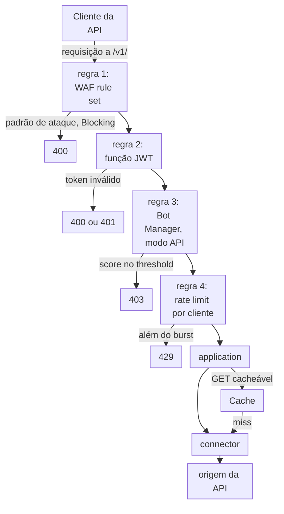

import DocCardGroup from '@aziontech/webkit/doc-card-group'
import DocCard from '@aziontech/webkit/doc-card'

Uma equipe de API ou de segurança expõe APIs públicas, móveis ou de parceiros a partir do seu próprio gateway, cloud ou data center. Ela vê scraping, uso indevido de tokens, abuso de credenciais e ondas de requisições que sobrecarregam o backend, e cada uma dessas requisições chega à origem da API antes que algo a inspecione. Esta página configura um firewall na frente da API que pontua cada requisição com WAF, verifica o seu token, pontua clientes automatizados e limita a taxa de cada cliente, e envia os eventos de segurança ao SIEM da equipe. O resultado é medido pela parcela de requisições abusivas bloqueadas antes da origem, pela taxa de erros do backend durante um ataque e pelo tempo entre a detecção e um novo bloqueio.

Este caso de uso não cobre o design nem a gestão do ciclo de vida de APIs, nem o account takeover em fluxos de login, que [Bloquear account takeover em fluxos de login e checkout](/pt-br/documentacao/casos-de-uso/proteger-aplicacoes-e-redes/bloquear-account-takeover-em-fluxos-de-login-e-checkout/) cobre.

## Pré-requisitos

- Uma conta Azion. Se você ainda não tem uma, [crie uma conta](https://console.azion.com/signup).
- Uma application que serve a API por meio de um connector e de um workload. Para criá-los, consulte [Primeiros passos com Applications](/pt-br/documentacao/plataforma/applications/primeiros-passos/).
- Um firewall vinculado ao deployment desse workload, com WAF e Functions ativados em **Main Settings** › **Modules**. Para vinculá-lo, consulte [Vincule um firewall a um workload](/pt-br/documentacao/guias/seguranca-de-aplicacoes/firewall-e-waf/proteja-seu-dominio/), e para ativar o WAF, consulte [Defina as configurações principais de um firewall](/pt-br/documentacao/guias/seguranca-de-aplicacoes/firewall-e-waf/firewall-definir-main-settings/).
- A função JWT instalada pelo Azion Marketplace. Para instalá-la, consulte [Use a integração JWT no Marketplace da Azion](/pt-br/documentacao/guias/desenvolvimento-de-aplicacoes/integracoes/jwt/).
- Bot Manager habilitado na conta, ou Bot Manager Lite instalado pelo Azion Marketplace. Para instalar o Bot Manager Lite, consulte [Instale o Bot Manager Lite](/pt-br/documentacao/guias/desenvolvimento-de-aplicacoes/integracoes/bot-manager-lite/).
- Os pares de key ID e secret key com que o emissor dos seus tokens assina os tokens.

---

## Produtos necessários

| A API precisa de | O que significa | Produto | Documentado em |
| --- | --- | --- | --- |
| Injeção e outros padrões de ataque recusados antes da origem | Um WAF rule set que uma regra _Set WAF_ aplica aos caminhos da API | WAF | [Primeiros passos com WAF](/pt-br/documentacao/plataforma/firewall/waf/primeiros-passos/) |
| Uma requisição sem token válido recusada antes da origem | A função JWT, instanciada no firewall e executada por uma regra nos caminhos da API | Functions | [Use a integração JWT no Marketplace da Azion](/pt-br/documentacao/guias/desenvolvimento-de-aplicacoes/integracoes/jwt/) |
| Clientes automatizados pontuados | Uma instância do Bot Manager, que pontua clientes que não carregam cookies, executada por uma regra nos caminhos da API | Bot Manager | [Execute Bot Manager em caminhos selecionados](/pt-br/documentacao/guias/seguranca-de-aplicacoes/bots-e-rede/executar-bot-manager-em-caminhos-selecionados/) |
| Ondas de requisições de um cliente limitadas | Uma regra _Set Rate Limit_ que conta as requisições por endereço IP de cliente nos caminhos da API | Nenhum: integrado ao firewall | [Aplique WAF e um rate limit a um caminho](/pt-br/documentacao/guias/seguranca-de-aplicacoes/firewall-e-waf/aplicar-waf-e-rate-limit-a-um-caminho/) |
| Respostas GET seguras respondidas sem a origem | Uma cache setting aplicada por uma regra da application nas rotas cacheáveis | Cache | [Cache settings](/pt-br/documentacao/plataforma/applications/cache/cache-settings/) |
| Eventos de segurança no SIEM da equipe | Um stream da fonte de dados _WAF Events_ para o endpoint do SIEM | Data Stream | [Envie eventos do WAF para um SIEM](/pt-br/documentacao/guias/seguranca-de-aplicacoes/firewall-e-waf/integrar-siems/) |
| Cada requisição bloqueada explicada | O registro da requisição, encontrado pelo seu `x-azion-request-id` | Real-Time Events | [Encontre o score de uma requisição bloqueada](/pt-br/documentacao/guias/seguranca-de-aplicacoes/firewall-e-waf/como-encontrar-score-de-requisicoes-bloqueadas-pelo-waf/) |

---

## Arquitetura de referência

Esta página constrói o *perímetro de segurança de APIs*: um firewall no workload da API que filtra cada requisição por regras, tokens, scores de bot e taxas antes que o connector a encaminhe à origem da API.

Leia o diagrama nas regras do firewall. A conexão já foi aceita quando uma requisição chega a elas, então cada verificação age sobre uma requisição, não sobre a identidade de um cliente: regras, um token, um score de bot e uma taxa. Cada verificação age pela regra que a chama, então a ordem das regras é a ordem das verificações. Só uma requisição que passa por todas chega à application, que responde as requisições GET seguras a partir do Cache e envia as demais à origem da API.

### Fluxo de dados

1. A requisição de um cliente da API a `api.example.com/v1/` chega ao workload. DDoS Protection a avalia antes que qualquer regra de firewall rode, e o firewall vinculado ao workload roda então as suas regras em ordem.
2. O WAF rule set pontua a requisição, incluindo o seu corpo JSON. Em _Blocking_, uma requisição cujo score atinge um threshold recebe `400`.
3. A função JWT verifica o token que a requisição carrega no seu header `Authorization`. Uma requisição cujo token é inválido recebe `400` ou `401`.
4. A instância do Bot Manager pontua o cliente em busca de automação. Quando a sua action é `deny`, um score no threshold recebe `403`.
5. O rate limit conta as requisições de cada endereço IP de cliente, e uma requisição além do burst recebe `429`.
6. Uma requisição que passa chega à application. Uma resposta GET cacheável vem do Cache, e toda outra requisição chega à origem da API pelo connector. Data Stream envia ao SIEM as requisições que o WAF analisou, e Real-Time Events guarda o registro de cada requisição, ligado a uma recusa pelo seu `x-azion-request-id`.

### Recursos de Plataforma

- **firewall**: o Platform Resource que é o ponto de aplicação. As suas regras rodam o WAF, as funções e o rate limit por cliente na ordem que as regras definem, e _Set Rate Limit_ é um dos seus comportamentos integrados.
- **DDoS Protection**: a Feature que mitiga ataques DoS e DDoS em todo workload, sempre ativa, antes que qualquer regra de firewall rode.
- **WAF**: pontua cada requisição contra oito famílias de ameaças e recusa padrões de ataque em _Blocking_. Ele faz o parsing de corpos JSON, então lê os campos que uma API recebe.
- **Bot Manager**: pontua cada requisição em busca de automação. O seu modo `api` é documentado para clientes que não carregam cookies, que é como a maioria dos clientes de API se comporta.
- **Functions**: roda a verificação de token no firewall, como a função JWT do Azion Marketplace, e qualquer verificação personalizada que a equipe escreva no ambiente de execução `firewall`.
- **application**: o Platform Resource que roteia as requisições que o firewall deixa passar e decide quais respostas o Cache pode responder.
- **Cache**: responde as respostas GET seguras, para que leituras repetidas nunca cheguem à origem da API.
- **connector**: o Platform Resource que alcança a origem da API. Toda requisição que passa pelo firewall e não encontra a resposta no Cache termina nele.
- **Data Stream**: envia as requisições que o WAF analisou, com o seu score, as regras correspondidas e a action, a um endpoint que o SIEM lê.
- **SIEM**: a integração que correlaciona os eventos de segurança da API com as outras fontes da equipe.
- **Real-Time Events**: guarda o registro de cada requisição, para que o relato de uma recusa feito por um cliente possa ser rastreado até a regra que a decidiu.

### Outros designs para este caso de uso

- *Perímetro de mutual TLS para APIs de parceiros*: atende integrações B2B e de parceiros em que todo cliente é conhecido. O workload exige um certificado de cliente assinado por uma autoridade certificadora que a equipe registra no Certificate Manager, então quem chama sem um certificado válido é recusado durante o handshake TLS, antes que qualquer requisição exista, e o firewall aplica depois regras de WAF e rate limits por parceiro.

---

## Como o design funciona

Esta seção explica por que cada verificação nos caminhos da API tem a sua forma e o seu lugar na ordem: o WAF, a verificação de token, o Bot Manager e o rate limit por cliente.

### WAF nos caminhos da API

O rule set `api-waf` pontua as oito famílias de ameaças na sensibilidade `medium`, o nível em que toda família começa. A regra que o aplica corresponde a `${request_uri}` _starts with_ `/v1/`, então o WAF pontua só a API: o WAF é cobrado pelas requisições que pontua, e o restante do domínio não precisa de uma política específica de API. O WAF faz o parsing de um corpo de `POST` enviado como `application/json`, então lê cada campo de um payload JSON.

A regra começa em _Logging_. Clientes de API enviam corpos bem formados com mais frequência do que navegadores enviam corpos incomuns, mas uma integração que envia, por exemplo, um apóstrofo em um campo se transforma em erros `400` em _Blocking_. Mude a regra para _Blocking_ quando 3 dias de **Tuning** não tiverem nenhuma requisição que deveria ter sido servida.

### Verificação de token

A função JWT roda no firewall, então uma requisição sem um token válido é recusada antes de chegar à origem da API, e a origem nunca contata um autenticador por ela. O token viaja no header `Authorization` da requisição, no esquema Bearer. Os argumentos da instância carregam os pares de key ID e secret key com que o emissor dos seus tokens assina, para que a função possa verificar uma assinatura sem chamar o emissor. A integração JWT é configurada no Azion Console.

Uma rota que a sua API serve sem token precisa do seu próprio caminho fora de `/v1/`, ou de um critério que a exclua desta regra.

### Bot Manager para clientes de API

Clientes de API não carregam cookies, então a instância define `mode` como `api`, que o Bot Manager documenta para web services e tráfego de API sem cookies. O Bot Manager Lite não documenta nenhum `mode`, e a sua função ignora a chave. A instância começa em modo de observação: `action` é `allow` e `internal_logs` é `2`, então toda requisição é pontuada, servida e gravada no report log. `threshold` é `15`, o ponto de partida que as [Boas práticas de Firewall](/pt-br/documentacao/plataforma/firewall/boas-praticas/#execute-uma-instancia-mais-rigorosa-do-bot-manager-em-um-caminho-de-alto-valor) dão para endpoints de API, e enquanto `action` for `allow` ele só define o rótulo `classified` de cada linha. `log_tag` é `api-bots`, então cada linha nomeia esta instância.

Um cliente de API não consegue responder a um desafio, então `deny` se encaixa melhor nestes caminhos do que `redirect`.

### Rate limit por cliente

O rate limit conta as requisições por endereço IP de cliente em `/v1/`, a `10` requisições por segundo com um burst de `10`. As requisições acima da taxa entram em fila e são liberadas na taxa, e só as requisições simultâneas além do burst recebem `429`. Um burst de no máximo dez vezes a taxa mantém a fila em 10 segundos de tráfego, então o pico de um cliente legítimo é atrasado em vez de recusado. Defina `average_rate_limit` a partir da taxa de requisições que o seu cliente legítimo mais pesado envia.

Os caminhos da API já carregam uma regra _Set WAF_, e as regras de token e de Bot Manager precisam rodar antes do limite, então _Set Rate Limit_ fica em uma regra própria.

A taxa se aplica em cada data center, e nenhuma resposta carrega um header de rate limit, então um cliente não tem nenhum sinal de quanto tempo esperar.

---

## Medindo resultados

| Métrica | Onde ler | Como é o funcionamento correto |
| --- | --- | --- |
| Parcela de requisições abusivas bloqueadas antes da origem | As requisições a `api.example.com` respondidas com `400`, `401`, `403` ou `429`, em relação a todas as suas requisições, na fonte de dados HTTP Requests do [Real-Time Events](/pt-br/documentacao/plataforma/real-time-events/fontes-de-dados/#http-requests), e **WAF Threat Requests by Host** no [dashboard de WAF](/pt-br/documentacao/plataforma/real-time-metrics/dashboards-secure/#waf) | A parcela sobe durante um ataque enquanto as requisições que chegam à origem ficam no seu nível habitual |
| Taxa de erros do backend durante um ataque | O `Upstream Status` de cada requisição na fonte de dados HTTP Requests, que guarda o status code da origem | As respostas `5xx` da origem ficam na sua taxa habitual enquanto as requisições recusadas sobem |
| Tempo entre a detecção e um novo bloqueio | O tempo entre salvar uma alteração e a resposta se manter em uma requisição repetida, como em [Espere uma alteração se propagar antes de julgá-la](/pt-br/documentacao/plataforma/firewall/boas-praticas/#espere-uma-alteracao-se-propagar-antes-de-julga-la) | Uma alteração nos argumentos de uma instância existente se mantém em cerca de 105 segundos, e uma regra nova em 6 a 10 minutos |

---

## Boas práticas

- **Corresponda aos caminhos da API, não à query string.** `${request_uri}` _starts with_ `/v1/` corresponde a toda requisição da API, com ou sem query string. `${request_args}` _matches_ `.*` deixa de fora todo `POST` cujo payload está no corpo, o que em uma API é a maioria deles.
- **Envie JSON bem formado com um content type correspondente.** Em _Blocking_, o WAF recusa com `400` um `POST` com `Content-Type` ausente ou não interpretado, um corpo JSON que não passa no parsing ou um corpo acima de 131.072 bytes. Um bug de cliente parece então um ataque. Para os formatos que o WAF interpreta, consulte [Parsing do corpo da requisição](/pt-br/documentacao/plataforma/firewall/waf/score-e-modos/#parsing-do-corpo-da-requisicao).
- **Escreva `threshold` e `action` em toda instância do Bot Manager.** O Bot Manager Lite traz `deny` em `30`, e o Bot Manager documenta `allow` em `Infinity`, então uma instância que não define nenhum dos dois recusa requisições em uma edição e as deixa passar na outra.
- **Negue clientes de API em vez de redirecioná-los.** Um redirect envia o cliente a um desafio que uma pessoa resolve, e um consumidor de API, um health check ou um monitor não consegue resolvê-lo.
- **Mantenha o burst em até dez vezes a taxa.** Um burst menor que os picos dos seus clientes recusa requisições simultâneas legítimas, e um maior atrasa por mais tempo a última delas. Para o raciocínio, consulte [Mantenha o burst de um rate limit em até dez vezes a taxa média](/pt-br/documentacao/plataforma/firewall/boas-praticas/#mantenha-o-burst-de-um-rate-limit-em-ate-dez-vezes-a-taxa-media).

---

## Guias deste caso de uso

<DocCardGroup cols={2}>
  <DocCard title="Crie um rule set em sensibilidade média" href="/pt-br/documentacao/guias/seguranca-de-aplicacoes/firewall-e-waf/rule-set-medio/" label="Crie api-waf com toda família de ameaças em medium." />
  <DocCard title="Aplique um rule set a toda requisição" href="/pt-br/documentacao/guias/seguranca-de-aplicacoes/firewall-e-waf/aplicar-rule-set/" label="Aplique api-waf em Logging aos caminhos da API, e envie a requisição com formato de injeção que o verifica." />
  <DocCard title="Mude um rule set para blocking" href="/pt-br/documentacao/guias/seguranca-de-aplicacoes/firewall-e-waf/mudar-para-blocking/" label="Mude a regra de api-waf para Blocking quando o Tuning não tiver nenhuma requisição que deveria ter sido servida." />
  <DocCard title="Instale a integração JWT" href="/pt-br/documentacao/guias/desenvolvimento-de-aplicacoes/integracoes/jwt/" label="Crie a instância api-jwt e a regra que verifica o token em toda requisição aos caminhos da API." />
  <DocCard title="Recuse requisições acima do threshold" href="/pt-br/documentacao/guias/seguranca-de-aplicacoes/bots-e-rede/recusar-acima-do-limite/" label="Mude api-bots de allow para deny quando a janela de observação terminar." />
  <DocCard title="Altere a ordem das regras de firewall" href="/pt-br/documentacao/guias/seguranca-de-aplicacoes/bots-e-rede/alterar-a-ordem-das-regras-de-firewall/" label="Mantenha o rate limit na última posição nos caminhos da API, depois das regras de WAF, de token e de Bot Manager." />
  <DocCard title="Verifique o status de cache de uma resposta" href="/pt-br/documentacao/guias/performance-e-confiabilidade/cache-e-purge/verificar-tempo-de-cache-da-pagina/" label="Leia o header x-cache que mostra uma resposta cacheável respondida sem a origem da API." />
  <DocCard title="Execute Bot Manager em caminhos selecionados" href="/pt-br/documentacao/guias/seguranca-de-aplicacoes/bots-e-rede/executar-bot-manager-em-caminhos-selecionados/" label="Crie a instância em modo API e a regra que pontua toda requisição aos caminhos da API." />
  <DocCard title="Aplique WAF e um rate limit a um caminho" href="/pt-br/documentacao/guias/seguranca-de-aplicacoes/firewall-e-waf/aplicar-waf-e-rate-limit-a-um-caminho/" label="Crie a regra que limita cada endereço IP de cliente nos caminhos da API, em uma regra própria depois das outras verificações." />
  <DocCard title="Envie eventos do WAF para um SIEM" href="/pt-br/documentacao/guias/seguranca-de-aplicacoes/firewall-e-waf/integrar-siems/" label="Envie os eventos do WAF dos caminhos da API para o SIEM da equipe, e confirme que o endpoint do SIEM aceita cada lote." />
</DocCardGroup>
