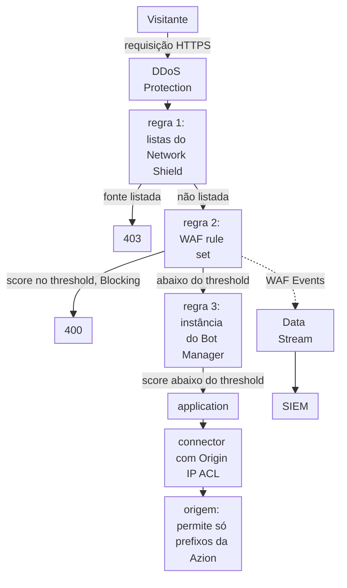

import DocCardGroup from '@aziontech/webkit/doc-card-group'
import DocCard from '@aziontech/webkit/doc-card'

Uma equipe de segurança protege uma aplicação web voltada ao cliente que roda na sua própria origem, muitas vezes atrás de um WAF independente, de appliances ou de fornecedores separados de proteção contra bots e DDoS. Cada uma dessas ferramentas mantém a sua própria política, e a origem ainda responde a qualquer um que descubra o seu endereço. Esta página configura um firewall na frente da aplicação, que recusa redes listadas, pontua cada requisição com WAF e Bot Manager e faz a origem aceitar conexões só da Azion. O resultado é medido pelos ataques bloqueados antes da origem, pela taxa de falsos positivos no tráfego legítimo e pelo tempo para alterar uma política.

Este caso de uso não cobre o abuso específico de APIs, que [Proteger APIs públicas contra abuso](/pt-br/documentacao/casos-de-uso/proteger-aplicacoes-e-redes/proteger-apis-publicas-contra-abuso/) cobre, nem o account takeover, que [Bloquear account takeover em fluxos de login e checkout](/pt-br/documentacao/casos-de-uso/proteger-aplicacoes-e-redes/bloquear-account-takeover-em-fluxos-de-login-e-checkout/) cobre.

## Pré-requisitos

- Uma conta Azion. Se você ainda não tem uma, [crie uma conta](https://console.azion.com/signup).
- Uma application que serve a aplicação web por meio de um connector e de um workload. Para criá-los, consulte [Primeiros passos com Applications](/pt-br/documentacao/plataforma/applications/primeiros-passos/).
- Um firewall vinculado ao deployment desse workload. Para vincular um, consulte [Vincule um firewall a um workload](/pt-br/documentacao/guias/seguranca-de-aplicacoes/firewall-e-waf/proteja-seu-dominio/).
- WAF e Functions ativados em **Main Settings** › **Modules** do firewall. Um firewall novo vem com WAF desativado. Para ativá-lo, consulte [Defina as configurações principais de um firewall](/pt-br/documentacao/guias/seguranca-de-aplicacoes/firewall-e-waf/firewall-definir-main-settings/).
- Bot Manager Lite instalado pelo Azion Marketplace, ou Bot Manager habilitado na conta. Para instalar o Bot Manager Lite, consulte [Instale o Bot Manager Lite](/pt-br/documentacao/guias/desenvolvimento-de-aplicacoes/integracoes/bot-manager-lite/).
- Acesso ao firewall da sua origem, onde fica a allowlist dos endereços da Azion.

---

## Produtos necessários

| A aplicação precisa de | O que significa | Produto | Documentado em |
| --- | --- | --- | --- |
| Fontes em que a equipe já não confia recusadas antes de qualquer inspeção | Uma network list que uma regra de negação lê pelo critério _Network_ | Network Shield | [Network Lists](/pt-br/documentacao/plataforma/firewall/network-shield/network-lists/) |
| Requisições com padrões de ataque do OWASP Top 10 recusadas antes da origem | Um WAF rule set que o comportamento _Set WAF_ de uma regra aplica a toda requisição | WAF | [Primeiros passos com WAF](/pt-br/documentacao/plataforma/firewall/waf/primeiros-passos/) |
| Clientes automatizados distinguidos de pessoas | Uma instância de função do Bot Manager que uma regra _Run Function_ executa em toda requisição de página | Bot Manager | [Execute Bot Manager em caminhos selecionados](/pt-br/documentacao/guias/seguranca-de-aplicacoes/bots-e-rede/executar-bot-manager-em-caminhos-selecionados/) |
| Uma origem que aceita conexões só da Azion | Origin IP ACL no connector, e os prefixos de `Azion Origin Shield` permitidos no firewall da origem | Origin Shield | [Restrinja uma origem à Azion com Origin IP ACL](/pt-br/documentacao/guias/seguranca-de-aplicacoes/bots-e-rede/restringir-uma-origem-a-azion-com-origin-ip-acl/) |
| Eventos de segurança no SIEM da equipe | Um stream da fonte de dados _WAF Events_ para o endpoint do SIEM | Data Stream | [Envie eventos do WAF para um SIEM](/pt-br/documentacao/guias/seguranca-de-aplicacoes/firewall-e-waf/integrar-siems/) |
| Cada bloqueio explicado, requisição por requisição | Os campos de WAF do registro da requisição, encontrado pelo seu `x-azion-request-id` | Real-Time Events | [Encontre o score de uma requisição bloqueada](/pt-br/documentacao/guias/seguranca-de-aplicacoes/firewall-e-waf/como-encontrar-score-de-requisicoes-bloqueadas-pelo-waf/) |

DDoS Protection mitiga ataques DoS e DDoS em todo workload, antes de qualquer regra de firewall rodar, sem nada para criar ou configurar. Para os tipos de ataque que cobre, consulte [Mitigação de ataques](/pt-br/documentacao/plataforma/workloads/ddos-protection/ddos-mitigation/).

---

## Arquitetura de referência

Esta página constrói o *perímetro de proteção de aplicações web e APIs (WAAP)*: uma política de firewall na frente do workload, com a origem fechada a qualquer outro caminho.

Leia o diagrama de cima para baixo. DDoS Protection age antes de qualquer regra, e as regras do firewall decidem então cada requisição em ordem. Network Shield, WAF e Bot Manager agem cada um só pela regra que os chama, então a ordem dessas regras é a ordem da política. Toda requisição que passa termina em um connector, e o próprio firewall da origem fecha qualquer outro caminho até ela. A aresta pontilhada carrega registros, não requisições: os eventos do WAF saem para o SIEM pelo Data Stream.

### Fluxo de dados

1. A requisição de um visitante chega ao workload em `www.example.com`. DDoS Protection a avalia primeiro, e o firewall vinculado ao workload a recebe em seguida.
2. A primeira regra compara o endereço do cliente com a network list da equipe e com a lista de nós de saída do Tor. Um cliente listado recebe `403`, e nenhuma regra seguinte roda.
3. A segunda regra entrega a requisição ao WAF rule set. Em _Blocking_, uma requisição cujo score atinge o threshold de uma família recebe `400`.
4. A terceira regra executa a instância do Bot Manager em toda requisição que não é um asset estático. Um score no threshold executa a action da instância.
5. Uma requisição que nenhuma regra para chega à application, que a encaminha à origem pelo connector. O firewall da origem aceita a conexão porque ela vem de um prefixo de `Azion Origin Shield`, e recusa conexões de qualquer outro lugar.
6. Data Stream envia ao SIEM cada requisição que o WAF analisou. Real-Time Events guarda o registro de cada requisição para investigação, ligado a uma recusa pelo seu `x-azion-request-id`.

### Recursos de Plataforma

- **firewall**: o Platform Resource que aplica a política. O deployment de um workload o nomeia, e ele roda as suas regras em toda requisição a esse workload antes que a application a veja.
- **DDoS Protection**: a Feature que mitiga ataques DoS e DDoS em todo workload, sempre ativa e sem nada para configurar. Ela age antes de qualquer regra de firewall.
- **WAF**: pontua cada requisição que uma regra _Set WAF_ lhe entrega contra oito famílias de ameaças, e recusa a requisição no modo _Blocking_ quando um score atinge o seu threshold. Ele filtra o OWASP Top 10 e outros padrões de ataque.
- **Bot Manager**: pontua cada requisição que uma regra _Run Function_ lhe entrega em busca de sinais de automação, e executa a action que a sua instância define quando o score atinge o threshold.
- **Network Shield**: adiciona o critério _Network_, que compara o endereço do cliente com uma lista de endereços, ASNs ou países. Ele recusa fontes sabidamente maliciosas antes que WAF e Bot Manager as pontuem.
- **application**: o Platform Resource que entrega as requisições que o firewall deixa passar e as encaminha à origem.
- **connector**: o Platform Resource que alcança a origem. Toda requisição que passa pela política termina nele.
- **Origin Shield**: Origin IP ACL no connector publica a lista `Azion Origin Shield` com os prefixos da Azion, que o firewall da origem permite enquanto recusa qualquer outra fonte. Nenhum cliente consegue então alcançar a origem contornando a política.
- **Data Stream**: envia as requisições que o WAF analisou, com o seu score, as regras correspondidas e a action, a um endpoint que o SIEM lê.
- **SIEM**: a integração que correlaciona os eventos do firewall com as outras fontes de segurança da equipe.
- **Real-Time Events**: guarda o registro de cada requisição, com os seus campos de WAF, para que um bloqueio possa ser explicado a partir do request ID que o cliente informa.

---

## Como o design funciona

Esta seção explica por que cada parte da política de firewall tem a sua forma: os bloqueios de rede, o WAF rule set, a pontuação do Bot Manager e a allowlist da origem.

### Bloqueios de rede

A regra de rede roda primeiro, então uma fonte em que a equipe já não confia é recusada antes que WAF e Bot Manager a pontuem. O WAF é cobrado pelas requisições que pontua, e o Bot Manager pelas requisições que avalia, então uma requisição que esta regra nega não custa nenhum dos dois. A regra lê duas listas. `webapp-blocked-addresses` guarda os endereços que a sua equipe bloqueia. `Azion IP Tor Exit Nodes`, a lista `2`, é mantida pela Azion, então a regra também corresponde aos nós de saída que a Azion adicionar depois.

O comportamento é _Deny (403 Forbidden)_ em vez de _Drop_. Um visitante negado vê uma página com um request ID que uma pessoa bloqueada por engano pode informar. Quando a lista recusar só os clientes que você espera, você pode mudar para _Drop (Close Without Response)_.

### WAF rule set

O rule set `webapp-waf` pontua cada requisição contra as oito famílias de ameaças na sensibilidade `medium`, o nível em que toda família começa. A regra que o aplica corresponde a `${request_uri}` _starts with_ `/`, o que corresponde a toda requisição. Um critério na query string deixaria de fora todo `POST` que carrega o seu payload no corpo.

A regra começa em _Logging_. Uma requisição que atinge um threshold é registrada e ainda é servida, e esses registros são a única descrição do seu tráfego como o rule set o vê. Mude a regra para _Blocking_ quando 3 dias de **Tuning** não tiverem nenhuma requisição que deveria ter sido servida.

### Pontuação do Bot Manager

A instância do Bot Manager começa em modo de observação: `action` é `allow`, então ela não recusa nada, e `internal_logs` é `2`, então toda requisição grava uma linha de report. Execute-a por 24 a 72 horas, tempo suficiente para cobrir os horários de pico, os crawlers semanais e os jobs noturnos. `threshold` é `18`, o valor a partir do qual o Bot Manager documenta começar. Enquanto `action` for `allow`, o threshold só define o rótulo `classified` de cada linha. `log_tag` é `webapp-observe`, então cada linha nomeia esta instância.

A regra que executa a instância exclui os assets estáticos, porque uma imagem ou uma folha de estilo não é um cliente, e cada uma é uma requisição que o Bot Manager cobra. Ela não nomeia nenhum caminho, então todas as outras requisições da aplicação são pontuadas.

### Allowlist da origem

Origin IP ACL no connector dá à conta a network list `Azion Origin Shield`, que guarda todos os prefixos IPv4 e IPv6 que a infraestrutura da Azion usa para se conectar às origens. O firewall da sua origem permite então esses prefixos e nega qualquer outra fonte, para que um cliente que se conecta diretamente ao endereço da origem nunca alcance a aplicação contornando a política de firewall descrita nesta página.

---

## Medindo resultados

| Métrica | Onde ler | Como é o funcionamento correto |
| --- | --- | --- |
| Ataques bloqueados antes da origem | **Threats vs Requests** no dashboard de WAF do Real-Time Metrics, que divide as requisições analisadas em ameaças bloqueadas, ameaças registradas e requisições permitidas. Consulte [Dashboards de Secure](/pt-br/documentacao/plataforma/real-time-metrics/dashboards-secure/#waf) | Depois da mudança para _Blocking_, as ameaças que o rule set encontra aparecem como bloqueadas, não como registradas |
| Taxa de falsos positivos no tráfego legítimo | A aba **Tuning** de `webapp-waf`, que lista as requisições que atingiram um threshold nos últimos 3 dias. Consulte [Tuning](/pt-br/documentacao/plataforma/firewall/waf/score-e-modos/#tuning) | Nenhuma requisição que você reconhece como legítima, e nenhuma exceção mais antiga que a requisição que a gerou |
| Tempo para alterar uma política | O tempo entre salvar uma alteração e a resposta se manter em uma requisição repetida, como em [Espere uma alteração se propagar antes de julgá-la](/pt-br/documentacao/plataforma/firewall/boas-praticas/#espere-uma-alteracao-se-propagar-antes-de-julga-la) | Uma alteração de lista se mantém em cerca de 100 segundos, e uma regra nova em 6 a 10 minutos |

---

## Boas práticas

- **Coloque a regra de rede primeiro.** O firewall roda as suas regras em ordem, e nenhuma regra seguinte roda para uma requisição que uma negação para. Uma fonte listada nunca chega então ao WAF ou ao Bot Manager, que cobram ambos pelas requisições que veem. Para a ordem das regras, consulte [Como Firewall funciona](/pt-br/documentacao/plataforma/firewall/como-funciona/#ordem-das-regras).
- **Altere uma lista, não uma regra, para uma fonte que muda com frequência.** Uma alteração nos itens de uma lista chega ao tráfego em cerca de 100 segundos, uma regra nova em 6 a 10 minutos, e a lista não soma nada às regras que o seu plano inclui por firewall.
- **Mantenha o critério da regra de WAF na URI da requisição.** `${request_args}` _matches_ `.*` parece corresponder a toda requisição e deixa de fora toda requisição sem query string. `${request_uri}` _starts with_ `/` corresponde a todas, como em [Corresponda à requisição, e não à query string dela](/pt-br/documentacao/plataforma/firewall/boas-praticas/#corresponda-a-requisicao-e-nao-a-query-string-dela).
- **Eleve uma família de ameaças por vez.** Elevar várias famílias de uma vez produz falsos positivos juntos, sem nada que diga qual elevação produziu qual bloqueio. Para os passos, consulte [Eleve a sensibilidade de uma família de ameaças](/pt-br/documentacao/guias/seguranca-de-aplicacoes/firewall-e-waf/aumentar-uma-familia/).
- **Mantenha o IPv6 na allowlist da origem e atualize-a em até 7 dias.** A lista carrega prefixos IPv6 para todo data center, e os servidores atrás de um prefixo novo entram em produção 7 dias depois que a Azion o publica. Uma allowlist que deixa de fora qualquer um dos dois recusa conexões que a Azion abre. Para a atualização, consulte [Atualizações da lista](/pt-br/documentacao/plataforma/connectors/origin-shield/origin-ip-acl-e-hmac/#atualizacoes-da-lista).

---

## Guias deste caso de uso

<DocCardGroup cols={2}>
  <DocCard title="Bloqueie requisições por IP, ASN ou país" href="/pt-br/documentacao/guias/seguranca-de-aplicacoes/bots-e-rede/blocklists-enderecos-ip-edge/" label="Crie webapp-blocked-addresses e a regra de negação que a lê, e confirme que um cliente listado recebe 403." />
  <DocCard title="Crie um rule set em sensibilidade média" href="/pt-br/documentacao/guias/seguranca-de-aplicacoes/firewall-e-waf/rule-set-medio/" label="Crie webapp-waf com toda família de ameaças em medium." />
  <DocCard title="Aplique um rule set a toda requisição" href="/pt-br/documentacao/guias/seguranca-de-aplicacoes/firewall-e-waf/aplicar-rule-set/" label="Aplique webapp-waf em Logging a toda requisição, e envie a requisição com formato de injeção que o verifica." />
  <DocCard title="Ajuste um WAF rule set" href="/pt-br/documentacao/guias/seguranca-de-aplicacoes/firewall-e-waf/tune-waf/" label="Leia os registros que o Logging produz, e transforme um falso positivo em uma exceção." />
  <DocCard title="Mude um rule set para blocking" href="/pt-br/documentacao/guias/seguranca-de-aplicacoes/firewall-e-waf/mudar-para-blocking/" label="Mude a regra de webapp-waf para Blocking quando o Tuning não tiver nenhuma requisição que deveria ter sido servida." />
  <DocCard title="Monitore e calibre o Bot Manager" href="/pt-br/documentacao/guias/seguranca-de-aplicacoes/bots-e-rede/monitorar-e-calibrar-bot-manager/" label="Leia os scores da janela de observação, e depois defina o threshold e a action deny." />
  <DocCard title="Encontre o score de uma requisição bloqueada" href="/pt-br/documentacao/guias/seguranca-de-aplicacoes/firewall-e-waf/como-encontrar-score-de-requisicoes-bloqueadas-pelo-waf/" label="Encontre uma requisição recusada pelo seu x-azion-request-id, com as regras internas que corresponderam." />
  <DocCard title="Execute Bot Manager em caminhos selecionados" href="/pt-br/documentacao/guias/seguranca-de-aplicacoes/bots-e-rede/executar-bot-manager-em-caminhos-selecionados/" label="Crie a instância de observação e a regra que pontua toda requisição, exceto os assets estáticos." />
  <DocCard title="Restrinja uma origem à Azion com Origin IP ACL" href="/pt-br/documentacao/guias/seguranca-de-aplicacoes/bots-e-rede/restringir-uma-origem-a-azion-com-origin-ip-acl/" label="Publique os prefixos de Azion Origin Shield e permita só eles no firewall da origem." />
  <DocCard title="Envie eventos do WAF para um SIEM" href="/pt-br/documentacao/guias/seguranca-de-aplicacoes/firewall-e-waf/integrar-siems/" label="Envie os eventos do WAF para o SIEM da equipe, e confirme que o endpoint do SIEM aceita cada lote." />
</DocCardGroup>
