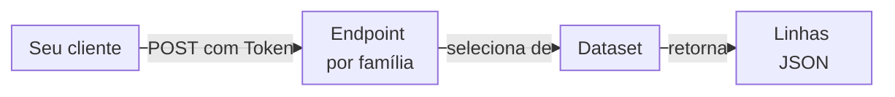

import FrameBox from '@aziontech/webkit/frame-box'
import ItemList from '@aziontech/webkit/item-list'
import DocItem from '@aziontech/webkit/doc-item'

Uma API GraphQL responde a uma query que nomeia os dados a ler e os campos a retornar. A resposta é um objeto JSON que contém esses campos e nada mais, então um cliente nunca baixa colunas que não usa. Para obter dados diferentes, você altera os campos ou o filtro na query, e a requisição vai para o mesmo endpoint.

A GraphQL API lê os dados de métricas, eventos, billing, accounting e consumption da sua conta Azion. Ela responde apenas a queries: não tem mutations, e nenhuma query altera a sua conta. Qualquer cliente que envie um `POST` HTTP com um corpo JSON pode chamá-la, seja qual for a linguagem de programação ou o framework.

As seções cobrem as cinco APIs e os seus endpoints, os datasets, os dados brutos e agregados, as janelas de tempo, a resolução de tempo, a reamostragem, a retenção e onde executar queries.

---

## Cinco APIs, uma por família de dados

A GraphQL API é formada por cinco APIs, cada uma com o próprio endpoint e o próprio schema. Cada uma serve uma família de dados:

| API | Endpoint | Dados |
| --- | --- | --- |
| Metrics | `https://api.azion.com/v4/metrics/graphql` | Dados agregados de requisições do [Real-Time Metrics](/pt-br/documentacao/plataforma/real-time-metrics/), agrupados em buckets de tempo |
| Events | `https://api.azion.com/v4/events/graphql` | Registros brutos do [Real-Time Events](/pt-br/documentacao/plataforma/real-time-events/), um por requisição ou evento |
| Billing | `https://api.azion.com/v4/billing/graphql` | [Faturas](/pt-br/documentacao/fundamentos/billing-and-subscriptions/), lançamentos financeiros e pagamentos |
| Accounting | `https://api.azion.com/v4/accounting/graphql` | Os produtos e as métricas contabilizados na conta |
| Consumption | `https://api.azion.com/v4/consumption/graphql` | O uso dos produtos, como dados contabilizados |

Este diagrama acompanha uma query do seu cliente até as linhas que ela retorna:



1. O seu cliente envia a query em uma requisição `POST` para o endpoint da família de dados que ele lê, com o header `Authorization: Token [TOKEN VALUE]`.
2. O endpoint verifica o token. Um token `Bearer` é recusado como um header ausente, com `401` e `Authentication credentials were not provided.`
3. A query nomeia um dataset desse endpoint, os argumentos que o filtram, agrupam e ordenam, e os campos a retornar.
4. O endpoint responde com um objeto JSON cuja chave `data` contém um array por dataset, com um objeto por linha.

Uma query precisa ir para o endpoint que serve o seu dataset. Por exemplo, uma query em `workloadEvents` enviada ao endpoint de métricas retorna `400`, porque `workloadEvents` é um dataset de eventos. Para o token e uma primeira requisição, consulte [Primeiros passos com a GraphQL API](/pt-br/documentacao/devtools/graphql/primeiros-passos/).

---

## Datasets

Um dataset é uma tabela da qual uma query da GraphQL API seleciona dados. Cada endpoint serve os próprios datasets, e uma query nomeia um deles, como `workloadMetrics` ou `workloadEvents`. Todo dataset recebe os mesmos argumentos: `filter`, `aggregate`, `groupBy`, `orderBy`, `offset` e `limit`.

O endpoint de métricas serve 17 datasets atuais, todos de dados agregados, como `workloadMetrics` para as requisições aos seus workloads e `dnsQueriesMetrics` para as consultas DNS. O endpoint de eventos serve 19 datasets atuais de registros brutos, como `workloadEvents` e `activityHistoryEvents`. O endpoint de billing serve `balanceFinancialEntry`, `paymentsClientDebt` e `billDetail`; o endpoint de accounting, `accountingDetail`; e o endpoint de consumption, `workloadConsumptionMetrics`.

O schema mantém alguns nomes antigos de datasets como aliases deprecated, que retornam as mesmas linhas que os seus substitutos. `httpMetrics` está deprecated; use `workloadMetrics`. `httpBreakdownMetrics` está deprecated; use `workloadBreakdownMetrics`. `httpEvents` está deprecated; use `workloadEvents`. `edgeFunctionsMetrics` está deprecated; use `functionsMetrics`. `edgeDnsQueriesMetrics` e `edgeDnsQueriesEvents` estão deprecated; use `dnsQueriesMetrics` e `dnsQueriesEvents`.

Para cada dataset e os argumentos que ele aceita, consulte [Datasets e argumentos de query](/pt-br/documentacao/devtools/graphql/recursos/). Os campos de cada dataset estão em [Campos do Real-Time Metrics](/pt-br/documentacao/devtools/graphql/campos-gql-real-time-metrics/), [Campos do Real-Time Events](/pt-br/documentacao/devtools/graphql/campos-gql-real-time-events/), [Campos de Billing](/pt-br/documentacao/devtools/graphql/campos-gql-billing/), [Campos de Accounting](/pt-br/documentacao/devtools/graphql/campos-gql-accounting/) e [Campos de Consumption](/pt-br/documentacao/devtools/graphql/campos-gql-consumption/).

---

## Dados brutos e agregados

A GraphQL API retorna dados de requisições em dois modelos. Os dados brutos vêm dos datasets de Events: cada registro é uma requisição ou um evento como a Azion o registrou, sem processamento adicional. Os dados agregados vêm dos datasets de Metrics: os registros já estão agrupados em buckets de tempo de um minuto, uma hora ou um dia.

Os dois modelos atendem a perguntas diferentes. Os dados brutos respondem a investigações detalhadas de requisições individuais, como os top endereços IP, URIs ou user agents, as requisições bloqueadas por endereço IP ou por país e os top endereços IP por método de requisição. Os dados agregados respondem a totais e tendências, como as requisições por método HTTP, os hosts ou domínios com mais ou com menos requisições, a origem das requisições que são ameaças, incluindo o tráfego de bots quando a conta usa Bot Manager, e os usuários conectados às suas transmissões ao vivo. Para ranquear endereços IP de clientes com dados agregados, use `workloadBreakdownMetrics`, que tem `remoteAddress`; `workloadMetrics` não tem campo de endereço IP do cliente.

A troca é entre detalhe e alcance. Um registro bruto traz todos os campos de uma requisição, mas os datasets de Events, como `workloadEvents`, mantêm os registros por cerca de sete dias. Uma linha agregada traz uma contagem ou um total de um bucket, então perde a requisição individual, mas cobre janelas de muitos dias de uma vez.

Uma query de Metrics não precisa de `groupBy`. Esta query seleciona o horário, o país e a região das linhas em uma janela de sete dias, sem `groupBy`:

```graphql
query {
  workloadMetrics(
    limit: 5
    filter: { tsRange: {begin: "2026-09-26T14:00:00", end: "2026-10-03T14:00:00"} }
  ) {
    ts
    geolocCountryName
    geolocRegionName
  }
}
```

A resposta contém cinco linhas, cortada aqui após a terceira:

```json
{
  "data": {
    "workloadMetrics": [
      {
        "ts": "2026-10-02T19:00:00Z",
        "geolocCountryName": "Brazil",
        "geolocRegionName": "Pernambuco"
      },
      {
        "ts": "2026-09-30T18:00:00Z",
        "geolocCountryName": "United States",
        "geolocRegionName": "Virginia"
      },
      {
        "ts": "2026-09-30T18:00:00Z",
        "geolocCountryName": "United States",
        "geolocRegionName": "Virginia"
      },
      …
    ]
  }
}
```

Um campo de medida, como `requests`, funciona de outra forma: ele é selecionado por meio de `aggregate`, como `aggregate: { sum: requests }`. Selecionado diretamente, ele retorna `400` com `The query includes fields that require grouping. Please ensure all non-aggregated fields are included in groupBy argument.` Um `aggregate` sem `groupBy` retorna uma linha com o total da janela. Para cada formato de query com a sua resposta, consulte [Queries](/pt-br/documentacao/devtools/graphql/queries/).

---

## Janelas de tempo

Uma query nos datasets de Metrics, Events ou Consumption precisa nomear uma janela de tempo no seu `filter`. A janela é `tsRange`, com um `begin` e um `end`, ou os limites `tsGt` e `tsLt`. `tsGt` sozinho é aceito e lê tudo depois desse horário. Sem nenhum deles, a query retorna `400` com `To execute queries it is mandatory to provide the desired time interval.`

Os dois limites de `tsRange` precisam ter o mesmo fuso horário. Um `begin` em UTC com um `end` sem offset retorna `400` com `The start and end dates must have the same timezone.` Dois limites com o mesmo offset, como `-03:00`, são aceitos, e a resposta dá cada `ts` em UTC. Um `begin` posterior ao `end` retorna um array vazio, não um erro.

Os datasets financeiros não têm o campo `ts`, então uma janela de tempo não se aplica a eles. `balanceFinancialEntry`, `paymentsClientDebt` e `accountingDetail` retornam linhas sem nenhum filtro. Para ler um período, filtre `accountingDetail` ou `billDetail` por `periodFrom` e `periodTo`, ou por uma forma de intervalo como `periodFromRange`.

---

## Resolução de tempo

Os datasets de Metrics escolhem o tamanho do bucket a partir da duração da janela de tempo, por meio de um resolvedor adaptativo. Uma janela curta retorna buckets de um minuto, uma mais longa, buckets de uma hora, e uma longa, buckets de um dia. A query não define o tamanho do bucket: ele segue a janela.

Os limites, como a API os aplica a `workloadMetrics`:

| Janela | Bucket |
| --- | --- |
| Até cerca de 2 dias (48 horas ou menos) | Minuto |
| De 60 horas até cerca de 60 dias (até 59 dias) | Hora |
| Acima de cerca de 60 dias (61 dias ou mais) | Dia |

A troca é entre precisão e extensão. Uma janela de 72 horas já retorna buckets de uma hora, então um pico que durou alguns minutos se mistura à sua hora. Para ver o detalhe por minuto, consulte uma janela de 48 horas ou menos.

Alguns datasets mantêm um único tamanho de bucket, que a descrição no schema informa. `workloadBreakdownMetrics` retorna buckets de uma hora, mesmo para uma janela de uma hora. `workloadConsumptionMetrics` é descrito por hora, `objectStorageMetrics` por dia, e `connectedUsersMetrics` e os datasets do Bot Manager por minuto.

---

## Reamostragem

A reamostragem define o número de pontos de dados que uma query de Metrics retorna, para que um gráfico mostre o número de pontos que você quer. Ela complementa `limit`: `limit` limita as linhas, e `resample` define em quantos pontos de tempo a janela é dividida. A reamostragem funciona na maioria dos datasets de Metrics: `objectStorageMetrics` e `connectedUsersMetrics` não têm o argumento `resample`, e nenhum dataset de Events, Billing, Accounting ou Consumption recebe esse argumento. Em um dataset de Events, `resample` retorna `400` como um argumento desconhecido.

Um resample recebe uma `function` e um número de `points`, e a query precisa ter `ts` em `groupBy`. Sem `ts` em `groupBy`, a query retorna `400` com uma mensagem `Query syntax error` que pede o campo de timestamp (ts) no parâmetro group_by. A `function` decide como os valores de cada intervalo se combinam:

| `function` | Valor de cada ponto |
| --- | --- |
| `sum` | O total dos valores no intervalo |
| `mean` | A média dos valores no intervalo |
| `max` | O maior valor no intervalo |
| `min` | O menor valor no intervalo |

A API divide a janela por `points` e arredonda o intervalo para baixo, até um número inteiro, então a quantidade de pontos retornados pode passar da quantidade pedida. Por exemplo, uma janela de sete dias com `points: 10` divide 168 horas em intervalos de 16,8 horas, arredondados para 16, e retorna 11 pontos.

Quando os dados têm menos pontos do que o pedido, a API não ignora o resample: ela preenche os intervalos vazios. Por exemplo, uma janela de sete dias consultada com `points: 100` retorna um ponto por hora, incluindo as horas vazias.

---

## Retenção

Cada tipo de dado fica disponível para a GraphQL API por um período próprio. Uma janela mais antiga que o período não retorna linhas para essa parte da janela, sem erro.

| Dados | Disponíveis por |
| --- | --- |
| Datasets de Events | Cerca de 7 dias; uma janela de 30 dias em `workloadEvents` não retorna nenhum registro mais antigo que isso |
| `activityHistoryEvents` | 2 anos, com dados desde 22 de setembro de 2023 |
| `connectedUsersMetrics` | 2 anos |
| `workloadBreakdownMetrics` | 90 dias |
| `workloadConsumptionMetrics` | 24 meses |

Como os registros brutos expiram após cerca de uma semana, uma investigação sobre um tráfego mais antigo lê dados agregados. Por exemplo, para encontrar os endereços IP de clientes por trás das requisições do mês passado, consulte `workloadBreakdownMetrics`, que mantém as suas linhas por hora por 90 dias, depois que `workloadEvents` já descartou os registros individuais. Para os outros limites dentro dos quais uma query é executada, consulte [Limites da GraphQL API](/pt-br/documentacao/devtools/graphql/limites/).

---

## Onde executar queries

A GraphQL API executa uma query de qualquer cliente que envie um `POST` HTTP, então você não precisa de banco de dados, framework ou linguagem de programação específicos. Três rotas cobrem a maior parte do trabalho:

- O [GraphiQL Playground](/pt-br/documentacao/devtools/graphql/playground-graphql/) serve as mesmas URLs de endpoint em um navegador. Ele valida a query enquanto você digita e a executa depois que você faz login no [Azion Console](https://console.azion.com/).
- O `curl`, ou qualquer cliente HTTP, envia a query como um corpo JSON, `{"query": "..."}`, com `Content-Type: application/json` e o header `Authorization`.
- O repositório [aziontech/azion-queries](https://github.com/aziontech/azion-queries) no GitHub contém exemplos de queries para adaptar, agrupados por [Data Stream](/pt-br/documentacao/plataforma/data-stream/), [Applications](/pt-br/documentacao/plataforma/applications/), Top X queries e [Functions](/pt-br/documentacao/plataforma/functions/). Você pode enviar alterações para o repositório.

---

## Recursos relacionados

<FrameBox>
<ItemList>
  <DocItem title="Primeiros passos com a GraphQL API" href="/pt-br/documentacao/devtools/graphql/primeiros-passos/">Crie um token e execute uma primeira query em um dos cinco endpoints.</DocItem>
  <DocItem title="Queries" href="/pt-br/documentacao/devtools/graphql/queries/">Os formatos de query brutos, agregados, financeiros e de uso, cada um com a sua resposta.</DocItem>
  <DocItem title="Datasets e argumentos de query" href="/pt-br/documentacao/devtools/graphql/recursos/">Os datasets de cada endpoint e os argumentos de filtro, ordenação e paginação que uma query aceita.</DocItem>
  <DocItem title="Limites da GraphQL API" href="/pt-br/documentacao/devtools/graphql/limites/">Os limites de linhas, campos e janela de tempo dentro dos quais uma query é executada.</DocItem>
</ItemList>
</FrameBox>
