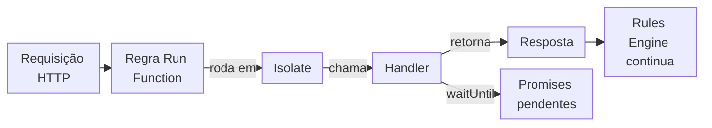

import FrameBox from '@aziontech/webkit/frame-box'
import ItemList from '@aziontech/webkit/item-list'
import DocItem from '@aziontech/webkit/doc-item'

Um runtime JavaScript serverless executa o seu código uma vez por requisição, dentro de um sandbox que o mantém separado do código de outros tenants. O código recebe a requisição, constrói uma resposta e a retorna, e o sandbox decide quais funcionalidades da linguagem e quais chamadas de sistema o código pode usar.

O Azion Runtime é esse ambiente para [Functions](/pt-br/documentacao/plataforma/functions/). Ele executa JavaScript construído sobre padrões Web, chama o handler que a sua function exporta e entrega ao handler as APIs da plataforma. O seu projeto chega a ele por meio do Azion Bundler, que faz o build do código e resolve as APIs do Node.js com polyfills em tempo de build.

As seções cobrem o modelo de execução, o ciclo de vida da requisição, os formatos de handler, o bundler e os polyfills, o strict mode, o tempo dentro de uma requisição, as variáveis de ambiente e os secrets e como `azion dev` difere de uma function com deploy feito. O que decide quando uma function roda, a regra e a instância de function, está em [Como Functions funciona](/pt-br/documentacao/plataforma/functions/como-funciona/).

---

## Modelo de execução

Cada invocação de uma function roda em um isolate, um contexto de execução do V8. As functions rodam dentro de Cells, um ambiente de isolamento baseado em isolates V8. Cada Cell é um contexto de execução leve, sem acesso direto ao sistema operacional subjacente. O limite de memória de uma function se aplica por isolate, e uma function que excede o seu tempo de CPU é encerrada. Para os valores, consulte [Limites de Functions](/pt-br/documentacao/plataforma/functions/limites/).

Para a segurança multi-tenant e a integridade da infraestrutura, uma Cell mantém três coisas fora do alcance do código:

- As propriedades do sistema operacional do host. `node:os` retorna strings vazias ou zeros para o hostname, a release e os campos de memória, enquanto as suas chamadas `platform()` e `type()` retornam os valores genéricos `linux` e `Linux`.
- A resolução de DNS por chamadas de sistema nativas. Uma chamada como `dns.lookup()` de `node:dns` lança `Error: [unenv] dns.lookup is not implemented yet!`.
- Sockets TCP e UDP de baixo nível, que exigem chamadas de sistema diretas.

A linguagem e os seus objetos globais são os que você conhece do navegador e dos ambientes de servidor. Built-ins padrão como `Math`, `JSON`, `Date`, `String`, `Array`, `Map`, `Set` e o modelo assíncrono baseado em `Promise` estão disponíveis. Sobre eles, o runtime expõe Web APIs como `fetch`, `Request`, `Response`, as interfaces da Web Crypto, streams e o tratamento de eventos. Por isso, a maior parte do JavaScript portável roda sem alterações. Para a lista completa, consulte [Web APIs](/pt-br/documentacao/devtools/runtime/api-reference/javascript/).

A Azion participa do WinterTC (TC55), o comitê da Ecma International que padroniza uma API comum mínima para runtimes JavaScript do lado do servidor. O código escrito para o Azion Runtime segue os mesmos padrões de outros runtimes importantes, e a Azion trabalha nesses padrões com o WHATWG, o W3C e outros órgãos de padronização. Uma function construída apenas sobre essas APIs pode ser portada para outras plataformas que implementam os mesmos padrões.

A propriedade global `EdgeRuntime` diz ao seu código onde ele roda. Ela contém a string `"azion"` em uma function com deploy feito e `"edge-runtime"` com `azion dev`. Você pode lê-la de três formas, e cada verificação abaixo pula o seu bloco nos dois ambientes, porque a propriedade é uma string nos dois:

```javascript
if (typeof EdgeRuntime !== 'string') {
  // Runs only outside Azion Runtime and azion dev.
}

if (typeof globalThis.EdgeRuntime !== 'string') {
  // Runs only outside Azion Runtime and azion dev.
}

if (typeof self.EdgeRuntime !== 'string') {
  // Runs only outside Azion Runtime and azion dev.
}
```

Construir sobre padrões Web, e não sobre o Node.js, é a troca que esse modelo faz. O código que usa APIs padrão se move entre runtimes, enquanto o código que depende de módulos do Node.js ou do sistema do host precisa de polyfills, ou não roda. Para cada global que o runtime define, consulte [Globais](/pt-br/documentacao/devtools/runtime/api-reference/azion-runtime-globals/).

---

## Ciclo de vida da requisição

Uma requisição chega a uma function apenas quando uma regra do [Rules Engine](/pt-br/documentacao/plataforma/applications/rules-engine/) com o comportamento **Run Function** corresponde a ela. A partir desse ponto, o Azion Runtime executa a function na infraestrutura distribuída da Azion, perto do usuário que enviou a requisição. O runtime chama o handler, espera a resposta que ele retorna e devolve o controle para a regra.

Este diagrama acompanha uma requisição pelo runtime:



1. Uma requisição chega, e uma regra do Rules Engine cujos critérios correspondem executa o seu comportamento **Run Function**, que nomeia uma instância de function.
2. O Azion Runtime executa a function dessa instância em um isolate.
3. O runtime chama o handler. No padrão ES Modules, ele chama o método `fetch` do export default com `request`, `env` e `ctx`. No padrão Service Worker, ele dispara um evento `fetch`: cria um `FetchEvent` que carrega o `request` original e o entrega ao listener que você registrou com `addEventListener`.
4. O handler retorna um `Response` ou uma promise que resolve para um. Um listener Service Worker passa o mesmo valor para `event.respondWith()`, que diz ao runtime o que enviar de volta ao cliente.
5. `ctx.waitUntil(promise)`, ou `event.waitUntil()` no padrão Service Worker, estende a execução até que a promise seja resolvida ou rejeitada, para que o trabalho iniciado no handler possa terminar depois que o handler retorna.
6. O controle volta para o Rules Engine, que continua com os comportamentos seguintes.

O `request` entrega ao handler a URL, o método, os headers e o body do tráfego recebido, e `request.metadata` acrescenta dados como a geolocalização e o protocolo TLS do cliente. As propriedades dele são somente leitura: atribuir `request.url` lança `TypeError: Cannot set property url of [object Request] which has only a getter`. Uma function costuma registrar um único listener `fetch`, e um listener que nunca chama `event.respondWith()` não produz resposta. O `addEventListener` global vem de `EventTarget`: em uma function com deploy feito, `globalThis instanceof EventTarget` é `true`, e a mesma classe pode servir de base para os seus próprios objetos que emitem e escutam eventos personalizados.

---

## Formatos de handler

Um handler é o código que o Azion Runtime chama quando a function roda. O runtime aceita três formatos, e cada um recebe a requisição de um jeito diferente:

| Formato | Padrão | O que o handler recebe |
| --- | --- | --- |
| `export default { fetch(request, env, ctx) }` | ES Modules, recomendado | `request`, `env` e `ctx` como três argumentos. |
| `addEventListener('fetch', (event) => {})` | Service Worker | Um `FetchEvent` com `request`, `args`, `console`, `respondWith()` e `waitUntil()`. |
| `export default main`, em que `main` recebe `event` | Obsoleto | O mesmo `FetchEvent` que o padrão Service Worker recebe. |

Uma function cujo export default é uma função continua rodando, após o deploy e com `azion dev`. `azion build` imprime esta linha de obsolescência para ela:

```text
[Azion] [Build] › ⚠  warning   DEPRECATED: Migrate handler to → export default { fetch: (request, env, ctx) => {...} }
```

Os formatos diferem em onde o contexto fica. O handler ES Modules recebe os Args da instância de function como `ctx.args`, enquanto os formatos baseados em evento os leem de `event.args`. Um export nomeado, `export async function fetch(request, env, ctx)`, não é um dos três formatos. `azion build` o envolve com o aviso `Unsupported handler pattern detected. Generating Service Worker wrapper as fallback.`, e `azion dev` não consegue executá-lo.

Uma instância de function em um firewall exporta um handler `firewall` no lugar de `fetch`. Para saber como ele decide a requisição, consulte [Functions em um firewall](/pt-br/documentacao/plataforma/functions/como-funciona/#functions-em-um-firewall). Para os parâmetros de cada formato, consulte [Handlers](/pt-br/documentacao/devtools/runtime/api-reference/handlers/). Para mover uma function mais antiga para o formato ES Modules, consulte [Migre padrões de handler em Functions](/pt-br/documentacao/guias/desenvolvimento-de-aplicacoes/functions-e-runtime/migrar-padroes-de-handler/).

---

## Bundler e polyfills

Um polyfill é um código que fornece uma API a um ambiente que não a tem. O Azion Runtime implementa padrões Web, mas os projetos construídos com frameworks web costumam chamar APIs do Node.js. O [Azion Bundler](https://github.com/aziontech/bundler), o adaptador de frameworks open source que a [Azion CLI](/pt-br/documentacao/devtools/cli/) executa, resolve essas APIs com polyfills durante o build, e não enquanto a function roda.

`azion build` executa o Azion Bundler com o preset do projeto, e o bundler grava o bundle que o deploy lê. A chave `build.polyfills` do arquivo `azion.config` do projeto, `true` ou `false`, controla se o build aplica polyfills. Por exemplo, `azion init` grava `build: { preset: 'javascript', polyfills: true }` na configuração de um projeto JavaScript. Durante um deploy, a Azion CLI faz o build do projeto, aplica os polyfills configurados, publica a function e imprime a URL da aplicação. Para cada chave do arquivo, consulte [azion.config.js](/pt-br/documentacao/devtools/cli/azion-config-js/).

Um módulo resolvido em tempo de build nem sempre é um módulo que funciona em tempo de execução. Todo módulo que a tabela de compatibilidade do Node.js lista é resolvido quando o bundle é gerado. Os módulos marcados como apenas de build são stubs, para que pacotes npm com dependências estáticas deles ainda compilem. Em tempo de execução, uma chamada a um stub retorna valores vazios ou padrão, ou lança um erro como `[unenv] dns.lookup is not implemented yet!`. A lista das APIs que o Azion Bundler resolve por meio de polyfills está no repositório dele, que também aceita contribuições.

O custo de resolver em tempo de build está em onde uma lacuna aparece. O build passa quer o módulo esteja completo, quer seja um stub, então uma implementação ausente só aparece quando uma requisição chega à chamada. Para o status de cada módulo, consulte [APIs do Node.js](/pt-br/documentacao/devtools/runtime/node/). Para um projeto completo, consulte [Use APIs do Node.js com polyfills](/pt-br/documentacao/guias/desenvolvimento-de-aplicacoes/functions-e-runtime/use-polyfills/).

---

## Strict mode

A Azion faz do strict mode o modo padrão e obrigatório do código JavaScript que uma function executa. O strict mode traz comportamentos do JavaScript que a linguagem não podia ativar por padrão, porque eles teriam quebrado o código escrito antes deles. Por esse motivo, a Azion o trata como o padrão sensato.

O strict mode altera a semântica normal do JavaScript de três formas:

- Transforma alguns erros silenciosos em erros lançados.
- Remove enganos que impedem os motores JavaScript de otimizar o código, então o código em strict mode às vezes roda mais rápido que o mesmo código fora do strict mode.
- Proíbe parte da sintaxe que versões posteriores do ECMAScript provavelmente vão definir.

A primeira mudança tem um custo para o código escrito sem strict mode. Um engano que o JavaScript fora do strict mode ignora lança um erro em uma function, e o erro aparece na requisição, então uma biblioteca mais antiga que depende de falhas silenciosas precisa de um teste antes que você faça o deploy dela.

---

## Tempo dentro de uma requisição

Uma function com deploy feito vê o relógio parado durante uma requisição. `Date.now()` não avança durante uma requisição: duas chamadas separadas por um loop, um timer de 50 ms e um `fetch()` retornam o mesmo valor. `performance.now()` avança, e começa em 0 quando a requisição começa.

Por exemplo, uma function que marca o início e o fim de uma chamada à origem com `Date.now()` registra o mesmo timestamp duas vezes. A mesma medição com `performance.now()` retorna os milissegundos decorridos. Da mesma forma, o campo de nanossegundos que `process.hrtime()` retorna é 0 em uma function com deploy feito, então uma duração medida com ele é 0.

O relógio parado é um comportamento apenas de uma function com deploy feito. Com `azion dev`, `Date.now()` avança ao longo do mesmo loop, do mesmo timer e da mesma chamada, então uma duração medida com ele funciona localmente e marca 0 depois do deploy. Meça durações com `performance.now()`. Para os globais de tempo que o runtime define, consulte [Globais](/pt-br/documentacao/devtools/runtime/api-reference/azion-runtime-globals/).

---

## Variáveis de ambiente e secrets

Uma function lê as variáveis de ambiente e os secrets armazenados na sua conta por meio do runtime, e não pelos seus argumentos. Em uma function com deploy feito, o argumento `env` de `fetch(request, env, ctx)` é um objeto vazio. Você lê uma variável com `Azion.env.get('<name>')` ou como uma propriedade de `process.env`, e os dois retornam o valor dela.

Uma variável criada como secret retorna o seu valor por meio de `Azion.env.get()` da mesma forma. Quando a chave não corresponde a nenhuma variável da sua conta, `Azion.env.get()` retorna `undefined` e não lança erro. Os valores ficam fora do código da function, então uma credencial muda sem uma edição no código.

Com `azion dev`, as variáveis vêm da sua máquina, e não da sua conta. Com um arquivo `.env` na pasta do projeto, `env` e `process.env` contêm as chaves desse arquivo. Sem ele, contêm todo o ambiente do shell da máquina que executa `azion dev`, tokens incluídos, então o código da function pode ler toda credencial definida nesse shell. Para a API e um exemplo, consulte [API de variáveis de ambiente](/pt-br/documentacao/devtools/runtime/api-reference/environment-variables/).

---

## Comportamento local e após o deploy

`azion dev` executa uma function na sua máquina por meio de um servidor local que emula o Azion Runtime. Ele atende em `http://localhost:3333` por padrão, e `--port` altera a porta. A emulação não é exata: várias APIs existem apenas em uma function com deploy feito, e algumas se comportam de forma diferente em cada lado. Uma página desta árvore descreve o comportamento após o deploy, e a tabela abaixo reúne as diferenças.

| API ou comportamento | Function com deploy feito | `azion dev` |
| --- | --- | --- |
| Argumento `env` do handler | Um objeto vazio | `process.env` da sua máquina: as chaves do `.env` ou, sem um arquivo `.env`, todo o ambiente do shell |
| Argumento `ctx` do handler | `Context` com `args` e `waitUntil` | Apenas `waitUntil` |
| `request.metadata` | Um objeto com os metadados da requisição | `undefined` |
| `EdgeRuntime` | `"azion"` | `"edge-runtime"` |
| `Date.now()` durante uma requisição | Não avança | Avança |
| `caches` (Cache API) | Disponível | `ReferenceError: caches is not defined` |
| `Azion.Sql`, `Azion.AI`, `WebSocket`, `upgradeWebSocket` | Disponíveis | `undefined` |
| `Azion.networkList.contains()` | Retorna `true` ou `false` | `TypeError: Cannot read properties of undefined (reading 'find')` |
| `CustomEvent` e o `dispatchEvent` global | Disponíveis | `CustomEvent is not defined`; `dispatchEvent` não é uma função |
| `queueMicrotask` | `ReferenceError: queueMicrotask is not defined` | Disponível |
| Callbacks de `process.nextTick()` | Não rodam quando o handler constrói a sua resposta | Rodam antes da resposta |
| `setTimeout()` com uma string | `EvalError: eval not allowed on setTimeout/setInterval parameter` | `TypeError` no argumento `callback` |
| Export nomeado `export async function fetch` | Roda, com três argumentos | Encerra com `SyntaxError: Unexpected token 'export'` |
| `pipeline` de `node:stream`; `timingSafeEqual` e `generateKeyPairSync` de `node:crypto` | Funcionam | O build falha, ou a chamada não é uma função |
| Atribuir uma propriedade de `Request` | Lança um `TypeError` | Ignorado |
| `structuredClone()` com `transfer` | Desanexa o buffer de origem | Mantém o buffer de origem anexado |
| Fuso horário de `Intl` | `UTC` | O fuso horário da sua máquina |
| `node:fs` | `fs.promises.*` lança `missing storage annotation` | Os paths são resolvidos em `.edge/storage/` |
| `get()` do Object Storage para uma chave inexistente | `StorageError: Object not found` | `ENOENT` do disco local |
| Construtor do KV Store `new Azion.KV(name)` | `KvError: KV constructor is private, use KV.open(name) instead` | Constrói o objeto |

Mais três comportamentos de `azion dev` mudam o que você vê localmente. Um bundle que contém `addEventListener("firewall", …)` em qualquer ponto muda todo o servidor local para a emulação de firewall, e toda requisição passa a falhar com HTTP 500. O hot reload não consegue trocar o formato do handler: mudar a entrada de `export default main` para `addEventListener('fetch')` interrompe o servidor, e um novo `azion dev` serve a entrada alterada. Por fim, com `azion dev`, um evento de firewall não tem `console`, então um código que chama `event.console.error()` lança um erro.

Uma execução local mostra uma alteração sem um deploy. Uma function que usa a Cache API, os metadados, um banco de dados SQL ou o relógio parado ainda precisa de um teste após o deploy antes de atender tráfego. Para o fluxo de trabalho local, consulte [Desenvolva e teste uma function localmente](/pt-br/documentacao/plataforma/functions/local-development/) e [Azion CLI dev](/pt-br/documentacao/devtools/cli/dev-comando/).

---

## Recursos relacionados

<FrameBox>
<ItemList>
  <DocItem title="Handlers" href="/pt-br/documentacao/devtools/runtime/api-reference/handlers/">Os parâmetros do handler fetch e os três formatos de handler, em forma de referência.</DocItem>
  <DocItem title="Globais" href="/pt-br/documentacao/devtools/runtime/api-reference/azion-runtime-globals/">Todos os objetos e funções globais que o runtime define, incluindo o relógio.</DocItem>
  <DocItem title="APIs do Node.js" href="/pt-br/documentacao/devtools/runtime/node/">O status de cada módulo do Node.js e o que o polyfill dele faz em tempo de execução.</DocItem>
  <DocItem title="Desenvolva e teste uma function localmente" href="/pt-br/documentacao/plataforma/functions/local-development/">Execute uma function com `azion dev` e forneça variáveis a partir de um arquivo local.</DocItem>
</ItemList>
</FrameBox>
