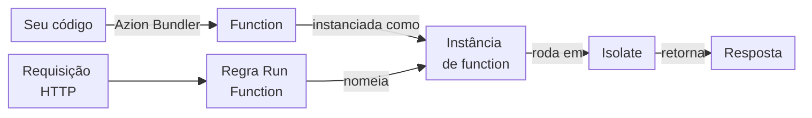

import DocButton from '~/components/webkit/DocButton.vue'
import DocCardGroup from '@aziontech/webkit/doc-card-group'
import DocCard from '@aziontech/webkit/doc-card'

Um runtime JavaScript é o ambiente que executa o código: ele fornece o motor da linguagem, os objetos globais e as APIs que o código pode chamar. Em um runtime serverless, você escreve um handler que recebe uma requisição e retorna uma resposta. A plataforma inicia o handler quando uma requisição chega, então não há servidor para você provisionar ou escalar.

**Azion Runtime** é o runtime JavaScript de [Functions](/pt-br/documentacao/plataforma/functions/). Ele executa o seu handler na infraestrutura distribuída da Azion, perto dos usuários que enviam as requisições, e a Azion provisiona o que o código precisa para rodar. O código é construído sobre padrões Web e roda em modo estrito (strict mode). Ele chama Web APIs, APIs da Azion para variáveis, metadados da requisição, armazenamento e bancos de dados e, por meio de polyfills, uma parte das APIs do Node.js. Use o Azion Runtime para colocar lógica de negócio na frente de uma aplicação, construir aplicações serverless, alterar respostas enquanto são transmitidas ou armazenar e consultar dados a partir de uma function.

<DocButton href="/pt-br/documentacao/devtools/runtime/primeiros-passos/" label="Primeiros passos" size="medium" />
<DocButton href="/pt-br/documentacao/devtools/runtime/api-reference/javascript/" label="Explore as Web APIs" kind="secondary" size="medium" />

---

## Estrutura da function

Uma function do Azion Runtime é um módulo JavaScript cujo export default contém um handler `fetch`. A menor function completa responde a toda requisição com o mesmo texto:

```javascript
export default {
  async fetch(request, env, ctx) {
    return new Response('Hello World!');
  },
};
```

Com o deploy feito, a function retorna esta resposta:

```json
{
 "status": 200,
 "statusText": "",
 "headers": {
  "content-type": "text/plain;charset=UTF-8"
 },
 "body": "Hello World!"
}
```

- `export default { fetch }` é o formato ES Modules, o que a Azion recomenda. O Azion Runtime também executa o padrão Service Worker, `addEventListener('fetch', …)`, e uma função de export default obsoleta.
- `request` é um `Request` padrão. A propriedade `metadata` dele adiciona dados sobre o cliente, como a geolocalização e o protocolo TLS.
- `env` é um objeto vazio em uma function com deploy feito. Uma function lê as suas variáveis com `Azion.env.get()` ou `process.env`.
- `ctx` carrega `args`, os Args da instância de function, e `waitUntil()`, que estende a execução até que uma promise seja resolvida ou rejeitada.

Um código escrito para os objetos Web `Request` e `Response`, em um navegador ou em outro runtime baseado em padrões, segue o mesmo modelo no Azion Runtime. Para cada parâmetro e formato de handler, consulte [Handlers](/pt-br/documentacao/devtools/runtime/api-reference/handlers/).

---

## Caminho de invocação

Escrever uma function não a executa. O seu código chega ao Azion Runtime por meio de um build, e uma requisição chega ao seu código apenas quando uma regra de uma aplicação executa uma instância da function.



1. `azion build` executa o Azion Bundler, que empacota o seu código e resolve com polyfills, em tempo de build, as APIs do Node.js que ele chama. `azion deploy` publica o resultado como uma function.
2. Uma [instância de function](/pt-br/documentacao/plataforma/applications/functions-instances/#campos-da-instancia) coloca a function em uma aplicação. O campo `active` dela impede a instância de rodar sem excluí-la. A aplicação precisa ter **Functions** ativado na seção **Modules** das suas [Main Settings](/pt-br/documentacao/plataforma/applications/main-settings/#produtos).
3. Uma requisição chega, e uma regra do [Rules Engine](/pt-br/documentacao/plataforma/applications/rules-engine/) cujos critérios correspondem executa o seu comportamento **Run Function**, que nomeia a instância.
4. O Azion Runtime executa a function em um isolate, um contexto de execução do V8, no [data center que atende a requisição](/pt-br/documentacao/fundamentos/como-funciona/#infraestrutura-distribuida).
5. O runtime chama o handler, e o handler retorna um `Response`. Um trabalho passado para `ctx.waitUntil()` pode terminar depois que o handler retorna.
6. O controle volta para o Rules Engine, que continua com os comportamentos seguintes.

Para o ciclo de vida da requisição, o bundler e o tempo dentro de uma requisição, consulte [Como o Azion Runtime funciona](/pt-br/documentacao/devtools/runtime/como-funciona/).

---

## Capacidades e limites

Uma function no Azion Runtime chama APIs padrão, uma parte do Node.js e as APIs da plataforma, dentro de um isolate com tetos fixos:

- **Linguagem**: JavaScript. A Azion faz do strict mode o modo padrão e obrigatório de toda function, então alguns erros silenciosos passam a ser erros lançados. Para mais informações, consulte [Como o Azion Runtime funciona](/pt-br/documentacao/devtools/runtime/como-funciona/) e a [referência de strict mode da MDN](https://developer.mozilla.org/en-US/docs/Web/JavaScript/Reference/Strict_mode).
- **Web APIs**: o runtime agrupa as suas Web APIs em rede, codificação e decodificação, Web Streams, padrões Web, primitivas do V8, Web Crypto e EventTarget. A Azion participa do WinterTC (TC55), o comitê da Ecma International que padroniza uma API comum mínima para runtimes JavaScript do lado do servidor. Uma function construída apenas sobre essas APIs pode ser portada para outros runtimes que as implementam. Para cada API, consulte [Web APIs](/pt-br/documentacao/devtools/runtime/api-reference/javascript/). [Globais](/pt-br/documentacao/devtools/runtime/api-reference/azion-runtime-globals/) lista os nomes que uma function usa sem um import.
- **APIs do Node.js**: uma function pode importar 68 módulos do Node.js, e cada um é resolvido quando o build empacota a function. Um módulo que passa pelo build nem sempre funciona em tempo de execução: alguns têm suporte parcial, e os módulos apenas de build são stubs cujas chamadas retornam valores vazios ou lançam erros. Para o status de cada módulo, consulte [APIs do Node.js](/pt-br/documentacao/devtools/runtime/node/).
- **APIs da Azion**: uma function lê [variáveis de ambiente e secrets](/pt-br/documentacao/devtools/runtime/api-reference/environment-variables/), os [metadados de uma requisição](/pt-br/documentacao/devtools/runtime/api-reference/metadata/) e [network lists](/pt-br/documentacao/devtools/runtime/api-reference/network-list/). Ela armazena dados com a [Object Storage API](/pt-br/documentacao/devtools/runtime/api-reference/storage/) e a [KV Store API](/pt-br/documentacao/devtools/runtime/api-reference/kv-store/), e consulta um banco de dados com a [SQL Database API](/pt-br/documentacao/devtools/runtime/api-reference/sql-database/). Ela também executa modelos com a [AI Inference API](/pt-br/documentacao/devtools/runtime/api-reference/ai/) e usa a [Cache API](/pt-br/documentacao/devtools/runtime/api-reference/cache/) e o [WebSocket](/pt-br/documentacao/devtools/runtime/api-reference/websocket/).
- **Isolamento**: um isolate não dá ao código acesso ao sistema operacional do host, nem resolução de DNS por chamadas de sistema nativas, nem sockets TCP ou UDP de baixo nível. Cada invocação roda dentro dos tetos de memória e de tempo de CPU de [Limites de Functions](/pt-br/documentacao/plataforma/functions/limites/#limites-default).
- **Invocação**: o Azion Runtime executa o código, mas não decide quando ele roda. A regra e a instância de function decidem, como descreve [Como Functions funciona](/pt-br/documentacao/plataforma/functions/como-funciona/).
- **Interfaces**: a [Azion CLI](/pt-br/documentacao/devtools/cli/) executa uma function localmente com `azion dev` e faz o build e o deploy dela com `azion build` e `azion deploy`. `azion dev` emula o runtime, e várias APIs se comportam de forma diferente nele. Para as diferenças, consulte [Como o Azion Runtime funciona](/pt-br/documentacao/devtools/runtime/como-funciona/).
- **Frameworks**: projetos construídos com frameworks web fazem o deploy por meio do Azion Bundler. Para o suporte de cada framework, consulte [Compatibilidade com frameworks](/pt-br/documentacao/devtools/runtime/frameworks/compatibilidade-frameworks/).
- **Termos e ajuda**: o [Glossário](/pt-br/documentacao/devtools/runtime/glossario/) define os termos do Azion Runtime, e [Obter ajuda](/pt-br/documentacao/suporte/obter-ajuda/) lista os canais de suporte e de comunidade.

---

## Próximos passos

<DocCardGroup cols={2}>
  <DocCard title="Primeiros passos com o Azion Runtime" href="/pt-br/documentacao/devtools/runtime/primeiros-passos/" label="Escreva uma function, execute-a com o azion dev e faça o deploy dela." />
  <DocCard title="Como o Azion Runtime funciona" href="/pt-br/documentacao/devtools/runtime/como-funciona/" label="Siga uma requisição da regra até o seu handler e de volta." />
  <DocCard title="Web APIs" href="/pt-br/documentacao/devtools/runtime/api-reference/javascript/" label="Consulte uma API padrão que uma function pode chamar." />
  <DocCard title="APIs do Node.js" href="/pt-br/documentacao/devtools/runtime/node/" label="Verifique se um módulo do Node.js funciona em tempo de execução." />
</DocCardGroup>
