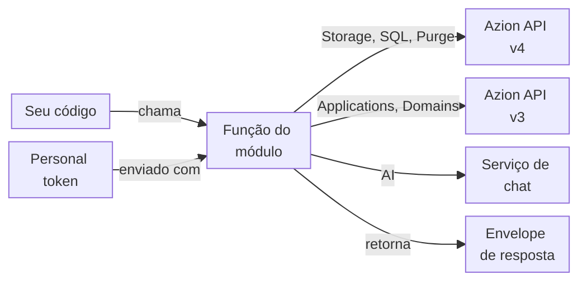

import FrameBox from '@aziontech/webkit/frame-box'
import ItemList from '@aziontech/webkit/item-list'
import DocItem from '@aziontech/webkit/doc-item'

Uma biblioteca cliente transforma a API de uma plataforma em funções da sua linguagem de programação. Você chama uma função com valores simples, e a biblioteca envia a requisição com o seu token. O seu código recebe de volta um valor que ele pode verificar, em vez de uma resposta HTTP bruta. Alguns módulos de uma biblioteca não enviam nenhuma requisição e apenas empacotam helpers que rodam dentro do seu código.

A Azion Lib é um conjunto de pacotes JavaScript e TypeScript que faz as duas coisas para a Azion Platform. Seis dos seus módulos chamam um serviço da Azion: Storage, SQL, Purge, Domains, Applications e AI, e o Client reúne esses seis em um único objeto. Os outros sete não fazem nenhuma chamada de API: Cookies, JWT, WASM Image Processor, Utils, Config, Types e unenv preset. As funções e os parâmetros de cada módulo estão na página dele, e as APIs que uma função acessa pelo próprio runtime estão em [Azion Runtime](/pt-br/documentacao/devtools/runtime/).

As seções cobrem os pacotes que trazem os módulos, as configurações de token e de debug, os envelopes de resposta, as versões da API que os módulos chamam e onde as funções rodam: no Node.js ou em uma function.

---

## Pacotes e módulos

A Azion Lib é distribuída em dois tipos de pacote npm. Sete módulos têm o seu próprio pacote com escopo em `@aziontech`, como `@aziontech/storage`, e as páginas da Azion Lib documentam esses pacotes. Os outros sete módulos existem apenas como subcaminhos do pacote `azion`, como `azion/purge`, e o Client é a raiz desse pacote.

Esta tabela mostra o pacote de onde vem cada módulo e o especificador com que o seu código o importa:

| Módulo | Pacote | Importar de |
| --- | --- | --- |
| [Storage](/pt-br/documentacao/devtools/azion-lib/storage/) | `@aziontech/storage` | `@aziontech/storage` |
| [SQL](/pt-br/documentacao/devtools/azion-lib/sql/) | `@aziontech/sql` | `@aziontech/sql` |
| [JWT](/pt-br/documentacao/devtools/azion-lib/jwt/) | `@aziontech/jwt` | `@aziontech/jwt` |
| [Utils](/pt-br/documentacao/devtools/azion-lib/utils/) | `@aziontech/utils` | `@aziontech/utils/edge` |
| [Config](/pt-br/documentacao/devtools/azion-lib/config/) | `@aziontech/config` | `@aziontech/config` |
| [Types](/pt-br/documentacao/devtools/azion-lib/types/) | `@aziontech/types` | `@aziontech/types` |
| [unenv preset](/pt-br/documentacao/devtools/azion-lib/unenv/) | `@aziontech/unenv-preset` | `@aziontech/unenv-preset` |
| [Client](/pt-br/documentacao/devtools/azion-lib/client/) | `azion` | `azion` |
| [Applications](/pt-br/documentacao/devtools/azion-lib/application/) | `azion` | `azion/applications` |
| [Domains](/pt-br/documentacao/devtools/azion-lib/domains/) | `azion` | `azion/domains` |
| [Purge](/pt-br/documentacao/devtools/azion-lib/purge/) | `azion` | `azion/purge` |
| [AI client](/pt-br/documentacao/devtools/azion-lib/ai-client/) | `azion` | `azion/ai` |
| [Cookies](/pt-br/documentacao/devtools/azion-lib/cookies/) | `azion` | `azion/cookies` |
| [WASM Image Processor](/pt-br/documentacao/devtools/azion-lib/wasm-image-processor/) | `azion` | `azion/wasm-image-processor` |

O pacote `azion` recebe apenas correções de bugs, e a manutenção dele termina em dezembro de 2026. Funcionalidades são adicionadas apenas aos pacotes com escopo. Os sete módulos com escopo também continuam sendo subcaminhos de `azion`, como `azion/storage`. Os pacotes com escopo de Storage e SQL chamam os mesmos endpoints da API que esses subcaminhos. Os outros sete módulos não têm pacote com escopo, então `azion` é o único pacote que os traz.

Essa divisão faz com que um projeto muitas vezes instale os dois tipos. Por exemplo, um script que faz o purge de uma URL depois de fazer o upload de um objeto instala `azion` para o Purge e `@aziontech/storage` para o Storage. Dois especificadores também diferem do nome do módulo. Não existe o subcaminho `azion/client`, porque o Client é a raiz do pacote. As funções do Utils são importadas de `@aziontech/utils/edge`, porque o `@aziontech/utils` sem subcaminho exporta apenas as suas entradas `edge` e `node`.

---

## Configurações de token e de debug

Um módulo que chama um serviço da Azion envia o seu [personal token](/pt-br/documentacao/fundamentos/personal-tokens/) com cada requisição e obtém o token de uma de duas formas. Cada módulo de API pode criar um cliente: `createClient` no Storage, SQL, Purge, Domains e AI, e `createAzionApplicationClient` no Applications. Um cliente guarda o token que você passa no campo `token` dele. Uma função que você importa e chama diretamente, sem um cliente, lê o token da variável de ambiente `AZION_TOKEN`.

Duas variáveis de ambiente configuram os seis módulos de API. `AZION_TOKEN` guarda o seu personal token, e `AZION_DEBUG` com o valor `true` ativa o modo debug. Defina as duas no ambiente do processo que executa o seu código, por exemplo a partir de um arquivo `.env`:

```bash
AZION_TOKEN=[TOKEN VALUE]
AZION_DEBUG=true
```

No modo debug, Storage, SQL, Purge e AI registram no log o corpo de cada resposta da API, e o Storage imprime uma resposta de erro depois de `Error response body`. O SQL também registra no log cada instrução que envia para um banco de dados. Os logs nunca mostram a URL da requisição nem os seus headers. Uma única chamada também pode ativar o modo debug com `debug: true` nas opções que a função recebe.

As duas formas trocam conveniência por controle. A variável de ambiente mantém o token fora do seu código, e toda chamada direta no processo a usa. Por exemplo, um script que chama `purgeURL` com `AZION_TOKEN` não definida envia a requisição sem token, e a API a recusa. Um cliente leva o seu próprio token, então um processo pode manter clientes com tokens diferentes.

Os sete módulos que não fazem nenhuma chamada de API não leem nenhuma das duas variáveis. Para ver como o Client recebe o token para os seis módulos de uma só vez, consulte [Client](/pt-br/documentacao/devtools/azion-lib/client/).

---

## Envelopes de resposta

A maioria das funções da Azion Lib que chamam uma API não lança uma exceção quando uma requisição falha. Em vez disso, elas retornam um envelope de resposta: um objeto que contém o resultado ou o erro, e que o seu código verifica antes de usar o resultado.

Storage, SQL, Purge e Domains retornam `{ data?, error? }`, assim como `deleteApplication` e as funções do Applications para origins, cache settings, device groups, instâncias de function e regras. Em caso de sucesso, `data` contém o resultado. Em caso de falha, `error` contém `{ message, operation }`, em que `operation` nomeia a chamada que falhou, como `get bucket`.

Dois módulos fogem desse formato:

- As funções de nível de aplicação do Applications, `createApplication`, `getApplication`, `getApplications`, `putApplication` e `patchApplication`, retornam `{ data }` em caso de sucesso. Quando a API responde com um status de erro, elas lançam `Error: HTTP error! Status: <code> - <TEXT>`, então chame essas funções dentro de `try`/`catch`.
- O AI retorna `{ data, error }`. Uma chamada que falha define `data` como `null` e `error` como um objeto `Error`, que aparece como `{}` com `JSON.stringify`, então registre `error.message` no log.

Algumas chamadas bem-sucedidas não retornam `data`, então uma verificação feita apenas em `data` aponta uma falha que não aconteceu. Um `deleteBucket` ou `deleteObject` do Storage bem-sucedido retorna um envelope cujo único campo é `error`, com o valor `undefined`, então verifique `error` depois de uma exclusão no Storage. O `deleteDatabase` do SQL retorna `data: { state: 'pending' }`, sem o ID do banco de dados. O `getDatabase` do SQL com um nome que não existe retorna um objeto vazio, sem `data` e sem `error`.

Toda exclusão do Applications retorna `{ error: { message: 'Expected JSON response, but got: ', operation } }` em caso de sucesso, porque a API responde a uma exclusão com um corpo vazio. Nesse caso, nenhum dos dois campos distingue o sucesso da falha, então leia o recurso de novo para confirmar a exclusão.

Os módulos que não fazem nenhuma chamada de API retornam os seus valores diretamente. JWT e Cookies lançam uma exceção quando uma chamada falha, e os erros do JWT são diferenciados pela propriedade `name`. Para o envelope e os erros de um módulo, consulte a página dele na tabela [Pacotes e módulos](#pacotes-e-modulos).

---

## Versões da API

Cada módulo de API chama um serviço, e esse serviço decide o formato dos payloads que o módulo envia. Três módulos chamam a Azion API v4, dois chamam a Azion API v3, e o AI chama um serviço de chat próprio.

Este diagrama acompanha uma chamada do seu código até o serviço que a responde:



1. O seu código chama uma função de um módulo de API, diretamente ou por meio de um cliente.
2. A função obtém o seu personal token do campo `token` do cliente dela ou da variável de ambiente `AZION_TOKEN`.
3. Storage, SQL e Purge chamam a Azion API v4, em `https://api.azion.com/v4/workspace/storage`, `https://api.azion.com/v4/workspace/sql` e `https://api.azion.com/v4/workspace/purge`.
4. Applications e Domains chamam a Azion API v3.
5. O AI envia as suas requisições para um serviço de chat fora da Azion API.
6. A função devolve a resposta no seu envelope de resposta, ou lança uma exceção, como descreve [Envelopes de resposta](#envelopes-de-resposta).

A versão da API decide quais objetos um módulo gerencia e qual é o formato dos seus payloads. Applications e Domains enviam payloads da API v3, como `origin_type` e `addresses` para um origin ou `edge_function_id` para uma instância de function. As páginas deles mostram os payloads que a API v3 aceita. Storage, SQL e Purge enviam payloads da API v4, como `workloads_access` para um bucket.

Os outros sete módulos não fazem nenhuma chamada de API: Cookies, JWT, WASM Image Processor, Utils, Config, Types e unenv preset. Para a própria API, consulte [Azion API](/pt-br/documentacao/devtools/api/).

---

## Node.js e functions

Um módulo da Azion Lib pode rodar em dois lugares: no Node.js, na sua máquina ou no seu servidor, ou dentro de uma [function](/pt-br/documentacao/plataforma/functions/) que o Azion Runtime executa. Os dois lugares expõem globais diferentes, então um módulo que funciona em um lugar nem sempre funciona no outro.

No Node.js, os seis módulos de API rodam e chamam os seus serviços por REST. Cookies, JWT, Config e a função `parseRequest` do Utils também rodam no Node.js. O WASM Image Processor roda no Node.js quando carrega uma imagem de uma URL que termina em uma extensão de imagem, e ele recusa um caminho de arquivo local.

Dentro de uma function servida localmente com [azion dev](/pt-br/documentacao/devtools/cli/dev-comando/), estes comportamentos valem:

- `mountSPA` e `mountMPA` do Utils servem os arquivos que `build.memoryFS` incorpora no build. Uma requisição para um arquivo que não existe faz a function responder com o status 500. Nenhuma das duas funções roda no Node.js.
- `parseRequest` roda e informa o IP do cliente como `Unknown`, porque o runtime local não tem `request.metadata`.
- Cookies e WASM Image Processor se comportam como no Node.js.
- Os fetch handlers tipados com Types rodam, no formato de módulo e no formato de listener.
- Uma function acessa os polyfills do Node.js que o unenv preset configura ao importar módulos `node:*`, como `node:crypto` e `node:fs`. As chamadas de leitura de `node:fs` `readFileSync`, `readdirSync`, `statSync`, `existsSync`, `openSync` e `closeSync` funcionam, enquanto `writeFileSync`, `mkdirSync` e `readSync` são indefinidas. Os próprios arquivos de polyfill não podem ser importados, nem no Node.js nem em uma function.

O Storage também verifica onde roda. Ele procura `globalThis.Azion.Storage`, que existe dentro de uma function, e, quando essa interface está presente, o Storage a chama em vez da API REST. Defina `external: true` nas opções de uma chamada para forçar a API REST. O SQL declara a mesma opção `external`.

Essa divisão tem um custo quando você testa. Um script que roda no Node.js não prova nada sobre `mountSPA`, `mountMPA` ou o polyfill de `node:fs`, que precisam de uma function com build feito pela Azion CLI. Para os metadados da requisição que uma function com deploy feito recebe, consulte [API de metadados](/pt-br/documentacao/devtools/runtime/api-reference/metadata/). Para as chamadas de sistema de arquivos do runtime, consulte [node:fs](/pt-br/documentacao/devtools/runtime/node/fs/).

---

## Recursos relacionados

<FrameBox>
<ItemList>
  <DocItem title="Azion Lib" href="/pt-br/documentacao/devtools/azion-lib/">Os módulos da Azion Lib e para que serve cada um.</DocItem>
  <DocItem title="Primeiros passos com a Azion Lib" href="/pt-br/documentacao/devtools/azion-lib/primeiros-passos/">Instale um pacote e faça uma primeira chamada com o seu token.</DocItem>
  <DocItem title="Client" href="/pt-br/documentacao/devtools/azion-lib/client/">Um único objeto que acessa os seis módulos de API com um token.</DocItem>
  <DocItem title="Storage" href="/pt-br/documentacao/devtools/azion-lib/storage/">As funções, o envelope e as opções de um módulo de API com escopo.</DocItem>
</ItemList>
</FrameBox>
