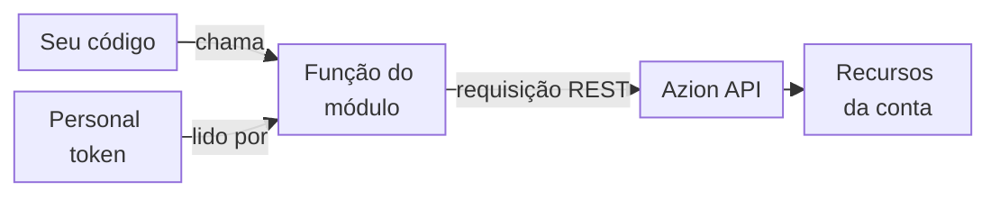

import DocButton from '~/components/webkit/DocButton.vue'
import DocCardGroup from '@aziontech/webkit/doc-card-group'
import DocCard from '@aziontech/webkit/doc-card'

Uma biblioteca cliente é um pacote de funções que substitui a API HTTP de uma plataforma. O seu código importa uma função, passa valores simples para ela e lê o objeto que ela retorna. A biblioteca monta a requisição, anexa as suas credenciais e interpreta a resposta, então o seu código não escreve chamadas HTTP próprias.

A **Azion Lib** é essa biblioteca para a Azion Platform: um conjunto de pacotes npm para JavaScript e TypeScript. Seis dos seus módulos chamam um serviço da Azion, como [Object Storage](/pt-br/documentacao/plataforma/object-storage/) ou [SQL Database](/pt-br/documentacao/plataforma/sql-database/). Outros sete, como JWT, Cookies e WASM Image Processor, são executados inteiramente dentro do seu código e não fazem nenhuma chamada de API. Use a Azion Lib para gerenciar buckets e objetos a partir de um script, executar instruções SQL em um banco de dados, fazer o purge de URLs em cache, assinar e verificar JSON Web Tokens (JWTs) ou definir cookies em uma resposta.

<DocButton href="/pt-br/documentacao/devtools/azion-lib/primeiros-passos/" label="Primeiros passos" size="medium" />
<DocButton href="/pt-br/documentacao/devtools/azion-lib/como-funciona/" label="Veja como funciona" kind="secondary" size="medium" />

---

## Modelo de código

Cada módulo é distribuído em um pacote npm, e o seu código importa apenas as funções que chama. Este script Node.js cria um bucket do Object Storage com o pacote `@aziontech/storage`:

```javascript
import { createBucket } from '@aziontech/storage';

const { data, error } = await createBucket({
  name: 'my-bucket',
  workloads_access: 'read_only',
});
if (data) {
  console.log(`Bucket created with name: ${data.name}`);
} else {
  console.error('Failed to create bucket', error);
}
```

Salvo como `create-bucket.mjs` e executado com `node create-bucket.mjs`, o script imprime o nome do bucket que criou:

```text
Bucket created with name: my-bucket
```

- A linha `import` carrega uma função do pacote do módulo. Nenhum objeto cliente é necessário para uma chamada direta.
- `createBucket` lê o seu personal token da variável de ambiente `AZION_TOKEN` e envia a requisição para a Azion API v4.
- A função recebe um argumento objeto, com o `name` do bucket e o seu nível de `workloads_access`.
- A chamada retorna um envelope de resposta, `{ data, error }`, em vez de lançar uma exceção. `data` contém o bucket em caso de sucesso, e `error` contém `message` e `operation` em caso de falha.

Se você conhece `async` e `await` em JavaScript, você sabe chamar as funções do Storage. Para executar este script na sua conta, siga os [Primeiros passos com a Azion Lib](/pt-br/documentacao/devtools/azion-lib/primeiros-passos/).

---

## Caminho da chamada

Instalar um pacote não dá ao seu código acesso à sua conta. O token acompanha cada chamada e vem de um cliente ou do ambiente.



1. O seu código chama uma função de um módulo de API diretamente ou por meio de um cliente que `createClient` retorna.
2. A função obtém o seu [personal token](/pt-br/documentacao/fundamentos/personal-tokens/) do campo `token` do cliente dela ou, em uma chamada direta, da variável de ambiente `AZION_TOKEN`.
3. A função envia a requisição para a [Azion API](/pt-br/documentacao/devtools/api/). Storage, SQL e Purge chamam a Azion API v4, e Applications e Domains chamam a Azion API v3. AI chama um serviço de chat próprio.
4. A API atua sobre os recursos da sua conta, como um bucket ou um banco de dados, e a função devolve a resposta ao seu código.

Apenas os seis módulos de API leem `AZION_TOKEN`, e `AZION_DEBUG` definido como `true` ativa os logs de depuração deles. Os outros sete módulos não leem nenhuma das duas variáveis. Para as configurações do token, os envelopes de resposta e a versão da API de cada módulo, consulte [Como a Azion Lib funciona](/pt-br/documentacao/devtools/azion-lib/como-funciona/).

---

## Pacotes e limites

A Azion Lib é distribuída em dois tipos de pacote npm, e um projeto costuma instalar os dois. Esta tabela mostra o pacote que contém cada módulo:

| Módulo | Pacote |
| --- | --- |
| [Storage](/pt-br/documentacao/devtools/azion-lib/storage/) | `@aziontech/storage` |
| [SQL](/pt-br/documentacao/devtools/azion-lib/sql/) | `@aziontech/sql` |
| [JWT](/pt-br/documentacao/devtools/azion-lib/jwt/) | `@aziontech/jwt` |
| [Utils](/pt-br/documentacao/devtools/azion-lib/utils/) | `@aziontech/utils` |
| [Config](/pt-br/documentacao/devtools/azion-lib/config/) | `@aziontech/config` |
| [Types](/pt-br/documentacao/devtools/azion-lib/types/) | `@aziontech/types` |
| [unenv preset](/pt-br/documentacao/devtools/azion-lib/unenv/) | `@aziontech/unenv-preset` |
| [Client](/pt-br/documentacao/devtools/azion-lib/client/) | `azion` |
| [Applications](/pt-br/documentacao/devtools/azion-lib/application/) | `azion` |
| [Domains](/pt-br/documentacao/devtools/azion-lib/domains/) | `azion` |
| [Purge](/pt-br/documentacao/devtools/azion-lib/purge/) | `azion` |
| [AI client](/pt-br/documentacao/devtools/azion-lib/ai-client/) | `azion` |
| [Cookies](/pt-br/documentacao/devtools/azion-lib/cookies/) | `azion` |
| [WASM Image Processor](/pt-br/documentacao/devtools/azion-lib/wasm-image-processor/) | `azion` |

O pacote `azion` recebe apenas correções de bugs, e a manutenção dele termina em dezembro de 2026. Os sete módulos do escopo `@aziontech` têm, cada um, um pacote próprio. Os outros sete não têm pacote com escopo, então `azion` é o único pacote que os contém. Cada página de módulo informa o pacote e o comando de instalação dele.

- **Onde as funções são executadas**: no Node.js, os seis módulos de API chamam os seus serviços por REST, e Cookies, JWT, Config e a função `parseRequest` do Utils também são executados. As funções `mountSPA` e `mountMPA` do Utils e o polyfill `node:fs` do unenv preset não são executados no Node.js. Eles são executados dentro de uma [function](/pt-br/documentacao/plataforma/functions/), inclusive em uma function servida localmente com [azion dev](/pt-br/documentacao/devtools/cli/dev-comando/), e os handlers tipados com Types também são executados nela. O Storage chama a interface `Azion.Storage` do [Azion Runtime](/pt-br/documentacao/devtools/runtime/) em vez da API REST quando essa interface está presente.
- **O que ela não faz**: a Azion Lib não tem um módulo de KV Store. Uma function lê e grava no KV Store por meio de `Azion.KV`, um global do Azion Runtime. Para mais informações, consulte [KV Store API](/pt-br/documentacao/devtools/runtime/api-reference/kv-store/). O WASM Image Processor redimensiona uma imagem dentro do seu código com WebAssembly. Ele é separado do [Image Processor](/pt-br/documentacao/plataforma/applications/image-processor/primeiros-passos/), que gera imagens derivadas em uma aplicação.
- **Interfaces**: os módulos de API chamam a Azion API por você. Para chamá-la diretamente, consulte [Azion API](/pt-br/documentacao/devtools/api/). Para gerenciar recursos a partir de um terminal, use a [Azion CLI](/pt-br/documentacao/devtools/cli/) e, para gerenciá-los como código, use o [Azion Terraform Provider](/pt-br/documentacao/devtools/terraform/).
- **Ajuda**: [Solucionar problemas da Azion Lib](/pt-br/documentacao/devtools/azion-lib/solucao-de-problemas/) lista os erros que uma chamada pode retornar e como corrigi-los, e o [Glossário](/pt-br/documentacao/devtools/azion-lib/glossario/) define os termos da Azion Lib.

---

## Próximos passos

<DocCardGroup cols={2}>
  <DocCard title="Primeiros passos com a Azion Lib" href="/pt-br/documentacao/devtools/azion-lib/primeiros-passos/" label="Instale um pacote e crie o seu primeiro bucket a partir do Node.js." />
  <DocCard title="Como a Azion Lib funciona" href="/pt-br/documentacao/devtools/azion-lib/como-funciona/" label="Descubra como cada módulo lê o seu token e informa uma falha." />
  <DocCard title="Storage" href="/pt-br/documentacao/devtools/azion-lib/storage/" label="Consulte cada função de bucket e de objeto, com os parâmetros e os erros dela." />
  <DocCard title="Solucionar problemas da Azion Lib" href="/pt-br/documentacao/devtools/azion-lib/solucao-de-problemas/" label="Corrija uma chamada que falha, lança uma exceção ou retorna um erro." />
</DocCardGroup>
