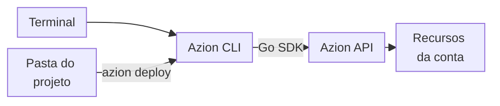

import DocButton from '~/components/webkit/DocButton.vue'
import DocCardGroup from '@aziontech/webkit/doc-card-group'
import DocCard from '@aziontech/webkit/doc-card'
import Tabs from '~/components/webkit/Tabs.vue'

Uma interface de linha de comando (CLI) de uma plataforma de nuvem é um programa que você executa em um terminal. Você atua sobre a sua conta com comandos digitados em vez de uma interface web, e um token salvo na sua máquina autoriza cada comando. Como toda ação é um comando, as mesmas etapas são executadas à mão, em um script ou em um pipeline de CI/CD.

A **Azion CLI** coloca a Azion Platform atrás de um único comando de terminal, `azion`, um binário [open source](https://github.com/aziontech/azion-cli/) escrito em Go. Ela tem duas famílias de comandos. Os comandos de projeto configuram o projeto da pasta atual, executam esse projeto localmente e fazem o build e o deploy dele. Os comandos de recursos criam, listam, descrevem, atualizam e excluem um recurso da plataforma de cada vez, com a forma `azion <verb> <noun>`. Use a Azion CLI para fazer o deploy de um site ou de uma function, testar o projeto localmente, gerenciar recursos como código ou automatizar deploys em pipelines de CI/CD.

Um build é executado no [Azion Bundler](https://github.com/aziontech/bundler), um adaptador de frameworks open source. `azion build` e `azion deploy` executam o bundler com o preset do projeto, e o bundler adapta a saída de um framework web para ser executada na Azion Platform. Para saber como as duas famílias de comandos chegam à plataforma, consulte [Como a Azion CLI funciona](/pt-br/documentacao/devtools/cli/como-funciona/).

Você também pode gerenciar os mesmos recursos pela [Azion API](/pt-br/documentacao/devtools/api/) ou com o [Azion Terraform Provider](/pt-br/documentacao/devtools/terraform/).

<DocButton href="/pt-br/documentacao/devtools/cli/primeiros-passos/" label="Primeiros passos" size="medium" />
<DocButton href="/pt-br/documentacao/devtools/cli/recursos/" label="Explore os comandos" kind="secondary" size="medium" />

---

## A CLI e a sua conta

A Azion CLI é um cliente: os recursos que ela cria e altera ficam na sua conta, e todo comando chega a eles pela Azion API.



1. Você executa `azion` em um terminal. A CLI autoriza cada comando com o personal token que ela salvou na sua máquina no login.
2. Um comando de projeto, como `azion deploy`, é executado dentro da pasta do projeto e lê o arquivo `azion/azion.json` e o arquivo `azion.config` dessa pasta.
3. A CLI, um binário Go, chama a Azion API por meio do [Azion Go SDK](/pt-br/documentacao/devtools/sdk/).
4. A API cria ou atualiza os recursos da sua conta, como uma aplicação e um workload. Após um deploy, a CLI grava o ID de cada recurso em `azion/azion.json`.

Para o build, os arquivos do projeto e os perfis em detalhe, consulte [Como a Azion CLI funciona](/pt-br/documentacao/devtools/cli/como-funciona/).

---

## Deploy de um projeto

Um único comando faz o deploy de um projeto. Na pasta de um site estático, `azion deploy` faz o deploy dele:

```bash
azion deploy
```

O comando envia os arquivos-fonte, e o build é executado na Azion. A saída termina com o domínio que serve o site:

```text
Running deploy command
Uploading source files

Upload completed successfully!
Please visit https://console.azion.com/create/deploy/9241bdbc-fe9f-4fbb-803a-0ca3b15911d3 in case it did not open automatically, to follow up the full deploy process
Your Application was deployed successfully

To visualize your application access the Domain: https://mz0kbijeiw0.map.azionedge.net
Your application is being deployed to all Azion Locations and it might take a few minutes.
```

- `Uploading source files` envia o projeto para a Azion, então o build não precisa de ferramentas de build na sua máquina. Com `--local`, o build é executado na sua máquina.
- O link do Azion Console abre **Deploy Log**, que mostra o progresso do build remoto.
- As últimas linhas mostram a URL do workload, um domínio `map.azionedge.net`.
- O comando grava o ID de cada recurso que criou em `azion/azion.json`, então o próximo deploy atualiza os mesmos recursos.

O primeiro deploy pode levar vários minutos para responder em todas as localidades; os deploys seguintes levam cerca de dois minutos. Para todas as flags do comando, consulte [Azion CLI deploy](/pt-br/documentacao/devtools/cli/deploy/).

---

## Instalar a Azion CLI

O script de instalação é a forma recomendada de instalar a Azion CLI. Ele coloca o binário `azion` no seu path:

```bash
curl -fsSL https://cli.azion.app/install.sh | bash
```

A Azion CLI também é publicada para gerenciadores de pacotes. Homebrew, Chocolatey e Windows Package Manager baixam o pacote para você. Para RPM, dpkg, APK e APT, primeiro baixe o pacote do seu sistema na [página de releases](https://github.com/aziontech/azion-cli/releases) e depois instale o arquivo baixado. Cada aba mostra o comando que instala a CLI e o comando que a atualiza:

<Tabs client:visible sharedStore="package-manager">
<Fragment slot="tab.brew">Homebrew</Fragment>
<Fragment slot="tab.windows">Windows</Fragment>
<Fragment slot="tab.rpm">RPM</Fragment>
<Fragment slot="tab.dpkg">dpkg</Fragment>
<Fragment slot="tab.apk">APK</Fragment>
<Fragment slot="tab.apt">APT</Fragment>

<Fragment slot="panel.brew">

Instale a fórmula `azion`:

```bash
brew install azion
```

Atualize-a para a versão mais recente:

```bash
brew upgrade azion
```

</Fragment>

<Fragment slot="panel.windows">

Instale a CLI com o Chocolatey:

```shell
choco install azion
```

Ou instale-a com o Windows Package Manager:

```shell
winget install aziontech.azion
```

Para atualizar, execute o comando do gerenciador que você usou na instalação:

```shell
choco upgrade azion
```

```shell
winget upgrade aziontech.azion
```

</Fragment>

<Fragment slot="panel.rpm">

Instale o pacote RPM que você baixou da página de releases:

```bash
sudo rpm -i <downloaded_file>
```

Para atualizar, baixe o pacote mais recente da página de releases e execute o mesmo comando nele.

</Fragment>

<Fragment slot="panel.dpkg">

Instale o pacote Debian que você baixou da página de releases:

```bash
sudo dpkg -i <downloaded_file>
```

Para atualizar, baixe o pacote mais recente da página de releases e execute o mesmo comando nele.

</Fragment>

<Fragment slot="panel.apk">

Instale o pacote APK que você baixou da página de releases:

```bash
apk add <downloaded_file>
```

Para atualizar, baixe o pacote mais recente da página de releases e execute o mesmo comando nele.

</Fragment>

<Fragment slot="panel.apt">

Instale o pacote Debian que você baixou da página de releases:

```bash
sudo apt install ./<downloaded_file>
```

Para atualizar, baixe o pacote mais recente da página de releases e execute o mesmo comando nele.

</Fragment>
</Tabs>

`azion version` confirma a instalação:

```bash
azion version
```

O comando imprime a versão da CLI:

```text
Azion CLI 4.23.0
```

Em seguida, a CLI precisa de um personal token para atuar sobre a sua conta. Para salvar um, consulte [Azion CLI login](/pt-br/documentacao/devtools/cli/login/).

---

## O que a CLI cobre

A Azion CLI cobre o ciclo de vida de um projeto, os recursos de uma conta e a configuração da própria CLI:

- **Comandos de projeto**: [`azion init`](/pt-br/documentacao/devtools/cli/init/) cria um projeto a partir de um template, e [`azion link`](/pt-br/documentacao/devtools/cli/link-comando/) configura uma pasta existente. [`azion dev`](/pt-br/documentacao/devtools/cli/dev-comando/) executa o projeto em um servidor de desenvolvimento local, e [`azion build`](/pt-br/documentacao/devtools/cli/build/) e [`azion deploy`](/pt-br/documentacao/devtools/cli/deploy/) fazem o build e o deploy dele. [`azion sync`](/pt-br/documentacao/devtools/cli/sync/) grava os recursos remotos de volta nos arquivos do projeto, [`azion unlink`](/pt-br/documentacao/devtools/cli/comando-unlink/) desvincula a pasta e [`azion rollback`](/pt-br/documentacao/devtools/cli/rollback/) volta a servir um deploy anterior de um site estático.
- **Comandos de recursos**: `azion <verb> <noun>` gerencia aplicações, functions, workloads, connectors, firewalls, zonas DNS, certificados, buckets de storage e tokens, em 28 nouns. [Comandos de recursos](/pt-br/documentacao/devtools/cli/recursos/) lista cada noun e os verbos que ele aceita. [`azion clone`](/pt-br/documentacao/devtools/cli/clone/) copia uma aplicação sob um novo nome, e [`azion config`](/pt-br/documentacao/devtools/cli/config/) gerencia recursos a partir de arquivos de manifesto.
- **Configuração do projeto**: [azion.config.js](/pt-br/documentacao/devtools/cli/azion-config-js/) declara, como código, as configurações de build de um projeto e os recursos de que ele precisa na Azion.
- **Conta e configurações**: [`azion login`](/pt-br/documentacao/devtools/cli/login/), [`azion logout`](/pt-br/documentacao/devtools/cli/logout/) e [`azion whoami`](/pt-br/documentacao/devtools/cli/whoami/) gerenciam a sessão. [`azion profiles`](/pt-br/documentacao/devtools/cli/profiles/) alterna entre contas, e [`azion reset`](/pt-br/documentacao/devtools/cli/reset/) retorna as configurações armazenadas aos seus valores padrão. As flags que todo comando aceita estão em [Opções globais](/pt-br/documentacao/devtools/cli/globals/).
- **Cache**: [`azion purge`](/pt-br/documentacao/devtools/cli/purge/) remove objetos em cache antes do fim do TTL deles, e [`azion warmup`](/pt-br/documentacao/devtools/cli/warmup/) solicita as páginas de um site para que elas fiquem em cache antes que os visitantes as peçam.
- **Logs**: [`azion logs`](/pt-br/documentacao/devtools/cli/logs/) imprime os logs de console das suas functions e os logs de eventos HTTP das suas aplicações.
- **Frameworks**: projetos desenvolvidos com Next.js, React, Vue, Angular, Astro e outros frameworks fazem o deploy pelo Azion Bundler. [Guias e tutoriais da Azion CLI](/pt-br/documentacao/devtools/cli/guias/) traz um guia por framework, e [Compatibilidade com web frameworks](/pt-br/documentacao/devtools/runtime/frameworks/compatibilidade-frameworks/) descreve como cada framework é executado no [Azion Runtime](/pt-br/documentacao/devtools/runtime/). Para fazer o deploy de um repositório pelo Azion Console em vez do terminal, consulte [Importe um projeto do GitHub](/pt-br/documentacao/guias/desenvolvimento-de-aplicacoes/automacao/importar-um-projeto-existente-do-github/).
- **Ajuda**: [Solucionar problemas da Azion CLI](/pt-br/documentacao/devtools/cli/solucao-de-problemas/) lista os erros que um comando pode retornar e como corrigir cada um, e o [Glossário](/pt-br/documentacao/devtools/cli/glossario/) define os termos da CLI.

---

## Próximos passos

<DocCardGroup cols={2}>
  <DocCard title="Primeiros passos com a Azion CLI" href="/pt-br/documentacao/devtools/cli/primeiros-passos/" label="Instale a CLI e faça o deploy da sua primeira function." />
  <DocCard title="Como a Azion CLI funciona" href="/pt-br/documentacao/devtools/cli/como-funciona/" label="Acompanhe um projeto da pasta até um workload após o deploy." />
  <DocCard title="Comandos de recursos" href="/pt-br/documentacao/devtools/cli/recursos/" label="Gerencie um recurso da plataforma pelo terminal." />
  <DocCard title="Guias e tutoriais da Azion CLI" href="/pt-br/documentacao/devtools/cli/guias/" label="Faça o deploy de um projeto de framework ou conclua outra tarefa." />
</DocCardGroup>
