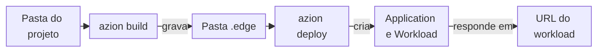

import FrameBox from '@aziontech/webkit/frame-box'
import ItemList from '@aziontech/webkit/item-list'
import DocItem from '@aziontech/webkit/doc-item'

Uma ferramenta de linha de comando de uma plataforma de hospedagem faz dois trabalhos a partir do seu shell. Ela transforma uma pasta de código em um deployment em execução e altera os recursos da sua conta, um de cada vez. Os dois trabalhos chegam à plataforma pela API dela, autorizados por um token que a ferramenta salva na sua máquina.

A Azion CLI é um binário Go open source, `azion`, que faz os dois trabalhos para a Azion Platform. Ela configura projetos a partir de presets e os executa localmente com `azion dev`. Ela faz o build e o deploy deles com `azion build` e `azion deploy`, e gerencia os recursos da plataforma com `azion <verb> <noun>`. As flags de cada comando estão na página dele, e as opções que todo comando aceita estão em [Opções globais](/pt-br/documentacao/devtools/cli/globals/).

As seções cobrem as duas famílias de comandos, o caminho de um projeto até um deployment, os presets e o bundler, os arquivos do projeto e as contas, os perfis e os tokens.

---

## Comandos e nouns

A Azion CLI tem duas famílias de comandos, e elas diferem no objeto sobre o qual atuam. Os comandos de projeto atuam sobre o projeto do diretório atual: `init`, `link`, `dev`, `build`, `deploy`, `sync`, `unlink`, `rollback` e `config`. `azion clone application` pertence a esse grupo e copia uma aplicação existente, com as regras, sob um novo nome. Os comandos de recursos atuam sobre um recurso da plataforma de cada vez, com a forma `azion <verb> <noun>`, como `azion list application` ou `azion delete workload`.

Um comando de projeto lê as configurações do projeto da pasta em que você o executa. Por isso, você precisa executar `azion dev`, `azion build` e `azion deploy` dentro da pasta do projeto. Por exemplo, `azion build` lê a pasta `azion` do diretório atual, então ele precisa ser executado na pasta que contém `azion/azion.json`. Executar `azion` sem comando inicia o mesmo fluxo que `azion init`.

Um comando de recurso chama a Azion API para um recurso e não precisa de uma pasta de projeto. Os verbos são `create`, `list`, `describe`, `update` e `delete`, e cada noun aceita os verbos que o seu recurso suporta. Um comando de recurso pergunta qualquer valor de que precisa e que você não passou em uma flag, como um nome ou um ID.

As duas famílias podem chegar ao mesmo recurso. Um deploy cria uma aplicação e um workload, e `azion describe application` então lê essa aplicação pelo ID dela. Para os nouns e os verbos que cada um recebe, consulte [Comandos de recursos](/pt-br/documentacao/devtools/cli/recursos/).

---

## De um projeto a um deployment

Um deployment começa como uma pasta de arquivos-fonte e termina como um workload que responde em uma URL. A Azion CLI leva o projeto por um build, que produz um bundle, e por um deploy, que cria os recursos que servem o bundle.

Este diagrama acompanha um projeto da pasta até a URL:



1. A pasta do projeto contém os seus arquivos-fonte e as configurações do projeto que `azion init` ou `azion link` gravaram: uma pasta `azion` e um arquivo `azion.config`.
2. `azion build` executa o build do preset do projeto por meio do Azion Bundler na sua máquina. O build grava o bundle na pasta `.edge`: um arquivo `manifest.json`, o código da function e os arquivos estáticos para o storage.
3. `azion deploy` envia o projeto para a Azion. Por padrão, a CLI envia os arquivos-fonte, o build é executado na Azion e o comando imprime um link para o Azion Console, onde fica o log do deploy. Com `--local`, a CLI faz o build na sua máquina e executa o próprio build quando o projeto não tem uma pasta `.edge`.
4. O deploy cria os recursos que servem o projeto: uma [aplicação](/pt-br/documentacao/plataforma/applications/), um [workload](/pt-br/documentacao/plataforma/workloads/) e um deployment do workload. Um site estático também recebe um bucket do [Object Storage](/pt-br/documentacao/plataforma/object-storage/), um connector que o lê, um cache setting e regras. Um projeto JavaScript recebe uma [function](/pt-br/documentacao/plataforma/functions/) e uma function instance em vez disso.
5. O deploy grava o ID de cada recurso em `azion/azion.json`. Um deploy seguinte lê esses IDs e atualiza os mesmos recursos em vez de criar novos.
6. O workload responde na sua URL, um domínio `map.azionedge.net` que o comando imprime. O primeiro deploy pode levar vários minutos para responder em todas as localidades; os deploys seguintes levam cerca de dois minutos.

Os arquivos estáticos de um site vão para o bucket do Object Storage sob um prefixo de storage. Cada deploy grava um novo prefixo no arquivo `azion.config`, envia os arquivos sob ele e atualiza o connector. Os arquivos dos deploys anteriores continuam no bucket, sob os seus próprios prefixos. A CLI gerencia as credenciais de storage que usa para o envio e as guarda em `~/.azion/<profile>/credentials.toml`, então o envio não precisa de nenhuma credencial sua.

As duas rotas de build têm custos diferentes. Um build remoto não precisa de ferramentas de build na sua máquina, mas o log dele fica no Azion Console, não no seu terminal. Um build local é executado no seu próprio ambiente e imprime cada etapa do build, então a falta de uma ferramenta faz o build falhar na sua máquina antes que qualquer arquivo seja enviado. Para as flags de cada rota, consulte [Azion CLI deploy](/pt-br/documentacao/devtools/cli/deploy/).

---

## Presets e o bundler

Um preset é o conjunto de configurações padrão de build para um framework ou uma linguagem, como `html`, `javascript`, `next` ou `vue`. Cada preset fornece configurações padrão, e você pode substituir qualquer uma delas no arquivo `azion.config` do projeto. Por exemplo, o preset `html` faz o build com o handler embutido desse preset e serve os arquivos da pasta `./www`.

O build em si é executado no Azion Bundler, um adaptador de frameworks open source em [github.com/aziontech/bundler](https://github.com/aziontech/bundler). O Azion Bundler e a Azion CLI, juntos, fazem as adaptações de que um framework precisa para ser executado na Azion Platform. `azion build` chama o bundler com o preset do projeto, e o bundler grava a pasta `.edge` e o manifest que o deploy lê.

A lista de presets depende do comando que a mostra. `azion init` oferece templates por preset, como *Hello World* para *Javascript*, em um seletor que inclui *AI Studio* e *Hono*, mas nenhuma entrada `html` ou `nitro`. `azion list presets` e `azion link` mostram uma lista diferente, que inclui `html` e `nitro`. Por isso, um site HTML simples é configurado com `azion link --preset html`.

Os padrões de um preset têm um custo quando o seu projeto não os segue. Com `azion link --preset html`, os arquivos na raiz do projeto não são enviados, porque o preset serve somente `./www`. Para os nomes que `azion link` e `azion build` aceitam, consulte [Azion CLI presets](/pt-br/documentacao/devtools/cli/recursos/presets/).

---

## Arquivos do projeto

A Azion CLI guarda o estado de um projeto em arquivos dentro da pasta do projeto. Esses arquivos decidem o que um build produz e quais recursos um deploy atualiza.

- `azion/azion.json` registra o projeto: o nome, o preset, o bucket, o prefixo de storage e o ID de cada recurso que o deploy criou. `azion init` e `azion link` gravam o arquivo, e `azion deploy` preenche os IDs. Um arquivo `azion/args.json` aparece depois do primeiro deploy.
- `azion.config.cjs` ou `azion.config.mjs` é a configuração dos recursos do projeto, escrita em JavaScript, e a fonte da verdade deles. `azion init` e `azion link` gravam o arquivo a partir do preset, e a extensão depende do template: `azion link --preset html` grava `azion.config.cjs`. `azion sync --iac` grava `azion.config.mjs`, e, quando um projeto tem os dois arquivos, o deploy atualiza o arquivo `.mjs`.
- `.edge/` contém a saída do build: `manifest.json`, o código da function em `functions` e os arquivos estáticos em `storage`. A CLI adiciona `.edge/` ao arquivo `.gitignore` do projeto.
- `.edge/.env` contém as variáveis de ambiente do projeto, e `azion deploy` e `azion sync` o leem ali por padrão. As variáveis cujos nomes contêm `password`, `pwd`, `secret`, `key`, `hash`, `encrypted`, `passcode`, `auth` ou `token` são enviadas para a Azion como secrets.

A Azion CLI detecta sozinha o arquivo `azion.config` na pasta do projeto. Se você excluir o arquivo, o próximo build recria a configuração padrão do preset. O arquivo gerado sugere `defineConfig` de `@aziontech/config`, que verifica a configuração, informa erros claros e oferece verificação de tipos em TypeScript.

O arquivo de configuração também seleciona as ferramentas de build. `build.bundler` escolhe `esbuild` ou `webpack`, e `build.extend` se conecta à configuração do bundler. Um preset personalizado é um objeto do tipo `AzionBuildPreset`. Ele tem o seu próprio `config`, um `handler` opcional, as funções `prebuild` e `postbuild`, que são executadas antes e depois do build, e um `metadata` que dá nome ao preset. Você o passa como `build.preset` em `defineConfig`. Para todas as chaves que o arquivo aceita, consulte [azion.config.js](/pt-br/documentacao/devtools/cli/azion-config-js/).

Guardar o estado em arquivos tem um custo: os IDs em `azion/azion.json` são o que liga a pasta aos seus recursos. Por exemplo, `azion delete application --cascade` exclui os recursos listados no `azion/azion.json` do diretório atual. Para gravar de volta nos arquivos do projeto os recursos que estão na Azion, consulte [Azion CLI sync](/pt-br/documentacao/devtools/cli/sync/).

---

## Contas, perfis e tokens

Todo comando que chama a Azion API autoriza a chamada com um personal token salvo na sua máquina. `azion login` salva o token para você, e você o executa antes de qualquer outro comando. A opção global `-t` salva um token que você já tem. A CLI imprime onde salvou o token, e todos os comandos seguintes o usam:

```text
Token saved in ~/.azion/default/settings.toml
This token will be used by default with all commands
```

A CLI guarda a sua configuração em `~/.azion`, com uma pasta por perfil. Um perfil é um conjunto separado de configurações com o seu próprio token, então uma máquina pode guardar várias contas ou vários tokens. `~/.azion/<profile>/settings.toml` contém as configurações do perfil, e `~/.azion/profiles.json` indica o perfil ativo. `azion profiles` escolhe o perfil ativo. Cada pasta de perfil também contém as credenciais de storage que um deploy usa.

Depois de `azion reset`, o arquivo de configurações contém cada chave com o seu valor de reset:

```text
Token = ''
UUID = ''
LastCheck = 0001-01-01T00:00:00Z
LastVulcanVersion = ''
AuthorizeMetricsCollection = 0
ClientId = ''
Email = ''
ContinuationToken = ''
S3AccessKey = ''
S3SecretKey = ''
S3Bucket = ''
```

`Token` é o personal token, e `UUID` é o UUID desse token. `ClientId` e `Email` identificam a conta. Com `AuthorizeMetricsCollection` em `0`, o próximo comando pergunta primeiro se você concorda em compartilhar dados de uso anônimos.

Um perfil vale até você trocá-lo; a opção global `-c` altera a configuração somente para um comando. `-c` recebe o caminho de um arquivo `.toml` e usa a pasta que contém esse caminho como raiz da configuração. O arquivo não precisa existir, e um caminho de pasta é recusado. Por exemplo, `-c ~/work/.azion/settings.toml` lê os perfis em `~/work/.azion` para esse único comando.

A CLI também detecta qual versão da Azion API a sua conta usa, sem nenhuma configuração sua. As contas criadas depois de 1º de janeiro de 2026 usam a API v4, e as contas mais antigas podem usar a API v3. Para verificar qual conta a CLI usa, execute `azion whoami`:

```text
 Client ID: 1234u
 Email: you@example.com
 Active Profile: default
```

Para os métodos de login, consulte [Azion CLI login](/pt-br/documentacao/devtools/cli/login/). Para trocar de perfil, consulte [Azion CLI profiles](/pt-br/documentacao/devtools/cli/profiles/).

---

## Recursos relacionados

<FrameBox>
<ItemList>
  <DocItem title="Primeiros passos com a Azion CLI" href="/pt-br/documentacao/devtools/cli/primeiros-passos/">Configure um projeto e faça o deploy dele, o caminho que esta página explica.</DocItem>
  <DocItem title="Opções globais" href="/pt-br/documentacao/devtools/cli/globals/">As opções que todo comando aceita, como `-c`, `-t` e `-y`.</DocItem>
  <DocItem title="azion.config.js" href="/pt-br/documentacao/devtools/cli/azion-config-js/">Todas as chaves do arquivo de configuração que um build e um deploy leem.</DocItem>
  <DocItem title="Comandos de recursos" href="/pt-br/documentacao/devtools/cli/recursos/">Os nouns e os verbos que gerenciam um recurso da plataforma de cada vez.</DocItem>
</ItemList>
</FrameBox>
