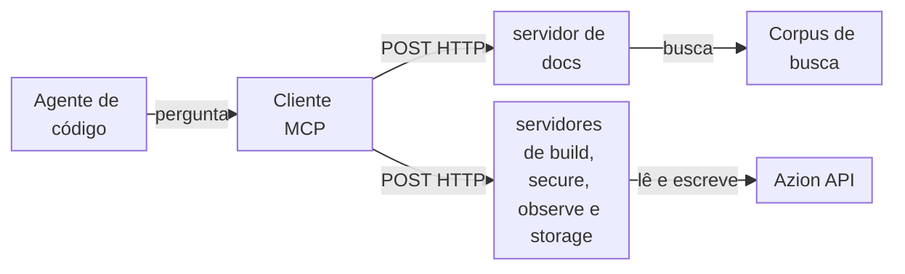

import FrameBox from '@aziontech/webkit/frame-box'
import ItemList from '@aziontech/webkit/item-list'
import DocItem from '@aziontech/webkit/doc-item'

Um agente de código responde a perguntas sobre uma plataforma com mais confiabilidade quando pode consultar fatos em vez de lembrá-los, e altera a plataforma com mais segurança quando age por uma API em vez de por suposições. O Model Context Protocol (MCP) é uma especificação aberta para as duas coisas. Ele usa JSON-RPC para padronizar como uma aplicação lista e chama as ferramentas de um servidor, lê os recursos dele e busca os prompts dele. O cliente MCP do agente envia cada requisição ao servidor, e o agente lê a resposta como contexto.

Os [MCP servers da Azion](/pt-br/documentacao/devtools/mcp/) são cinco MCP servers hospedados, um por área da plataforma: docs, build, secure, observe e storage, cada um em `https://<area>-mcp.azion.com/mcp`. Cada servidor autentica cada requisição com seu [personal token](/pt-br/documentacao/fundamentos/personal-tokens/) da Azion. O servidor de docs responde com texto extraído da documentação da Azion, de exemplos de código e das referências da CLI, da API e do Terraform provider. Os outros quatro servidores leem e alteram os recursos da sua conta pela Azion API. Para conectar um agente, consulte [Primeiros passos com o MCP server](/pt-br/documentacao/devtools/mcp/primeiros-passos/). Para os termos, consulte o [Glossário](/pt-br/documentacao/devtools/mcp/glossario/).

As seções cobrem o caminho da requisição, a conexão e o transporte dela, a autenticação, as ferramentas e os recursos e a execução das ferramentas.

---

## O caminho da requisição

Os MCP servers da Azion seguem o modelo cliente-servidor do protocolo. O seu agente decide quando precisa de um fato ou de uma ação, o cliente MCP dele transforma essa decisão em uma requisição JSON-RPC para o servidor responsável pela área, e o servidor faz o trabalho e retorna texto.

Este diagrama acompanha uma chamada de ferramenta do agente até os sistemas que os servidores alcançam:



1. Você faz uma pergunta ou dá uma tarefa ao agente em linguagem natural, e o agente decide que uma ferramenta pode atendê-la.
2. O cliente MCP se conecta por HTTP à URL do servidor responsável pela ferramenta, como `https://docs-mcp.azion.com/mcp`, e envia seu personal token no header `Authorization` da requisição.
3. O servidor valida o token.
4. O cliente lista as ferramentas e os recursos e, em seguida, chama uma ferramenta pelo nome com argumentos JSON.
5. O servidor executa a ferramenta. Uma ferramenta do servidor de docs busca em um corpus de documentos ou retorna texto de guia. Uma ferramenta dos outros quatro servidores envia uma requisição para a Azion API com o seu token ou, com `dry_run`, retorna essa requisição sem enviá-la.
6. O servidor retorna o resultado como texto, e o agente usa esse texto para responder a você.

Para executar um MCP server seu na Azion, consulte [Execute um MCP server na Azion](/pt-br/documentacao/guias/desenvolvimento-de-aplicacoes/automacao/executar-mcp-server/).

---

## Conexão e transporte

Um transporte é a forma como as mensagens MCP trafegam entre um cliente e um servidor. Os MCP servers da Azion usam streamable HTTP: o cliente envia cada mensagem como um `POST` HTTP para o caminho `/mcp` do servidor, com os headers `Authorization: Token [TOKEN VALUE]`, `Content-Type: application/json` e `Accept: application/json, text/event-stream`.

A primeira requisição de uma conexão é `initialize`. Um cliente a envia como um `POST` para a URL do servidor, como `https://docs-mcp.azion.com/mcp`, com este corpo:

```json
{
  "jsonrpc": "2.0",
  "method": "initialize",
  "id": 1,
  "params": {
    "protocolVersion": "2025-03-26",
    "capabilities": {},
    "clientInfo": {
      "name": "my-client",
      "version": "0.1"
    }
  }
}
```

O servidor responde com a versão do protocolo e as capacidades dele, e o cliente então envia `notifications/initialized`. Cada requisição seguinte, como `tools/list` ou `tools/call`, é um `POST` que leva o próprio header `Authorization`.

Os servidores aceitam apenas TLS 1.3. Um cliente criado com uma biblioteca TLS mais antiga falha no handshake antes que a requisição chegue ao servidor.

Alguns clientes iniciam todo MCP server como um processo local e falam com ele pela entrada e saída padrão em vez de HTTP. Esses clientes chegam aos MCP servers da Azion pelo `mcp-remote`, um pacote que o `npx` baixa e executa como uma ponte local para a URL do servidor. O Claude Desktop e o Windsurf o usam. Para as configurações deles, consulte [Configuração de agentes](/pt-br/documentacao/agent-setup/).

---

## Autenticação

Cada MCP server da Azion autentica cada requisição de forma independente, a partir do header `Authorization`. O header leva um personal token no esquema `Token`: `Authorization: Token [TOKEN VALUE]`. Um personal token é `azion` seguido de 35 letras e dígitos, 40 caracteres no total.

Uma requisição que falha na autenticação recebe um objeto de erro JSON-RPC com o código `-32001`. Uma requisição sem header `Authorization` recebe HTTP `401` e este corpo:

```json
{
  "jsonrpc": "2.0",
  "error": {
    "code": -32001,
    "message": "No authentication provided"
  },
  "id": null
}
```

Um valor `Token` que não é um personal token válido recebe HTTP `403` com a mensagem `Authentication failed`. Um personal token enviado com o esquema `Bearer` recebe HTTP `401` com a mensagem `OAuth validation failed`. Os servidores verificam a autenticação antes de rotear a requisição, então uma requisição para o caminho errado também recebe um desses erros quando o header falha. O que fazer em cada caso está em [Solucionar problemas do MCP server](/pt-br/documentacao/devtools/mcp/solucao-de-problemas/).

---

## Ferramentas e recursos

O protocolo define três tipos de capacidade que um servidor pode expor: ferramentas, que um cliente chama para obter uma resposta ou executar uma ação; recursos, que um cliente lê como arquivos; e prompts, que são templates de mensagem. Todo MCP server da Azion expõe ferramentas, e o servidor de docs também expõe recursos.

Uma ferramenta é uma função que o servidor executa quando solicitado. A resposta de `tools/list` descreve cada ferramenta com um `name`, uma `description` que o agente lê para decidir quando chamá-la e um `inputSchema` escrito em JSON Schema. Em seguida, o agente envia `tools/call` com o nome da ferramenta e argumentos que seguem o schema. Por exemplo, uma chamada a `search_azion_docs_and_site` leva uma `query` como `how to configure cache`.

Um recurso é um documento que o cliente lê pela URI com `resources/read`, sem chamar uma ferramenta. As URIs do servidor de docs têm a forma `azion://<category>/<resource>/<item>`, como em `azion://guides/deploy/step-0-preparation`, com o tipo `text/markdown`. O servidor gera o texto de um guia quando o cliente o lê, então o texto traz a data da requisição.

Os guias de site estático podem ser acessados por dois caminhos. Um cliente que suporta recursos os lista e os lê diretamente; um cliente que não suporta pode chamar `deploy_azion_static_site` para obter o mesmo texto. Para as ferramentas de cada servidor e cada URI de recurso, consulte [Ferramentas e recursos](/pt-br/documentacao/devtools/mcp/ferramentas/).

---

## Execução das ferramentas

As ferramentas dos MCP servers da Azion diferem no que fazem com uma requisição, e a diferença decide quanto tempo uma chamada leva, quanto confiar na resposta dela e se ela altera a sua conta.

- As ferramentas de busca do servidor de docs, cujos nomes começam com `search_azion_`, executam a sua `query` em um corpus de documentos e retornam os resultados mais próximos como um objeto JSON com um array `results`. Cada documento traz `title`, `content` e `source`, com `similarity`, `search_type` e `relevance_score` da correspondência.
- `deploy_azion_static_site`, no servidor de docs, retorna texto de guia.
- As ferramentas de listagem e de consulta dos servidores de build, secure, observe e storage leem recursos pela Azion API, com o seu token.
- As ferramentas de criação, atualização, patch, exclusão, clonagem, reordenação e purge desses servidores alteram a sua conta pela Azion API, com o seu token. Com `dry_run` definido como `true`, uma ferramenta de escrita retorna o método, a URL, os headers e o corpo da requisição em vez de enviá-la. Os headers incluem o seu personal token, então remova-o antes de compartilhar uma prévia.
- `create_graphql_query`, no servidor de observe, pede a um modelo de linguagem que escreva uma query para o seu objetivo, executa-a no endpoint selecionado da [GraphQL API](/pt-br/documentacao/devtools/graphql/) da sua conta, com o seu token, e a corrige por introspecção GraphQL em até seis tentativas.

As ferramentas de busca classificam os documentos pela proximidade com as palavras da query, não pelo significado dela. Uma query ampla pode colocar em primeiro lugar um documento sobre outro produto ou outra operação, então leia o `title` de cada resultado antes de agir com base nele.

Uma chamada a `create_graphql_query` demora mais que uma busca, porque gera e executa cada query na sua conta. A resposta dela não é garantida. Quando nenhuma tentativa produz uma query válida, a ferramenta retorna um texto alternativo que diz que a informação não pôde ser obtida e aponta para a documentação da GraphQL API. A falha chega como texto dentro de um resultado bem-sucedido, então o texto, e não o status, diz ao agente se a chamada funcionou.

Uma ferramenta de escrita age com as permissões do personal token. Limite o escopo do token aos recursos de que o agente precisa, e peça ao agente uma prévia `dry_run` antes de toda escrita que você ainda não revisou.

---

## Recursos relacionados

<FrameBox>
<ItemList>
  <DocItem title="Ferramentas e recursos" href="/pt-br/documentacao/devtools/mcp/ferramentas/">As ferramentas de cada servidor com as entradas delas, e cada URI de recurso que o servidor de docs oferece.</DocItem>
  <DocItem title="Primeiros passos com o MCP server" href="/pt-br/documentacao/devtools/mcp/primeiros-passos/">Conecte um agente de código a um servidor com um personal token e faça uma primeira chamada.</DocItem>
  <DocItem title="Solucionar problemas do MCP server" href="/pt-br/documentacao/devtools/mcp/solucao-de-problemas/">Corrija um token recusado, uma ferramenta ausente ou um cliente que não consegue se conectar.</DocItem>
  <DocItem title="Execute um MCP server na Azion" href="/pt-br/documentacao/guias/desenvolvimento-de-aplicacoes/automacao/executar-mcp-server/">Crie e faça o deploy de um servidor seu como uma function na Azion.</DocItem>
</ItemList>
</FrameBox>
