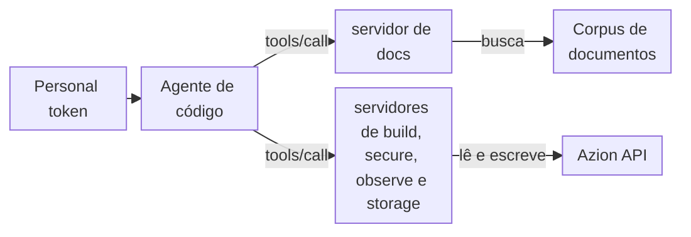

import DocButton from '~/components/webkit/DocButton.vue'
import DocCardGroup from '@aziontech/webkit/doc-card-group'
import DocCard from '@aziontech/webkit/doc-card'

Um MCP server dá a um agente de código ferramentas que ele pode chamar para consultar fatos, em vez de lembrá-los do treinamento, e para agir em um sistema em seu nome. O [Model Context Protocol](https://modelcontextprotocol.io) (MCP) é um padrão aberto, desenvolvido pela Anthropic, que usa JSON-RPC para definir como um agente lista as ferramentas de um servidor, chama essas ferramentas e lê os recursos do servidor. O agente consulta o servidor quando uma pergunta precisa de um fato ou uma tarefa precisa de uma ação, e lê a resposta como contexto, para que você não tenha que colar documentação na conversa.

Os **MCP servers da Azion** são cinco MCP servers hospedados, um por área da Azion Platform, cada um na sua própria URL. Eles autenticam cada requisição com seu [personal token](/pt-br/documentacao/fundamentos/personal-tokens/) da Azion. O servidor de docs responde a perguntas com a documentação da Azion, exemplos de código e as referências da [Azion CLI](/pt-br/documentacao/devtools/cli/), da [Azion API](/pt-br/documentacao/devtools/api/) e do [Azion Terraform Provider](/pt-br/documentacao/devtools/terraform/). Os servidores de build, secure, observe e storage leem e alteram os recursos da sua conta pela Azion API. Use os MCP servers da Azion para encontrar um comando da CLI ou uma operação da API, obter um exemplo de código, criar uma regra do [Rules Engine](/pt-br/documentacao/plataforma/applications/rules-engine/), fazer purge de cache ou escrever uma query GraphQL para as métricas da sua conta.

| Servidor | URL | O que cobre |
| --- | --- | --- |
| docs | `https://docs-mcp.azion.com/mcp` | Busca na documentação, nos exemplos de código e nas referências da CLI, da API e do Terraform; guias de deploy de site estático e de teste de cache |
| build | `https://build-mcp.azion.com/mcp` | Aplicações, cache settings, connectors, functions, regras, workloads, deployments e purge de cache |
| secure | `https://secure-mcp.azion.com/mcp` | Firewalls, WAF, DNS, certificados, network lists, custom pages, políticas da conta e autenticação |
| observe | `https://observe-mcp.azion.com/mcp` | Data streams, dashboards, relatórios, fontes de dados, queries GraphQL e faturas |
| storage | `https://storage-mcp.azion.com/mcp` | Buckets, objetos e credenciais do Object Storage; bancos e queries do SQL Database |

<DocButton href="/pt-br/documentacao/devtools/mcp/configuracao/" label="Primeiros passos" size="medium" />
<DocButton href="/pt-br/documentacao/devtools/mcp/ferramentas/" label="Veja as ferramentas" kind="secondary" size="medium" />

---

## Chamada de ferramenta

Um agente de código chega a uma ferramenta com uma requisição JSON-RPC `tools/call`. A requisição abaixo pede a `search_azion_docs_and_site`, no servidor de docs, dois documentos sobre cache. É um `POST` para `https://docs-mcp.azion.com/mcp` com os headers `Authorization: Token [TOKEN VALUE]`, `Content-Type: application/json` e `Accept: application/json, text/event-stream`, e este corpo:

```json
{
  "jsonrpc": "2.0",
  "method": "tools/call",
  "id": 1,
  "params": {
    "name": "search_azion_docs_and_site",
    "arguments": {
      "query": "how to configure cache",
      "docsAmount": 2
    }
  }
}
```

O resultado traz um item `text`, cortado abaixo em `…`; o valor completo contém os dois documentos que `docsAmount` pede:

```json
{
  "result": {
    "content": [
      {
        "type": "text",
        "text": "{\"results\":[{\"title\":\"application-acceleration\",\"content\":\"Title: application-acceleration\\nDescription: Application Accelerator speeds up web applications and APIs through protocol optimizations and manages dynamic content requirements.…"
      }
    ]
  },
  "jsonrpc": "2.0",
  "id": 1
}
```

- `params.name` seleciona a ferramenta, e `params.arguments` leva as entradas dela: a `query` e `docsAmount`, o número de documentos.
- `result.content` contém um item do tipo `text`. Para uma ferramenta de busca, esse texto é um objeto JSON cujo array `results` contém os documentos, cada um com `title`, `content` e `source`, e `similarity`, `search_type` e `relevance_score` da correspondência.
- O header `Authorization` acompanha cada requisição.

Se você conhece JSON-RPC 2.0, você conhece o formato das mensagens. Raramente você escreve essas requisições à mão: o cliente MCP do seu agente as escreve quando você pede em linguagem natural, como com um destes prompts:

- `Configure Rules Engine to cache static assets for 1 year and API responses for 5 minutes.`
- `Optimize my site's Core Web Vitals scores`

---

## Caminho da requisição

O servidor de docs apenas lê. Os servidores de build, secure, observe e storage podem criar, alterar e excluir recursos, dentro do que o seu personal token permite. Cada ferramenta de escrita deles recebe `dry_run`, que retorna a requisição da API sem enviá-la.



1. Você adiciona cada servidor de que precisa à configuração do seu agente de código, com seu personal token no header `Authorization`.
2. Quando uma pergunta precisa de um fato ou uma tarefa precisa de uma ação, o cliente MCP do agente envia uma requisição JSON-RPC para a URL do servidor responsável, como um `POST` HTTP.
3. O servidor verifica o token.
4. Uma ferramenta de busca do servidor de docs executa a `query` em um corpus de documentos da Azion.
5. Uma ferramenta dos outros quatro servidores envia uma requisição para a Azion API com o seu token. Uma ferramenta de escrita chamada com `dry_run` retorna essa requisição em vez de enviá-la. `create_graphql_query`, no servidor de observe, pede a um modelo de linguagem que escreva uma query a partir do objetivo que você informa, e a executa na [GraphQL API](/pt-br/documentacao/devtools/graphql/) da sua conta.
6. O servidor retorna o resultado como texto, e o agente o usa para responder a você.

Para o transporte e os esquemas de autenticação, consulte [Como o MCP server funciona](/pt-br/documentacao/devtools/mcp/como-funciona/).

---

## O que os servidores cobrem

Os MCP servers da Azion respondem a perguntas e agem na sua conta. Estas são as ferramentas, os limites e as formas de acessá-los:

- **Ferramentas**: o servidor de docs expõe sete ferramentas. Seis buscam na documentação e no site da Azion, nos exemplos de código, nos comandos da Azion CLI, nas referências v4 e v3 da Azion API e na documentação do Azion Terraform Provider, e `deploy_azion_static_site` retorna guias para fazer o deploy de um site estático e testar o cache dele. Os outros quatro servidores expõem ferramentas para listar, ler, criar, alterar e excluir os recursos da área deles. [Ferramentas e recursos](/pt-br/documentacao/devtools/mcp/ferramentas/) lista as ferramentas por servidor.
- **Recursos**: o servidor de docs oferece sete recursos em Markdown em `azion://guides/deploy/` e `azion://guides/test-cache/`, os mesmos guias que `deploy_azion_static_site` retorna.
- **Escritas**: as ferramentas de build, secure, observe e storage alteram a sua conta pela Azion API, com o seu token. Peça ao agente que chame uma ferramenta de escrita com `dry_run` antes e revise a requisição que ela retorna. A prévia mostra o seu token no header `Authorization`, então remova-o antes de compartilhar uma prévia. O servidor de docs não faz deploy: os guias de site estático indicam os comandos da Azion CLI que você ou o seu agente executam.
- **Respostas**: a classificação da busca é imprecisa, então o primeiro resultado pode não tratar do assunto. Cada documento da busca traz o `source`, a página com que conferi-lo. `create_graphql_query` informa uma falha como texto dentro de um resultado bem-sucedido.
- **Credencial**: cada requisição leva um personal token como `Authorization: Token [TOKEN VALUE]`. Um valor `Bearer` é lido como um access token OAuth, não como um personal token. Uma requisição sem o header recebe `401` com a mensagem `No authentication provided`. Você cria o token no [Azion Console](https://console.azion.com/).
- **Conexão**: cada servidor usa o transporte streamable HTTP no caminho `/mcp` do host dele e aceita apenas TLS 1.3.
- **Clientes**: [Configuração de agentes](/pt-br/documentacao/agent-setup/) conecta Claude Code, Cursor, GitHub Copilot, Windsurf, Codex, Gemini CLI e OpenCode. [Primeiros passos com o MCP server](/pt-br/documentacao/devtools/mcp/configuracao/) conecta o Claude Code com um comando e mostra a configuração para o Kiro e para o Claude Desktop e o Warp, que acessam os servidores pela ponte `mcp-remote`.
- **Seu próprio servidor**: para criar e fazer o deploy de um MCP server seu como uma [function](/pt-br/documentacao/plataforma/functions/) da Azion, consulte [Execute um MCP server na Azion](/pt-br/documentacao/guias/desenvolvimento-de-aplicacoes/automacao/executar-mcp-server/).
- **Ajuda**: [Solucionar problemas do MCP server](/pt-br/documentacao/devtools/mcp/solucao-de-problemas/) lista cada erro com a causa e a correção, [Teste o comportamento do cache com o MCP server](/pt-br/documentacao/guias/performance-e-confiabilidade/cache-e-purge/testar-cache-com-mcp/) usa os guias de cache em um site com deploy feito e o [Glossário](/pt-br/documentacao/devtools/mcp/glossario/) define os termos dos servidores.

---

## Próximos passos

<DocCardGroup cols={2}>
  <DocCard title="Primeiros passos com o MCP server" href="/pt-br/documentacao/devtools/mcp/configuracao/" label="Conecte o Claude Code ao servidor de docs e faça sua primeira pergunta." />
  <DocCard title="Como o MCP server funciona" href="/pt-br/documentacao/devtools/mcp/como-funciona/" label="Acompanhe uma chamada de ferramenta do seu agente até a resposta, passando pela autenticação." />
  <DocCard title="Ferramentas e recursos" href="/pt-br/documentacao/devtools/mcp/ferramentas/" label="Consulte as ferramentas de cada servidor, as entradas que eles compartilham e cada URI de recurso." />
  <DocCard title="Guias e tutoriais do MCP server" href="/pt-br/documentacao/devtools/mcp/guias/" label="Crie regras, faça o deploy de um site estático, execute o seu próprio MCP server na Azion ou teste o comportamento do cache." />
</DocCardGroup>
