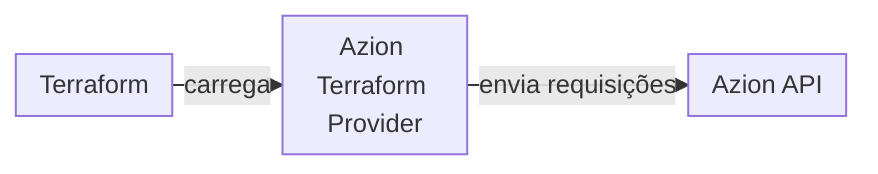

import FrameBox from '@aziontech/webkit/frame-box'
import ItemList from '@aziontech/webkit/item-list'
import DocItem from '@aziontech/webkit/doc-item'

Uma ferramenta de infraestrutura como código mantém a descrição da sua infraestrutura em arquivos que você pode reutilizar, versionar e compartilhar. O Terraform é uma ferramenta desse tipo e não chama nenhuma plataforma por conta própria. Ele funciona por meio de providers: plugins, cada um responsável pelo ciclo de vida de tipos específicos de recursos. Um provider é um arquivo executável separado que o Terraform carrega em tempo de execução.

O [Azion Terraform Provider](https://github.com/aziontech/terraform-provider-azion) é o provider open source da Azion Platform, publicado no [Terraform Registry](https://registry.terraform.io/providers/aziontech/azion/latest/docs) com a source `aziontech/azion`. Com ele, você gerencia os recursos da sua conta localmente, como código. A versão 2.0 do provider funciona apenas com a [Azion API](/pt-br/documentacao/devtools/api/) v4. Para contas na API v3, consulte [Azion Terraform Provider v1.x (API v3)](/pt-br/documentacao/devtools/terraform/terraform-provider-v3/).

As seções cobrem a cadeia do Terraform até a API, o state, o ciclo de plan e apply e os nomes de recursos e data sources.

---

## Do Terraform à Azion API

Uma alteração que você escreve em uma configuração do Terraform passa por três camadas antes de chegar à sua conta. Cada camada se comunica apenas com a seguinte.

Este diagrama acompanha uma alteração do Terraform até a API:



1. O Terraform lê os seus arquivos `.tf` e determina quais alterações fazer. Ele entrega cada alteração ao Azion Terraform Provider, que a configuração declara no bloco `required_providers`.
2. O provider envia as requisições à Azion API, que cria, atualiza, exclui ou lê os recursos da sua conta.

Uma configuração declara o provider com a source do Registry e uma versão fixada. O provider lê o seu [personal token](/pt-br/documentacao/fundamentos/personal-tokens/) da variável de ambiente `AZION_API_TOKEN` ou do argumento `api_token`:

```hcl
terraform {
  required_providers {
    azion = {
      source  = "aziontech/azion"
      version = "2.0.0"
    }
  }
}

provider "azion" {
  # Recommended: use AZION_API_TOKEN environment variable
  # api_token = var.api_token
}
```

Como toda chamada passa pela API, o provider acompanha a versão da API que ele usa. A versão 2.0 moveu o provider da API v3 para a API v4, e alguns recursos foram removidos ou renomeados no caminho. Por exemplo, uma configuração que ainda declara `azion_domain` falha, porque a versão 2.0 o substitui por `azion_workload` e `azion_workload_deployment`. Para todos os recursos removidos e renomeados, consulte [Migre do provider v1.x para o v2.0](/pt-br/documentacao/devtools/terraform/migration-v3-to-v4/).

---

## State

O Terraform registra os objetos que gerencia em um state. Cada entrada liga um endereço de recurso da sua configuração, como `azion_workload.my_workload`, ao objeto que existe na sua conta. Com state local, o Terraform mantém o state no arquivo `terraform.tfstate` da pasta do projeto, com uma cópia de backup em `terraform.tfstate.backup`.

O Terraform lê e altera o state com os próprios comandos:

- `terraform state list` lista todos os recursos do state.
- `terraform state show` exibe um recurso, como `terraform state show azion_workload.my_workload`.
- `terraform state pull` baixa um state remoto como uma cópia local.
- `terraform state rm` remove um recurso do state.
- `terraform import` adiciona um objeto existente ao state, na forma `terraform import <type>.<name> <id>`.

Por exemplo, a migração para a versão 2.0 remove do state recursos retirados, como `azion_domain.example`, com `terraform state rm`. Depois, ela coloca os objetos existentes sob os tipos de recurso da v2.0 com `terraform import azion_workload.example <workload_id>`.

Um arquivo de state local atende uma pessoa em uma máquina, e esse é o custo dele. As [boas práticas do Terraform Provider](/pt-br/documentacao/devtools/terraform/best-practices/) guardam o state em um backend remoto com locking, para que execuções simultâneas não entrem em conflito. Elas também mantêm os arquivos `*.tfstate` fora do controle de versão, junto com os outros arquivos que contêm segredos.

---

## Plan e apply

O Terraform altera a sua conta em um ciclo de três comandos, cada um com a sua função:

- `terraform init` instala o provider que a configuração declara, obtido da source `aziontech/azion` do Terraform Registry.
- `terraform plan` mostra as alterações que `terraform apply` faria, sem fazê-las.
- `terraform apply` faz as alterações por meio do provider, depois que você digita `yes` na pergunta dele.

O Terraform lê a ordem das alterações na própria configuração. Uma referência a outro recurso, como `azion_workload.example.id`, faz um recurso depender do outro, então o Terraform cria o workload antes do deployment que usa o ID dele:

```hcl
resource "azion_workload" "example" {
  name = "my-workload"
}

resource "azion_workload_deployment" "example" {
  workload_id = azion_workload.example.id

  # Deployment configuration
}
```

O argumento `depends_on`, em vez disso, declara uma dependência pelo nome. Um ID fixo no código, como `application_id = "12345"`, não carrega nenhuma dependência, então referências são a escolha mais segura.

Separar o plan do apply custa um passo a mais e garante uma revisão antes de qualquer alteração. Por exemplo, um pipeline pode executar `terraform plan` em toda alteração e executar `terraform apply -auto-approve` apenas na branch `main`. Para executar o ciclo pela primeira vez, consulte [Primeiros passos com o Azion Terraform Provider](/pt-br/documentacao/devtools/terraform/getting-started/).

---

## Nomes de recursos e data sources

O Azion Terraform Provider oferece dois tipos de blocos, e eles diferem em quem é dono do objeto. Um bloco `resource` cria, atualiza e exclui um objeto na Azion, então o ciclo de vida dele pertence à configuração. Um bloco `data` é um data source: ele consulta objetos que já existem e não altera nada.

Os nomes de data sources seguem um padrão. O nome no plural lista objetos, e o nome no singular consulta um objeto específico. Por exemplo, `azion_workloads` lista workloads, e `azion_workload` consulta um workload. O plural pode ficar no meio do nome: `azion_application_rules_engine` lista, e `azion_application_rule_engine` consulta um.

O nome no singular muitas vezes é um recurso e um data source ao mesmo tempo. `azion_workload` é os dois, então a palavra-chave do bloco decide se o Terraform gerencia o objeto ou apenas o lê. Uma configuração que lê todos os workloads declara `data "azion_workloads" "all" {}`.

As configurações principais da aplicação quebram o padrão. O recurso é `azion_application_main_setting`, e o data source que consulta as configurações principais é `azion_application_main_settings`, com grafia no plural. Confira cada nome na página de referência dele, como [Recursos de Applications](/pt-br/documentacao/devtools/terraform/applications/), antes de usá-lo.

Um data source permite que uma configuração use um objeto que ela não possui, como um workload que outra configuração gerencia. O custo é que o Terraform não pode alterar esse objeto. Para gerenciá-lo, importe-o para o state como um recurso.

---

## Recursos relacionados

<FrameBox>
<ItemList>
  <DocItem title="Primeiros passos com o Azion Terraform Provider" href="/pt-br/documentacao/devtools/terraform/getting-started/">Execute o ciclo de init, plan e apply na sua conta pela primeira vez.</DocItem>
  <DocItem title="Recursos e data sources" href="/pt-br/documentacao/devtools/terraform/examples/">Todos os nomes de recursos e data sources que o provider oferece, agrupados por produto.</DocItem>
  <DocItem title="Boas práticas do Terraform Provider" href="/pt-br/documentacao/devtools/terraform/best-practices/">State remoto, locking, módulos e pipelines para uma configuração que você compartilha.</DocItem>
  <DocItem title="Solucionar problemas do Terraform Provider" href="/pt-br/documentacao/devtools/terraform/solucao-de-problemas/">Correções para erros de autenticação, de versão, de state e de importação.</DocItem>
</ItemList>
</FrameBox>
