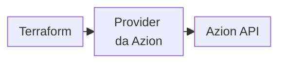

import DocButton from '~/components/webkit/DocButton.vue'
import DocCardGroup from '@aziontech/webkit/doc-card-group'
import DocCard from '@aziontech/webkit/doc-card'

Com infraestrutura como código, você descreve os recursos de uma conta em arquivos de texto em vez de criá-los um a um em uma interface web. Uma ferramenta compara esses arquivos com o que existe e faz as alterações por você. Como a descrição é um conjunto de arquivos, você pode reutilizá-la, mantê-la sob controle de versão e compartilhá-la. Um único fluxo de trabalho, então, provisiona e gerencia a infraestrutura ao longo de todo o seu ciclo de vida. O [Terraform](https://developer.hashicorp.com/terraform/docs) é uma ferramenta desse tipo.

**Azion Terraform Provider** conecta o Terraform à Azion Platform, para que seus arquivos `.tf` criem, alterem e excluam os recursos da sua conta Azion. É um provider de [código aberto](https://github.com/aziontech/terraform-provider-azion) publicado no [Terraform Registry](https://registry.terraform.io/providers/aziontech/azion/latest/docs), e a versão 2.0 funciona por meio da [Azion API](/pt-br/documentacao/devtools/api/) v4. Use o Azion Terraform Provider para gerenciar workloads, connectors, aplicações, zonas DNS, firewalls e certificados a partir da sua máquina, revisar cada alteração antes que ela chegue à conta ou aplicar a mesma configuração a partir de um pipeline de CI/CD.

:::caution[Atenção]
A versão 2.0 do provider funciona apenas com a Azion API v4. Se a sua conta usa a API v3, consulte [Azion Terraform Provider v1.x (API v3)](/pt-br/documentacao/devtools/terraform/terraform-provider-v3/).
:::

<DocButton href="/pt-br/documentacao/devtools/terraform/getting-started/" label="Comece agora" size="medium" />
<DocButton href="/pt-br/documentacao/devtools/terraform/examples/" label="Explore resources e data sources" kind="secondary" size="medium" />

---

## Configuração do provider

Um projeto Terraform para a Azion declara o provider uma vez e, em seguida, um bloco por resource. Esta configuração fixa a versão 2.0.0 do provider e declara um workload:

```hcl
terraform {
  required_providers {
    azion = {
      source  = "aziontech/azion"
      version = "2.0.0"
    }
  }
}

provider "azion" {
  # Recommended: use AZION_API_TOKEN environment variable
  # api_token = var.api_token
}

# Create a workload
resource "azion_workload" "my_workload" {
  name = "my-first-workload"
}
```

- O bloco `required_providers` indica a origem no Registry, `aziontech/azion`, e uma versão fixa do provider. O `terraform init` instala essa versão.
- O bloco `provider "azion"` configura o provider. Ele fica vazio quando o seu personal token está na variável de ambiente `AZION_API_TOKEN`; caso contrário, o argumento `api_token` passa o token.
- Cada bloco `resource` declara um objeto da sua conta. O tipo, como `azion_workload`, indica o tipo de objeto, e o rótulo, como `my_workload`, dá nome ao objeto dentro da configuração.

Os blocos seguem a linguagem padrão do Terraform, então uma configuração escrita para outro provider tem o mesmo formato. Só os tipos `azion_*` mudam.

---

## Arquitetura do provider

O Terraform não chama a Azion por conta própria. Ele entrega cada alteração ao provider, e o provider a envia à Azion API:



1. O Terraform Core, o programa por trás dos comandos `terraform`, lê seus arquivos `.tf` e determina as alterações a fazer. Ele passa cada alteração ao Azion Terraform Provider.
2. O provider envia as requisições à Azion API, que cria, atualiza, exclui ou lê os recursos da sua conta.

Como toda alteração termina como uma requisição à API, o provider segue a versão da API que ele usa. Para detalhes sobre o state, o ciclo de plan e apply e os nomes de resources, consulte [Como o Terraform Provider funciona](/pt-br/documentacao/devtools/terraform/como-funciona/).

---

## Escopo e termos

As quatro primeiras entradas definem os termos do Terraform que todas as páginas desta seção usam. As demais definem o escopo do Azion Terraform Provider:

- **Provider**: um plugin que gerencia o ciclo de vida de tipos específicos de resource. Um [provider do Terraform](https://developer.hashicorp.com/terraform/registry/providers) é um arquivo executável separado que o Terraform carrega em tempo de execução, e o `terraform init` o instala a partir da origem no Registry que a configuração indica.
- **Resource**: um bloco `resource` que cria, atualiza e exclui um objeto na Azion. A configuração controla o ciclo de vida desse objeto.
- **Data source**: um bloco `data` que consulta objetos que já existem na sua conta e não altera nada. Por exemplo, uma configuração lê, por meio de um data source, um workload que outra configuração gerencia, e o Terraform nunca modifica esse workload.
- **State**: o registro que o Terraform mantém de cada objeto que gerencia, que vincula cada endereço de resource ao objeto na sua conta. Com state local, o registro é o arquivo `terraform.tfstate` da pasta do projeto; as [Boas práticas do Terraform Provider](/pt-br/documentacao/devtools/terraform/best-practices/) mantêm o state em um backend remoto.
- **Cobertura**: o provider gerencia [workloads](/pt-br/documentacao/devtools/terraform/workloads/), [connectors](/pt-br/documentacao/devtools/terraform/connectors/), [aplicações](/pt-br/documentacao/devtools/terraform/applications/), zonas e registros do [Edge DNS](/pt-br/documentacao/devtools/terraform/dns/), recursos de [segurança](/pt-br/documentacao/devtools/terraform/security/), como firewalls e network lists, e [certificados](/pt-br/documentacao/devtools/terraform/certificates/). [Resources e data sources](/pt-br/documentacao/devtools/terraform/examples/) lista todos os nomes.
- **Requisitos**: Terraform 1.0 ou posterior e um [personal token](/pt-br/documentacao/fundamentos/personal-tokens/) da Azion com as permissões de que seus recursos precisam.
- **Versões**: a versão 2.0 do provider funciona com a Azion API v4, e a versão 1.x, com a API v3. A versão 1.x não recebe mais atualizações. Para mover uma configuração v1.x para a versão 2.0, consulte [Migre do provider v1.x para a v2.0](/pt-br/documentacao/devtools/terraform/migration-v3-to-v4/).
- **Outras interfaces**: você também pode gerenciar os mesmos recursos com a [Azion CLI](/pt-br/documentacao/devtools/cli/) ou diretamente pela Azion API.
- **Erros**: [Solucionar problemas do Terraform Provider](/pt-br/documentacao/devtools/terraform/solucao-de-problemas/) lista correções para erros de autenticação, versão, state e importação.

---

## Próximos passos

<DocCardGroup cols={2}>
  <DocCard title="Primeiros passos com o Azion Terraform Provider" href="/pt-br/documentacao/devtools/terraform/getting-started/" label="Configure o provider e crie seus primeiros recursos como código." />
  <DocCard title="Como o Terraform Provider funciona" href="/pt-br/documentacao/devtools/terraform/como-funciona/" label="Acompanhe uma alteração da sua configuração até a Azion API." />
  <DocCard title="Recursos e data sources" href="/pt-br/documentacao/devtools/terraform/examples/" label="Encontre o resource ou data source do objeto que você gerencia." />
  <DocCard title="Guias e tutoriais do Terraform Provider" href="/pt-br/documentacao/devtools/terraform/guias/" label="Encontre um guia para uma tarefa, como mover uma configuração v1.x para a versão 2.0." />
</DocCardGroup>
