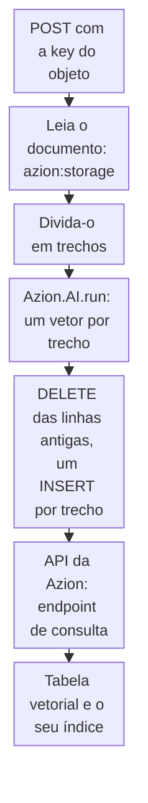

import DocCardGroup from '@aziontech/webkit/doc-card-group'
import DocCard from '@aziontech/webkit/doc-card'

Você transforma um documento armazenado no Object Storage em trechos, gera o embedding de cada trecho com um modelo do AI Inference e armazena os trechos e os seus vetores em uma tabela do SQL Database, a partir de uma function e da API da Azion. Para consultar a tabela por significado depois que ela guardar vetores, consulte [Vector search](/pt-br/documentacao/plataforma/sql-database/vector-search/).

Uma etapa de recuperação encontra trechos comparando vetores, então cada trecho precisa de um, produzido pelo mesmo modelo e na mesma largura do vetor de cada pergunta posterior. A function lê um documento por requisição, gera os embeddings de todos os trechos dele em uma chamada ao modelo e os grava em uma chamada à API da Azion.



1. Uma requisição indica a key de objeto de um documento, e a function lê esse documento do bucket.
2. A function divide o texto em trechos.
3. Uma chamada ao modelo de embedding retorna um vetor para cada trecho.
4. A function monta um `DELETE` para as linhas anteriores do documento e um `INSERT` por trecho e os envia ao endpoint de consulta da API da Azion.
5. As linhas chegam à tabela vetorial, e o índice vetorial passa a cobri-las.

---

## Pré-requisitos

- SQL Database habilitado na sua conta. O produto está em Preview e não vem habilitado por padrão, então solicite acesso pelo [Technical Support](/pt-br/documentacao/suporte/).
- Um banco de dados, o seu identificador e um personal token, armazenados como as variáveis de ambiente `SQL_DATABASE_ID` e `SQL_TOKEN`, como descreve [Grave linhas no SQL Database a partir de uma function](/pt-br/documentacao/guias/desenvolvimento-de-aplicacoes/dados/gravar-linhas-no-sql-database-a-partir-de-uma-function/). Uma function só grava em um banco de dados pela API da Azion, porque a conexão dela é somente leitura.
- Um bucket que guarda os documentos como arquivos de texto UTF-8 ou Markdown. Para criar um e enviar os arquivos, consulte [Primeiros passos com Object Storage](/pt-br/documentacao/plataforma/object-storage/primeiros-passos/).
- A [Azion CLI](/pt-br/documentacao/devtools/cli/primeiros-passos/) instalada e autorizada e um projeto de function ao qual adicionar o código. Para criar um e fazer o deploy, consulte [Faça o deploy de uma function com a Azion CLI](/pt-br/documentacao/guias/desenvolvimento-de-aplicacoes/functions-e-runtime/deploy-function-with-cli/).

Os exemplos leem o bucket `my-bucket`, geram embeddings com `Qwen/Qwen3-Embedding-4B` em 1.024 dimensões, gravam em uma tabela chamada `passages` e respondem em `www.example.com`. Substitua esses valores, `<database-id>`, `<personal-token>` e `<object-key>` pelos seus.

---

## Crie a tabela vetorial

A coluna vetorial declara a largura dos vetores que guarda, e a requisição de embedding pede a mesma largura. `Qwen/Qwen3-Embedding-4B` retorna uma de cinco larguras, `256`, `512`, `1024`, `2048` ou `4096`, pelo campo `dimensions`, então uma coluna `F32_BLOB(1024)` corresponde a uma requisição de `1024`. Um índice vetorial precisa de uma tabela com `ROWID` ou com uma chave primária de coluna única, e o segundo argumento dele define a métrica de distância.

Para criar a tabela e o seu índice, envie as duas instruções ao endpoint de consulta:

```bash
curl --request POST \
  --url https://api.azion.com/v4/workspace/sql/databases/<database-id>/query \
  --header 'Accept: application/json' \
  --header 'Authorization: Token <personal-token>' \
  --header 'Content-Type: application/json' \
  --data '{"statements":[
    "CREATE TABLE passages (id INTEGER PRIMARY KEY AUTOINCREMENT, source TEXT NOT NULL, content TEXT NOT NULL, embedding F32_BLOB(1024));",
    "CREATE INDEX passages_idx ON passages (libsql_vector_idx(embedding, '\''metric=cosine'\''));"
  ]}'
```

A API responde `200` com `"state": "executed"` e uma entrada por instrução. Uma instrução que falha ainda responde `200`, com `error` no lugar de `results` na sua entrada, então leia as duas entradas:

```json
{"state":"executed","data":[{"results":{"columns":[],"rows":[],...}},{"results":{"columns":[],"rows":[],...}}]}
```

O banco de dados guarda uma tabela `passages` vazia e o índice `passages_idx`. O índice adiciona uma tabela sombra, `passages_idx_shadow`, que uma listagem de tabelas mostra ao lado de `passages`.

---

## Gere os embeddings de um documento na tabela

A function lê o documento com a classe `Storage` do módulo `azion:storage`, que recebe o nome do bucket e nenhum token. Ela envia todos os trechos em um único array `input`, e o modelo responde com uma entrada por item em `data`, em que `data[].index` é a posição do trecho e `data[].embedding` é o seu vetor. Cada vetor entra na sua instrução como texto dentro de `vector('[...]')`.

A rota grava no banco de dados, então ela recusa uma requisição que não traz um segredo. Para armazenar esse segredo com a Azion CLI:

```bash
azion create variables --key INGEST_SECRET --value <ingest-secret> --secret true
```

O comando imprime o UUID da variável que criou:

```text
Created variable with UUID d6f142ad-b817-4cd2-ae8e-00d832b8a68e
```

Para gerar os embeddings de um documento por requisição, use este código como entrypoint da function:

```javascript
import Storage from 'azion:storage';

const BUCKET = 'my-bucket';
const EMBEDDING_MODEL = 'Qwen/Qwen3-Embedding-4B';
const DIMENSIONS = 1024;
const MAX_PASSAGE = 1500;
const MAX_PASSAGES = 99;

// Um trecho é uma sequência de parágrafos de até MAX_PASSAGE caracteres.
function split(text) {
  const passages = [];
  let current = '';
  for (const paragraph of text.split(/\n\s*\n/)) {
    const p = paragraph.trim();
    if (!p) continue;
    if (current && current.length + p.length > MAX_PASSAGE) {
      passages.push(current);
      current = '';
    }
    current = current ? `${current}\n\n${p}` : p;
  }
  if (current) passages.push(current);
  return passages;
}

function sqlText(value) {
  return `'${String(value).replaceAll("'", "''")}'`;
}

async function writeRows(statements) {
  const response = await fetch(
    `https://api.azion.com/v4/workspace/sql/databases/${Azion.env.get('SQL_DATABASE_ID')}/query`,
    {
      method: 'POST',
      headers: {
        Accept: 'application/json',
        Authorization: `Token ${Azion.env.get('SQL_TOKEN')}`,
        'Content-Type': 'application/json',
      },
      body: JSON.stringify({ statements }),
    },
  );
  if (!response.ok) {
    throw new Error(`Azion API answered ${response.status}`);
  }
  const failed = (await response.json()).data.find((entry) => entry.error);
  if (failed) {
    throw new Error(failed.error);
  }
}

export default {
  async fetch(request, env, ctx) {
    if (request.method !== 'POST') {
      return new Response('Method not allowed', { status: 405 });
    }
    if (request.headers.get('Authorization') !== `Bearer ${Azion.env.get('INGEST_SECRET')}`) {
      return new Response('Unauthorized', { status: 401 });
    }
    const key = new URL(request.url).searchParams.get('key');
    if (!key) {
      return Response.json({ error: 'key is required' }, { status: 400 });
    }

    let text;
    try {
      const object = await new Storage(BUCKET).get(key);
      text = new TextDecoder().decode(await object.arrayBuffer());
    } catch (error) {
      return Response.json({ error: String(error) }, { status: 404 });
    }
    const passages = split(text);
    if (passages.length === 0 || passages.length > MAX_PASSAGES) {
      return Response.json({ error: `${passages.length} passages; split the document` }, { status: 413 });
    }

    const embedded = await Azion.AI.run(EMBEDDING_MODEL, {
      input: passages,
      encoding_format: 'float',
      dimensions: DIMENSIONS,
    });

    // O DELETE faz uma segunda execução para a mesma key substituir as linhas dela em vez de somar a elas.
    const statements = [`DELETE FROM passages WHERE source = ${sqlText(key)};`];
    for (const item of embedded.data) {
      statements.push(
        `INSERT INTO passages (source, content, embedding) VALUES (${sqlText(key)}, ${sqlText(passages[item.index])}, vector('[${item.embedding.join(',')}]'));`,
      );
    }
    try {
      await writeRows(statements);
    } catch (error) {
      console.log(error.message);
      return Response.json({ error: 'The passages were not stored' }, { status: 502 });
    }
    return Response.json({ key, passages: passages.length });
  },
};
```

O código aplica quatro decisões:

- **Um documento por requisição.** Uma leitura, uma chamada ao modelo e uma escrita limitam o trabalho de cada invocação. Uma function pode usar 2 segundos de tempo de CPU e 50 chamadas `fetch()` de saída por invocação.
- **No máximo 99 trechos por documento.** O `DELETE` e 99 instruções `INSERT` somam 100 instruções, e uma chamada com 100 instruções dá certo. Um documento mais longo responde `413`, então divida-o em dois arquivos.
- **A largura é uma única constante.** `DIMENSIONS` define a requisição e precisa ser igual à largura `F32_BLOB` da coluna. Uma pergunta só é comparável a um trecho quando o mesmo modelo produziu os dois vetores na mesma largura.
- **Uma key ausente responde `404`.** `get` lança `StorageError: Object not found` para uma key que não guarda nenhum objeto, e `Bucket not found` para um bucket que a conta não tem.

Com `azion dev`, `Azion.AI` é `undefined` e `azion:storage` lê o disco local, então faça o deploy da function, como mostra [Faça o deploy de uma function com a Azion CLI](/pt-br/documentacao/guias/desenvolvimento-de-aplicacoes/functions-e-runtime/deploy-function-with-cli/), e teste-a lá. Depois envie um documento:

```bash
curl -X POST 'https://www.example.com/?key=<object-key>' \
  -H 'Authorization: Bearer <ingest-secret>'
```

A function responde com a key e o número de trechos que armazenou, como `{"key":"<object-key>","passages":3}`. Uma requisição sem o header `Authorization` responde `401`. A tabela guarda uma linha por trecho do documento, cada uma com o seu vetor.

---

## Confirme que os trechos trazem vetores

Para contar as linhas do documento que guardam um vetor, envie um `SELECT` ao endpoint de consulta:

```bash
curl --request POST \
  --url https://api.azion.com/v4/workspace/sql/databases/<database-id>/query \
  --header 'Accept: application/json' \
  --header 'Authorization: Token <personal-token>' \
  --header 'Content-Type: application/json' \
  --data '{"statements":["SELECT COUNT(*) AS passages FROM passages WHERE source = '\''<object-key>'\'' AND embedding IS NOT NULL;"]}'
```

A única entrada em `data` traz `results`, cuja única linha guarda o número que a function retornou:

```json
{"state":"executed","data":[{"results":{"columns":["passages"],"rows":[[3]],...}}]}
```

Cada trecho do documento traz um vetor, e `vector_top_k` em `passages_idx` pode retorná-lo. Um vetor de consulta também precisa vir de `Qwen/Qwen3-Embedding-4B` em 1.024 dimensões.

---

## Próximos passos

<DocCardGroup cols={2}>
  <DocCard title="Vector search" href="/pt-br/documentacao/plataforma/sql-database/vector-search/" label="Consulte os trechos com vector_top_k e leia as funções de distância e os limites do índice." />
  <DocCard title="Qwen3 Embedding 4B" href="/pt-br/documentacao/plataforma/ai-inference/qwen3-embedding-4b/" label="O id do modelo, as larguras que ele retorna e o seu tamanho de contexto." />
  <DocCard title="Grave linhas no SQL Database a partir de uma function" href="/pt-br/documentacao/guias/desenvolvimento-de-aplicacoes/dados/gravar-linhas-no-sql-database-a-partir-de-uma-function/" label="Armazene as credenciais do banco de dados e verifique o resultado de cada instrução que uma function envia." />
  <DocCard title="Crie e execute assistentes de IA para suporte ao cliente" href="/pt-br/documentacao/casos-de-uso/construir-e-executar-workloads-de-ai/criar-e-executar-assistentes-de-ia-para-suporte-ao-cliente/" label="Um assistente que ingere um bucket de documentação dessa forma e responde perguntas a partir dos trechos." />
</DocCardGroup>
