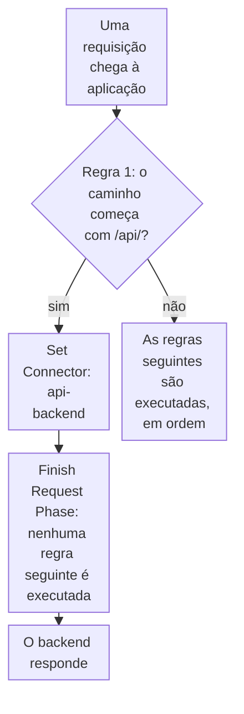

import DocCardGroup from '@aziontech/webkit/doc-card-group'
import DocCard from '@aziontech/webkit/doc-card'

Você envia cada requisição sob um prefixo de caminho, como `/api/`, a um backend que roda fora da Azion pelo arquivo `azion.config` de um projeto, que a Azion CLI aplica com `azion deploy`. Para definir o header `Host` e o prefixo de caminho de um connector pelo Azion Console ou pela API, consulte [Defina o Host header e o path prefix de uma origem](/pt-br/documentacao/guias/desenvolvimento-de-aplicacoes/primeiros-passos/defina-o-host-header-e-o-path-prefix/).

A rota são duas entradas do arquivo: um connector que alcança o backend e uma regra de requisição que envia o caminho a esse connector. `azion deploy` aplica à aplicação as regras que o arquivo declara, então a rota sai com cada deploy do projeto.



1. A aplicação executa as suas regras de requisição em ordem, e a primeira regra verifica se o caminho começa com `/api/`.
2. Uma requisição que corresponde recebe o connector `api-backend`, e _Finish Request Phase_ encerra a fase, então nenhuma regra seguinte muda o seu connector, o seu caminho ou o seu cache setting.
3. O backend responde a requisição.
4. Qualquer outra requisição passa pela primeira regra sem corresponder, e as regras seguintes são executadas como antes.

---

## Pré-requisitos

- Uma pasta de projeto com um arquivo de configuração que `azion deploy` lê, como o arquivo `azion.config.cjs` ou `azion.config.mjs` que `azion link` ou `azion init` escreve. Para os nomes de arquivo que a CLI lê, consulte [azion.config.js](/pt-br/documentacao/devtools/cli/azion-config-js/#nomes-de-arquivo-e-onde-a-cli-os-le).
- A [Azion CLI](/pt-br/documentacao/devtools/cli/primeiros-passos/), instalada e autenticada, nessa pasta de projeto.
- Um backend que responde HTTPS na porta `443` com o seu próprio hostname.

Os exemplos enviam `/api/` ao backend `api.example.com` por um connector chamado `api-backend`, e requisitam `/api/health` em `<workload-domain>`, o domínio que o deploy imprime. Substitua-os pelos seus valores.

---

## Declare o connector do backend

O connector guarda o endereço do backend e como a Azion se conecta a ele. `transportPolicy: 'force_https'` conecta ao backend somente por HTTPS. `host` envia o próprio nome do backend no header `Host`: o padrão, `${host}`, envia o host que o cliente requisitou, ao qual um backend que roteia requisições por nome pode não responder.

Para declarar o connector, adicione esta entrada ao array `connectors` do arquivo:

```javascript
{
  name: 'api-backend',
  active: true,
  type: 'http',
  attributes: {
    addresses: [{ address: 'api.example.com' }],
    connectionOptions: {
      transportPolicy: 'force_https',
      host: 'api.example.com'
    },
    modules: {
      loadBalancer: { enabled: false, config: null },
      originShield: { enabled: false, config: null }
    }
  }
}
```

O build recusa um connector `http` sem o objeto `modules`, então a entrada o carrega com os dois recursos desativados. O arquivo agora declara o connector `api-backend`, que a regra da próxima seção nomeia.

---

## Envie o caminho ao connector primeiro

A regra corresponde ao caminho com `${uri}`, que não exige nenhum Produto na aplicação. Os seus behaviors são executados em ordem: `set_connector` nomeia o connector pelo `name` que o arquivo declara, e `finish_request_phase` encerra a Request Phase.

A regra vem primeiro porque uma aplicação executa as regras de uma fase em ordem, e somente o último _Set Connector_ que corresponde é executado. Sem a parada, uma regra posterior que nomeia outro connector para todos os caminhos tiraria as requisições de `/api/` do backend. Com ela, as regras depois desta nunca veem uma requisição de `/api/`.

Para declarar a regra, adicione esta entrada como o primeiro item do array `rules.request` da aplicação, antes de qualquer regra que já esteja lá:

```javascript
{
  name: 'Send /api/ to the backend',
  active: true,
  criteria: [
    [
      {
        variable: '${uri}',
        conditional: 'if',
        operator: 'starts_with',
        argument: '/api/'
      }
    ]
  ],
  behaviors: [
    { type: 'set_connector', attributes: { value: 'api-backend' } },
    { type: 'finish_request_phase' }
  ]
}
```

A ordem do array é a ordem em que as regras são executadas na aplicação: depois de atualizar as regras, `azion deploy --local` ordena a request phase e imprime `Rules Engine of Application with id <application-id> successfully ordered (request phase)`. O arquivo agora envia `/api/` ao backend antes que qualquer outra regra seja executada.

---

## Faça o deploy da rota

`azion deploy` aplica o arquivo à aplicação, com o connector e a regra. Para fazer o deploy, execute este comando na pasta do projeto:

```bash
azion deploy
```

O comando abre a página do Console que acompanha o deploy e termina com o domínio:

```text
Your Application was deployed successfully

To visualize your application access the Domain: https://<workload-domain>
Your application is being deployed to all Azion Locations and it might take a few minutes.
```

As requisições sob `/api/` chegam a `api.example.com` com o seu próprio caminho, e todas as outras requisições mantêm as regras que vêm depois. Uma mudança de regra leva alguns minutos para chegar a todos os data centers.

---

## Verifique se o caminho chega ao backend

Uma requisição sob o prefixo deve retornar a resposta do backend, e não uma resposta das regras seguintes. Para verificar, requisite um caminho do backend:

```bash
curl -s -D - https://<workload-domain>/api/health
```

A resposta é a própria resposta do backend para `/api/health`. Quando não for, a regra pode ainda estar em propagação, ou outra regra foi executada antes. Para ver quais regras foram executadas em uma requisição, ative [Debug Rules](/pt-br/documentacao/plataforma/applications/main-settings/#debug-rules).

---

## Próximos passos

<DocCardGroup cols={2}>
  <DocCard title="azion.config.js" href="/pt-br/documentacao/devtools/cli/azion-config-js/" label="Todos os campos de connector, regra e behavior que o arquivo de configuração aceita." />
  <DocCard title="Como Applications funciona" href="/pt-br/documentacao/plataforma/applications/como-funciona/#como-as-regras-sao-executadas" label="Como as regras são executadas em ordem, por que o último Set Connector vence e quais behaviors param o restante." />
  <DocCard title="Configurações de connector" href="/pt-br/documentacao/plataforma/connectors/configuracoes/" label="Todas as opções de conexão de um connector, com o seu padrão e os seus limites." />
  <DocCard title="Implantar aplicações front-end" href="/pt-br/documentacao/casos-de-uso/construir-e-executar-aplicacoes/implantar-aplicacoes-front-end/" label="Uma single-page application cujas chamadas de API chegam a um backend existente no mesmo domínio." />
</DocCardGroup>
