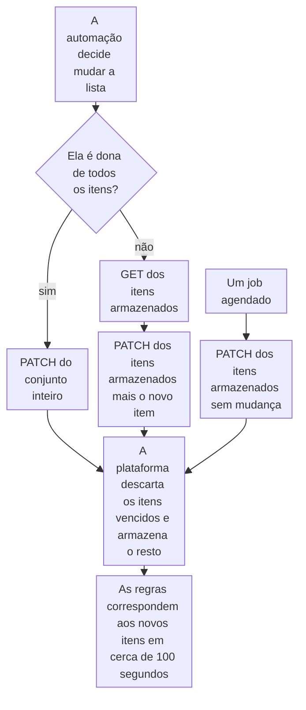

import DocCardGroup from '@aziontech/webkit/doc-card-group'
import DocCard from '@aziontech/webkit/doc-card'
import DocSteps from '@aziontech/webkit/doc-steps'
import DocStep from '@aziontech/webkit/doc-step'
import Tabs from '~/components/webkit/Tabs.vue'

Você faz uma automação, como um playbook de SIEM ou SOAR ou um script agendado, gravar os itens de uma network list pela Azion API ou pela Azion CLI, e faz a mesma mudança manualmente pelo Azion Console. Para criar uma lista com um item datado e a regra que o nega, consulte [Bloqueie endereços até uma data](/pt-br/documentacao/guias/seguranca-de-aplicacoes/bots-e-rede/bloqueio-temporario/).

Uma regra de firewall nomeia a network list pelo ID, então uma mudança nos itens muda o que corresponde em toda regra que lê a lista, sem mudar nenhuma regra. A automação que já acompanha os endereços é a que os grava, e a plataforma aplica cada data de expiração na gravação seguinte.



1. Uma automação dona de todos os itens da lista envia o conjunto inteiro em uma gravação.
2. Uma automação que compartilha a lista lê primeiro os itens armazenados e depois os grava de volta com o novo item.
3. Um job agendado grava de volta os itens armazenados sem mudança, então os itens que passaram da data de expiração saem da lista.
4. Em cada gravação, a plataforma descarta os itens já vencidos e armazena o resto como enviado. As regras correspondem aos novos itens quando a mudança chega ao tráfego.

---

## Pré-requisitos

- Uma network list do tipo `ip_cidr` e a regra de firewall que a lê. Para criar as duas, consulte [Bloqueie endereços até uma data](/pt-br/documentacao/guias/seguranca-de-aplicacoes/bots-e-rede/bloqueio-temporario/).
- Um [personal token](/pt-br/documentacao/guias/plataforma/conta-e-billing/personal-tokens/) para a automação, criado por um usuário cuja equipe tem a permissão **Edit Network Lists**. Para a permissão, consulte [Permissões](/pt-br/documentacao/plataforma/firewall/network-shield/network-lists/#permissoes).
- A [Azion CLI](/pt-br/documentacao/devtools/cli/) instalada e autorizada, para o procedimento pela CLI.
- Acesso ao Azion Console, para o procedimento pelo Console. Consulte [Acesse o Azion Console](/pt-br/documentacao/guias/plataforma/conta-e-billing/como-acessar-o-azion-console/).

Os exemplos gravam a lista `<network-list-id>`, que tem o item permanente `192.0.2.10 #permanent block`, e adicionam `198.51.100.7` até `2030-01-01T00:00:00Z`. Substitua-os pela sua lista, pelos seus itens e pelas suas datas.

---

## Adicione um item à lista

Um `PATCH` que envia `items` substitui o array inteiro, então uma automação que envia só o novo item remove todos os outros. Ela lê os itens armazenados, adiciona o seu item e grava o array de volta. Um item pode carregar uma data de expiração, `--LT` e uma data e hora UTC em segundos inteiros terminada em `Z`, e um comentário depois de `#`, por último na linha. O comentário pode nomear a detecção ou o ticket por trás do item. A API informa só o primeiro item inválido de uma gravação, em `meta.index` e `meta.value`, então valide o array inteiro antes de enviá-lo.

<Tabs client:visible sharedStore="interface">
<Fragment slot="tab.console">Console</Fragment>
<Fragment slot="tab.cli">CLI</Fragment>
<Fragment slot="tab.api">API</Fragment>

<Fragment slot="panel.console">

Para adicionar o item manualmente:

<DocSteps>
  <DocStep title="Abra a lista">

  Acesse [Azion Console](https://console.azion.com/) > **Edge Libraries** > **Network Lists** e selecione a lista.

  </DocStep>
  <DocStep title="Adicione o item">

  No campo **List**, adicione `198.51.100.7 --LT2030-01-01T00:00:00Z #<detection-id>` em uma linha própria.

  </DocStep>
  <DocStep title="Selecione Save" />
</DocSteps>

Azion Console confirma com a mensagem `Your Network List has been updated.`

</Fragment>

<Fragment slot="panel.cli">

Para adicionar o item por um script, passe-o para `--add-item`, que lê a lista primeiro e mantém os itens que já estão nela:

```bash
azion update network-list --network-list-id <network-list-id> --add-item "198.51.100.7 --LT2030-01-01T00:00:00Z #<detection-id>"
```

O comando imprime o ID da lista:

```text
Updated Network List with ID <network-list-id>
```

`--add-item` recebe valores separados por vírgula, então um comentário nele não carrega vírgula.

</Fragment>

<Fragment slot="panel.api">

Para adicionar o item pela automação, leia primeiro os itens armazenados:

```bash
curl --request GET \
  --url https://api.azion.com/v4/workspace/network_lists/<network-list-id> \
  --header 'Authorization: Token <personal-token>' \
  --header 'Accept: application/json'
```

A API responde `200` com a lista e os seus `items`:

```json
{"data":{"id":<network-list-id>,"type":"ip_cidr","items":["192.0.2.10 #permanent block"],...}}
```

Depois envie todos os itens armazenados mais o novo item:

```bash
curl --request PATCH \
  --url https://api.azion.com/v4/workspace/network_lists/<network-list-id> \
  --header 'Authorization: Token <personal-token>' \
  --header 'Content-Type: application/json' \
  --data '{"items":["192.0.2.10 #permanent block","198.51.100.7 --LT2030-01-01T00:00:00Z #<detection-id>"]}'
```

A API responde `200` e armazena os itens exatamente como enviados, com as anotações:

```json
{"state":"executed","data":{"id":<network-list-id>,"type":"ip_cidr","items":["192.0.2.10 #permanent block","198.51.100.7 --LT2030-01-01T00:00:00Z #<detection-id>"],...}}
```

</Fragment>
</Tabs>

A lista tem o novo item ao lado de todos os itens que tinha antes. As regras que a leem correspondem a `198.51.100.7` quando a mudança chega ao tráfego, de 46 segundos a cerca de 100 segundos depois da gravação.

---

## Substitua a lista a partir da sua fonte da verdade

Quando outro sistema já acompanha todos os endereços, como um SIEM ou um inventário, deixe que ele seja o dono da lista e envie o conjunto inteiro em cada gravação. Cada gravação deixa então exatamente o que foi enviado, e a gravação seguinte corrige uma que falhou. Cada gravação também sobrescreve todos os outros editores, então dê um único dono à lista e mantenha os bloqueios manuais em uma lista própria, com a sua própria regra. Uma lista tem de 1 a 20.000 itens de até 250 caracteres cada, com as anotações.

<Tabs client:visible sharedStore="interface">
<Fragment slot="tab.console">Console</Fragment>
<Fragment slot="tab.cli">CLI</Fragment>
<Fragment slot="tab.api">API</Fragment>

<Fragment slot="panel.console">

Para substituir os itens manualmente:

<DocSteps>
  <DocStep title="Abra a lista">

  Acesse [Azion Console](https://console.azion.com/) > **Edge Libraries** > **Network Lists** e selecione a lista.

  </DocStep>
  <DocStep title="Substitua os itens">

  No campo **List**, substitua todas as linhas pelo conjunto da sua fonte da verdade, um item por linha.

  </DocStep>
  <DocStep title="Selecione Save" />
</DocSteps>

Azion Console confirma com a mensagem `Your Network List has been updated.`

</Fragment>

<Fragment slot="panel.cli">

Para substituir os itens por um script, passe o conjunto inteiro para `--items`, que substitui todos os itens, como um `PATCH` faz:

```bash
azion update network-list --network-list-id <network-list-id> --items "192.0.2.10,203.0.113.0/24"
```

O comando imprime o ID da lista:

```text
Updated Network List with ID <network-list-id>
```

</Fragment>

<Fragment slot="panel.api">

Para substituir os itens pela automação, envie o conjunto inteiro em um `PATCH`, sem leitura antes:

```bash
curl --request PATCH \
  --url https://api.azion.com/v4/workspace/network_lists/<network-list-id> \
  --header 'Authorization: Token <personal-token>' \
  --header 'Content-Type: application/json' \
  --data '{"items":["192.0.2.10 #permanent block","203.0.113.0/24 #partner abuse"]}'
```

A API responde `200` com `state` igual a `executed`, e `items` tem exatamente o conjunto que você enviou, sem duplicatas exatas.

</Fragment>
</Tabs>

A lista tem o conjunto da sua fonte da verdade e nada mais. Um item que a fonte retirou deixa de corresponder quando a mudança chega ao tráfego.

---

## Remova itens expirados de forma agendada

Uma data de expiração nunca remove um item sozinha. A plataforma lê as datas de expiração só quando os itens são gravados: cada gravação descarta os itens já vencidos, e um item cuja data passa depois da gravação continua correspondendo. Um job agendado que grava de volta os itens armazenados é o que encerra cada bloqueio, e a frequência dele define por quanto tempo um item expirado continua correspondendo. Quando todos os itens estão vencidos, a gravação é recusada com `22019`, então mantenha na lista um item sem data de expiração.

<Tabs client:visible sharedStore="interface">
<Fragment slot="tab.console">Console</Fragment>
<Fragment slot="tab.cli">CLI</Fragment>
<Fragment slot="tab.api">API</Fragment>

<Fragment slot="panel.console">

Para remover um item expirado manualmente:

<DocSteps>
  <DocStep title="Abra a lista">

  Acesse [Azion Console](https://console.azion.com/) > **Edge Libraries** > **Network Lists** e selecione a lista.

  </DocStep>
  <DocStep title="Exclua a linha expirada">

  No campo **List**, exclua a linha cuja data de expiração passou. O formulário sinaliza essa linha com `the --LT date must be in the future`.

  </DocStep>
  <DocStep title="Selecione Save" />
</DocSteps>

Azion Console confirma com a mensagem `Your Network List has been updated.`

</Fragment>

<Fragment slot="panel.cli">

`--remove-item` corresponde a um item exatamente como a lista o armazena, com a data de expiração e o comentário. Com só o endereço, ele não remove nada e imprime a mesma linha mesmo assim. Para ler os itens armazenados:

```bash
azion describe network-list --network-list-id <network-list-id>
```

A linha `Items` os lista:

```text
Items:           ["192.0.2.10 #permanent block","198.51.100.7 --LT2030-01-01T00:00:00Z #<detection-id>"]
```

Passe o item expirado exatamente como a linha o mostra:

```bash
azion update network-list --network-list-id <network-list-id> --remove-item "198.51.100.7 --LT2030-01-01T00:00:00Z #<detection-id>"
```

```text
Updated Network List with ID <network-list-id>
```

</Fragment>

<Fragment slot="panel.api">

Para descartar todos os itens expirados pelo job, leia os itens armazenados com o `GET` da primeira tarefa e envie-os de volta sem mudança. Depois da data de expiração de `198.51.100.7`, escrita abaixo como `<past-due-date>`, a gravação é:

```bash
curl --request PATCH \
  --url https://api.azion.com/v4/workspace/network_lists/<network-list-id> \
  --header 'Authorization: Token <personal-token>' \
  --header 'Content-Type: application/json' \
  --data '{"items":["192.0.2.10 #permanent block","198.51.100.7 --LT<past-due-date> #<detection-id>"]}'
```

A API responde `200` e armazena só os itens ainda em vigor:

```json
{"state":"executed","data":{"id":<network-list-id>,"type":"ip_cidr","items":["192.0.2.10 #permanent block"],...}}
```

</Fragment>
</Tabs>

A lista tem só os itens ainda em vigor, e as regras deixam de corresponder ao endereço expirado quando a mudança chega ao tráfego. Um `PATCH` que carrega só um `name` não descarta nada, porque não grava nenhum item.

:::note[nota]
Estes erros interrompem uma gravação e não armazenam nada. `22005`: um item que não é um endereço nem um intervalo, inclusive uma linha que começa com `#`. `22007`: uma data de expiração sem hora ou com frações de segundo. `22019`: todos os itens estão vencidos. `22004`: uma gravação em uma lista mantida pela Azion, como `Azion IP Tor Exit Nodes`. `10065`: mais de 20.000 itens. Para todos os códigos, consulte [Erros de Network Lists](/pt-br/documentacao/plataforma/firewall/network-shield/network-lists/#erros).
:::

---

## Próximos passos

<DocCardGroup cols={2}>
  <DocCard title="Network Lists" href="/pt-br/documentacao/plataforma/firewall/network-shield/network-lists/" label="Cada campo, operação, anotação e código de erro que uma automação encontra." />
  <DocCard title="Bloqueie endereços até uma data" href="/pt-br/documentacao/guias/seguranca-de-aplicacoes/bots-e-rede/bloqueio-temporario/" label="Crie a lista com um item datado e a regra que o nega." />
  <DocCard title="Correspondência de listas" href="/pt-br/documentacao/plataforma/firewall/network-shield/correspondencia-de-listas/" label="Como uma lista corresponde ao endereço de um cliente, e como uma mudança chega ao tráfego." />
  <DocCard title="Boas práticas de Firewall" href="/pt-br/documentacao/plataforma/firewall/boas-praticas/#substitua-uma-network-list-a-partir-da-sua-propria-fonte-da-verdade" label="Por que um dono por lista, e por que uma gravação é o que remove um item expirado." />
  <DocCard title="Bloquear atacantes automaticamente a partir de detecções do SIEM" href="/pt-br/documentacao/casos-de-uso/proteger-aplicacoes-e-redes/bloquear-atacantes-automaticamente-a-partir-de-deteccoes-do-siem/" label="Um playbook que adiciona cada endereço detectado com uma data de expiração, e um job de expiração de hora em hora." />
  <DocCard title="Inspecionar uploads de arquivos em busca de conteúdo malicioso" href="/pt-br/documentacao/casos-de-uso/proteger-aplicacoes-e-redes/inspecionar-uploads-de-arquivos-em-busca-de-conteudo-malicioso/" label="Uma lista de remetentes que bloqueia os endereços cujos arquivos um modelo sinalizou." />
</DocCardGroup>
