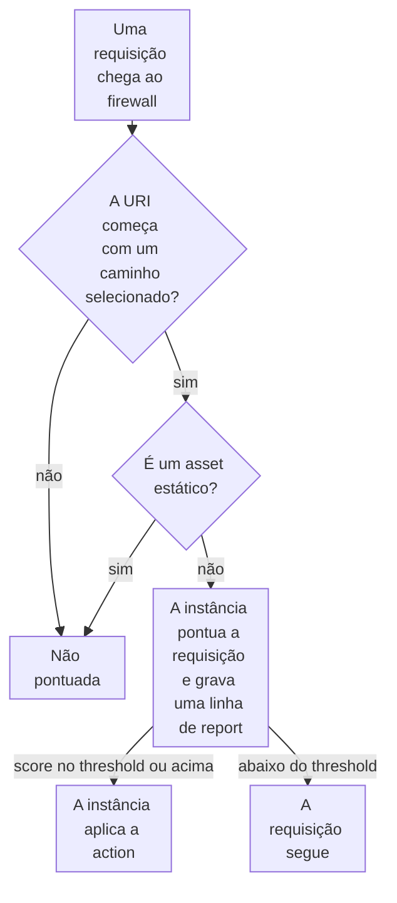

import DocCardGroup from '@aziontech/webkit/doc-card-group'
import DocCard from '@aziontech/webkit/doc-card'
import DocSteps from '@aziontech/webkit/doc-steps'
import DocStep from '@aziontech/webkit/doc-step'
import Tabs from '~/components/webkit/Tabs.vue'

Você executa uma instância do Bot Manager nos caminhos que escolher, como `/account/` e `/checkout/`, pelo Azion Console, pela Azion CLI ou pela API. Para executar uma instância em toda requisição que um firewall recebe, consulte [Execute Bot Manager em toda requisição](/pt-br/documentacao/guias/seguranca-de-aplicacoes/bots-e-rede/executar-em-toda-requisicao/).

Bot Manager cobra cada requisição que pontua, e um caminho que nenhuma regra corresponde não é pontuado. Uma instância carrega um threshold e uma action, então caminhos de valores diferentes, como um catálogo e um checkout, exigem uma instância cada, com a sua própria regra.



1. A regra compara a URI da requisição com os caminhos selecionados. Uma requisição a qualquer outro caminho não é pontuada.
2. Uma requisição de imagem, folha de estilo, script ou outro asset estático nesses caminhos também não é pontuada.
3. A instância pontua todas as outras requisições e grava uma linha de report marcada com o `log_tag` dela.
4. Uma requisição cujo score atinge o threshold recebe a action da instância, e uma requisição abaixo dele segue.

---

## Pré-requisitos

- Um firewall vinculado ao workload que serve os caminhos, com Functions ativado nas configurações principais. Consulte [Primeiros passos com Bot Manager](/pt-br/documentacao/plataforma/firewall/bot-manager/primeiros-passos/).
- Bot Manager habilitado na conta, ou Bot Manager Lite instalado pelo Azion Marketplace, e o ID da função instalada para a CLI e a API. Para instalar o Bot Manager Lite, consulte [Instale o Bot Manager Lite](/pt-br/documentacao/guias/desenvolvimento-de-aplicacoes/integracoes/bot-manager-lite/).
- Um [personal token](/pt-br/documentacao/guias/plataforma/conta-e-billing/personal-tokens/), para a API e a CLI.
- A [Azion CLI](/pt-br/documentacao/devtools/cli/) instalada e autorizada, para o procedimento pela CLI.
- Acesso ao Azion Console, para o procedimento pelo Console. Consulte [Acesse o Azion Console](/pt-br/documentacao/guias/plataforma/conta-e-billing/como-acessar-o-azion-console/).

Os exemplos pontuam `/account/` e `/checkout/` em `www.example.com`, com a instância `checkout-bots` no firewall `<firewall-id>`. Substitua-os pelos seus caminhos, nomes e firewall.

---

## Crie uma instância para os caminhos

A instância recebe um único objeto JSON de argumentos, e nada o valida: uma chave escrita errado, como `thresold`, é armazenada, e a função nunca a lê. Escreva `threshold` e `action` em toda instância. Bot Manager Lite traz `deny` em `30`, e Bot Manager documenta `allow` em `Infinity`, então uma instância que não define nenhum dos dois recusa requisições em uma edição e as deixa passar na outra. O objeto abaixo começa em modo de observação: `action` é `allow`, então nada é recusado, e `internal_logs` é `2`, então toda requisição grava uma linha de report. `log_tag` nomeia esta instância nessas linhas.

```json
{ "threshold": 15, "action": "allow", "internal_logs": 2, "log_tag": "checkout-bots" }
```

Execute-o por 24 a 72 horas, depois defina `threshold` no intervalo entre os scores dos clientes que você reconhece e os dos automatizados, e escolha uma das sete actions:

| `action` | O que a função faz no threshold |
| --- | --- |
| `allow` | Deixa a requisição seguir, qualquer que seja o score |
| `custom_html` | Retorna o HTML de `custom_html`, com o status code de `custom_status_code` |
| `deny` | Retorna `403` com a página de erro padrão da Azion |
| `drop` | Encerra a requisição sem resposta |
| `hold_connection` | Mantém a conexão aberta por 1 minuto e depois descarta a requisição |
| `random_delay` | Espera um período aleatório entre 1 e 10 segundos e depois deixa a requisição seguir |
| `redirect` | Redireciona a requisição para o endereço de `redirect_to` |

Um valor fora dos sete é lido como `allow`, assim como `custom_html` e `redirect` sem o segundo argumento. No Bot Manager, `mode` definido como `api` pontua web services e tráfego de API que não carrega cookies. Para o threshold inicial por tipo de caminho, consulte [Execute uma instância mais rigorosa do Bot Manager em um caminho de alto valor](/pt-br/documentacao/plataforma/firewall/boas-praticas/#execute-uma-instancia-mais-rigorosa-do-bot-manager-em-um-caminho-de-alto-valor).

<Tabs client:visible sharedStore="interface">
<Fragment slot="tab.console">Console</Fragment>
<Fragment slot="tab.cli">CLI</Fragment>
<Fragment slot="tab.api">API</Fragment>

<Fragment slot="panel.console">

Para criar a instância no Azion Console:

<DocSteps>
  <DocStep title="Abra o firewall vinculado ao seu workload">

  Acesse [Azion Console](https://console.azion.com/) > **Firewalls** e selecione o firewall.

  </DocStep>
  <DocStep title="Selecione a aba Functions Instances" />
  <DocStep title="Selecione + Function">

  Em um firewall que ainda não tem nenhuma instância, o botão mostra **+ Function Instance**.

  </DocStep>
  <DocStep title="Nomeie a instância">

  Na seção **General**, insira `checkout-bots` como **Name**.

  </DocStep>
  <DocStep title="Selecione a função do Bot Manager">

  Na seção **Function**, selecione a função instalada do Bot Manager ou do Bot Manager Lite.

  </DocStep>
  <DocStep title="Insira os argumentos">

  Na seção **Arguments**, insira o objeto.

  </DocStep>
  <DocStep title="Selecione Save" />
</DocSteps>

A instância aparece na lista **Functions Instances**, que mostra **Name**, **Function**, **Last Editor** e **Last Modified**.

</Fragment>

<Fragment slot="panel.cli">

Para criar a instância com a Azion CLI, salve o objeto como `bmargs.json`. A flag `--args` recebe o caminho desse arquivo, não JSON inline:

```bash
azion create firewall-instance --name checkout-bots --firewall-id <firewall-id> \
  --function-id <function-id> --args bmargs.json --active true
```

O comando imprime o ID da instância:

```text
Created Firewall Function Instance with ID <instance-id>
```

Guarde esse ID. A regra nomeia a instância por ele, nunca pelo ID da função.

</Fragment>

<Fragment slot="panel.api">

Para criar a instância com a API, envie o ID da função instalada e os argumentos:

```bash
curl --request POST \
  --url https://api.azion.com/v4/workspace/firewalls/<firewall-id>/functions \
  --header 'Authorization: Token <personal-token>' \
  --header 'Content-Type: application/json' \
  --data '{
  "name": "checkout-bots",
  "function": <function-id>,
  "active": true,
  "args": { "threshold": 15, "action": "allow", "internal_logs": 2, "log_tag": "checkout-bots" }
}'
```

A API responde `202` com `state` igual a `pending` e devolve `args` sem alteração. Guarde o `id` da instância:

```json
{"state":"pending","data":{"id":<instance-id>,"name":"checkout-bots","args":{"threshold":15,"action":"allow","internal_logs":2,"log_tag":"checkout-bots"},...}}
```

</Fragment>
</Tabs>

A instância existe no firewall e não pontua nada até que uma regra a execute.

---

## Crie a regra que a executa nos caminhos

A regra tem dois blocos de critérios, e uma requisição só corresponde a ela quando corresponde aos dois. O primeiro bloco nomeia os caminhos, unidos por `or`: `Request Uri` _starts with_ `/account/`, ou _starts with_ `/checkout/`. O segundo bloco deixa os assets estáticos de fora, porque nenhum deles é um cliente e cada um é uma requisição que o Bot Manager cobra: `Request Uri` _does not match_ esta expressão, que também corresponde a um asset pedido com query string:

```text
\.(png|jpg|jpeg|gif|ico|css|js|svg|woff|woff2|ttf|eot|otf|webp|avif|mp4|webm|pdf)(\?.*)?$
```

O comportamento _Run Function_ nomeia a instância, e uma regra carrega no máximo um, então uma segunda instância em outros caminhos exige uma segunda regra.

<Tabs client:visible sharedStore="interface">
<Fragment slot="tab.console">Console</Fragment>
<Fragment slot="tab.cli">CLI</Fragment>
<Fragment slot="tab.api">API</Fragment>

<Fragment slot="panel.console">

Para criar a regra no Azion Console:

<DocSteps>
  <DocStep title="Abra a aba Rules Engine do firewall">

  Acesse [Azion Console](https://console.azion.com/) > **Firewalls**, selecione o firewall e depois a aba **Rules Engine**.

  </DocStep>
  <DocStep title="Selecione + Rule" />
  <DocStep title="Nomeie a regra">

  Insira `checkout - score clients`.

  </DocStep>
  <DocStep title="Defina o primeiro caminho">

  Na seção **Criteria**, selecione a variável `Request Uri`, o operador _starts with_ e `/account/` como argumento.

  </DocStep>
  <DocStep title="Adicione o segundo caminho">

  Selecione **Or** e depois `Request Uri`, _starts with_ e `/checkout/`.

  </DocStep>
  <DocStep title="Exclua os assets estáticos">

  Selecione **Add Criteria**. No novo bloco, selecione `Request Uri`, _does not match_ e a expressão acima.

  </DocStep>
  <DocStep title="Adicione o comportamento Run Function">

  Na seção **Behaviors**, selecione **Run Function** e depois `checkout-bots`.

  </DocStep>
  <DocStep title="Selecione Save" />
</DocSteps>

</Fragment>

<Fragment slot="panel.cli">

Para criar a regra com a Azion CLI, salve-a como `rule.json`, com o ID da instância em `value`. Dentro da string JSON, cada barra invertida da expressão é escapada mais uma vez:

```json
{
  "name": "checkout - score clients",
  "active": true,
  "criteria": [
    [
      { "variable": "${request_uri}", "conditional": "if", "operator": "starts_with", "argument": "/account/" },
      { "variable": "${request_uri}", "conditional": "or", "operator": "starts_with", "argument": "/checkout/" }
    ],
    [
      { "variable": "${request_uri}", "conditional": "if", "operator": "does_not_match", "argument": "\\.(png|jpg|jpeg|gif|ico|css|js|svg|woff|woff2|ttf|eot|otf|webp|avif|mp4|webm|pdf)(\\?.*)?$" }
    ]
  ],
  "behaviors": [
    { "type": "run_function", "attributes": { "value": <instance-id> } }
  ]
}
```

Depois crie a regra a partir do arquivo:

```bash
azion create firewall-rule --firewall-id <firewall-id> --file rule.json
```

O comando imprime o ID da nova regra:

```text
Created Firewall Rule with ID <rule-id>
```

</Fragment>

<Fragment slot="panel.api">

Para criar a regra com a API, envie os dois blocos, com o ID da instância em `value`. Dentro da string JSON, cada barra invertida da expressão é escapada mais uma vez:

```bash
curl --request POST \
  --url https://api.azion.com/v4/workspace/firewalls/<firewall-id>/request_rules \
  --header 'Authorization: Token <personal-token>' \
  --header 'Content-Type: application/json' \
  --data '{
  "name": "checkout - score clients",
  "active": true,
  "criteria": [
    [
      { "variable": "${request_uri}", "conditional": "if", "operator": "starts_with", "argument": "/account/" },
      { "variable": "${request_uri}", "conditional": "or", "operator": "starts_with", "argument": "/checkout/" }
    ],
    [
      { "variable": "${request_uri}", "conditional": "if", "operator": "does_not_match", "argument": "\\.(png|jpg|jpeg|gif|ico|css|js|svg|woff|woff2|ttf|eot|otf|webp|avif|mp4|webm|pdf)(\\?.*)?$" }
    ]
  ],
  "behaviors": [{ "type": "run_function", "attributes": { "value": <instance-id> } }]
}'
```

A API responde `202` com `state` igual a `pending` e acrescenta a `order` que a regra ocupa entre as regras do firewall.

</Fragment>
</Tabs>

A instância pontua toda requisição a `/account/` e `/checkout/`, exceto os assets estáticos, e nenhuma requisição a outro caminho. Um formato adicionado ao seu site depois é pontuado até que você o acrescente à expressão.

---

## Confirme que a instância pontua só os caminhos

Uma regra nova chega ao tráfego de 6 minutos e 29 segundos a 9 minutos e 18 segundos depois de salva, e uma mudança nos argumentos de uma instância, cerca de 105 segundos depois. Repita cada verificação até que as respostas concordem.

Para confirmar o que a instância pontua:

1. Envie uma requisição sem user agent a um caminho selecionado e uma a um caminho fora deles:

   ```bash
   curl -A "" https://www.example.com/checkout/
   curl -A "" https://www.example.com/
   ```

2. Consulte o dataset `functionConsoleEvents` em busca das linhas de report, com um `tsRange` que cubra as requisições:

   ```bash
   curl --request POST \
     --url https://api.azion.com/v4/events/graphql \
     --header 'Authorization: Token <personal-token>' \
     --header 'Content-Type: application/json' \
     --data '{"query":"{ functionConsoleEvents(limit: 200, filter: { tsRange: { begin: \"2030-01-01T10:00:00\", end: \"2030-01-01T11:00:00\" } }, orderBy: [ts_ASC]) { ts line } }"}'
   ```

3. Leia as linhas. A requisição a `/checkout/` tem uma, que começa com a tag da instância e carrega `request_uri`, `score`, `matched_rules` e `action`:

   ```text
   [Bot-Protection][checkout-bots] Report:  {"request_id":"<request-id>",…,"request_uri":"/checkout/",…,"score":<score>,…,"action":"allow","matched_rules":[…]}
   ```

   A requisição a `/` não tem nenhuma linha, porque a regra não corresponde a ela.

A instância pontua os caminhos selecionados e nada mais. Leia `score` e `matched_rules` em vez de `classified`, que depende do threshold em vigor. Para cada campo de uma linha, consulte [Logs](/pt-br/documentacao/plataforma/firewall/bot-manager/logs/), e para mudar a action quando a janela terminar, consulte [Recuse requisições acima do threshold](/pt-br/documentacao/guias/seguranca-de-aplicacoes/bots-e-rede/recusar-acima-do-limite/).

---

## Próximos passos

<DocCardGroup cols={2}>
  <DocCard title="Recuse requisições acima do threshold" href="/pt-br/documentacao/guias/seguranca-de-aplicacoes/bots-e-rede/recusar-acima-do-limite/" label="Mude a instância de allow para uma action que recusa clientes automatizados." />
  <DocCard title="Leia o report log de uma instância" href="/pt-br/documentacao/guias/seguranca-de-aplicacoes/bots-e-rede/ler-o-report-log/" label="Consulte as linhas que uma instância gravou, com scores e regras correspondidas." />
  <DocCard title="Argumentos" href="/pt-br/documentacao/plataforma/firewall/bot-manager/argumentos/" label="Cada argumento que uma instância aceita, com tipo, default e valores aceitos." />
  <DocCard title="Boas práticas de Firewall" href="/pt-br/documentacao/plataforma/firewall/boas-praticas/#bot-manager" label="Thresholds por tipo de caminho, janelas de observação e exclusão de assets estáticos." />
  <DocCard title="Proteger aplicações web contra ataques do OWASP Top 10 e zero-day" href="/pt-br/documentacao/casos-de-uso/proteger-aplicacoes-e-redes/proteger-aplicacoes-web-contra-ataques-do-owasp-top-10-e-zero-day/" label="Uma instância que pontua toda requisição de página de uma aplicação web, sem os assets estáticos." />
  <DocCard title="Proteger APIs públicas contra abuso" href="/pt-br/documentacao/casos-de-uso/proteger-aplicacoes-e-redes/proteger-apis-publicas-contra-abuso/" label="Uma instância no modo api que pontua os clientes de um caminho de API." />
  <DocCard title="Bloquear account takeover em fluxos de login e checkout" href="/pt-br/documentacao/casos-de-uso/proteger-aplicacoes-e-redes/bloquear-account-takeover-em-fluxos-de-login-e-checkout/" label="Uma instância de observação em login, signup e checkout, depois instâncias mais rigorosas por caminho." />
  <DocCard title="Execute Bot Manager em toda requisição" href="/pt-br/documentacao/guias/seguranca-de-aplicacoes/bots-e-rede/executar-em-toda-requisicao/" label="A regra que entrega a uma instância toda requisição que um firewall recebe." />
</DocCardGroup>
