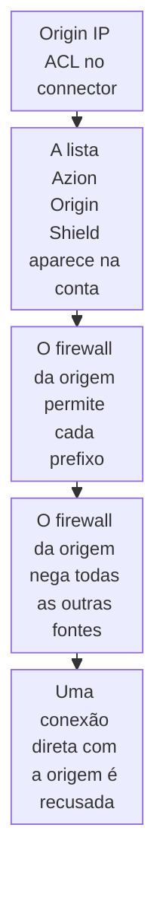

import DocCardGroup from '@aziontech/webkit/doc-card-group'
import DocCard from '@aziontech/webkit/doc-card'
import DocSteps from '@aziontech/webkit/doc-steps'
import DocStep from '@aziontech/webkit/doc-step'
import Tabs from '~/components/webkit/Tabs.vue'

Você restringe uma origem aos endereços da Azion ativando Origin IP ACL no [connector](/pt-br/documentacao/plataforma/connectors/) dela pelo Azion Console ou pela API e, em seguida, liberando a lista `Azion Origin Shield` no firewall da origem. Para ler essa lista pelo Azion Console, pela Azion CLI ou pela API, consulte [Libere os IPs da Azion na sua origem](/pt-br/documentacao/guias/seguranca-de-aplicacoes/bots-e-rede/obter-ranges-ip-azion/).

Uma origem na internet pública responde a qualquer um que encontre o endereço dela, então um cliente pode alcançá-la contornando a aplicação e todas as proteções à frente dela. Origin IP ACL faz parte de [Origin Shield](/pt-br/documentacao/plataforma/connectors/#origin-shield) em um connector do tipo `http`. Ele disponibiliza para a sua conta a network list `Azion Origin Shield`, com todos os prefixos IPv4 e IPv6 que a infraestrutura da Azion usa para se conectar às origens. O firewall da sua origem aplica a allowlist, não a Azion.



1. Você ativa Origin Shield e Origin IP ACL no connector.
2. A lista `Azion Origin Shield` aparece na sua conta.
3. O firewall da sua origem permite o tráfego de entrada de cada prefixo da lista.
4. Só depois que todos os prefixos estão permitidos, o firewall nega todas as outras fontes.
5. Um cliente que se conecta diretamente ao endereço da origem é recusado, enquanto as requisições pelo seu domínio continuam chegando à origem.

---

## Pré-requisitos

- Um connector do tipo `http` que alcança a sua origem. Origin Shield se aplica apenas a esse tipo. Para criar um, consulte [Primeiros passos com Connectors](/pt-br/documentacao/plataforma/connectors/primeiros-passos/).
- Acesso ao firewall que protege o seu servidor de origem, onde fica a allowlist.
- A permissão **View Network Lists**, para ler a lista. Para mais informações, consulte [Network Lists](/pt-br/documentacao/plataforma/firewall/network-shield/network-lists/#permissoes).
- Acesso ao Azion Console, para o procedimento pelo Console. Consulte [Como acessar o Azion Console](/pt-br/documentacao/guias/plataforma/conta-e-billing/como-acessar-o-azion-console/).
- Um [personal token](/pt-br/documentacao/guias/plataforma/conta-e-billing/personal-tokens/) e o ID do connector, para o procedimento pela API.

Os exemplos usam `www.example.com` para o domínio que a aplicação atende. Substitua-o pelo seu.

---

## Ative Origin IP ACL no connector

Origin Shield é ativado em dois níveis. Um switch ativa Origin Shield no connector e, dentro dele, o switch de Origin IP ACL fica desativado até que você o ative. Origin Shield e Load Balancer podem estar ativados ao mesmo tempo no mesmo connector.

<Tabs client:visible sharedStore="interface">
<Fragment slot="tab.console">Console</Fragment>
<Fragment slot="tab.api">API</Fragment>

<Fragment slot="panel.console">

Para ativar Origin IP ACL pelo Azion Console:

<DocSteps>
  <DocStep title="Abra o connector">

  Acesse [Azion Console](https://console.azion.com/) > **Connectors** e selecione o connector que alcança a sua origem.

  </DocStep>
  <DocStep title="Ative Origin Shield">

  Em **Modules**, ative **Origin Shield**. O switch **Origin IP ACL** e a seção **HMAC** aparecem.

  </DocStep>
  <DocStep title="Ative Origin IP ACL">

  Ative **Origin IP ACL**.

  </DocStep>
  <DocStep title="Selecione Save" />
</DocSteps>

O connector tem Origin IP ACL ativado.

</Fragment>

<Fragment slot="panel.api">

Para ativar Origin IP ACL pela API, envie uma requisição `PATCH` com as chaves que mudam. Um `PATCH` as mescla ao connector armazenado:

```bash
curl --request PATCH \
  --url https://api.azion.com/v4/workspace/connectors/<connector-id> \
  --header 'Accept: application/json' \
  --header 'Authorization: Token <personal-token>' \
  --header 'Content-Type: application/json' \
  --data '{"attributes":{"modules":{"origin_shield":{"enabled":true,"config":{"origin_ip_acl":{"enabled":true}}}}}}'
```

A API responde `202` com `"state": "pending"`. Com `enabled` definido como `true` e sem `config`, a API recusa a requisição com `28014`.

</Fragment>
</Tabs>

O connector tem Origin IP ACL ativado, e a lista `Azion Origin Shield` aparece na sua conta assim que pelo menos um connector tem Origin IP ACL ativado. O switch chega ao tráfego em vários minutos, e os data centers o aplicam em momentos diferentes.

---

## Libere a lista no firewall da sua origem

A allowlist filtra pelo endereço da fonte de cada conexão, nas camadas 3 e 4, então ela atua antes que o seu servidor leia uma requisição. A lista traz prefixos IPv6 de todos os data centers da Azion além dos prefixos IPv4, e uma allowlist só com os prefixos IPv4 recusa as conexões que a Azion abre por IPv6.

Leia os prefixos da lista como descreve [Encontre a lista Azion Origin Shield](/pt-br/documentacao/guias/seguranca-de-aplicacoes/bots-e-rede/obter-ranges-ip-azion/#encontre-a-lista-azion-origin-shield). Em seguida, para aplicá-los na sua origem:

<DocSteps>
  <DocStep title="Permita cada prefixo da lista">

  No firewall da sua origem, permita o tráfego de entrada de cada prefixo IPv4 e IPv6 da lista.

  </DocStep>
  <DocStep title="Negue todas as outras fontes">

  Negue o tráfego de entrada de todos os outros endereços. Faça essa alteração só depois que todos os prefixos estiverem permitidos, ou as requisições da Azion são recusadas até que a allowlist esteja completa.

  </DocStep>
</DocSteps>

Só a infraestrutura da Azion consegue se conectar à sua origem. O tráfego que chega à origem sem passar pela Azion, como o seu próprio acesso administrativo, também é recusado, a menos que você o permita separadamente.

A Azion atualiza a lista e envia um e-mail para toda conta com Origin Shield cada vez que ela muda. Os servidores por trás de um prefixo adicionado entram em produção 7 dias depois que a Azion publica a lista, então uma rotina que lê a lista em um intervalo menor que 7 dias mantém a sua allowlist atualizada. Para essa rotina, consulte [Mantenha a allowlist atualizada](/pt-br/documentacao/guias/seguranca-de-aplicacoes/bots-e-rede/obter-ranges-ip-azion/#mantenha-a-allowlist-atualizada).

:::note[nota]
Um endereço de origem na lista prova que uma conexão veio da infraestrutura da Azion, não do seu connector, porque a lista contém os endereços que a Azion usa para todas as contas. Para uma origem que também deve aceitar só requisições assinadas com as suas credenciais, consulte [Assine requisições de origem com HMAC](/pt-br/documentacao/guias/desenvolvimento-de-aplicacoes/primeiros-passos/assine-requisicoes-de-origem-com-hmac/).
:::

---

## Confirme que a origem recusa conexões diretas

A verificação compara uma requisição pelo seu domínio com uma conexão ao endereço da própria origem.

Para confirmar a restrição:

<DocSteps>
  <DocStep title="Requisite o seu domínio">

  ```bash
  curl -sI https://www.example.com/
  ```

  A aplicação responde como antes, porque a requisição chega à origem a partir de um endereço da Azion.

  </DocStep>
  <DocStep title="Conecte-se diretamente à origem">

  De um host fora da Azion, como a sua própria máquina, envie uma requisição ao endereço da própria origem.

  </DocStep>
</DocSteps>

O firewall da origem recusa a conexão direta ou deixa que ela expire, enquanto as requisições para `www.example.com` continuam respondendo. A sua origem aceita conexões só da Azion.

---

## Próximos passos

<DocCardGroup cols={2}>
  <DocCard title="Origin IP ACL e HMAC" href="/pt-br/documentacao/plataforma/connectors/origin-shield/origin-ip-acl-e-hmac/" label="O que a allowlist e a assinatura provam cada uma, e como a Azion atualiza a lista." />
  <DocCard title="Libere os IPs da Azion na sua origem" href="/pt-br/documentacao/guias/seguranca-de-aplicacoes/bots-e-rede/obter-ranges-ip-azion/" label="Leia a lista Azion Origin Shield pelo Azion Console, pela Azion CLI ou pela API." />
  <DocCard title="Acelerar sites e APIs com uma CDN" href="/pt-br/documentacao/casos-de-uso/melhorar-performance-e-confiabilidade/acelerar-sites-e-apis-com-uma-cdn/" label="Um site em cache à frente de uma origem que aceita conexões só da Azion." />
  <DocCard title="Proteger aplicações web contra ataques do OWASP Top 10 e zero-day" href="/pt-br/documentacao/casos-de-uso/proteger-aplicacoes-e-redes/proteger-aplicacoes-web-contra-ataques-do-owasp-top-10-e-zero-day/" label="Uma política de firewall que nenhum cliente contorna ao alcançar a origem diretamente." />
</DocCardGroup>
