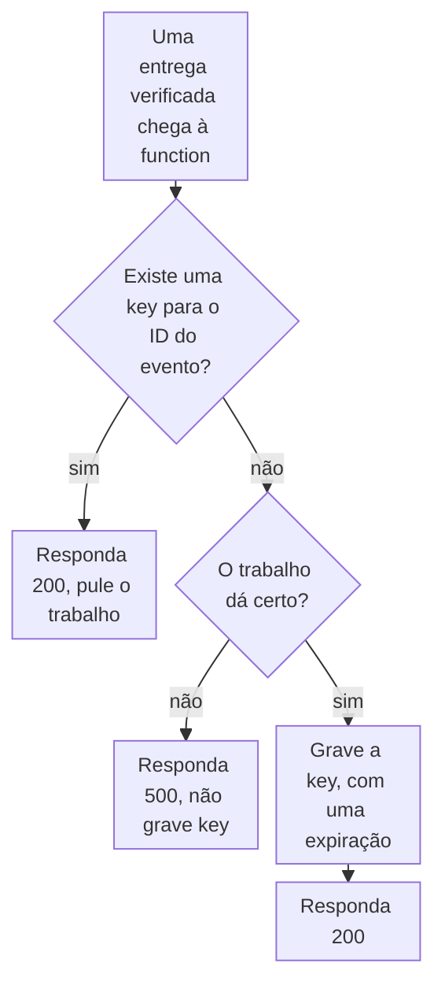

import DocCardGroup from '@aziontech/webkit/doc-card-group'
import DocCard from '@aziontech/webkit/doc-card'

Você marca cada evento de webhook que uma function tratou com uma key no KV Store, e a function pula um evento cuja key já existe, pela API da Azion e pelo código da function. Para ler e escrever keys com outros objetivos, consulte [Gerencie dados de chave-valor em uma função](/pt-br/documentacao/guias/desenvolvimento-de-aplicacoes/dados/gerenciar-com-funcoes/).

Um provedor que não vê uma entrega confirmada envia o mesmo evento de novo, então um evento pode chegar à function mais de uma vez. Uma key por ID de evento permite que a function reconheça uma repetição e responda a ela sem fazer o trabalho duas vezes.



1. A function lê a key do ID do evento. Um valor significa que uma entrega anterior do evento foi tratada, então a function responde `200` e não faz mais nada.
2. Sem key, a function faz o trabalho que o evento dispara.
3. Quando o trabalho falha, a function responde `500` e não grava key, então a próxima entrega do provedor executa o trabalho de novo.
4. Quando o trabalho dá certo, a function grava a key com uma expiração e responde `200`.

---

## Pré-requisitos

- KV Store habilitado na sua conta. O produto está em Preview e não vem habilitado por padrão, então solicite acesso pelo [Technical Support](/pt-br/documentacao/suporte/).
- Um [personal token](/pt-br/documentacao/guias/plataforma/conta-e-billing/personal-tokens/) para a chamada de API que cria o namespace.
- Uma function que recebe o webhook do provedor e verifica a assinatura dele, como o handler que [Construa um handler de webhooks do Stripe com Functions](/pt-br/documentacao/guias/desenvolvimento-de-aplicacoes/functions-e-runtime/webhooks-stripe-functions/) cria. Cada evento que o provedor envia traz um ID que se mantém igual em todas as suas entregas.

Os exemplos usam o namespace `webhook-events`, keys no formato `event:<event-id>` e uma expiração de `86400` segundos. Substitua esses valores pelos seus.

---

## Crie o namespace

Um namespace é criado pela API da Azion, e uma function só abre um que já existe. Um namespace não pode ser renomeado nem excluído, e dois nomes que diferem só em maiúsculas e minúsculas são dois namespaces, então crie-o uma única vez, em minúsculas. Um nome tem de 3 a 63 caracteres entre letras, números, o hífen e o underscore.

Para criar o namespace, envie o nome dele à API do KV Store:

```bash
curl --request POST \
  --url https://api.azion.com/v4/workspace/kv/namespaces \
  --header 'Accept: application/json' \
  --header 'Authorization: Token <personal-token>' \
  --header 'Content-Type: application/json' \
  --data '{"name": "webhook-events"}'
```

A API responde `201` com o namespace. A requisição é síncrona, e não existe estado de provisionamento a consultar:

```json
{"name":"webhook-events","created_at":"...","last_modified":"..."}
```

O namespace `webhook-events` existe e está vazio. Para todos os campos e erros da API de namespaces, consulte [Namespaces](/pt-br/documentacao/plataforma/kv-store/namespaces/).

---

## Pule uma entrega que a function já tratou

`kv.get` retorna `null` para uma key que o namespace não guarda, então um `null` significa que o evento é novo. A function grava a key só depois que o trabalho dá certo: uma key gravada antes de uma tentativa que falha marca o evento como tratado, e a nova tentativa do provedor é então pulada. `expirationTtl` remove a key depois dos segundos que indica, então o namespace não guarda uma key por evento para sempre. O mínimo é de 60 segundos.

Para deduplicar entregas, adicione este código à function, depois da verificação da assinatura:

```javascript
const NAMESPACE = 'webhook-events';
const KEY_TTL_SECONDS = 86400;

// Substitua pelo trabalho que o evento dispara, como uma publicação em uma fila.
async function handleEvent(event) {
  console.log(`Handling ${event.id}`);
}

export default {
  async fetch(request, env, ctx) {
    // Leia o ID de onde o seu provedor o coloca, depois que a assinatura é verificada.
    const event = await request.json();
    const key = `event:${event.id}`;
    const kv = await Azion.KV.open(NAMESPACE);

    // Uma key para este evento significa que uma entrega anterior já foi tratada.
    if ((await kv.get(key, 'text')) !== null) {
      return Response.json({ received: true, duplicate: true });
    }

    try {
      await handleEvent(event);
    } catch (error) {
      console.log(error.message);
      return Response.json({ error: 'Event not handled' }, { status: 500 });
    }

    // Gravada só depois que o trabalho dá certo, então uma tentativa que falha nunca é marcada como tratada.
    await kv.put(key, 'handled', { expirationTtl: KEY_TTL_SECONDS });
    return Response.json({ received: true });
  },
};
```

`Azion.KV` é um global do runtime, alcançado sem linha de import e sem credencial. `Azion.KV.open` lança `NotFound: KV namespace "webhook-events" does not exist` quando a conta não guarda nenhum namespace com esse nome. Com `azion dev`, `open` aceita um nome que não pertence a nenhum namespace, então teste a function depois do deploy.

A primeira entrega de um evento executa `handleEvent` e grava `event:<event-id>`. Uma entrega posterior do mesmo evento, dentro de um dia, responde `{"received":true,"duplicate":true}` e não executa o trabalho. Uma repetição que chega depois que a key expira executa o trabalho de novo, então defina um `expirationTtl` maior que o tempo durante o qual o seu provedor continua tentando entregar um evento.

:::caution[Atenção]
A key filtra repetições; ela não garante que o trabalho rode uma única vez. O KV Store tem consistência eventual: uma escrita fica visível em todos os lugares em até 60 segundos, e o cliente não tem compare-and-set. Duas entregas de um mesmo evento que chegam próximas podem ambas não ler nenhuma key e ambas executar o trabalho. Faça o próprio trabalho tolerar uma repetição, como uma tabela cuja chave primária é o ID do evento.
:::

Cada entrega lê uma key, e cada evento novo grava uma. O KV Store inclui 100.000 keys lidas e 1.000 keys gravadas por dia antes de uma cobrança se aplicar, e aceita 1 escrita por segundo na mesma key. Para todos os limites, consulte [Limites do KV Store](/pt-br/documentacao/plataforma/kv-store/limites/).

---

## Próximos passos

<DocCardGroup cols={2}>
  <DocCard title="Como o KV Store funciona" href="/pt-br/documentacao/plataforma/kv-store/como-funciona/#consistencia" label="Por que uma key gravada em um lugar pode faltar em outro por até 60 segundos." />
  <DocCard title="KV Store API" href="/pt-br/documentacao/devtools/runtime/api-reference/kv-store/" label="Todos os métodos, opções e erros do cliente que lê e grava as keys." />
  <DocCard title="Crie APIs orientadas a eventos" href="/pt-br/documentacao/casos-de-uso/construir-e-executar-aplicacoes/criar-apis-orientadas-a-eventos/" label="Um produtor de webhooks que filtra eventos repetidos antes de publicá-los em uma fila." />
  <DocCard title="Publique uma mensagem no Upstash QStash a partir de uma function" href="/pt-br/documentacao/guias/desenvolvimento-de-aplicacoes/integracoes/publicar-uma-mensagem-no-upstash-qstash-a-partir-de-uma-function/" label="Entregue cada evento novo a uma fila como o trabalho que a function faz." />
</DocCardGroup>
