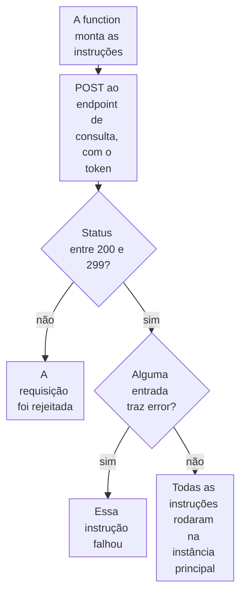

import DocCardGroup from '@aziontech/webkit/doc-card-group'
import DocCard from '@aziontech/webkit/doc-card'

Você grava linhas em um banco de dados do SQL Database a partir de uma function pela API da Azion, com um personal token que a function lê de uma variável de ambiente. Para ler linhas dentro de uma function, consulte [Consulte um banco de dados de uma function](/pt-br/documentacao/guias/desenvolvimento-de-aplicacoes/dados/listando-dados-edge-functions-edge-sql/).

Uma function abre um banco de dados por uma réplica de leitura, e essa conexão é somente leitura: uma instrução que escreve falha com ``Error: SQLite failure: `attempt to write a readonly database` ``. A instância principal recebe toda escrita, então a function envia suas instruções de escrita ao endpoint de consulta da API da Azion, que chega até ela.



1. A function lê o identificador do banco de dados e o token de variáveis de ambiente e envia as instruções ao endpoint de consulta.
2. Um status fora do intervalo de 200 a 299 significa que a API rejeitou a requisição inteira, e nenhuma instrução rodou.
3. Um `200` traz uma entrada por instrução. Uma entrada com `error` é uma instrução que falhou, mesmo que a requisição tenha dado certo.
4. Quando nenhuma entrada traz `error`, cada instrução rodou, e os seus `results` informam as linhas que ela gravou.

---

## Pré-requisitos

- SQL Database habilitado na sua conta. O produto está em Preview e não vem habilitado por padrão, então solicite acesso pelo [Technical Support](/pt-br/documentacao/suporte/).
- Um banco de dados, o seu identificador e a tabela em que a function grava. O identificador é o `id` que a resposta de criação retorna. Para criá-los, consulte [Crie e gerencie bancos de dados](/pt-br/documentacao/guias/desenvolvimento-de-aplicacoes/dados/gerenciar-bancos-dados-edge-sql/) e [Crie tabelas e consulte dados](/pt-br/documentacao/guias/desenvolvimento-de-aplicacoes/dados/criar-tabelas-edge-sql/).
- Um [personal token](/pt-br/documentacao/guias/plataforma/conta-e-billing/personal-tokens/) para a function, separado do que a Azion CLI usa. A conta dona dele precisa da permissão **Edit SQL Database**. Um token expira 1 dia depois de criado, a menos que você escolha uma expiração maior, e toda escrita falha quando ele expira, então defina uma expiração que cubra o tempo em que a function roda.
- A [Azion CLI](/pt-br/documentacao/devtools/cli/primeiros-passos/) instalada e autorizada, para armazenar as variáveis de ambiente.
- Um projeto de function ao qual adicionar o código. Para criar um e fazer o deploy, consulte [Faça o deploy de uma function com a Azion CLI](/pt-br/documentacao/guias/desenvolvimento-de-aplicacoes/functions-e-runtime/deploy-function-with-cli/).

Os exemplos gravam em uma tabela criada com `CREATE TABLE items (id INTEGER PRIMARY KEY AUTOINCREMENT, name TEXT NOT NULL);` e armazenam o identificador e o token como `SQL_DATABASE_ID` e `SQL_TOKEN`. Substitua esses valores, `<database-id>` e `<personal-token>` pelos seus.

---

## Armazene o identificador do banco de dados e o token

A function lê os dois valores em tempo de execução, então nenhum deles entra no código ou no repositório dele. O identificador não é confidencial, e o token é: a CLI nunca imprime de volta uma variável secreta. Uma key que contém `token` é enviada como secreta por padrão.

Para criar as duas variáveis com a Azion CLI:

```bash
azion create variables --key SQL_DATABASE_ID --value <database-id> --secret false
azion create variables --key SQL_TOKEN --value <personal-token> --secret true
```

Cada comando imprime o UUID da variável que criou:

```text
Created variable with UUID 00000000-0000-0000-0000-000000000005
```

Uma mudança em uma variável só chega a uma function depois de um novo deploy da function, então crie as duas antes de fazer o deploy do código da próxima seção. A conta guarda as duas variáveis, e a function lê cada uma com `Azion.env.get()`. Para os limites das variáveis, consulte [Variáveis de ambiente](/pt-br/documentacao/plataforma/functions/environment-variables/).

---

## Envie as instruções a partir da function

O endpoint de consulta recebe um array `statements` de strings SQL, executa as instruções em ordem e retorna uma entrada por instrução em `data`. Uma chamada com 100 instruções dá certo, então um conjunto de escritas relacionadas segue em uma única chamada. O corpo traz texto SQL e nenhum parâmetro, então um valor de texto vai dentro da instrução: coloque-o entre aspas, duplique cada aspa simples que ele contém e valide-o antes que ele chegue a uma instrução.

Para gravar uma linha, adicione este código ao entrypoint da function:

```javascript
// O endpoint de consulta recebe strings SQL, então um valor de texto vai entre aspas, com as aspas duplicadas.
function sqlText(value) {
  return `'${String(value).replaceAll("'", "''")}'`;
}

// As escritas vão para a instância principal pela API da Azion. Uma instrução que falha ainda responde 200.
async function writeRows(statements) {
  const response = await fetch(
    `https://api.azion.com/v4/workspace/sql/databases/${Azion.env.get('SQL_DATABASE_ID')}/query`,
    {
      method: 'POST',
      headers: {
        Accept: 'application/json',
        Authorization: `Token ${Azion.env.get('SQL_TOKEN')}`,
        'Content-Type': 'application/json',
      },
      body: JSON.stringify({ statements }),
    },
  );
  if (!response.ok) {
    throw new Error(`Azion API answered ${response.status}`);
  }
  const { data } = await response.json();
  const failed = data.find((entry) => entry.error);
  if (failed) {
    throw new Error(failed.error);
  }
  return data.map((entry) => entry.results);
}

export default {
  async fetch(request, env, ctx) {
    if (request.method !== 'POST') {
      return new Response('Method not allowed', { status: 405 });
    }
    const { name } = await request.json();
    if (typeof name !== 'string' || name.length === 0) {
      return Response.json({ error: 'name is required' }, { status: 400 });
    }
    try {
      const [results] = await writeRows([`INSERT INTO items (name) VALUES (${sqlText(name)});`]);
      return Response.json({ rows_written: results.rows_written }, { status: 201 });
    } catch (error) {
      console.log(error.message);
      return Response.json({ error: 'The write failed' }, { status: 500 });
    }
  },
};
```

`writeRows` verifica o resultado em dois lugares, porque uma escrita falha em dois lugares:

- **A requisição.** Um status fora do intervalo de 200 a 299 significa que a API rejeitou a chamada inteira. Quando as instruções não podem ser executadas, a API responde `422` com o código `14005` `Execute SQL Exception`.
- **Cada instrução.** Uma instrução que falha não faz a requisição falhar. A chamada responde `200`, e a entrada dessa instrução traz `error` no lugar de `results`:

  ```json
  {"state":"executed","data":[{"error":"no such table: items"}]}
  ```

Um cliente que lê só o status HTTP informa essa escrita como sucesso, e a linha nunca é gravada. Para todos os códigos e strings de erro, consulte [Bancos de dados e consultas](/pt-br/documentacao/plataforma/sql-database/bancos-de-dados-e-consultas/#erros).

Faça o deploy da function, como mostra [Faça o deploy de uma function com a Azion CLI](/pt-br/documentacao/guias/desenvolvimento-de-aplicacoes/functions-e-runtime/deploy-function-with-cli/). Uma instrução bem-sucedida retorna uma entrada cujo `results` traz `rows_written`, as linhas que essa instrução gravou:

```json
{"state":"executed","data":[{"results":{"columns":[],"rows":[],"rows_written":1,...}}]}
```

Um `POST` à function com um `name` adiciona uma linha a `items`, e a function responde `201` com `rows_written` igual a `1`. Uma escrita que falha responde `500`, e a function registra no log o status ou a string de erro. Para ler essa linha de log, consulte [Consultar logs de console de uma function](/pt-br/documentacao/guias/plataforma/observabilidade/consultar-function-console-events/).

---

## Confirme que as linhas foram gravadas

A resposta da function informa o que a API retornou. Para ler as linhas de volta da tabela, envie um `SELECT` ao mesmo endpoint de consulta:

```bash
curl --request POST \
  --url https://api.azion.com/v4/workspace/sql/databases/<database-id>/query \
  --header 'Accept: application/json' \
  --header 'Authorization: Token <personal-token>' \
  --header 'Content-Type: application/json' \
  --data '{"statements": ["SELECT id, name FROM items;"]}'
```

A API responde `200`, e o `results` da entrada traz um array por linha em `rows`, com os valores na ordem de `columns`:

```json
{"state":"executed","data":[{"results":{"columns":["id","name"],"rows":[[1,"<name>"]],"rows_read":1,"rows_written":0,...}}]}
```

A tabela guarda as linhas que a function gravou. Uma function que lê a mesma tabela por `Database.open` as lê de uma réplica de leitura. Para saber como a instância principal e as réplicas dividem o trabalho, consulte [Como o SQL Database funciona](/pt-br/documentacao/plataforma/sql-database/como-funciona/).

---

## Próximos passos

<DocCardGroup cols={2}>
  <DocCard title="Bancos de dados e consultas" href="/pt-br/documentacao/plataforma/sql-database/bancos-de-dados-e-consultas/" label="O corpo da consulta, os campos que cada instrução retorna e todos os códigos de erro da API do banco de dados." />
  <DocCard title="Consulte um banco de dados de uma function" href="/pt-br/documentacao/guias/desenvolvimento-de-aplicacoes/dados/listando-dados-edge-functions-edge-sql/" label="Leia as linhas de volta dentro de uma function, por uma réplica de leitura e sem token." />
  <DocCard title="Crie APIs REST e GraphQL" href="/pt-br/documentacao/casos-de-uso/construir-e-executar-aplicacoes/criar-apis-rest-e-graphql/" label="Uma function de API que lê por uma réplica e grava cada tarefa pela API da Azion." />
  <DocCard title="Implante aplicações full-stack globalmente" href="/pt-br/documentacao/casos-de-uso/construir-e-executar-aplicacoes/implantar-aplicacoes-full-stack-globalmente/" label="Um route handler do Next.js que grava os registros do portal pela API da Azion." />
  <DocCard title="Crie e execute assistentes de IA para suporte ao cliente" href="/pt-br/documentacao/casos-de-uso/construir-e-executar-workloads-de-ai/criar-e-executar-assistentes-de-ia-para-suporte-ao-cliente/" label="Uma function de ingestão que grava cada trecho e o seu vetor pela API da Azion." />
  <DocCard title="Crie agentes de IA" href="/pt-br/documentacao/casos-de-uso/construir-e-executar-workloads-de-ai/criar-agentes-de-ia/" label="Uma function de agente que registra cada evento de tarefa em uma tabela de histórico." />
</DocCardGroup>
