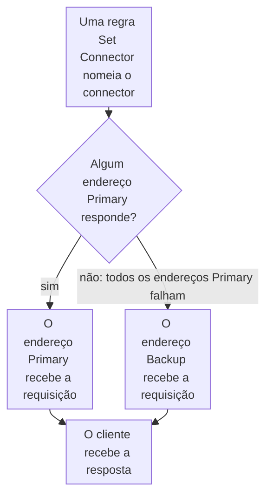

import DocCardGroup from '@aziontech/webkit/doc-card-group'
import DocCard from '@aziontech/webkit/doc-card'
import DocSteps from '@aziontech/webkit/doc-steps'
import DocStep from '@aziontech/webkit/doc-step'
import Tabs from '~/components/webkit/Tabs.vue'

Você adiciona uma origem de reserva a um [connector](/pt-br/documentacao/plataforma/connectors/) como um endereço _Backup_ de [Load Balancer](/pt-br/documentacao/plataforma/connectors/#load-balancer), pelo Azion Console, pela API ou pela Azion CLI. Para distribuir o tráfego ao vivo entre várias origens com pesos, consulte [Balanceie o tráfego entre múltiplas origens](/pt-br/documentacao/guias/performance-e-confiabilidade/disponibilidade/configure-multiplas-origens/).

Um endereço _Backup_ fica em espera, fora do tráfego diário, e só recebe requisições quando todos os endereços _Primary_ falham. Os endereços _Primary_ sempre têm preferência, então a origem de reserva não recebe tráfego enquanto a primária responde. Load Balancer não tem health check: nenhuma sonda e nenhum intervalo, então nada testa um endereço entre as requisições.



1. O comportamento _Set Connector_ de uma regra envia a requisição ao connector, que tem Load Balancer ativado.
2. Enquanto um endereço _Primary_ responde, ele recebe todas as requisições, e o endereço _Backup_ não recebe nenhuma.
3. Quando todos os endereços _Primary_ falham, o endereço _Backup_ recebe a requisição.
4. O cliente recebe a resposta do endereço que a atendeu, sem nenhuma mudança de DNS.

---

## Pré-requisitos

- Um connector do tipo `http` que alcança a sua origem primária e uma regra cujo comportamento _Set Connector_ envia requisições a ele. Para criar os dois, consulte [Primeiros passos com Connectors](/pt-br/documentacao/plataforma/connectors/primeiros-passos/).
- Uma origem de reserva que guarda o mesmo conteúdo da primária e está configurada da mesma forma para a aplicação.
- Acesso ao Azion Console, para o procedimento pelo Console. Consulte [Como acessar o Azion Console](/pt-br/documentacao/guias/plataforma/conta-e-billing/como-acessar-o-azion-console/).
- Um [personal token](/pt-br/documentacao/guias/plataforma/conta-e-billing/personal-tokens/) e o ID do connector, para o procedimento pela API.
- A [Azion CLI](/pt-br/documentacao/devtools/cli/) instalada e autorizada, e o ID do connector, para o procedimento pela CLI.

Os exemplos usam `primary.example.com` para a origem primária, `standby.example.com` para a origem de reserva e `www.example.com` para o domínio. Substitua-os pelos seus.

---

## Adicione a origem de reserva como endereço de backup

Um connector guarda um endereço até que Load Balancer seja ativado, e até 15 endereços com ele ativado. O método é _Round Robin_ ou _Least Connections_, porque _IP Hash_ recusa um endereço _Backup_ com `28005`. Todo endereço é _Primary_, a menos que você defina outra função.

**Max Retries** define as novas tentativas quando uma conexão com a origem falha, de 0 a 20. **Connection Timeout** limita a espera por essa conexão, de 1 a 300 segundos, e **Read/Write Timeout** limita a espera por dados em uma conexão aberta, de 1 a 600 segundos. O cliente espera por todas as novas tentativas antes de receber uma resposta. O Console preenche `3`, `30` e `60`. A API e a CLI dão a uma chave que o corpo deixa de fora os valores `0`, `60` e `120`, então um connector sem `max_retries` não tenta de novo uma conexão que falhou. Os exemplos definem os valores do Console em todas as interfaces.

<Tabs client:visible sharedStore="interface">
<Fragment slot="tab.console">Console</Fragment>
<Fragment slot="tab.api">API</Fragment>
<Fragment slot="tab.cli">CLI</Fragment>

<Fragment slot="panel.console">

Para adicionar o endereço de backup pelo Azion Console:

<DocSteps>
  <DocStep title="Abra o connector">

  Acesse [Azion Console](https://console.azion.com/) > **Connectors** e selecione o connector da sua origem primária.

  </DocStep>
  <DocStep title="Ative Load Balancer">

  Em **Modules**, ative **Load Balancer**. O formulário preenche **Max Retries**, **Connection Timeout** e **Read/Write Timeout**.

  </DocStep>
  <DocStep title="Selecione o método">

  Em **Load Balancer Configuration**, defina **Method** como _Round Robin_.

  </DocStep>
  <DocStep title="Defina as novas tentativas e os timeouts">

  Insira `3` em **Max Retries**, `30` em **Connection Timeout** e `60` em **Read/Write Timeout**.

  </DocStep>
  <DocStep title="Mantenha a origem primária como primária">

  Em **Address Management**, em `primary.example.com`, defina **Server Role** como _Primary_.

  </DocStep>
  <DocStep title="Selecione Add Address" />
  <DocStep title="Insira a origem de reserva">

  No novo **Address**, insira `standby.example.com`, sem protocolo nem porta.

  </DocStep>
  <DocStep title="Defina a função de backup">

  Defina **Server Role** como _Backup_ e mantenha **Active** ativado.

  </DocStep>
  <DocStep title="Selecione Save" />
</DocSteps>

O Console mostra `Connector has been updated`.

</Fragment>

<Fragment slot="panel.api">

Para adicionar o endereço de backup pela API, envie uma requisição `PATCH` ao connector. `addresses` substitui a lista de endereços, então o corpo carrega os dois:

```bash
curl --request PATCH \
  --url https://api.azion.com/v4/workspace/connectors/<connector-id> \
  --header 'Accept: application/json' \
  --header 'Authorization: Token <personal-token>' \
  --header 'Content-Type: application/json' \
  --data '{
  "attributes": {
    "addresses": [
      {
        "address": "primary.example.com",
        "modules": { "load_balancer": { "server_role": "primary", "weight": 1 } }
      },
      {
        "address": "standby.example.com",
        "modules": { "load_balancer": { "server_role": "backup", "weight": 1 } }
      }
    ],
    "modules": {
      "load_balancer": {
        "enabled": true,
        "config": { "method": "round_robin", "max_retries": 3, "connection_timeout": 30, "read_write_timeout": 60 }
      }
    }
  }
}'
```

A API responde `202` com `"state": "pending"`. Um `PATCH` mantém as opções de conexão que o corpo deixa de fora.

</Fragment>

<Fragment slot="panel.cli">

O comando de atualização recebe o connector inteiro de um arquivo, com todos os campos que o connector mantém. Para ler as configurações atuais do connector:

```bash
azion describe connector --connector-id <connector-id> --format json
```

O comando imprime o objeto completo. Em um connector do tipo `http`, `attributes` contém `addresses`, `connection_options` e `modules`.

Salve o connector como `connector.json`, com a origem de reserva adicionada e Load Balancer ativado. Substitua `name` e `connection_options` pelos valores que o comando imprimiu:

```json
{
  "name": "<connector-name>",
  "active": true,
  "type": "http",
  "attributes": {
    "addresses": [
      {
        "address": "primary.example.com",
        "modules": { "load_balancer": { "server_role": "primary", "weight": 1 } }
      },
      {
        "address": "standby.example.com",
        "modules": { "load_balancer": { "server_role": "backup", "weight": 1 } }
      }
    ],
    "connection_options": {
      "dns_resolution": "both",
      "transport_policy": "preserve",
      "host": "${host}"
    },
    "modules": {
      "load_balancer": {
        "enabled": true,
        "config": { "method": "round_robin", "max_retries": 3, "connection_timeout": 30, "read_write_timeout": 60 }
      }
    }
  }
}
```

Atualize o connector a partir do arquivo. O comando precisa de `--type`, mesmo que o arquivo nomeie o tipo:

```bash
azion update connector --connector-id <connector-id> --type http --file connector.json
```

A saída confirma a atualização:

```text
Updated Connector with ID <connector-id>
```

</Fragment>
</Tabs>

O connector guarda a origem primária e a origem de reserva, e a regra que o nomeia não precisa de alteração. Uma alteração de connector chega à infraestrutura distribuída da Azion em vários minutos, e os data centers a aplicam em momentos diferentes.

Os dois endereços recebem do connector o mesmo header `Host`, o mesmo prefixo de caminho e o mesmo protocolo. Quando a origem de reserva responde com um nome diferente do da primária, defina **Host** como `${host}`, que envia o host que o cliente requisitou. Para as opções de conexão, consulte [Configurações de connector](/pt-br/documentacao/plataforma/connectors/configuracoes/#opcoes-de-conexao).

No caso de uso [Manter uma aplicação no ar quando uma origem falha](/pt-br/documentacao/casos-de-uso/melhorar-performance-e-confiabilidade/manter-uma-aplicacao-no-ar-quando-uma-origem-falha/), esta seção usa estes valores:

| Configuração | Chave da API em `config` | Valor |
| --- | --- | --- |
| **Method** | `method` | `round_robin` |
| **Max Retries** | `max_retries` | `1` |
| **Connection Timeout** | `connection_timeout` | `10` |
| **Read/Write Timeout** | `read_write_timeout` | `60` |

O connector guarda a origem primária e a de reserva, e a regra que nomeia `app-origin` não precisa de mudança.

No caso de uso [Rotear usuários para origens regionais](/pt-br/documentacao/casos-de-uso/melhorar-performance-e-confiabilidade/rotear-usuarios-para-origens-regionais/), esta seção usa estes valores:

| Configuração | Valor |
| --- | --- |
| **Addresses** | `us.origin.example.com` com **Server Role** _Primary_, e `eu.origin.example.com` com _Backup_ |
| **Method** | _Round Robin_ |
| **Max Retries** | `1`. Uma nova tentativa limita quanto tempo um usuário espera por uma conexão que falha |
| **Connection Timeout** | `10` segundos. Ele impede que uma requisição espere os 60 segundos padrão da API por uma origem que não aceita conexão |
| **Read/Write Timeout** | `60` segundos |

`origin-us` guarda a origem da região padrão e um backup na Europa, e `origin-eu` guarda só a sua origem europeia.

---

## Confirme que a origem de reserva assume

A verificação tira a origem primária de serviço, então execute-a em uma janela de manutenção. Ela lê **Upstream Addr** na fonte de dados _HTTP Requests_ de Real-Time Events, que contém o endereço IP e a porta do servidor ao qual a requisição foi enviada.

Para confirmar o failover:

<DocSteps>
  <DocStep title="Pare a origem primária">

  Pare o servidor web em `primary.example.com` ou bloqueie as conexões da Azion no firewall dela.

  </DocStep>
  <DocStep title="Envie requisições pelo seu domínio">

  ```bash
  curl -s -o /dev/null -w '%{http_code}\n' https://www.example.com/
  ```

  O comando imprime o código de status de cada resposta. Envie-o várias vezes.

  </DocStep>
  <DocStep title="Abra Real-Time Events">

  Acesse [Azion Console](https://console.azion.com/) > **Products menu** > **Observe** > **Real-Time Events** e selecione _HTTP Requests_ em **Data Sources**.

  </DocStep>
  <DocStep title="Filtre pelo seu domínio">

  Em **Filter by**, insira `host='www.example.com'` e selecione **Refresh**.

  </DocStep>
  <DocStep title="Leia o endereço upstream">

  Os registros mais recentes trazem o endereço IP de `standby.example.com` em **Upstream Addr**.

  </DocStep>
  <DocStep title="Inicie a origem primária de novo" />
</DocSteps>

A origem de reserva atende as requisições enquanto a primária está fora do ar. Quando a primária volta a responder, ela retoma as requisições, porque os endereços _Primary_ sempre têm preferência sobre os endereços _Backup_. Um data center que ainda não recebeu uma alteração pode responder como antes, então repita a busca até que os registros concordem. Para a sintaxe do filtro, consulte [Filtrar eventos](/pt-br/documentacao/guias/plataforma/observabilidade/adicionar-filtros-events/).

Quando as suas origens definem um header de resposta que as identifica, um segundo método lê esse header na resposta em vez do Upstream Addr no Real-Time Events. Envie várias requisições pelo seu domínio:

```bash
curl -s -D - -o /dev/null https://www.example.com/
```

No caso de uso [Manter uma aplicação no ar quando uma origem falha](/pt-br/documentacao/casos-de-uso/melhorar-performance-e-confiabilidade/manter-uma-aplicacao-no-ar-quando-uma-origem-falha/), espere:

- **A primária atende enquanto responde.** Todas as respostas a várias requisições para `https://www.example.com/` carregam `x-origin-site: primary`. Em HTTP/2, os nomes dos headers chegam em minúsculas.
- **A origem de reserva assume quando a primária falha.** Pare o servidor web em `primary.example.com`, ou bloqueie as conexões da Azion no firewall dela. Envie a requisição de novo, várias vezes. As respostas carregam `x-origin-site: standby`, sem mudança de DNS do seu lado.
- **A primária recebe o tráfego de volta.** Inicie de novo o servidor web em `primary.example.com` e envie a requisição várias vezes. As respostas voltam a carregar `x-origin-site: primary`, porque os endereços _Primary_ sempre têm preferência sobre os endereços _Backup_.

No caso de uso [Rotear usuários para origens regionais](/pt-br/documentacao/casos-de-uso/melhorar-performance-e-confiabilidade/rotear-usuarios-para-origens-regionais/), espere:

- **A região padrão recorre ao backup, e a Europa não.** Em uma janela de manutenção, pare o servidor web em `us.origin.example.com` e repita a requisição a partir de fora da Europa. As respostas carregam `x-origin-region: eu`. Inicie-o de novo. Uma falha da origem europeia, por design, mostra aos usuários europeus um erro em vez de uma resposta de outra região.

---

## Próximos passos

<DocCardGroup cols={2}>
  <DocCard title="Métodos de balanceamento" href="/pt-br/documentacao/plataforma/connectors/load-balancer/metodos-de-balanceamento/#funcao-do-servidor" label="Como a função do servidor, as novas tentativas e os timeouts decidem para onde vai uma requisição." />
  <DocCard title="Mostre a sua própria página quando nenhuma origem responde" href="/pt-br/documentacao/guias/performance-e-confiabilidade/disponibilidade/mostrar-a-sua-propria-pagina-quando-nenhuma-origem-responde/" label="Substitua o erro da Azion pela sua página quando nem a primária nem a origem de reserva respondem." />
  <DocCard title="Manter uma aplicação no ar quando uma origem falha" href="/pt-br/documentacao/casos-de-uso/melhorar-performance-e-confiabilidade/manter-uma-aplicacao-no-ar-quando-uma-origem-falha/" label="Uma origem primária e uma de reserva em um pool, com uma página de erro quando as duas falham." />
  <DocCard title="Rotear usuários para origens regionais" href="/pt-br/documentacao/casos-de-uso/melhorar-performance-e-confiabilidade/rotear-usuarios-para-origens-regionais/" label="Uma região padrão com um backup em outra região, só onde as regras de residência permitem." />
</DocCardGroup>
