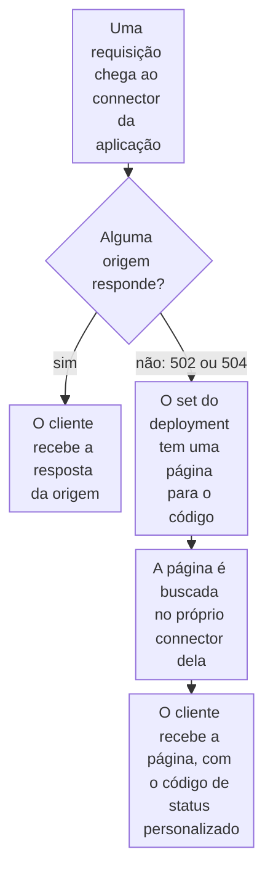

import DocCardGroup from '@aziontech/webkit/doc-card-group'
import DocCard from '@aziontech/webkit/doc-card'
import DocSteps from '@aziontech/webkit/doc-steps'
import DocStep from '@aziontech/webkit/doc-step'
import Tabs from '~/components/webkit/Tabs.vue'

Você substitui o erro que um [workload](/pt-br/documentacao/plataforma/workloads/) retorna quando nenhuma origem responde por uma página sua, pelo Azion Console ou pela API. Para substituir outros códigos de status, como um `404`, consulte [Personalize uma página de erro](/pt-br/documentacao/guias/desenvolvimento-de-aplicacoes/primeiros-passos/personalizar-pagina-resposta-erro/).

Quando nenhum servidor de origem pode ser selecionado, uma requisição traz o status upstream `502`. Quando uma origem HTTPS recusa o handshake TLS, o cliente recebe `502` com a página intitulada `Azion - Default error page`. Um custom page set vincula um código de status a uma página que um [connector](/pt-br/documentacao/plataforma/connectors/) serve. Uma página para um código marcado como Azion no Console substitui a página padrão da Azion.



1. Uma requisição chega ao connector que a regra _Set Connector_ da aplicação nomeia.
2. Quando uma origem responde, o cliente recebe a resposta dela.
3. Quando nenhuma origem responde, a resposta traz um `502` ou um `504`, e o custom page set do deployment do workload contém uma página para esse código.
4. A Azion busca a página no próprio connector dela, no caminho da página.
5. O cliente recebe a página no lugar da resposta, sem redirecionamento e com o código de status personalizado da página.

---

## Pré-requisitos

- Um workload cujo deployment nomeia uma aplicação. Para criar um, consulte [Primeiros passos com Workloads](/pt-br/documentacao/plataforma/workloads/primeiros-passos/).
- Um connector que serve a sua página de erro em um caminho e não alcança nenhuma das suas origens, como um connector do tipo `storage` que lê um bucket de [Object Storage](/pt-br/documentacao/plataforma/object-storage/). Para os campos dele, consulte [Configurações de connector](/pt-br/documentacao/plataforma/connectors/configuracoes/#storage).
- Acesso ao Azion Console, para o procedimento pelo Console. Consulte [Como acessar o Azion Console](/pt-br/documentacao/guias/plataforma/conta-e-billing/como-acessar-o-azion-console/).
- Um [personal token](/pt-br/documentacao/guias/plataforma/conta-e-billing/personal-tokens/) para o procedimento pela API, com o ID do connector da página, do workload, do deployment dele e da aplicação que o deployment nomeia. Se o deployment nomeia um firewall, o ID dele também.

Os exemplos servem a página em `/errors/503.html` em um connector chamado `error-pages`, para o domínio `www.example.com`. Substitua-os pelos seus.

---

## Crie um set com uma página para cada código

O set vincula `502`, `503` e `504` à mesma página. Nas [Configurações de custom page](/pt-br/documentacao/plataforma/workloads/custom-pages/configuracoes/#codigos-de-status), `502` é um gateway que recebeu uma resposta inválida, `503` um servidor que não está pronto e `504` um gateway que não recebeu resposta a tempo. Cada página responde com `503`, que marca uma condição temporária.

A página vem de um connector que não alcança nenhuma das suas origens, porque uma página buscada em uma origem que falha falha junto com ela. **Response TTL** define por quantos segundos a página fica em cache, de 0 a 31.536.000. Uma página de erro é estática e raramente muda, então um valor alto, como `86400`, um dia, afasta as requisições do connector da página.

<Tabs client:visible sharedStore="interface">
<Fragment slot="tab.console">Console</Fragment>
<Fragment slot="tab.api">API</Fragment>

<Fragment slot="panel.console">

Para criar o set pelo Azion Console:

<DocSteps>
  <DocStep title="Abra a página Custom Pages">

  Acesse [Azion Console](https://console.azion.com/) > **Custom Pages**.

  </DocStep>
  <DocStep title="Inicie o set">

  Selecione **Create Custom Page**.

  </DocStep>
  <DocStep title="Dê um nome ao set">

  Em **Name**, insira um nome que identifique o set, como `origin-down`.

  </DocStep>
  <DocStep title="Selecione Create Custom Page Code" />
  <DocStep title="Selecione o código de status">

  Em **Page Code**, selecione `502`.

  </DocStep>
  <DocStep title="Mantenha o tipo de página de connector">

  Em **Type**, mantenha _Page Connector_.

  </DocStep>
  <DocStep title="Selecione o connector da página">

  Em **Connector**, selecione `error-pages`.

  </DocStep>
  <DocStep title="Insira o caminho da página">

  Em **Page Path (URI)**, insira `/errors/503.html`.

  </DocStep>
  <DocStep title="Defina o tempo de cache e o status">

  Insira `86400` em **Response TTL** e `503` em **Response Custom Status Code**.

  </DocStep>
  <DocStep title="Adicione os códigos 503 e 504">

  Selecione **Create Custom Page Code** de novo para **Page Code** `503` e `504`, com o mesmo connector, o mesmo caminho e os mesmos **Response TTL** e **Response Custom Status Code**.

  </DocStep>
  <DocStep title="Selecione Create" />
</DocSteps>

A tabela **Page Codes** lista uma linha por página, com **Page Status Code**, **Page Path (URI)**, **Custom Status Code** e **Response TTL**.

</Fragment>

<Fragment slot="panel.api">

Para criar o set pela API, envie uma requisição `POST` ao endpoint de custom pages, com uma entrada em `pages` por código de status. Substitua `<connector-id>` pelo ID de `error-pages`:

```bash
curl --request POST \
  --url https://api.azion.com/v4/workspace/custom_pages \
  --header 'Accept: application/json' \
  --header 'Authorization: Token <personal-token>' \
  --header 'Content-Type: application/json' \
  --data '{"name": "origin-down", "active": true, "pages": [
  {"code": "502", "page": {"type": "page_connector", "attributes": {"connector": <connector-id>, "ttl": 86400, "uri": "/errors/503.html", "custom_status_code": 503}}},
  {"code": "503", "page": {"type": "page_connector", "attributes": {"connector": <connector-id>, "ttl": 86400, "uri": "/errors/503.html", "custom_status_code": 503}}},
  {"code": "504", "page": {"type": "page_connector", "attributes": {"connector": <connector-id>, "ttl": 86400, "uri": "/errors/503.html", "custom_status_code": 503}}}
]}'
```

A API responde `201` com o novo set, incluindo o `id` dele. Anote o `id` para a próxima tarefa.

</Fragment>
</Tabs>

O set contém uma página para cada um dos três códigos. Ele não serve nada até que o deployment de um workload o nomeie.

---

## Atribua o set no deployment do workload

O deployment de um workload nomeia a aplicação, o firewall e o custom page set dele. Só o custom page set muda aqui, então a aplicação e o firewall mantêm os valores que o workload usa hoje. A Azion CLI define o custom page set só quando cria um deployment, e um workload tem um deployment, então esta tarefa usa o Azion Console ou a API.

<Tabs client:visible sharedStore="interface">
<Fragment slot="tab.console">Console</Fragment>
<Fragment slot="tab.api">API</Fragment>

<Fragment slot="panel.console">

Para atribuir o set pelo Azion Console:

<DocSteps>
  <DocStep title="Abra a página Workloads">

  Acesse [Azion Console](https://console.azion.com/) > **Workloads**.

  </DocStep>
  <DocStep title="Abra o workload">

  Selecione o workload que atende `www.example.com`.

  </DocStep>
  <DocStep title="Selecione o set">

  Em **Deployment Settings**, selecione `origin-down` em **Custom Page**. Mantenha **Application** e **Firewall** como estão.

  </DocStep>
  <DocStep title="Selecione Save" />
</DocSteps>

O Azion Console mostra `Your workload has been updated`.

</Fragment>

<Fragment slot="panel.api">

Para atribuir o set pela API, envie uma requisição `PATCH` ao deployment do workload, com a aplicação que o deployment nomeia hoje e o ID do set em `custom_page`. Deixe `firewall` de fora se o deployment não tiver firewall:

```bash
curl --request PATCH \
  --url https://api.azion.com/v4/workspace/workloads/<workload-id>/deployments/<deployment-id> \
  --header 'Accept: application/json' \
  --header 'Authorization: Token <personal-token>' \
  --header 'Content-Type: application/json' \
  --data '{
  "strategy": {
    "type": "default",
    "attributes": {
      "application": <application-id>,
      "firewall": <firewall-id>,
      "custom_page": <custom-page-id>
    }
  }
}'
```

A API responde `202`.

</Fragment>
</Tabs>

O deployment do workload nomeia o set. Uma alteração de deployment leva vários minutos para chegar à infraestrutura distribuída da Azion, e as requisições podem receber a página padrão da Azion até que ela chegue.

---

## Confirme que a página substitui o erro

A verificação tira as suas origens de serviço, então execute-a em uma janela de manutenção.

Para confirmar a página:

<DocSteps>
  <DocStep title="Pare todas as origens do connector da aplicação">

  Pare o servidor web em cada origem ou bloqueie as conexões da Azion no firewall dela.

  </DocStep>
  <DocStep title="Requisite o seu domínio">

  ```bash
  curl -s -D - https://www.example.com/
  ```

  </DocStep>
  <DocStep title="Inicie as origens de novo" />
</DocSteps>

A resposta traz o status `503`, do **Response Custom Status Code** da página, e o corpo de `/errors/503.html`, não a página intitulada `Azion - Default error page`. Ela não traz header `Location`, então o cliente não é redirecionado. Se a página padrão ainda chegar depois que a alteração do deployment se propagou, consulte [Solucionar problemas de Workloads](/pt-br/documentacao/plataforma/workloads/solucao-de-problemas/#custom-pages).

---

## Próximos passos

<DocCardGroup cols={2}>
  <DocCard title="Configurações de custom page" href="/pt-br/documentacao/plataforma/workloads/custom-pages/configuracoes/" label="Todos os campos de um set e das páginas dele, e os 22 códigos de status que uma página pode substituir." />
  <DocCard title="Adicione uma origem de backup a um connector" href="/pt-br/documentacao/guias/performance-e-confiabilidade/disponibilidade/adicionar-uma-origem-de-backup-a-um-connector/" label="Mantenha uma origem de reserva respondendo antes que a página de erro seja necessária." />
  <DocCard title="Personalize uma página de erro" href="/pt-br/documentacao/guias/desenvolvimento-de-aplicacoes/primeiros-passos/personalizar-pagina-resposta-erro/" label="Substitua as respostas de erro de outros códigos de status, cada página com o próprio tempo de cache." />
  <DocCard title="Manter uma aplicação no ar quando uma origem falha" href="/pt-br/documentacao/casos-de-uso/melhorar-performance-e-confiabilidade/manter-uma-aplicacao-no-ar-quando-uma-origem-falha/" label="Uma origem primária e uma de reserva em um pool, com esta página quando as duas falham." />
</DocCardGroup>
