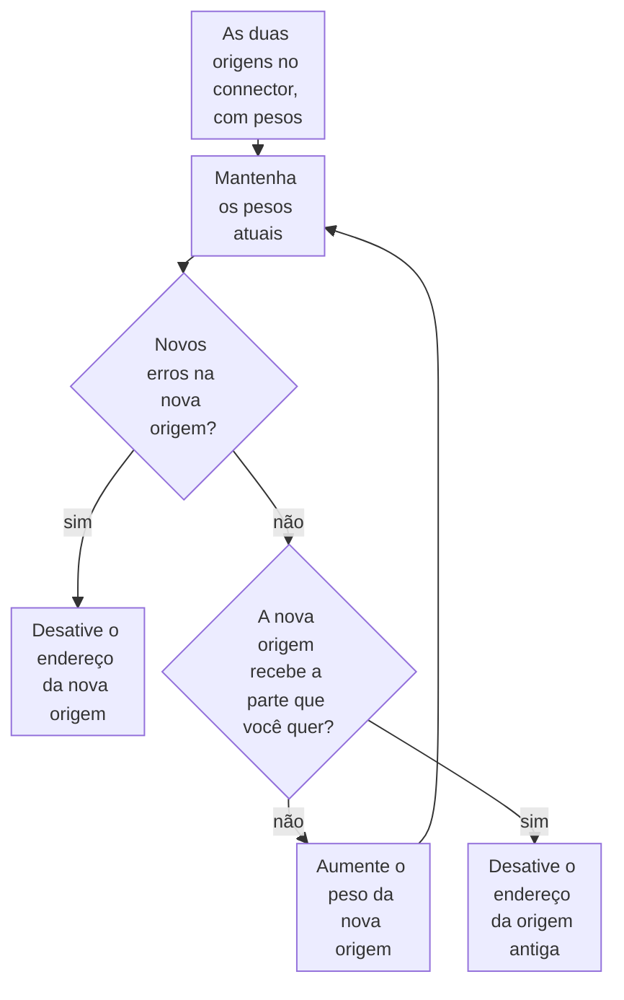

import DocCardGroup from '@aziontech/webkit/doc-card-group'
import DocCard from '@aziontech/webkit/doc-card'
import DocSteps from '@aziontech/webkit/doc-steps'
import DocStep from '@aziontech/webkit/doc-step'
import Tabs from '~/components/webkit/Tabs.vue'

Você move requisições de uma origem para outra em etapas, com os pesos dos endereços de um connector com [Load Balancer](/pt-br/documentacao/plataforma/connectors/#load-balancer), pelo Azion Console, pela API ou pela Azion CLI. Para manter uma origem de reserva fora do tráfego até que a primária falhe, consulte [Adicione uma origem de backup a um connector](/pt-br/documentacao/guias/performance-e-confiabilidade/disponibilidade/adicionar-uma-origem-de-backup-a-um-connector/).

Com _Round Robin_, cada endereço recebe uma parte das requisições proporcional ao seu peso, um número inteiro de 1 a 100. O peso define uma proporção, não uma divisão exata: cada data center balanceia por conta própria, então a parte que um endereço recebe varia em torno da que o seu peso pede. Um peso não pode ser `0`, então uma origem sai da rotação pelo switch **Active**, não pelo peso.



1. As duas origens ficam em um connector como endereços _Primary_, e a nova origem começa com um peso pequeno.
2. Mantenha cada conjunto de pesos até que a nova origem tenha atendido requisições suficientes para mostrar os seus erros.
3. Quando aparecem novos erros, desative o endereço da nova origem para fazer o rollback.
4. Quando nenhum erro novo aparece, aumente o peso da nova origem e mantenha de novo.
5. Quando a nova origem recebe a parte que você quer, desative o endereço da origem antiga para fazer o cutover.

---

## Pré-requisitos

- Um connector do tipo `http` que alcança a origem atual e uma regra cujo comportamento _Set Connector_ envia requisições a ele. Para criar os dois, consulte [Primeiros passos com Connectors](/pt-br/documentacao/plataforma/connectors/primeiros-passos/).
- Uma nova origem que guarda a mesma aplicação da atual. Todo endereço de um connector recebe o mesmo header `Host`, então as duas origens devem responder pelo mesmo nome.
- Acesso ao Azion Console, para o procedimento pelo Console. Consulte [Como acessar o Azion Console](/pt-br/documentacao/guias/plataforma/conta-e-billing/como-acessar-o-azion-console/).
- Um [personal token](/pt-br/documentacao/guias/plataforma/conta-e-billing/personal-tokens/) e o ID do connector, para o procedimento pela API.
- A [Azion CLI](/pt-br/documentacao/devtools/cli/) instalada e autorizada, e o ID do connector, para o procedimento pela CLI.

Os exemplos usam `old-origin.example.com` para a origem atual e `new-origin.example.com` para a nova. Substitua-os pelos seus.

---

## Coloque as duas origens no connector

O connector recebe Load Balancer com _Round Robin_, e a nova origem entra como um segundo endereço _Primary_. Um peso `9` na origem atual e `1` na nova envia cerca de uma requisição em dez para a nova origem. Um connector guarda até 15 endereços com Load Balancer ativado.

**Host** recebe um nome pelo qual as duas origens respondem, como `${host}`, que envia o host que o cliente requisitou. Um nome literal da origem atual chegaria à nova origem com um nome pelo qual ela pode não responder. Os exemplos definem **Max Retries**, **Connection Timeout** e **Read/Write Timeout** como `3`, `30` e `60`, os valores que o Console preenche. A API e a CLI dão a uma chave que o corpo deixa de fora os valores `0`, `60` e `120`.

<Tabs client:visible sharedStore="interface">
<Fragment slot="tab.console">Console</Fragment>
<Fragment slot="tab.api">API</Fragment>
<Fragment slot="tab.cli">CLI</Fragment>

<Fragment slot="panel.console">

Para colocar as duas origens no connector pelo Azion Console:

<DocSteps>
  <DocStep title="Abra o connector">

  Acesse [Azion Console](https://console.azion.com/) > **Connectors** e selecione o connector da origem atual.

  </DocStep>
  <DocStep title="Envie um host pelo qual as duas origens respondem">

  Em **Host**, insira `${host}`.

  </DocStep>
  <DocStep title="Ative Load Balancer">

  Em **Modules**, ative **Load Balancer**. O formulário preenche **Max Retries**, **Connection Timeout** e **Read/Write Timeout**.

  </DocStep>
  <DocStep title="Selecione Round Robin">

  Em **Load Balancer Configuration**, defina **Method** como _Round Robin_.

  </DocStep>
  <DocStep title="Defina o peso da origem atual">

  Em **Address Management**, em `old-origin.example.com`, defina **Server Role** como _Primary_ e insira `9` em **Weight**.

  </DocStep>
  <DocStep title="Selecione Add Address" />
  <DocStep title="Insira a nova origem">

  No novo **Address**, insira `new-origin.example.com`, sem protocolo nem porta.

  </DocStep>
  <DocStep title="Defina o peso da nova origem">

  Defina **Server Role** como _Primary_ e insira `1` em **Weight**.

  </DocStep>
  <DocStep title="Selecione Save" />
</DocSteps>

O Console mostra `Connector has been updated`.

</Fragment>

<Fragment slot="panel.api">

Para colocar as duas origens no connector pela API, envie uma requisição `PATCH`. `addresses` substitui a lista de endereços, então o corpo também carrega a origem atual:

```bash
curl --request PATCH \
  --url https://api.azion.com/v4/workspace/connectors/<connector-id> \
  --header 'Accept: application/json' \
  --header 'Authorization: Token <personal-token>' \
  --header 'Content-Type: application/json' \
  --data '{
  "attributes": {
    "addresses": [
      {
        "address": "old-origin.example.com",
        "modules": { "load_balancer": { "server_role": "primary", "weight": 9 } }
      },
      {
        "address": "new-origin.example.com",
        "modules": { "load_balancer": { "server_role": "primary", "weight": 1 } }
      }
    ],
    "connection_options": { "host": "${host}" },
    "modules": {
      "load_balancer": {
        "enabled": true,
        "config": { "method": "round_robin", "max_retries": 3, "connection_timeout": 30, "read_write_timeout": 60 }
      }
    }
  }
}'
```

A API responde `202` com `"state": "pending"`. Um `PATCH` mantém as opções de conexão que o corpo deixa de fora.

</Fragment>

<Fragment slot="panel.cli">

O comando de atualização recebe o connector inteiro de um arquivo, com todos os campos que o connector mantém. Para ler as configurações atuais do connector:

```bash
azion describe connector --connector-id <connector-id> --format json
```

O comando imprime o objeto completo. Em um connector do tipo `http`, `attributes` contém `addresses`, `connection_options` e `modules`.

Salve o connector como `connector.json`, com as duas origens e Load Balancer ativado. Substitua `name` e as outras `connection_options` pelos valores que o comando imprimiu:

```json
{
  "name": "<connector-name>",
  "active": true,
  "type": "http",
  "attributes": {
    "addresses": [
      {
        "address": "old-origin.example.com",
        "modules": { "load_balancer": { "server_role": "primary", "weight": 9 } }
      },
      {
        "address": "new-origin.example.com",
        "modules": { "load_balancer": { "server_role": "primary", "weight": 1 } }
      }
    ],
    "connection_options": {
      "dns_resolution": "both",
      "transport_policy": "preserve",
      "host": "${host}"
    },
    "modules": {
      "load_balancer": {
        "enabled": true,
        "config": { "method": "round_robin", "max_retries": 3, "connection_timeout": 30, "read_write_timeout": 60 }
      }
    }
  }
}
```

Atualize o connector a partir do arquivo. O comando precisa de `--type`, mesmo que o arquivo nomeie o tipo:

```bash
azion update connector --connector-id <connector-id> --type http --file connector.json
```

A saída confirma a atualização:

```text
Updated Connector with ID <connector-id>
```

</Fragment>
</Tabs>

O connector guarda dois endereços ativos e envia cerca de uma requisição em dez para a nova origem. Uma alteração de connector chega à infraestrutura distribuída da Azion em vários minutos e, até que todos os data centers a recebam, algumas requisições chegam só à origem atual.

No caso de uso [Migrar uma aplicação para uma nova origem sem downtime](/pt-br/documentacao/casos-de-uso/construir-e-executar-aplicacoes/migrar-uma-aplicacao-para-uma-nova-origem-sem-downtime/), esta seção usa estes valores:

| Configuração | Valor |
| --- | --- |
| **Host** | `${host}` |
| **Transport Protocol Policy** | _Force HTTPS_, porque as duas origens respondem HTTPS na porta `443` |
| **Method** | _Round Robin_ |
| **Max Retries**, **Connection Timeout**, **Read/Write Timeout** | `3`, `30` e `60` |
| `old-origin.example.com` | **Server Role** _Primary_, **Weight** `99` |
| `new-origin.example.com` | **Server Role** _Primary_, **Weight** `1` |

O connector guarda dois endereços ativos e envia cerca de uma requisição em cem para a nova origem. Uma mudança no connector leva vários minutos para chegar a todos os data centers, e até lá algumas requisições chegam apenas à origem antiga.

---

## Altere os pesos

Cada etapa altera só os pesos. Mantenha uma etapa por tempo suficiente para que a nova origem atenda as requisições que revelam as suas falhas antes de passar à próxima. Cada registro da fonte de dados _HTTP Requests_ de [Real-Time Events](/pt-br/documentacao/plataforma/real-time-events/fontes-de-dados/#http-requests) traz **Upstream Status** e **Upstream Addr**, o status e o endereço da origem que respondeu, então um filtro pelo endereço da nova origem mostra os erros dela.

<Tabs client:visible sharedStore="interface">
<Fragment slot="tab.console">Console</Fragment>
<Fragment slot="tab.api">API</Fragment>
<Fragment slot="tab.cli">CLI</Fragment>

<Fragment slot="panel.console">

Para alterar os pesos pelo Azion Console:

<DocSteps>
  <DocStep title="Abra o connector">

  Acesse [Azion Console](https://console.azion.com/) > **Connectors** e selecione o connector.

  </DocStep>
  <DocStep title="Defina o peso da origem atual">

  Em **Address Management**, em `old-origin.example.com`, insira o novo peso em **Weight**, como `5`.

  </DocStep>
  <DocStep title="Defina o peso da nova origem">

  Em `new-origin.example.com`, insira o novo peso em **Weight**, como `5`.

  </DocStep>
  <DocStep title="Selecione Save" />
</DocSteps>

O Console mostra `Connector has been updated`.

</Fragment>

<Fragment slot="panel.api">

Para alterar os pesos pela API, envie os dois endereços com os novos pesos. Um `PATCH` só com `addresses` mantém a configuração de Load Balancer do connector:

```bash
curl --request PATCH \
  --url https://api.azion.com/v4/workspace/connectors/<connector-id> \
  --header 'Accept: application/json' \
  --header 'Authorization: Token <personal-token>' \
  --header 'Content-Type: application/json' \
  --data '{
  "attributes": {
    "addresses": [
      {
        "address": "old-origin.example.com",
        "modules": { "load_balancer": { "server_role": "primary", "weight": 5 } }
      },
      {
        "address": "new-origin.example.com",
        "modules": { "load_balancer": { "server_role": "primary", "weight": 5 } }
      }
    ]
  }
}'
```

A API responde `202` com `"state": "pending"`. Um peso `0` é recusado com `10050`, e um peso acima de `100` com `10068`.

</Fragment>

<Fragment slot="panel.cli">

Para alterar os pesos pela Azion CLI, edite o `weight` dos dois endereços em `connector.json`, como `5` e `5`, e atualize o connector a partir do arquivo:

```bash
azion update connector --connector-id <connector-id> --type http --file connector.json
```

A saída confirma a atualização:

```text
Updated Connector with ID <connector-id>
```

</Fragment>
</Tabs>

A nova origem recebe a parte dos novos pesos quando a alteração chega a cada data center. Durante a propagação, alguns data centers ainda aplicam os pesos anteriores, então avalie uma etapa só depois que ela se propagou.

No caso de uso [Migrar uma aplicação para uma nova origem sem downtime](/pt-br/documentacao/casos-de-uso/construir-e-executar-aplicacoes/migrar-uma-aplicacao-para-uma-nova-origem-sem-downtime/), esta seção usa estes valores:

| Etapa | Peso da origem antiga | Peso da nova origem | Parcela na nova origem |
| --- | --- | --- | --- |
| 1 | `99` | `1` | Cerca de 1 em 100 |
| 2 | `90` | `10` | Cerca de 1 em 10 |
| 3 | `50` | `50` | Cerca de metade |
| 4 | `10` | `90` | Cerca de 9 em 10 |

A nova origem recebe a parcela da etapa quando a mudança chega a cada data center. Durante a propagação, alguns data centers ainda aplicam os pesos anteriores.

---

## Tire uma origem da rotação

O switch **Active** de um endereço o tira da rotação sem excluí-lo. O endereço mantém as portas, a função e o peso, então ativá-lo de novo restaura a etapa que ele deixou. Desativar o endereço da nova origem faz o rollback, e desativar o endereço da origem atual faz o cutover.

<Tabs client:visible sharedStore="interface">
<Fragment slot="tab.console">Console</Fragment>
<Fragment slot="tab.api">API</Fragment>
<Fragment slot="tab.cli">CLI</Fragment>

<Fragment slot="panel.console">

Para tirar a nova origem pelo Azion Console:

<DocSteps>
  <DocStep title="Abra o connector">

  Acesse [Azion Console](https://console.azion.com/) > **Connectors** e selecione o connector.

  </DocStep>
  <DocStep title="Desative o endereço">

  Em **Address Management**, em `new-origin.example.com`, desative **Active**.

  </DocStep>
  <DocStep title="Selecione Save" />
</DocSteps>

O Console mostra `Connector has been updated`. Para fazer o cutover, desative **Active** em `old-origin.example.com`.

</Fragment>

<Fragment slot="panel.api">

Para tirar a nova origem pela API, envie os dois endereços com `"active": false` na nova:

```bash
curl --request PATCH \
  --url https://api.azion.com/v4/workspace/connectors/<connector-id> \
  --header 'Accept: application/json' \
  --header 'Authorization: Token <personal-token>' \
  --header 'Content-Type: application/json' \
  --data '{
  "attributes": {
    "addresses": [
      {
        "address": "old-origin.example.com",
        "modules": { "load_balancer": { "server_role": "primary", "weight": 5 } }
      },
      {
        "address": "new-origin.example.com",
        "active": false,
        "modules": { "load_balancer": { "server_role": "primary", "weight": 5 } }
      }
    ]
  }
}'
```

A API responde `202` com `"state": "pending"`. Para fazer o cutover, mova `"active": false` para o endereço da origem atual.

</Fragment>

<Fragment slot="panel.cli">

Para tirar a nova origem pela Azion CLI, adicione `"active": false` ao endereço `new-origin.example.com` em `connector.json` e atualize o connector a partir do arquivo:

```bash
azion update connector --connector-id <connector-id> --type http --file connector.json
```

A saída confirma a atualização:

```text
Updated Connector with ID <connector-id>
```

Para fazer o cutover, mova `"active": false` para o endereço da origem atual.

</Fragment>
</Tabs>

O endereço desativado não recebe nenhuma requisição quando todos os data centers recebem a alteração. A alteração leva vários minutos para se propagar, então mantenha a origem que você desativou respondendo até que nenhuma requisição chegue a ela.

O caso de uso [Migrar uma aplicação para uma nova origem sem downtime](/pt-br/documentacao/casos-de-uso/construir-e-executar-aplicacoes/migrar-uma-aplicacao-para-uma-nova-origem-sem-downtime/) usa os valores deste exemplo.

---

## Acompanhe a parcela e os erros de cada origem

Cada etapa é avaliada pelo que cada origem recebeu e por como ela respondeu. As verificações abaixo leem um header de resposta que diferencia as duas origens, como o header `server` que cada uma envia, as requisições de uma hora agrupadas por endereço de upstream no Real-Time Metrics e as requisições com falha da nova origem no Real-Time Events. Os exemplos usam `www.example.com` para o site e `<new-origin-ip>` para o endereço IP para o qual `new-origin.example.com` resolve, que os filtros de eventos usam.

- **As duas origens respondem.** Envie a mesma requisição várias vezes e leia o header que diferencia as origens:

  ```bash
  curl -s -D - -o /dev/null https://www.example.com/
  ```

  Com pesos iguais, cerca de metade das respostas traz o header da nova origem. Com os pesos `99` e `1`, a maioria das execuções mostra apenas o header da origem antiga, porque uma requisição em cem vai para a nova. As respostas não vêm em uma ordem fixa.

- **A nova origem recebe a parcela dela.** Consulte as requisições de uma hora agrupadas por endereço de upstream. Substitua o token, a hora e o hostname:

  ```bash
  curl -X POST 'https://api.azion.com/v4/metrics/graphql' \
    -H 'Content-Type: application/json' \
    -H 'Authorization: Token [TOKEN VALUE]' \
    -d '{"query":"query OriginShare { workloadBreakdownMetrics(aggregate: { sum: requests }, groupBy: [upstreamAddr], orderBy: [sum_DESC], limit: 10, filter: { tsGte: \"2026-10-05T13:00:00\", tsLt: \"2026-10-05T14:00:00\", hostEq: \"www.example.com\" }) { upstreamAddr total: sum } }"}'
  ```

  A API responde `200` com uma linha por endereço de upstream, no formato `{"data":{"workloadBreakdownMetrics":[{"upstreamAddr":"<new-origin-ip>:443","total":<requests>}, …]}}`. O total da nova origem em relação à soma de todas as linhas acompanha a parcela dos pesos.

- **Nenhum erro novo na nova origem.** Em [Azion Console](https://console.azion.com/) > **Real-Time Events**, selecione a fonte de dados _HTTP Requests_ e um período que cubra a etapa, e insira este filtro em **Filter by**:

  ```text
  upstream_addr like '%<new-origin-ip>%' AND upstream_status='502'
  ```

  Um resultado vazio significa que nenhuma requisição à nova origem terminou com `502`. Repita o filtro com os outros códigos `5xx` que a sua origem pode retornar.

- **A reversão se mantém.** Depois de uma reversão, execute o filtro `upstream_addr like '%<new-origin-ip>%'` sobre os minutos depois da mudança. Os registros mais recentes param quando todos os data centers têm a mudança.

Uma etapa que parece não ter efeito ainda pode estar se propagando. Repita a verificação depois de alguns minutos antes de alterar os pesos de novo.

Estas verificações confirmam o caso de uso [Migrar uma aplicação para uma nova origem sem downtime](/pt-br/documentacao/casos-de-uso/construir-e-executar-aplicacoes/migrar-uma-aplicacao-para-uma-nova-origem-sem-downtime/).

---

## Próximos passos

<DocCardGroup cols={2}>
  <DocCard title="Métodos de balanceamento" href="/pt-br/documentacao/plataforma/connectors/load-balancer/metodos-de-balanceamento/#peso" label="Como o peso, o método e os endereços ativos decidem para onde vai cada requisição." />
  <DocCard title="Adicione uma origem de backup a um connector" href="/pt-br/documentacao/guias/performance-e-confiabilidade/disponibilidade/adicionar-uma-origem-de-backup-a-um-connector/" label="Mantenha a origem antiga como reserva depois do cutover, fora do tráfego diário." />
  <DocCard title="Migrar uma aplicação para uma nova origem sem downtime" href="/pt-br/documentacao/casos-de-uso/construir-e-executar-aplicacoes/migrar-uma-aplicacao-para-uma-nova-origem-sem-downtime/" label="Um cronograma de pesos de uma requisição em cem até o cutover, com as verificações de cada etapa." />
  <DocCard title="Primeiros passos com Load Balancer" href="/pt-br/documentacao/plataforma/connectors/load-balancer/primeiros-passos/" label="Ative Load Balancer em um primeiro connector e veja os dois endereços responderem." />
</DocCardGroup>
