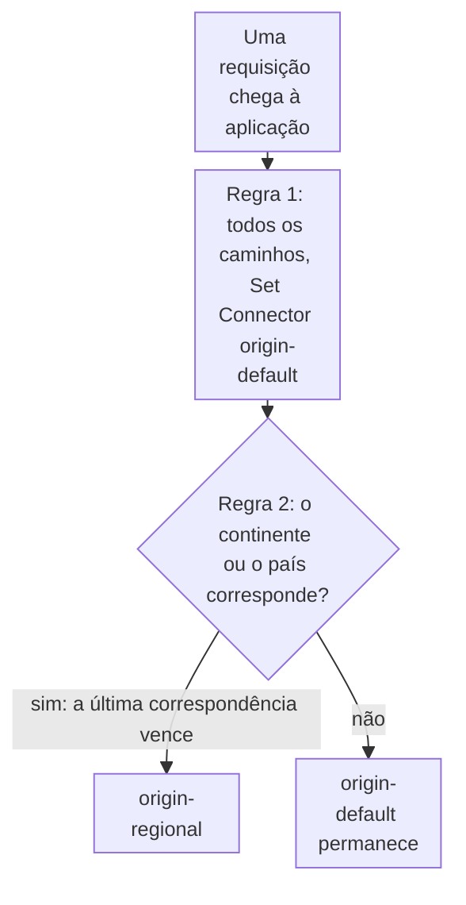

import DocCardGroup from '@aziontech/webkit/doc-card-group'
import DocCard from '@aziontech/webkit/doc-card'
import DocSteps from '@aziontech/webkit/doc-steps'
import DocStep from '@aziontech/webkit/doc-step'
import Tabs from '~/components/webkit/Tabs.vue'

Você envia as requisições de um continente, ou de uma lista de países, a um connector regional com uma regra de geolocalização, pelo Azion Console, pela API ou pela Azion CLI. Para dar a um connector uma origem de backup que recebe as requisições quando a sua origem primária falha, consulte [Adicione uma origem de backup a um connector](/pt-br/documentacao/guias/performance-e-confiabilidade/disponibilidade/adicionar-uma-origem-de-backup-a-um-connector/).

Uma regra de geolocalização lê a localização do endereço IP do cliente na Request Phase e nomeia um connector com _Set Connector_. _Set Connector_ não se acumula entre regras: quando várias regras que correspondem o carregam, somente o da última regra que corresponde é executado. Uma regra padrão que envia todos os caminhos a um connector vem, portanto, primeiro, e cada regra de geolocalização vem depois dela e substitui o padrão para as requisições a que corresponde.



1. Toda requisição corresponde à primeira regra, que define `origin-default`.
2. Uma requisição do continente ou dos países da segunda regra também corresponde a ela, que define `origin-regional`, e a regra posterior vence.
3. Qualquer outra requisição mantém `origin-default`.

---

## Pré-requisitos

- Uma aplicação servida por um workload, com uma primeira regra cujo behavior _Set Connector_ envia todas as requisições, `${uri}` _starts with_ `/`, ao connector padrão. Para criá-los, consulte [Primeiros passos com Applications](/pt-br/documentacao/plataforma/applications/primeiros-passos/).
- Um segundo connector, para a região. Para criar um, consulte [Primeiros passos com Connectors](/pt-br/documentacao/plataforma/connectors/primeiros-passos/).
- Um [personal token](/pt-br/documentacao/guias/plataforma/conta-e-billing/personal-tokens/), para os procedimentos pela API.
- A [Azion CLI](/pt-br/documentacao/devtools/cli/) instalada e autorizada, para os procedimentos pela CLI.

Os exemplos usam `origin-default` para o connector padrão, `origin-regional` com o ID `<connector-id>` para o regional e a aplicação `<application-id>`. Substitua-os pelos seus valores.

---

## Crie a regra de geolocalização

O critério nomeia a localização a corresponder. O Rules Engine a lê do endereço IP do cliente, e as variáveis e os operadores abaixo não exigem nenhum Produto na aplicação:

| Para corresponder a | Variável | Operador | Argumento |
| --- | --- | --- | --- |
| Um continente | `${geoip_continent_code}`, o código de continente de duas letras | _is equal_, `is_equal` | Um código como `NA`, para a América do Norte |
| Um país | `${geoip_country_code}`, o código de país de duas letras | _is equal_, `is_equal` | Um código como `RU`, para a Rússia |
| Uma lista de países | `${geoip_country_code}` | _matches_, `matches` | Uma expressão regular de códigos de país, como `^(BR\|AR)$` |

Um código de continente é geografia, não uma jurisdição. Quando uma regra deve seguir os países que uma lei ou um contrato nomeia, corresponda à lista de países. As variáveis `${geoip_city_*}` leem outra base de geolocalização, `geoip_city`. Para todas as variáveis de geolocalização, consulte [Variáveis](/pt-br/documentacao/plataforma/applications/rules-engine/#variaveis).

Os procedimentos correspondem ao continente `NA`. Para uma lista de países, troque o critério pelo da tabela.

<Tabs client:visible sharedStore="interface">
<Fragment slot="tab.console">Console</Fragment>
<Fragment slot="tab.api">API</Fragment>
<Fragment slot="tab.cli">CLI</Fragment>

<Fragment slot="panel.console">

Para criar a regra no Azion Console:

<DocSteps>
  <DocStep title="Vá para a aba Rules Engine">

  Acesse [Azion Console](https://console.azion.com/) > **Applications** > **sua aplicação** e vá para a aba **Rules Engine**.

  </DocStep>
  <DocStep title="Selecione + Rule" />
  <DocStep title="Nomeie a regra">

  Insira um nome que identifique a região. Por exemplo: `geo - north america`.

  </DocStep>
  <DocStep title="Selecione Request Phase" />
  <DocStep title="Corresponda ao continente">

  Na seção **Criteria**, defina o critério como `${geoip_continent_code}` _is equal_ `NA`.

  </DocStep>
  <DocStep title="Defina o connector">

  Na seção **Behaviors**, selecione **Set Connector** e, em seguida, selecione `origin-regional`.

  </DocStep>
  <DocStep title="Selecione Save" />
</DocSteps>

A regra aparece na lista **Request** da aba **Rules Engine**.

</Fragment>

<Fragment slot="panel.api">

Os critérios carregam `${geoip_continent_code}`, que um shell expande, então o corpo é enviado de um arquivo. Para criar a regra:

<DocSteps>
  <DocStep title="Escreva a regra em um arquivo">

  Salve o conteúdo a seguir como `rule.json`, com o ID de `origin-regional` em `attributes.value`:

  ```json
  {
    "name": "geo - north america",
    "active": true,
    "criteria": [[{ "variable": "${geoip_continent_code}", "conditional": "if", "operator": "is_equal", "argument": "NA" }]],
    "behaviors": [{ "type": "set_connector", "attributes": { "value": <connector-id> } }]
  }
  ```

  </DocStep>
  <DocStep title="Envie a requisição de criação">

  ```bash
  curl --request POST \
    --url https://api.azion.com/v4/workspace/applications/<application-id>/request_rules \
    --header 'Accept: application/json' \
    --header 'Authorization: Token <personal-token>' \
    --header 'Content-Type: application/json' \
    --data @rule.json
  ```

  </DocStep>
</DocSteps>

A API responde `202` com `"state": "pending"` e a regra como foi armazenada, com o seu `id` e a sua `order` na fase.

</Fragment>

<Fragment slot="panel.cli">

A CLI lê a regra de um arquivo JSON. Para criar a regra:

<DocSteps>
  <DocStep title="Escreva a regra em um arquivo">

  Salve o conteúdo a seguir como `rule.json`, com o ID de `origin-regional` em `attributes.value`:

  ```json
  {
    "name": "geo - north america",
    "active": true,
    "criteria": [[{ "variable": "${geoip_continent_code}", "conditional": "if", "operator": "is_equal", "argument": "NA" }]],
    "behaviors": [{ "type": "set_connector", "attributes": { "value": <connector-id> } }]
  }
  ```

  </DocStep>
  <DocStep title="Crie a regra">

  ```bash
  azion create rules-engine --application-id <application-id> --phase request --file rule.json
  ```

  O comando imprime o ID da regra:

  ```text
  Created Rules Engine with ID <rule-id>
  ```

  </DocStep>
</DocSteps>

</Fragment>
</Tabs>

As requisições da América do Norte vão para `origin-regional` quando a regra se propaga, e todas as outras requisições mantêm `origin-default`. Uma regra nova leva alguns minutos para chegar a todos os data centers.

No caso de uso [Rotear usuários para origens regionais](/pt-br/documentacao/casos-de-uso/melhorar-performance-e-confiabilidade/rotear-usuarios-para-origens-regionais/), esta seção usa estes valores:

| Configuração | Valor |
| --- | --- |
| **Nome da regra** | `geo - europe` |
| **Critério** | `${geoip_continent_code}` _is equal_ `EU` |
| **Behavior** | **Set Connector** com `origin-eu`, cujo ID vai em `attributes.value` na API |
| **Posição** | depois da regra padrão que envia todos os caminhos para `origin-us`, então o seu `order` é maior que o da regra padrão |

As requisições da Europa vão para `origin-eu`, e todas as outras para `origin-us`.

---

## Mantenha a regra de geolocalização depois da regra padrão

A plataforma cria uma regra nova no fim da sua fase, que é a posição de que uma regra de geolocalização precisa. Uma lista reordenada pode deixar a regra padrão por último, e ela então envia de novo todas as requisições a `origin-default`, sem mudança em nenhuma regra. Verifique a ordem depois de cada mudança na lista.

<Tabs client:visible sharedStore="interface">
<Fragment slot="tab.console">Console</Fragment>
<Fragment slot="tab.api">API</Fragment>
<Fragment slot="tab.cli">CLI</Fragment>

<Fragment slot="panel.console">

Para verificar a ordem no Azion Console:

<DocSteps>
  <DocStep title="Vá para a aba Rules Engine">

  Acesse [Azion Console](https://console.azion.com/) > **Applications** > **sua aplicação** e vá para a aba **Rules Engine**.

  </DocStep>
  <DocStep title="Encontre a regra de geolocalização na lista Request">

  `geo - north america` fica depois da regra padrão. Se não ficar, mova-a para baixo da regra padrão.

  </DocStep>
</DocSteps>

</Fragment>

<Fragment slot="panel.api">

Para definir a ordem, envie os IDs das regras da fase na nova ordem, a regra padrão primeiro, no array `order`:

```bash
curl --request PUT \
  --url https://api.azion.com/v4/workspace/applications/<application-id>/request_rules/order \
  --header 'Accept: application/json' \
  --header 'Authorization: Token <personal-token>' \
  --header 'Content-Type: application/json' \
  --data '{ "order": [<default-rule-id>, <geo-rule-id>] }'
```

A lista deve nomear todas as regras da fase. O campo `order` de cada regra passa então a guardar a sua nova posição, a partir de `0`.

</Fragment>

<Fragment slot="panel.cli">

Para ler a ordem, liste as regras da fase com a sua posição:

```bash
azion list rules-engine --application-id <application-id> --phase request --details
```

A saída adiciona as colunas `ORDER`, `PHASE` e `ACTIVE` às colunas `ID` e `NAME`. `ORDER` começa em `0`, e a regra de geolocalização deve ter um número maior que o da regra padrão.

Para definir a ordem, passe todos os IDs de regra da fase, a regra padrão primeiro:

```bash
azion update rules-engine-order --application-id <application-id> --phase request --rule-ids "<default-rule-id>,<geo-rule-id>"
```

O comando confirma a nova ordem:

```text
Ordered Rules Engine of Application with ID <application-id>
```

</Fragment>
</Tabs>

A regra de geolocalização é executada depois da regra padrão, então o seu connector vence para as requisições a que ela corresponde.

:::note[nota]
A cache key padrão guarda o esquema, o host e o caminho, e nenhuma localização. Quando as origens regionais respondem o mesmo caminho com conteúdos diferentes, um cache setting aplicado a esse caminho pode servir a cópia de uma região a outra. Para o formato da key, consulte [Cache keys](/pt-br/documentacao/plataforma/applications/cache/cache-keys/).
:::

Para testar a regra, envie uma requisição de uma máquina na região a que ela corresponde, porque a regra lê a localização do endereço IP do cliente. Para ver quais regras foram executadas em uma requisição, ative [Debug Rules](/pt-br/documentacao/plataforma/applications/main-settings/#debug-rules).

---

## Confirme qual região respondeu

A regra lê a localização do endereço IP do cliente, então cada verificação roda a partir de uma máquina na região que ela testa. A verificação lê um header de resposta que nomeia a região da origem. O exemplo envia as requisições da Europa a um connector e todas as outras a outro, em `www.example.com`, e cada origem adiciona um header de resposta `X-Origin-Region` com o valor `us` ou `eu`. Substitua cada valor pelo seu.

A partir de uma máquina fora da Europa, envie várias requisições:

```bash
curl -s -D - -o /dev/null https://www.example.com/
```

Todas as respostas carregam `x-origin-region: us`. Em HTTP/2, os nomes dos headers chegam em minúsculas. A partir de uma máquina na Europa, a mesma requisição carrega `x-origin-region: eu`.

Para comparar a localização que a Azion leu com a origem que respondeu, acesse [Azion Console](https://console.azion.com/) > **Real-Time Events**, selecione a fonte de dados _HTTP Requests_ e informe `host='www.example.com'` em **Filter by**. Cada registro das suas requisições carrega **Geoloc Country Name** e **Upstream Addr**, o endereço da origem que respondeu. Para a sintaxe do filtro, consulte [Filtrar eventos](/pt-br/documentacao/guias/plataforma/observabilidade/adicionar-filtros-events/).

Estas verificações confirmam o caso de uso [Rotear usuários para origens regionais](/pt-br/documentacao/casos-de-uso/melhorar-performance-e-confiabilidade/rotear-usuarios-para-origens-regionais/).

---

## Próximos passos

<DocCardGroup cols={2}>
  <DocCard title="Rules Engine para Applications" href="/pt-br/documentacao/plataforma/applications/rules-engine/#variaveis" label="Todas as variáveis de geolocalização que uma regra lê, do continente à região." />
  <DocCard title="Como Applications funciona" href="/pt-br/documentacao/plataforma/applications/como-funciona/#behaviors-que-se-repetem" label="Por que o último Set Connector que corresponde vence, e como a ordem das regras define um padrão." />
  <DocCard title="Métodos de balanceamento" href="/pt-br/documentacao/plataforma/connectors/load-balancer/metodos-de-balanceamento/#funcao-do-servidor" label="Dê a um connector regional uma origem de backup com as funções Primary e Backup." />
  <DocCard title="Rotear usuários para origens regionais" href="/pt-br/documentacao/casos-de-uso/melhorar-performance-e-confiabilidade/rotear-usuarios-para-origens-regionais/" label="Envie usuários europeus a uma origem europeia, com uma região de backup só onde a residência de dados permite." />
</DocCardGroup>
