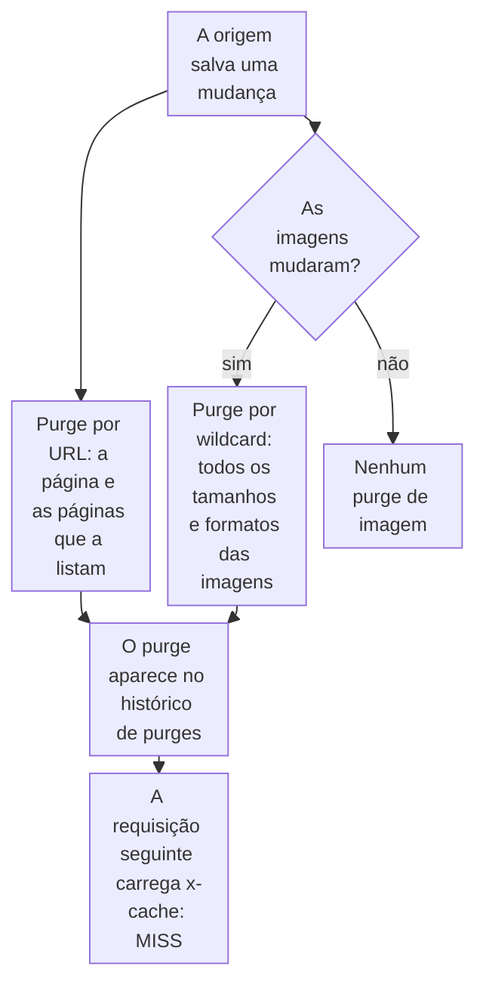

import DocCardGroup from '@aziontech/webkit/doc-card-group'
import DocCard from '@aziontech/webkit/doc-card'
import DocSteps from '@aziontech/webkit/doc-steps'
import DocStep from '@aziontech/webkit/doc-step'
import Tabs from '~/components/webkit/Tabs.vue'

Você faz um sistema de publicação, como um CMS, uma plataforma de e-commerce ou um pipeline de build, purgar as páginas que ele muda pela Azion API ou pela Azion CLI, e envia o mesmo purge manualmente pelo Azion Console. Para um purge avulso de qualquer tipo, consulte [Purgue conteúdo em cache](/pt-br/documentacao/guias/performance-e-confiabilidade/cache-e-purge/purgar-conteudo-em-cache/).

Uma mudança publicada só chega aos visitantes depois que a cópia em cache sai do cache. O sistema de publicação sabe quais páginas mudaram, então ele envia o purge no momento em que as salva, e o TTL do cache fica como um limite de segurança para um purge que não for enviado.



1. A cada salvamento, o sistema de publicação envia um purge por URL da página alterada e das páginas que a listam.
2. Só quando o salvamento muda imagens, ele também envia um purge por wildcard de todos os tamanhos e formatos dessas imagens.
3. Cada purge aparece no histórico de purges quando termina, e a requisição seguinte por cada objeto chega à origem.

---

## Pré-requisitos

- Um domínio que pertença à sua conta, servido por uma aplicação. Um purge de qualquer outro domínio é rejeitado com o erro `30003`.
- Um [personal token](/pt-br/documentacao/guias/plataforma/conta-e-billing/personal-tokens/) para a API e a CLI. Um token expira 1 dia depois de criado, a menos que você escolha uma expiração maior, então defina uma que cubra o tempo em que o sistema de publicação roda e substitua o token antes que ele expire.
- A [Azion CLI](/pt-br/documentacao/devtools/cli/) instalada e autorizada, para o procedimento pela CLI.
- Acesso ao Azion Console, para o procedimento pelo Console. Consulte [Acesse o Azion Console](/pt-br/documentacao/guias/plataforma/conta-e-billing/como-acessar-o-azion-console/).

Os exemplos purgam a página de produto `https://www.example.com/products/blue-shirt`, a sua página de categoria `https://www.example.com/category/shirts` e as imagens em `www.example.com/media/blue-shirt`. Substitua-os pelos objetos que o seu salvamento muda.

---

## Purgue as páginas alteradas a cada salvamento

Um purge por URL remove as URLs exatas que lista. Ele não é recursivo, então liste cada página que a mudança afeta: a própria página e cada página que mostra o conteúdo alterado, como uma página de categoria ou uma página inicial. Uma requisição carrega até 50 URLs. Uma URL sem esquema purga as cópias HTTP e HTTPS.

<Tabs client:visible sharedStore="interface">
<Fragment slot="tab.console">Console</Fragment>
<Fragment slot="tab.api">API</Fragment>
<Fragment slot="tab.cli">CLI</Fragment>

<Fragment slot="panel.console">

Para enviar o purge por URL manualmente:

<DocSteps>
  <DocStep title="Abra o Real-Time Purge">

  Acesse [Azion Console](https://console.azion.com/) > **Products Menu** > **Real-Time Purge**.

  </DocStep>
  <DocStep title="Selecione New Purge" />
  <DocStep title="Escolha o tipo de purge por URL e a camada Cache" />
  <DocStep title="Insira as URLs">

  Insira uma URL por item: `https://www.example.com/products/blue-shirt` e `https://www.example.com/category/shirts`.

  </DocStep>
  <DocStep title="Selecione Purge" />
</DocSteps>

Uma mensagem confirma a criação, e a Azion coloca o purge na fila.

</Fragment>

<Fragment slot="panel.api">

Para enviar o purge por URL pelo sistema de publicação, chame o caminho de purge `url` com o token:

```bash
curl --request POST \
  --url https://api.azion.com/v4/workspace/purge/url \
  --header 'Authorization: Token <personal-token>' \
  --header 'Content-Type: application/json' \
  --data '{"items":["https://www.example.com/products/blue-shirt","https://www.example.com/category/shirts"],"layer":"cache"}'
```

A API responde com HTTP `201` e `state` igual a `executed`:

```json
{"state":"executed","data":{"items":["https://www.example.com/products/blue-shirt","https://www.example.com/category/shirts"],"layer":"cache"}}
```

</Fragment>

<Fragment slot="panel.cli">

Para enviar o purge por URL a partir de um script, passe as URLs em uma lista separada por vírgulas:

```bash
azion purge --urls "https://www.example.com/products/blue-shirt,https://www.example.com/category/shirts"
```

O comando imprime uma linha:

```text
Purge carried out successfully
```

</Fragment>
</Tabs>

As páginas listadas saem do cache quando o purge se propaga. Um purge por URL não alcança as cópias que variam por cookie, device group ou formato de imagem, e a próxima seção trata desse caso para imagens.

O caso de uso [Criar vitrines de e-commerce](/pt-br/documentacao/casos-de-uso/construir-e-executar-aplicacoes/criar-vitrines-de-e-commerce/) usa os valores deste exemplo.

---

## Purgue as variações de imagem quando uma imagem muda

O Image Processor guarda em cache uma cópia de uma imagem por tamanho e por formato, e um purge por URL não alcança nenhuma dessas cópias. Um purge por wildcard terminado em `*` alcança todas. Envie-o só quando o salvamento muda uma imagem: a Azion aceita 2.000 requisições de purge por wildcard em um intervalo de 24 horas, e um wildcard a cada salvamento de um catálogo grande pode chegar a esse limite. Uma requisição carrega uma expressão de até 256 caracteres.

<Tabs client:visible sharedStore="interface">
<Fragment slot="tab.console">Console</Fragment>
<Fragment slot="tab.api">API</Fragment>
<Fragment slot="tab.cli">CLI</Fragment>

<Fragment slot="panel.console">

Para enviar o purge por wildcard manualmente:

<DocSteps>
  <DocStep title="Abra o Real-Time Purge">

  Acesse [Azion Console](https://console.azion.com/) > **Products Menu** > **Real-Time Purge**.

  </DocStep>
  <DocStep title="Selecione New Purge" />
  <DocStep title="Escolha o tipo de purge por wildcard e a camada Cache" />
  <DocStep title="Insira a expressão">

  Insira `www.example.com/media/blue-shirt*`.

  </DocStep>
  <DocStep title="Selecione Purge" />
</DocSteps>

Uma mensagem confirma a criação, e a Azion coloca o purge na fila.

</Fragment>

<Fragment slot="panel.api">

Para enviar o purge por wildcard, chame o caminho de purge `wildcard` com uma expressão:

```bash
curl --request POST \
  --url https://api.azion.com/v4/workspace/purge/wildcard \
  --header 'Authorization: Token <personal-token>' \
  --header 'Content-Type: application/json' \
  --data '{"items":["www.example.com/media/blue-shirt*"]}'
```

A API responde com HTTP `201` e, sem `layer`, purga `cache`:

```json
{"state":"executed","data":{"items":["www.example.com/media/blue-shirt*"],"layer":"cache"}}
```

</Fragment>

<Fragment slot="panel.cli">

Para enviar o purge por wildcard a partir de um script:

```bash
azion purge --wildcard "www.example.com/media/blue-shirt*"
```

O comando imprime uma linha:

```text
Purge carried out successfully
```

</Fragment>
</Tabs>

Todos os tamanhos e formatos das imagens alteradas saem do cache. Quando o sistema de publicação conhece as variações exatas que serve, um purge por cache key que lista cada key faz o mesmo trabalho sem contar no limite de wildcard. Uma key carrega os argumentos de processamento depois de `?` e o formato depois de `@@`, como em `httpswww.example.com/media/blue-shirt.jpg?ims=400x@@webp`. Para o formato, consulte [Cache keys](/pt-br/documentacao/plataforma/applications/cache/cache-keys/).

:::caution[Atenção]
Purges por URL e por wildcard limpam só a camada do Cache. Em uma aplicação cuja cache setting tem o [Tiered Cache](/pt-br/documentacao/plataforma/applications/cache/tiered-cache/) ativado, purgue primeiro a camada do Tiered Cache com um purge por cache key e depois a camada do Cache, para que o cache não seja preenchido de novo a partir de uma cópia desatualizada. Para os passos, consulte [Purgue conteúdo em cache](/pt-br/documentacao/guias/performance-e-confiabilidade/cache-e-purge/purgar-conteudo-em-cache/#escolha-o-tipo-de-purge).
:::

No caso de uso [Criar e operar sites de marketing](/pt-br/documentacao/casos-de-uso/construir-e-executar-aplicacoes/criar-e-operar-sites-de-marketing/), esta seção usa estes valores:

| Purge | Quando | Itens |
| --- | --- | --- |
| Wildcard, na camada Cache | Uma vez por push, depois que o deploy dele termina | `www.example.com/*`, todas as páginas do domínio |

Todas as páginas de `www.example.com` saem do cache assim que o purge se propaga, e a requisição seguinte por cada uma lê o novo build. Para confirmar que um purge terminou, encontre-o no histórico de purges, como [Confirme que o purge terminou](#confirme-que-o-purge-terminou) descreve.

O caso de uso [Criar vitrines de e-commerce](/pt-br/documentacao/casos-de-uso/construir-e-executar-aplicacoes/criar-vitrines-de-e-commerce/) usa os valores deste exemplo.

---

## Confirme que o purge terminou

Um `201` da API significa que o purge foi aceito, não que ele se propagou. A Azion lista um purge no histórico de purges quando ele termina. Para confirmar:

<DocSteps>
  <DocStep title="Abra o Real-Time Purge">

  Acesse [Azion Console](https://console.azion.com/) > **Products Menu** > **Real-Time Purge**.

  </DocStep>
  <DocStep title="Encontre o purge no histórico">

  O histórico lista cada purge concluído e pode ser filtrado pelo usuário que o fez, pelo horário, pela lista de argumentos, pelo tipo de purge e pelo método. Filtre pela lista de argumentos para encontrar a URL ou a expressão que você enviou.

  </DocStep>
  <DocStep title="Requisite a página com o header de debug">

  ```bash
  curl -sI -H "Pragma: azion-debug-cache" https://www.example.com/products/blue-shirt
  ```

  </DocStep>
  <DocStep title="Leia o status de cache">

  A resposta carrega `MISS`, porque a Azion buscou a página na origem de novo:

  ```http
  x-cache: MISS from 192.0.2.10 with HTTP/2.0
  ```

  </DocStep>
</DocSteps>

O purge está no histórico, e a página servida depois dele é a versão que a origem publicou. A requisição seguinte volta a carregar `HIT`.

:::note[nota]
Um sistema de publicação que salva muitos objetos de uma vez, como uma importação de catálogo, envia as URLs em lotes de 50 ou menos. A Azion aceita 10.000 objetos de URL e de cache key a cada 60 segundos. Para todos os limites de purge, consulte [Limites do Real-Time Purge](/pt-br/documentacao/plataforma/applications/cache/real-time-purge/#limites).
:::

No caso de uso [Criar e operar sites de marketing](/pt-br/documentacao/casos-de-uso/construir-e-executar-aplicacoes/criar-e-operar-sites-de-marketing/), espere:

- **Um push chega à página.** Mude o texto da página `/about/`, faça o commit e o push. Espere o deploy terminar, envie o purge por wildcard e requisite a página de novo. A resposta carrega `x-cache: MISS` e o novo texto, e a requisição seguinte carrega `HIT`.

Estas verificações confirmam o caso de uso [Criar vitrines de e-commerce](/pt-br/documentacao/casos-de-uso/construir-e-executar-aplicacoes/criar-vitrines-de-e-commerce/).

---

## Próximos passos

<DocCardGroup cols={2}>
  <DocCard title="Purgue conteúdo em cache" href="/pt-br/documentacao/guias/performance-e-confiabilidade/cache-e-purge/purgar-conteudo-em-cache/" label="Purgue por cache key, purgue a camada do Tiered Cache e purgue objetos que variam." />
  <DocCard title="Real-Time Purge" href="/pt-br/documentacao/plataforma/applications/cache/real-time-purge/" label="Todos os tipos de purge, as variações que cada um alcança, os erros e os limites." />
  <DocCard title="Criar vitrines de e-commerce" href="/pt-br/documentacao/casos-de-uso/construir-e-executar-aplicacoes/criar-vitrines-de-e-commerce/" label="Uma vitrine que purga páginas de produto pela plataforma de e-commerce a cada salvamento." />
  <DocCard title="Azion CLI purge" href="/pt-br/documentacao/devtools/cli/purge/" label="Todas as flags do comando azion purge." />
  <DocCard title="Criar e operar sites de marketing" href="/pt-br/documentacao/casos-de-uso/construir-e-executar-aplicacoes/criar-e-operar-sites-de-marketing/" label="Um site de marketing implantado a partir do GitHub a cada push e purgado por wildcard depois de cada deploy." />
</DocCardGroup>
