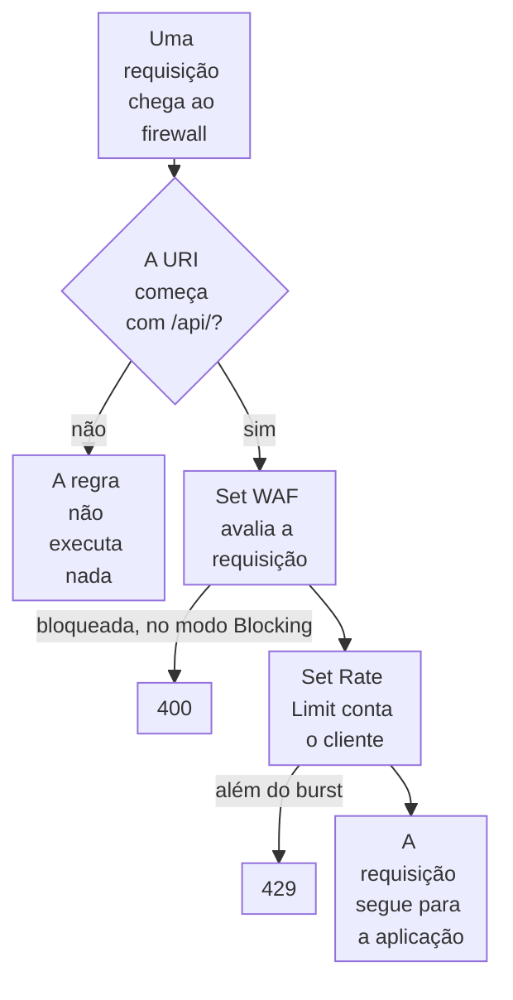

import DocCardGroup from '@aziontech/webkit/doc-card-group'
import DocCard from '@aziontech/webkit/doc-card'
import DocSteps from '@aziontech/webkit/doc-steps'
import DocStep from '@aziontech/webkit/doc-step'
import Tabs from '~/components/webkit/Tabs.vue'

Você aplica um rule set do WAF e um rate limit a um caminho de um workload, como `/api/`, com uma regra de firewall, pelo Azion Console, pela Azion CLI ou pela API. Para aplicar um rule set a toda requisição, consulte [Aplique um rule set a toda requisição](/pt-br/documentacao/guias/seguranca-de-aplicacoes/firewall-e-waf/aplicar-rule-set/), e para aplicar um rate limit aos clientes de uma network list, consulte [Aplique um rate limit aos endereços de uma lista](/pt-br/documentacao/guias/seguranca-de-aplicacoes/bots-e-rede/rate-limit-lista/).

Um caminho como uma API ou um formulário de login precisa de proteções de que o resto do domínio não precisa. O WAF é cobrado pelas requisições que avalia, então uma regra limitada ao caminho avalia só esse tráfego, e o rate limit dela conta só as requisições a esse caminho.



1. O firewall compara a URI da requisição com o caminho. Uma requisição a qualquer outro caminho não corresponde, e a regra não executa nada nela.
2. Na correspondência, _Set WAF_ avalia a requisição contra o rule set. No modo _Blocking_, uma requisição que o rule set bloqueia recebe `400`.
3. _Set Rate Limit_ então conta a requisição contra a taxa do endereço IP do cliente. Uma requisição além do burst recebe `429`.
4. Uma requisição que passa pelos dois segue para a aplicação.

---

## Pré-requisitos

- Um firewall vinculado ao workload que serve o caminho, com o WAF ativado nas configurações principais. Para vinculá-lo, consulte [Vincule um firewall a um workload](/pt-br/documentacao/guias/seguranca-de-aplicacoes/firewall-e-waf/proteja-seu-dominio/), e para ativar o WAF, consulte [Defina as configurações principais de um firewall](/pt-br/documentacao/guias/seguranca-de-aplicacoes/firewall-e-waf/firewall-definir-main-settings/).
- Um rule set do WAF, e o ID dele para a CLI e a API. Para criar um, consulte [Crie um rule set em sensibilidade média](/pt-br/documentacao/guias/seguranca-de-aplicacoes/firewall-e-waf/rule-set-medio/).
- Um [personal token](/pt-br/documentacao/guias/plataforma/conta-e-billing/personal-tokens/), para a API e a CLI.
- A [Azion CLI](/pt-br/documentacao/devtools/cli/) instalada e autorizada, para o procedimento pela CLI.
- Acesso ao Azion Console, para o procedimento pelo Console. Consulte [Acesse o Azion Console](/pt-br/documentacao/guias/plataforma/conta-e-billing/como-acessar-o-azion-console/).

Os exemplos protegem `/api/` em `www.example.com` com o rule set `<waf-id>`, no firewall `<firewall-id>`. Substitua-os pelo seu caminho, rule set e firewall.

---

## Crie a regra para o caminho

O critério é `Request Uri` _starts with_ `/api/`, que também corresponde a caminhos mais profundos, como `/api/v1/orders`. Corresponda à URI, não à query string: uma variável vazia não corresponde, então `Request Args` _matches_ `.*` ignora todo `POST` cujo payload fica no corpo. Os comportamentos seguem uma ordem fixa. _Set WAF_ é um dos dois comportamentos que outro comportamento pode seguir, e escolher _Set Rate Limit_ remove todo comportamento depois dele, então _Set WAF_ vem primeiro.

_Set WAF_ começa em _Logging_, que avalia, registra e serve cada requisição, porque os registros mostram o que o rule set sinaliza no seu próprio tráfego. A taxa é de `10` requisições por segundo por endereço IP de cliente, com um burst de `10`. As requisições acima da taxa entram em fila e são liberadas na taxa, e só as requisições simultâneas além do burst recebem `429`. Mantenha o burst em até dez vezes a taxa, para que a fila guarde no máximo 10 segundos de tráfego.

<Tabs client:visible sharedStore="interface">
<Fragment slot="tab.console">Console</Fragment>
<Fragment slot="tab.cli">CLI</Fragment>
<Fragment slot="tab.api">API</Fragment>

<Fragment slot="panel.console">

Para criar a regra no Azion Console:

<DocSteps>
  <DocStep title="Abra o firewall vinculado ao seu workload">

  Acesse [Azion Console](https://console.azion.com/) > **Firewalls** e selecione o firewall.

  </DocStep>
  <DocStep title="Selecione a aba Rules Engine" />
  <DocStep title="Selecione + Rule" />
  <DocStep title="Nomeie a regra">

  Insira `api - waf and rate limit`.

  </DocStep>
  <DocStep title="Defina o critério">

  Na seção **Criteria**, selecione a variável `Request Uri`, o operador _starts with_ e `/api/` como argumento.

  </DocStep>
  <DocStep title="Adicione o comportamento Set WAF">

  Na seção **Behaviors**, selecione **Set WAF**, depois o seu rule set e _Logging_ como modo.

  </DocStep>
  <DocStep title="Adicione o comportamento Set Rate Limit">

  Selecione **Add Behavior** e depois **Set Rate Limit**. Defina **Rate Limit Type** como _Req/s_ e **Limit By** como _Client IP address_. Insira `10` em **Average Rate Limit** e `10` em **Maximum Burst Size**.

  </DocStep>
  <DocStep title="Selecione Save" />
</DocSteps>

A regra aparece na aba **Rules Engine**, abaixo das regras criadas antes dela.

</Fragment>

<Fragment slot="panel.cli">

Para criar a regra com a Azion CLI, salve-a como `rule.json`, com o ID do seu rule set em `waf_id`:

```json
{
  "name": "api - waf and rate limit",
  "active": true,
  "criteria": [
    [
      { "variable": "${request_uri}", "conditional": "if", "operator": "starts_with", "argument": "/api/" }
    ]
  ],
  "behaviors": [
    { "type": "set_waf", "attributes": { "waf_id": <waf-id>, "mode": "logging" } },
    { "type": "set_rate_limit", "attributes": { "type": "second", "limit_by": "client_ip", "average_rate_limit": 10, "maximum_burst_size": 10 } }
  ]
}
```

Depois crie a regra a partir do arquivo:

```bash
azion create firewall-rule --firewall-id <firewall-id> --file rule.json
```

O comando imprime o ID da nova regra:

```text
Created Firewall Rule with ID <rule-id>
```

</Fragment>

<Fragment slot="panel.api">

Para criar a regra com a API, envie os dois comportamentos em ordem, com o ID do seu rule set em `waf_id`:

```bash
curl --request POST \
  --url https://api.azion.com/v4/workspace/firewalls/<firewall-id>/request_rules \
  --header 'Authorization: Token <personal-token>' \
  --header 'Content-Type: application/json' \
  --data '{
  "name": "api - waf and rate limit",
  "active": true,
  "criteria": [
    [{ "variable": "${request_uri}", "conditional": "if", "operator": "starts_with", "argument": "/api/" }]
  ],
  "behaviors": [
    { "type": "set_waf", "attributes": { "waf_id": <waf-id>, "mode": "logging" } },
    { "type": "set_rate_limit", "attributes": { "type": "second", "limit_by": "client_ip", "average_rate_limit": 10, "maximum_burst_size": 10 } }
  ]
}'
```

A API responde `202` com `state` igual a `pending` e acrescenta a `order` que a regra ocupa entre as regras do firewall:

```text
{"state":"pending","data":{"id":<rule-id>,…,"description":"","order":<order>}}
```

Um comportamento `set_waf` enviado sem `mode` é recusado com `400` e `10059 Required Field`, e um `waf_id` que não nomeia nenhum rule set, com `25036 Invalid Informed WAF`.

</Fragment>
</Tabs>

Toda requisição a `/api/` é avaliada pelo rule set e contada contra a taxa antes de chegar à aplicação. Esta regra não avalia nem conta as requisições a nenhum outro caminho. Para recusar o que o rule set sinaliza, mude o modo para _Blocking_ quando 3 dias de **Tuning** não tiverem nenhuma requisição que deveria ter sido servida, como descreve [Mude um rule set para blocking](/pt-br/documentacao/guias/seguranca-de-aplicacoes/firewall-e-waf/mudar-para-blocking/).

:::note[nota]
Uma regra mantém um rate limit para tudo o que os critérios dela correspondem, então uma regra que corresponde a dois caminhos por `or` compartilha um limite entre eles, e um limite separado por caminho exige uma regra por caminho. Quando o caminho já tem uma regra com _Set WAF_, ou outra regra precisa rodar antes do limite, coloque _Set Rate Limit_ em uma regra própria com o mesmo critério, na última posição. Um firewall executa as regras em ordem, a API atribui `order` na ordem de criação, e a lista **Rules Engine** no Azion Console pode ser reordenada.
:::

---

## Confirme que a regra age no caminho

Uma regra que você adiciona chega ao tráfego de 6 minutos e 29 segundos a 9 minutos e 18 segundos depois de salva, e até lá as requisições alternam entre a resposta anterior e a nova. Repita cada verificação até que as respostas concordem.

Para confirmar os dois comportamentos:

1. Envie 30 requisições simultâneas ao caminho a partir de um endereço:

   ```bash
   seq 30 | xargs -P 30 -I{} curl -s -o /dev/null -w '%{http_code}\n' https://www.example.com/api/
   ```

   Algumas das respostas imprimem `429`: as requisições simultâneas além do burst de `10`. Uma requisição recusada recebe a página de erro padrão da Azion, sem nenhum header de rate limit:

   ```text
   HTTP/2 429
   content-type: text/html; charset=utf-8
   x-azion-request-id: <request-id>

   <title>Azion - Default error page</title> ... Too Many Requests ... Status Code 429
   ```

2. Envie as mesmas 30 requisições a um caminho fora de `/api/`. Nenhuma delas imprime `429`, porque a regra não corresponde a esse caminho.

3. Envie ao caminho uma requisição com uma query string em formato de injeção:

   ```bash
   curl -i "https://www.example.com/api/?q=1%27%20OR%20%271%27%3D%271"
   ```

   Em _Logging_, a aplicação responde normalmente, e o `x-azion-request-id` da requisição encontra o registro dela no WAF. Depois da mudança para _Blocking_, a mesma requisição recebe:

   ```text
   HTTP/2 400
   ```

A regra recusa com `429` as requisições a `/api/` além do burst e registra o que o rule set sinaliza no caminho. Nenhuma resposta nomeia o firewall nem traz um tempo de nova tentativa, então o `x-azion-request-id` de uma requisição recusada é o que leva ao registro dela. Para lê-lo, consulte [Encontre o score de uma requisição bloqueada](/pt-br/documentacao/guias/seguranca-de-aplicacoes/firewall-e-waf/como-encontrar-score-de-requisicoes-bloqueadas-pelo-waf/).

---

## Próximos passos

<DocCardGroup cols={2}>
  <DocCard title="Mude um rule set para blocking" href="/pt-br/documentacao/guias/seguranca-de-aplicacoes/firewall-e-waf/mudar-para-blocking/" label="Mude o comportamento Set WAF desta regra de Logging para Blocking." />
  <DocCard title="Rules Engine para Firewall" href="/pt-br/documentacao/plataforma/firewall/rules-engine/#set-rate-limit" label="Cada atributo de Set Rate Limit e Set WAF, e os erros que uma regra retorna." />
  <DocCard title="Boas práticas de Firewall" href="/pt-br/documentacao/plataforma/firewall/boas-praticas/#mantenha-o-burst-de-um-rate-limit-em-ate-dez-vezes-a-taxa-media" label="Dimensione o burst em relação à taxa média antes que a regra chegue ao tráfego." />
  <DocCard title="Aplique um rate limit aos endereços de uma lista" href="/pt-br/documentacao/guias/seguranca-de-aplicacoes/bots-e-rede/rate-limit-lista/" label="Limite a uma taxa os clientes de uma network list, seja qual for o caminho que pedem." />
  <DocCard title="Proteger APIs públicas contra abuso" href="/pt-br/documentacao/casos-de-uso/proteger-aplicacoes-e-redes/proteger-apis-publicas-contra-abuso/" label="Uma API cujo rate limit roda por último, depois do WAF, de uma verificação de token e do Bot Manager." />
  <DocCard title="Implantar servidores MCP remotos" href="/pt-br/documentacao/casos-de-uso/construir-e-executar-workloads-de-ai/implantar-servidores-mcp-remotos/" label="Um servidor MCP cuja única regra aplica WAF e um rate limit a /mcp." />
</DocCardGroup>
