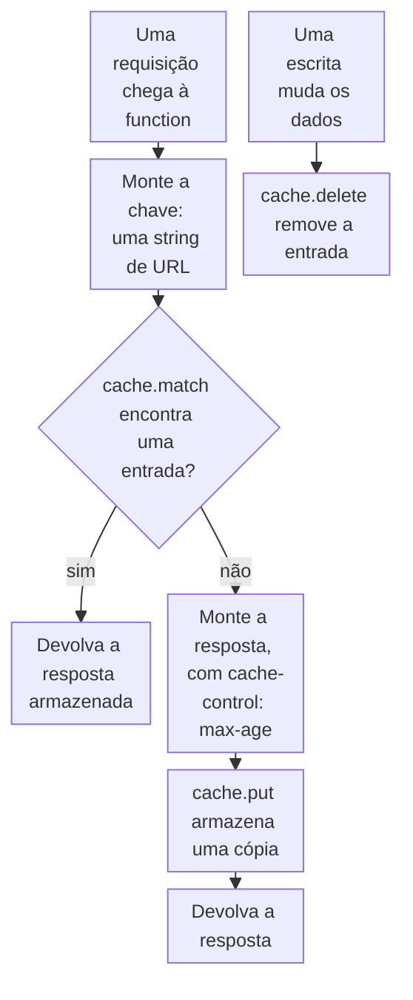

import DocCardGroup from '@aziontech/webkit/doc-card-group'
import DocCard from '@aziontech/webkit/doc-card'

Você armazena com a Cache API do runtime uma resposta que uma function monta, devolve a cópia armazenada nas próximas requisições e a exclui quando os dados por trás dela mudam. Para armazenar respostas em cache sem uma function, com uma regra em uma aplicação, consulte [Cache settings](/pt-br/documentacao/plataforma/applications/cache/cache-settings/).

Uma function que monta a mesma resposta para a mesma entrada, como uma lista lida de um banco de dados ou a saída de uma chamada a um modelo, pode guardar essa resposta e pular o trabalho na próxima requisição. A chave decide quais requisições compartilham uma mesma cópia armazenada, e uma escrita que muda os dados exclui a cópia, então a próxima requisição a monta de novo.



1. A function monta uma chave para a requisição: a URL da requisição, ou uma string de URL que traz um hash da entrada.
2. Quando o cache guarda uma entrada sob a chave, a function a devolve e não faz nenhum outro trabalho.
3. Caso contrário, a function monta a resposta com um header `cache-control: max-age`, armazena uma cópia e devolve a resposta.
4. Quando uma escrita muda os dados a partir dos quais uma resposta armazenada foi montada, a function exclui a entrada sob essa chave.

---

## Pré-requisitos

- Uma function à qual adicionar o código, com deploy feito e instanciada em uma aplicação. Para criar uma, consulte [Primeiros passos com Functions](/pt-br/documentacao/plataforma/functions/primeiros-passos/).

A Cache API só roda em uma function com deploy feito. Com `azion dev`, `caches` não está definido, e qualquer chamada lança `ReferenceError: caches is not defined`. Teste o código quando a function rodar na aplicação.

Os exemplos abrem um cache chamado `my-cache`, armazenam respostas por `3600` segundos e respondem em `www.example.com`. Substitua esses valores pelos seus.

---

## Monte a chave da requisição

Um `Cache` armazena cada resposta sob uma chave, que é um objeto `Request` ou uma string de URL, e `put` aceita só uma requisição `GET`. Uma requisição `GET` pode ser a própria chave. Uma requisição cuja entrada segue no corpo, como um `POST`, precisa de uma string de URL no lugar, ou `put` lança `TypeError: Request method must be GET`. Monte essa string a partir de um hash SHA-256 da entrada, para que a mesma entrada sempre gere a mesma chave e uma entrada diferente gere outra.

Para montar a chave, adicione estes dois helpers à function:

```javascript
// SHA-256 de uma string, em 64 caracteres hexadecimais.
async function sha256(text) {
  const digest = await crypto.subtle.digest('SHA-256', new TextEncoder().encode(text));
  return Array.from(new Uint8Array(digest), (byte) => byte.toString(16).padStart(2, '0')).join('');
}

// Uma requisição GET usa a própria URL como chave. Qualquer outra usa um hash da entrada.
async function cacheKey(request, input) {
  const url = new URL(request.url);
  if (request.method === 'GET') {
    return `${url.origin}${url.pathname}${url.search}`;
  }
  return `${url.origin}/cache/${await sha256(input)}`;
}
```

`crypto.subtle.digest` com `SHA-256` retorna 32 bytes, que o helper escreve como 64 caracteres hexadecimais. Duas requisições `POST` com a mesma entrada recebem a mesma chave.

---

## Armazene a resposta e devolva-a quando houver correspondência

`match` retorna a resposta armazenada sob a chave, ou nenhuma resposta quando a chave não tem entrada. Uma resposta armazenada só é encontrada por requisições posteriores quando traz `cache-control: max-age`. Uma resposta armazenada sem esse header não é encontrada por uma requisição posterior, então toda requisição a monta de novo. Armazene um clone da resposta com `put` e devolva a original.

Para armazenar em cache a resposta de uma requisição `POST` com chave a partir do corpo, use este handler com os dois helpers:

```javascript
const CACHE_NAME = 'my-cache';
const MAX_AGE = 3600;

// Substitua pelo trabalho cujo resultado a function armazena em cache.
async function buildBody(input) {
  return { input, length: input.length };
}

export default {
  async fetch(request, env, ctx) {
    if (request.method !== 'POST') {
      return new Response('Method not allowed', { status: 405 });
    }
    const input = await request.text();
    const cache = await caches.open(CACHE_NAME);
    const key = await cacheKey(request, input);

    const cached = await cache.match(key);
    if (cached) {
      return cached;
    }

    const response = new Response(JSON.stringify(await buildBody(input)), {
      headers: {
        'content-type': 'application/json',
        'cache-control': `max-age=${MAX_AGE}`,
        'x-stored-at': new Date().toISOString(),
      },
    });
    await cache.put(key, response.clone());
    return response;
  },
};
```

O header `x-stored-at` é definido uma única vez, quando a function armazena a resposta, então duas respostas com o mesmo valor vieram da mesma cópia armazenada.

Faça o deploy da function e envie o mesmo corpo duas vezes:

```bash
curl -i -X POST https://www.example.com/ -d 'the same input'
```

A segunda resposta traz o mesmo valor de `x-stored-at` da primeira, e `buildBody` não roda para ela. Um corpo diferente recebe uma chave nova e um valor novo. Todo cliente que envia a mesma entrada recebe a cópia armazenada, então armazene em cache só respostas iguais para todos os clientes, e nunca uma montada a partir das credenciais de um cliente.

---

## Exclua a entrada depois de uma escrita

Uma resposta armazenada não acompanha os dados a partir dos quais foi montada. Quando uma escrita muda esses dados, exclua a entrada no mesmo trecho de código, com a chave que a leitura monta. `delete` remove a entrada e retorna `true`, e um `match` posterior para essa chave não retorna nenhuma resposta.

Em uma function que também serve uma lista em `GET /api/items`, chame `delete` quando uma escrita na lista der certo:

```javascript
const cache = await caches.open(CACHE_NAME);
await cache.delete(`${new URL(request.url).origin}/api/items`);
```

A chave precisa ser igual à que a leitura armazena, caractere por caractere: aqui, a lista que `GET /api/items` armazena sob a própria URL. A próxima requisição da lista não encontra entrada, monta a resposta a partir dos dados alterados e a armazena de novo. Exclua a entrada só depois que a escrita der certo, para que uma escrita que falha deixe a cópia armazenada no lugar.

---

## Próximos passos

<DocCardGroup cols={2}>
  <DocCard title="Cache API" href="/pt-br/documentacao/devtools/runtime/api-reference/cache/" label="Todos os métodos de CacheStorage e Cache, como as respostas armazenadas são encontradas e os erros esperados." />
  <DocCard title="SubtleCrypto" href="/pt-br/documentacao/devtools/runtime/api-reference/subtle-crypto/" label="Os algoritmos de digest que crypto.subtle suporta e o tamanho de cada hash." />
  <DocCard title="Crie APIs REST e GraphQL" href="/pt-br/documentacao/casos-de-uso/construir-e-executar-aplicacoes/criar-apis-rest-e-graphql/" label="Uma function de API que armazena em cache a resposta de lista e a exclui depois de cada escrita." />
  <DocCard title="Adicione funcionalidades de IA a aplicações existentes" href="/pt-br/documentacao/casos-de-uso/construir-e-executar-workloads-de-ai/adicionar-funcionalidades-de-ia-a-aplicacoes-existentes/" label="Uma rota de resumo que armazena cada resumo em cache sob um hash do texto." />
  <DocCard title="Governe o acesso a múltiplos modelos de IA" href="/pt-br/documentacao/casos-de-uso/construir-e-executar-workloads-de-ai/governar-o-acesso-a-multiplos-modelos-de-ia/" label="Um gateway de IA que armazena em cache a resposta de um modelo quando quem chama permite." />
</DocCardGroup>
