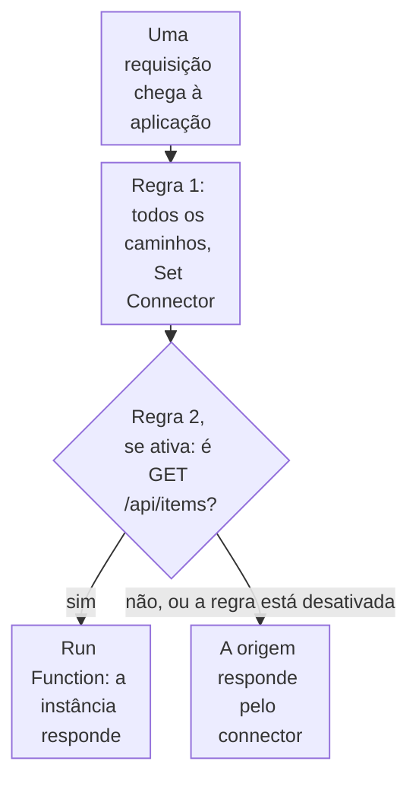

import DocCardGroup from '@aziontech/webkit/doc-card-group'
import DocCard from '@aziontech/webkit/doc-card'
import DocSteps from '@aziontech/webkit/doc-steps'
import DocStep from '@aziontech/webkit/doc-step'
import Tabs from '~/components/webkit/Tabs.vue'

Você executa uma função em um caminho e um método de uma aplicação com uma regra _Run Function_, e reverte o caminho desativando essa regra, pelo Azion Console, pela API ou pela Azion CLI. Para criar a função e a sua instância antes, consulte [Primeiros passos com Functions](/pt-br/documentacao/plataforma/functions/primeiros-passos/).

Uma regra para um caminho move esse caminho para a função, enquanto todos os outros caminhos mantêm a regra que os atendia antes. O switch **Active** da regra, o campo `active` na API, é a reversão: uma regra desativada não é executada, e o caminho volta para a regra anterior sem mudança em nenhuma outra regra.



1. Toda requisição corresponde à primeira regra, que a envia à origem por um connector.
2. Uma requisição `GET` para `/api/items` também corresponde à segunda regra enquanto ela está ativa, e a instância da função a responde.
3. Qualquer outra requisição, e toda requisição depois que a segunda regra é desativada, é respondida pela origem.

---

## Pré-requisitos

- Uma aplicação servida por um workload, com uma regra que envia todas as requisições a um connector. Para criá-los, consulte [Primeiros passos com Applications](/pt-br/documentacao/plataforma/applications/primeiros-passos/).
- Application Accelerator na aplicação, que o behavior _Run Function_ exige. Para ativá-lo, consulte [Ative Application Accelerator](/pt-br/documentacao/guias/performance-e-confiabilidade/cache-e-purge/cache-settings/#ative-application-accelerator).
- Uma instância de função na aplicação. Para criar a função e a instância, consulte [Primeiros passos com Functions](/pt-br/documentacao/plataforma/functions/primeiros-passos/), que cria as duas.
- Um [personal token](/pt-br/documentacao/guias/plataforma/conta-e-billing/personal-tokens/), para os procedimentos pela API.
- A [Azion CLI](/pt-br/documentacao/devtools/cli/) instalada e autorizada, para os procedimentos pela CLI.

Os exemplos executam a instância `<function-instance-id>` em `GET /api/items` da aplicação `<application-id>`, no domínio `www.example.com`. Substitua-os pelos seus valores.

---

## Crie a regra para o caminho e o método

A regra carrega dois grupos de critérios, um para o caminho e outro para o método. Os grupos se unem com `and`, então uma requisição só corresponde quando os dois correspondem, e um `POST` para o mesmo caminho continua chegando à origem. Nem `${uri}` nem `${request_method}` exigem um Produto na aplicação.

Uma regra nova é criada no fim da Request Phase, depois da regra que envia todos os caminhos ao connector. Uma regra posicionada depois de outra que encerra o processamento, como _Deliver_ ou _Finish Request Phase_, nunca é executada para as requisições que essa outra regra corresponde.

<Tabs client:visible sharedStore="interface">
<Fragment slot="tab.console">Console</Fragment>
<Fragment slot="tab.api">API</Fragment>
<Fragment slot="tab.cli">CLI</Fragment>

<Fragment slot="panel.console">

Para criar a regra no Azion Console:

<DocSteps>
  <DocStep title="Vá para a aba Rules Engine">

  Acesse [Azion Console](https://console.azion.com/) > **Applications** > **sua aplicação** e vá para a aba **Rules Engine**.

  </DocStep>
  <DocStep title="Selecione + Rule" />
  <DocStep title="Nomeie a regra">

  Insira um nome que identifique o caminho. Por exemplo: `function - GET /api/items`.

  </DocStep>
  <DocStep title="Selecione Request Phase" />
  <DocStep title="Corresponda ao caminho">

  Na seção **Criteria**, defina o critério como `${uri}` _is equal_ `/api/items`.

  </DocStep>
  <DocStep title="Corresponda ao método">

  Adicione um segundo grupo de critérios com um critério: `${request_method}` _is equal_ `GET`.

  </DocStep>
  <DocStep title="Na seção Behaviors, selecione Run Function" />
  <DocStep title="Selecione a instância da função" />
  <DocStep title="Selecione Save" />
</DocSteps>

A regra aparece na lista **Request**, depois da regra que envia todos os caminhos ao connector.

</Fragment>

<Fragment slot="panel.api">

Os critérios carregam `${uri}`, que um shell expande, então o corpo é enviado de um arquivo. Para criar a regra:

<DocSteps>
  <DocStep title="Escreva a regra em um arquivo">

  Salve o conteúdo a seguir como `rule.json`, com o ID da instância da função em `attributes.value`:

  ```json
  {
    "name": "function - GET /api/items",
    "active": true,
    "criteria": [
      [
        { "variable": "${uri}", "conditional": "if", "operator": "is_equal", "argument": "/api/items" }
      ],
      [
        { "variable": "${request_method}", "conditional": "if", "operator": "is_equal", "argument": "GET" }
      ]
    ],
    "behaviors": [{ "type": "run_function", "attributes": { "value": <function-instance-id> } }]
  }
  ```

  </DocStep>
  <DocStep title="Envie a requisição de criação">

  ```bash
  curl --request POST \
    --url https://api.azion.com/v4/workspace/applications/<application-id>/request_rules \
    --header 'Accept: application/json' \
    --header 'Authorization: Token <personal-token>' \
    --header 'Content-Type: application/json' \
    --data @rule.json
  ```

  </DocStep>
</DocSteps>

A API responde `202` com `"state": "pending"` e a regra como foi armazenada, com o seu `id` e a `order` que ela ocupa na fase. Guarde o `id` para a reversão.

</Fragment>

<Fragment slot="panel.cli">

A CLI lê a regra de um arquivo JSON. Para criar a regra:

<DocSteps>
  <DocStep title="Escreva a regra em um arquivo">

  Salve o conteúdo a seguir como `rule.json`, com o ID da instância da função em `attributes.value`:

  ```json
  {
    "name": "function - GET /api/items",
    "active": true,
    "criteria": [
      [
        { "variable": "${uri}", "conditional": "if", "operator": "is_equal", "argument": "/api/items" }
      ],
      [
        { "variable": "${request_method}", "conditional": "if", "operator": "is_equal", "argument": "GET" }
      ]
    ],
    "behaviors": [{ "type": "run_function", "attributes": { "value": <function-instance-id> } }]
  }
  ```

  </DocStep>
  <DocStep title="Crie a regra">

  ```bash
  azion create rules-engine --application-id <application-id> --phase request --file rule.json
  ```

  O comando imprime o ID da regra:

  ```text
  Created Rules Engine with ID <rule-id>
  ```

  </DocStep>
</DocSteps>

Guarde o ID da regra para a reversão.

</Fragment>
</Tabs>

`GET /api/items` executa a instância da função, e todas as outras requisições continuam chegando à origem. Uma regra nova leva alguns minutos para chegar a todos os data centers. Quando _Run Function_ não aparece na lista de behaviors, a aplicação precisa de Application Accelerator.

No caso de uso [Modernizar uma aplicação monolítica sem reescrevê-la](/pt-br/documentacao/casos-de-uso/construir-e-executar-aplicacoes/modernizar-uma-aplicacao-monolitica-sem-reescreve-la/), esta seção usa estes valores:

| Configuração | Valor |
| --- | --- |
| **Rule name** | `strangler - GET /api/stores` |
| **Criteria** | um grupo com `${uri}` _is equal_ `/api/stores`, e um segundo grupo com `${request_method}` _is equal_ `GET` |
| **Behavior** | _Run Function_ com a instância `stores-route`, cujo ID vai em `attributes.value` na API |

`GET /api/stores` é respondido pela função, e todas as outras requisições continuam chegando ao monolito. Uma mudança de regra leva alguns minutos para chegar a todos os data centers, então o cut-over e a reversão se espalham ao longo desse tempo, e as duas versões da rota respondem enquanto isso acontece.

No caso de uso [Criar agentes de IA](/pt-br/documentacao/casos-de-uso/construir-e-executar-workloads-de-ai/criar-agentes-de-ia/), esta seção usa estes valores:

| Configuração | Valor |
| --- | --- |
| Regra | `agent - tasks and approvals`, na Request Phase |
| Critérios | Um grupo, `${uri}` _starts with_ `/api/agent/`, no lugar dos grupos de caminho e de método deste guia |
| Behavior | **Run Function**, selecionando a instância `ops-agent` |

Uma tarefa enviada para `/api/agent/tasks` é executada até que o modelo responda, um reembolso precise de aprovação ou seis etapas passem, e cada início, pausa, decisão e fim chega a `task_events`. Uma regra nova leva alguns minutos para se propagar.

---

## Reverta o caminho

Desativar a regra mantém os seus critérios e o seu behavior, então ativá-la de novo move o caminho de volta para a função. A atualização muda somente `active`.

<Tabs client:visible sharedStore="interface">
<Fragment slot="tab.console">Console</Fragment>
<Fragment slot="tab.api">API</Fragment>
<Fragment slot="tab.cli">CLI</Fragment>

<Fragment slot="panel.console">

Para desativar a regra no Azion Console:

<DocSteps>
  <DocStep title="Vá para a aba Rules Engine">

  Acesse [Azion Console](https://console.azion.com/) > **Applications** > **sua aplicação** e vá para a aba **Rules Engine**.

  </DocStep>
  <DocStep title="Selecione a regra">

  Na lista **Request**, selecione `function - GET /api/items`.

  </DocStep>
  <DocStep title="Desative o switch Active">

  Na seção **Status**, desative **Active**.

  </DocStep>
  <DocStep title="Selecione Save" />
</DocSteps>

</Fragment>

<Fragment slot="panel.api">

Para desativar a regra, envie uma requisição `PATCH` com `active` definido como `false`. Substitua `<rule-id>` pelo `id` que a criação retornou:

```bash
curl --request PATCH \
  --url https://api.azion.com/v4/workspace/applications/<application-id>/request_rules/<rule-id> \
  --header 'Accept: application/json' \
  --header 'Authorization: Token <personal-token>' \
  --header 'Content-Type: application/json' \
  --data '{ "active": false }'
```

A regra mantém os seus critérios e o seu behavior, com `active` definido como `false`. Para mover o caminho para a função de novo, envie a mesma requisição com `"active": true`.

</Fragment>

<Fragment slot="panel.cli">

A atualização é parcial, então um arquivo só com `active` mantém o restante da regra. Para desativar a regra:

<DocSteps>
  <DocStep title="Escreva a mudança em um arquivo">

  Salve o conteúdo a seguir como `rollback.json`:

  ```json
  { "active": false }
  ```

  </DocStep>
  <DocStep title="Atualize a regra">

  ```bash
  azion update rules-engine --application-id <application-id> --rule-id <rule-id> --phase request --file rollback.json
  ```

  O comando imprime o ID da regra:

  ```text
  Updated Rules Engine with ID <rule-id>
  ```

  </DocStep>
</DocSteps>

Para mover o caminho para a função de novo, execute o mesmo comando com `{ "active": true }` no arquivo.

</Fragment>
</Tabs>

`GET /api/items` volta a chegar à origem quando a mudança se propaga. Durante a propagação, alguns data centers ainda executam a função, então as duas versões respondem por alguns minutos.

---

## Verifique qual versão responde

O **Upstream Addr** de um registro de requisição indica quem a respondeu, e `127.0.0.1:1666` indica o Azion Runtime. Para verificar o caminho no Real-Time Events:

<DocSteps>
  <DocStep title="Abra o Real-Time Events">

  Acesse [Azion Console](https://console.azion.com/) > **Real-Time Events**.

  </DocStep>
  <DocStep title="Selecione a fonte de dados HTTP Requests" />
  <DocStep title="Filtre pelo caminho">

  Em **Filter by**, insira `request_uri like '/api/items%'`.

  </DocStep>
  <DocStep title="Leia o Upstream Addr de cada registro" />
</DocSteps>

Enquanto a regra está ativa, os registros `GET` carregam `127.0.0.1:1666`. Depois da reversão, os registros novos carregam o endereço e a porta da origem. Para a sintaxe do filtro, consulte [Filtrar eventos](/pt-br/documentacao/guias/plataforma/observabilidade/adicionar-filtros-events/).

No caso de uso [Modernizar uma aplicação monolítica sem reescrevê-la](/pt-br/documentacao/casos-de-uso/construir-e-executar-aplicacoes/modernizar-uma-aplicacao-monolitica-sem-reescreve-la/), espere:

- **Todas as outras rotas continuam chegando ao monolito.** No Real-Time Events, os registros de _HTTP Requests_ que correspondem a `request_uri like '/api/stores%'` trazem **Upstream Addr** `127.0.0.1:1666` em `GET`, que marca Azion Runtime. Os registros de qualquer outro caminho do site trazem o endereço do monolito, `<monolith-ip>`, com a porta.
- **As escritas continuam chegando ao monolito.** O registro de um `POST` para `/api/stores` traz o endereço do monolito, porque a regra de cut-over corresponde apenas a `GET`.
- **A reversão se mantém.** Alguns minutos depois que a regra é desativada, `/api/stores` responde pelo monolito, e os novos registros do caminho trazem `<monolith-ip>`.

---

## Próximos passos

<DocCardGroup cols={2}>
  <DocCard title="Como Functions funciona" href="/pt-br/documentacao/plataforma/functions/como-funciona/" label="Como uma função, a sua instância e a regra que a executa se combinam em cada requisição." />
  <DocCard title="Rules Engine para Applications" href="/pt-br/documentacao/plataforma/applications/rules-engine/#run-function" label="O behavior Run Function, os campos da regra e a API que atualiza uma regra." />
  <DocCard title="Azion CLI rules-engine" href="/pt-br/documentacao/devtools/cli/recursos/rules-engine/" label="Todas as flags dos comandos que criam, atualizam e ordenam regras." />
  <DocCard title="Modernizar uma aplicação monolítica sem reescrevê-la" href="/pt-br/documentacao/casos-de-uso/construir-e-executar-aplicacoes/modernizar-uma-aplicacao-monolitica-sem-reescreve-la/" label="Mova uma rota de um monolito por vez para uma função, e reverta cada uma." />
  <DocCard title="Criar agentes de IA" href="/pt-br/documentacao/casos-de-uso/construir-e-executar-workloads-de-ai/criar-agentes-de-ia/" label="Execute a função do agente no caminho da API, com uma regra que você desativa para revertê-la." />
</DocCardGroup>
