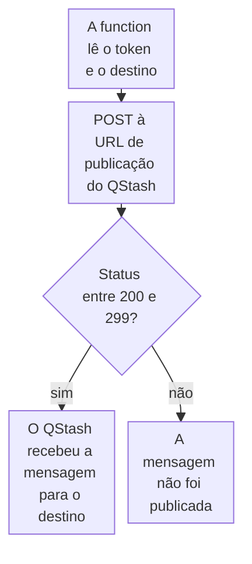

import DocCardGroup from '@aziontech/webkit/doc-card-group'
import DocCard from '@aziontech/webkit/doc-card'

Você publica uma mensagem no Upstash QStash a partir de uma function, com o token do QStash que a function lê de uma variável de ambiente, e o QStash recebe a mensagem para o domínio de destino que você indica. Para fazer o deploy do template que recebe mensagens agendadas do QStash, consulte [Use o template QStash Function Scheduler](/pt-br/documentacao/guias/desenvolvimento-de-aplicacoes/frameworks/qstash-function-scheduler/).

O QStash é uma fila de mensagens e um agendador de tarefas para runtimes serverless. Uma function que entrega trabalho a ele responde a quem a chamou sem esperar por esse trabalho, e só responde depois que o QStash aceita a mensagem, então uma publicação que falha nunca é informada como sucesso.



1. A function lê o token do QStash e o domínio de destino de variáveis de ambiente.
2. Ela envia a mensagem como um `POST` à URL de publicação do QStash, que termina no domínio de destino.
3. Um status entre 200 e 299 significa que o QStash recebeu a mensagem. Qualquer outro status significa que a mensagem não foi publicada, e a function informa uma falha.

---

## Pré-requisitos

- Uma [conta Upstash](https://console.upstash.com/) e o seu **QStash Token**, da aba **QStash** do [Upstash Console](https://console.upstash.com/qstash). O uso do QStash é processado e cobrado separadamente na plataforma Upstash.
- O domínio que recebe as mensagens, como o domínio de uma function consumidora.
- A [Azion CLI](/pt-br/documentacao/devtools/cli/primeiros-passos/) instalada e autorizada, para armazenar as variáveis de ambiente.
- Um projeto de function ao qual adicionar o código. Para criar um e fazer o deploy, consulte [Faça o deploy de uma function com a Azion CLI](/pt-br/documentacao/guias/desenvolvimento-de-aplicacoes/functions-e-runtime/deploy-function-with-cli/).

Os exemplos armazenam o token e o destino como `QSTASH_TOKEN` e `QSTASH_DESTINATION` e publicam para `consumer.example.com`. Substitua esses valores e `<qstash-token>` pelos seus.

---

## Armazene o token e o destino

A function lê os dois valores em tempo de execução, então o token nunca entra no código, e o destino muda sem uma edição no código. O token é confidencial, e o destino não. Uma key que contém `token` é enviada como secreta por padrão.

Para criar as duas variáveis com a Azion CLI:

```bash
azion create variables --key QSTASH_TOKEN --value <qstash-token> --secret true
azion create variables --key QSTASH_DESTINATION --value consumer.example.com --secret false
```

Cada comando imprime o UUID da variável que criou:

```text
Created variable with UUID 00000000-0000-0000-0000-000000000005
```

Uma mudança em uma variável só chega a uma function depois de um novo deploy da function, então crie as duas antes de fazer o deploy do código da próxima seção. A conta guarda as duas variáveis, e a function lê cada uma com `Azion.env.get()`.

---

## Publique a mensagem a partir da function

A publicação é um `POST` a `https://qstash.upstash.io/v1/publish/` seguido do domínio de destino, com o token do QStash como token `Bearer` e a mensagem como corpo. Uma function a envia com `fetch()`, e `response.ok` é `true` quando o status está no intervalo de 200 a 299.

Para publicar o corpo JSON de cada requisição, adicione este código ao entrypoint da function:

```javascript
async function publish(message) {
  const response = await fetch(
    `https://qstash.upstash.io/v1/publish/${Azion.env.get('QSTASH_DESTINATION')}`,
    {
      method: 'POST',
      headers: {
        Authorization: `Bearer ${Azion.env.get('QSTASH_TOKEN')}`,
        'Content-Type': 'application/json',
      },
      body: JSON.stringify(message),
    },
  );
  if (!response.ok) {
    throw new Error(`QStash answered ${response.status}`);
  }
}

export default {
  async fetch(request, env, ctx) {
    if (request.method !== 'POST') {
      return new Response('Method not allowed', { status: 405 });
    }
    try {
      await publish(await request.json());
      return Response.json({ published: true });
    } catch (error) {
      console.log(error.message);
      return Response.json({ error: 'Message not published' }, { status: 500 });
    }
  },
};
```

A mensagem pode estar em qualquer formato que uma requisição HTTP transporta, como JSON, XML ou binário, e este exemplo envia JSON. Faça o deploy da function, como mostra [Faça o deploy de uma function com a Azion CLI](/pt-br/documentacao/guias/desenvolvimento-de-aplicacoes/functions-e-runtime/deploy-function-with-cli/).

Um `POST` à function publica o corpo dela no QStash para `consumer.example.com`, e a function responde `{"published":true}`. Quando o QStash não recebe a mensagem, a function registra no log `QStash answered` com o status e responde `500`, então quem chama e tenta de novo em caso de erro envia a mensagem outra vez. Para ler essa linha de log, consulte [Consultar logs de console de uma function](/pt-br/documentacao/guias/plataforma/observabilidade/consultar-function-console-events/).

---

## Publique em um agendamento

Uma mensagem também pode se repetir em um agendamento. O header `Upstash-Cron` na mesma requisição de publicação recebe uma expressão cron, como `* * * * *` para cada minuto ou `0 * * * *` para cada hora.

Para publicar em um agendamento, adicione o header à requisição em `publish`:

```javascript
headers: {
  Authorization: `Bearer ${Azion.env.get('QSTASH_TOKEN')}`,
  'Content-Type': 'application/json',
  'Upstash-Cron': '0 * * * *',
},
```

O QStash executa a mensagem no agendamento que você definiu, e o agendamento fica visível na aba **QStash** do [Upstash Console](https://console.upstash.com/qstash) para revisão e monitoramento. Cada requisição que chega à function cria um agendamento, então envie essa requisição uma vez por agendamento, e não em cada requisição que uma function atende.

---

## Próximos passos

<DocCardGroup cols={2}>
  <DocCard title="Use o template QStash Function Scheduler" href="/pt-br/documentacao/guias/desenvolvimento-de-aplicacoes/frameworks/qstash-function-scheduler/" label="Faça o deploy de uma function que recebe mensagens agendadas do QStash, com as signing keys de que ela precisa." />
  <DocCard title="fetch" href="/pt-br/documentacao/devtools/runtime/api-reference/fetch/" label="As opções de requisição que fetch aceita, o sinal de timeout e os erros com que ele rejeita." />
  <DocCard title="Crie APIs orientadas a eventos" href="/pt-br/documentacao/casos-de-uso/construir-e-executar-aplicacoes/criar-apis-orientadas-a-eventos/" label="Um produtor de webhooks que publica cada evento no QStash antes de responder ao provedor." />
  <DocCard title="Deduplique entregas de webhook com KV Store" href="/pt-br/documentacao/guias/desenvolvimento-de-aplicacoes/dados/deduplicar-entregas-de-webhook-com-kv-store/" label="Pule a publicação de um evento que um provedor de webhooks entrega duas vezes." />
</DocCardGroup>
