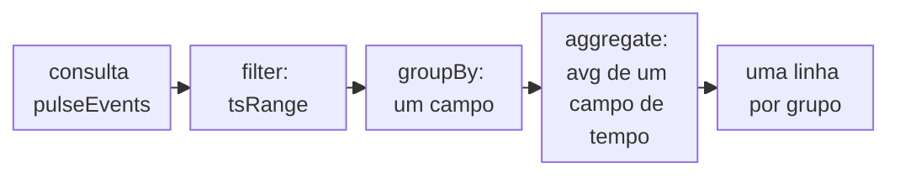

import DocCardGroup from '@aziontech/webkit/doc-card-group'
import DocCard from '@aziontech/webkit/doc-card'

Você lê as medições que o [Edge Pulse](/pt-br/documentacao/plataforma/edge-pulse/) coleta nos browsers de visitantes reais com consultas GraphQL no dataset `pulseEvents`, pela Azion API. Nenhuma página do Azion Console as exibe em gráficos, e a API REST não tem endpoint do Edge Pulse. Para colocar a tag nas suas páginas primeiro, consulte [Primeiros passos com Edge Pulse](/pt-br/documentacao/plataforma/edge-pulse/primeiros-passos/).

O endpoint GraphQL do Real-Time Events, `https://api.azion.com/v4/events/graphql`, serve o `pulseEvents`. Cada registro é uma medição, com o endereço da página em que foi feita e os tempos desse carregamento de página. Uma consulta delimita uma janela de tempo, agrupa os registros e aplica uma função de agregação a um campo em cada grupo.



1. A consulta seleciona as medições de uma janela de tempo com `tsRange`.
2. Ela as agrupa por um campo, como `locationhref`, o endereço da página.
3. Ela calcula a média de um campo de tempo, como `pageloadtime`, dentro de cada grupo.
4. A API retorna uma linha por grupo.

---

## Pré-requisitos

- Páginas que carregam a tag do Edge Pulse e recebem visitas. Nada é coletado até que um visitante carregue uma página com a tag. Para os passos, consulte [Primeiros passos com Edge Pulse](/pt-br/documentacao/plataforma/edge-pulse/primeiros-passos/).
- Um [personal token](/pt-br/documentacao/guias/plataforma/conta-e-billing/personal-tokens/), enviado no header `Authorization` com o esquema `Token`. Um header `Bearer` retorna `401`.
- `curl` ou outro cliente HTTP. Para executar as mesmas consultas no GraphiQL, o editor que o endpoint serve a um browser conectado ao Azion Console, consulte [Primeiros passos com a GraphQL API](/pt-br/documentacao/devtools/graphql/primeiros-passos/).

Os exemplos leem o dia de `2026-10-04T00:00:00` a `2026-10-05T00:00:00` no site `https://www.example.com/`. Substitua as datas por uma janela dentro dos últimos 7 dias e o endereço por uma página sua.

---

## Calcule a média de um campo de tempo por página

Uma consulta no `pulseEvents` precisa de uma janela de tempo dentro de `filter`, e os dois limites usam o mesmo fuso horário. O Real-Time Events mantém um registro por 7 dias, então a janela volta no máximo 7 dias. Sem `limit`, a API retorna 10 linhas, então `limit: 100` mantém todas as páginas de um site com até 100 endereços com a tag. `orderBy: [avg_DESC]` coloca a página mais lenta primeiro.

Para calcular a média de `pageloadtime`, o tempo até a página terminar de carregar, de todas as páginas com a tag, envie a consulta ao endpoint de events:

```bash
curl -X POST https://api.azion.com/v4/events/graphql \
  -H "Authorization: Token [TOKEN VALUE]" \
  -H "Content-Type: application/json" \
  -d '{"query": "query { pulseEvents(limit: 100, filter: { tsRange: {begin: \"2026-10-04T00:00:00\", end: \"2026-10-05T00:00:00\"} }, aggregate: { avg: pageloadtime }, groupBy: [locationhref], orderBy: [avg_DESC]) { locationhref avg } }"}'
```

O endpoint retorna HTTP `200`. A resposta carrega `data.pulseEvents`, um array com um objeto por endereço de página que reportou medições na janela, e cada objeto guarda só os campos que a consulta selecionou: `locationhref` e `avg`. Uma janela sem medições retorna um array vazio, não um erro.

Uma consulta sem janela de tempo é recusada com HTTP `400`:

```json
{
  "detail": "To execute queries it is mandatory to provide the desired time interval."
}
```

Cada página com a tag e com visitas na janela tem uma linha, com o tempo médio de carregamento das suas medições. Uma página com a tag, com visitas e sem linha é uma página em que a tag não é executada, porque a tag não reporta erro próprio.

---

## Divida o tempo de carregamento nas suas partes

O argumento `aggregate` aceita cada função no máximo uma vez por consulta, e cada função recebe um campo. Uma consulta, portanto, calcula a média de um campo de tempo, e cada parte do tempo de carregamento é uma consulta própria. Adicione `count: rows` à mesma consulta para retornar quantas medições cada média cobre.

Estes campos de tempo usam a mesma consulta no lugar de `pageloadtime`:

| Campo | O que guarda |
| --- | --- |
| `dns` | Tempo gasto resolvendo o nome |
| `tcp` | Tempo gasto abrindo a conexão |
| `ssl` | Tempo gasto no handshake TLS |
| `ttfb` | Tempo até a chegada do primeiro byte da resposta |
| `contentdownload` | Tempo gasto baixando o conteúdo |
| `networkduration` | Tempo total da parte de rede da visita |
| `rendertime` | Tempo que o browser gastou renderizando |

Para calcular a média de `ttfb` por página, com o número de medições por trás de cada média:

```bash
curl -X POST https://api.azion.com/v4/events/graphql \
  -H "Authorization: Token [TOKEN VALUE]" \
  -H "Content-Type: application/json" \
  -d '{"query": "query { pulseEvents(limit: 100, filter: { tsRange: {begin: \"2026-10-04T00:00:00\", end: \"2026-10-05T00:00:00\"} }, aggregate: { avg: ttfb, count: rows }, groupBy: [locationhref], orderBy: [avg_DESC]) { locationhref avg count } }"}'
```

Cada objeto de `data.pulseEvents` carrega `locationhref`, `avg` e `count`. Execute a consulta uma vez por campo para comparar as partes do tempo de carregamento de cada página.

---

## Compare visitantes por conexão ou browser

A mesma consulta pode agrupar as medições por outro campo no lugar da página. `effectivetype` guarda a classe de conexão que o browser reportou, como `4g`, e `browser` o browser que fez a medição. Um campo em `filter` sem sufixo compara por igualdade, então `locationhref` em `filter` mantém as medições de uma página.

Para calcular a média do tempo de carregamento da página inicial por classe de conexão:

```bash
curl -X POST https://api.azion.com/v4/events/graphql \
  -H "Authorization: Token [TOKEN VALUE]" \
  -H "Content-Type: application/json" \
  -d '{"query": "query { pulseEvents(limit: 100, filter: { tsRange: {begin: \"2026-10-04T00:00:00\", end: \"2026-10-05T00:00:00\"}, locationhref: \"https://www.example.com/\" }, aggregate: { avg: pageloadtime, count: rows }, groupBy: [effectivetype], orderBy: [avg_DESC]) { effectivetype avg count } }"}'
```

Cada objeto de `data.pulseEvents` carrega uma classe de conexão, com o tempo médio de carregamento da página inicial e o número de medições nessa classe. Agrupe por `browser` no lugar de `effectivetype` para comparar browsers.

O dataset não tem campo de Core Web Vitals, como LCP, CLS ou INP, nem campo para a região ou o país do visitante. Para cada campo que uma consulta pode selecionar, consulte [Campos do Real-Time Events](/pt-br/documentacao/devtools/graphql/campos-gql-real-time-events/#pulseevents-edge-pulse).

:::note[nota]
Uma consulta seleciona até 37 campos e retorna até 10.000 linhas, e a API aceita 120 requisições por minuto, acima do que responde `429`. Uma consulta sobre os 7 dias inteiros sem outro filtro pode chegar ao limite de linhas que o banco de logs lê, então consulte um dia por vez. Para cada limite, consulte [Limites de Real-Time Events](/pt-br/documentacao/plataforma/real-time-events/limites/).
:::

---

## Próximos passos

<DocCardGroup cols={2}>
  <DocCard title="Como o Edge Pulse funciona" href="/pt-br/documentacao/plataforma/edge-pulse/como-funciona/" label="O que um teste mede, com que frequência um visitante é testado e por quanto tempo uma medição é mantida." />
  <DocCard title="Campos do Real-Time Events" href="/pt-br/documentacao/devtools/graphql/campos-gql-real-time-events/#pulseevents-edge-pulse" label="Cada campo do dataset pulseEvents, com o tipo que o schema declara." />
  <DocCard title="Queries" href="/pt-br/documentacao/devtools/graphql/queries/" label="As funções de agregação, e o que o groupBy faz com elas, em todos os datasets." />
  <DocCard title="Monitore a performance de sites e APIs" href="/pt-br/documentacao/casos-de-uso/melhorar-performance-e-confiabilidade/monitorar-a-performance-de-sites-e-apis/" label="Medições do Edge Pulse lidas por página e comparadas com o que a Azion serviu para o mesmo domínio." />
</DocCardGroup>
