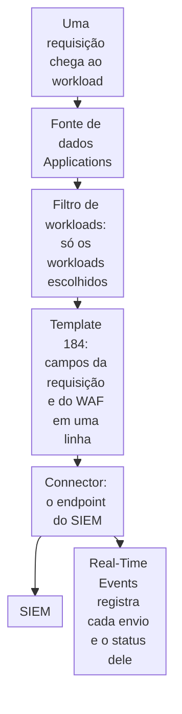

import DocCardGroup from '@aziontech/webkit/doc-card-group'
import DocCard from '@aziontech/webkit/doc-card'
import DocSteps from '@aziontech/webkit/doc-steps'
import DocStep from '@aziontech/webkit/doc-step'
import Tabs from '~/components/webkit/Tabs.vue'

Você envia toda requisição a uma aplicação, com os campos do WAF da mesma requisição, a uma plataforma de gerenciamento de informações e eventos de segurança (SIEM) pelo Azion Console ou pela Azion API. Para enviar só as requisições que o WAF analisou, consulte [Envie eventos do WAF para um SIEM](/pt-br/documentacao/guias/seguranca-de-aplicacoes/firewall-e-waf/integrar-siems/).

Um stream do [Data Stream](/pt-br/documentacao/plataforma/data-stream/) na fonte de dados _Applications_, formatado pelo template predefinido _Applications + WAF Event Collector_, carrega a requisição, a resposta e o endereço do cliente com o score, as correspondências e a flag de bloqueio do WAF da mesma requisição. Uma linha de log responde então a uma pergunta sobre uma requisição, tenha o WAF a sinalizado ou não. O custo é o volume: o template predefinido envia 51 chaves, o maior número entre os cinco templates predefinidos, e o Data Stream é cobrado por requisições e transferência de dados.



1. Cada requisição a um workload escolhido vira um evento da fonte de dados _Applications_.
2. O filtro de workloads mantém só os workloads que você escolhe e deixa os outros streams da conta ativos.
3. O template `184` transforma cada evento em uma linha de log com os campos da requisição e os campos do WAF.
4. O stream envia as linhas ao endpoint do SIEM em lotes, e o Real-Time Events registra cada envio com o status que o endpoint retornou.

---

## Pré-requisitos

- Um usuário da conta com a permissão **Edit Data Stream**. Para as permissões, consulte [Configurações do stream](/pt-br/documentacao/plataforma/data-stream/configuracoes-do-stream/#permissoes).
- Um workload cujo firewall aplica um rule set do WAF com uma regra _Set WAF_. Para montá-lo, consulte [Aplique um rule set a toda requisição](/pt-br/documentacao/guias/seguranca-de-aplicacoes/firewall-e-waf/aplicar-rule-set/).
- Um endpoint que o seu SIEM lê. Os exemplos usam um cluster Apache Kafka, com o host e a porta dos servidores e um tópico. Para os outros endpoints, consulte [Endpoints](/pt-br/documentacao/plataforma/data-stream/endpoints/).
- Um [personal token](/pt-br/documentacao/guias/plataforma/conta-e-billing/personal-tokens/) e o ID do workload, para o procedimento pela API.
- Acesso ao Azion Console, para o procedimento pelo Console. Consulte [Acesse o Azion Console](/pt-br/documentacao/guias/plataforma/conta-e-billing/como-acessar-o-azion-console/).

Os exemplos enviam as requisições do workload `<workload-id>` para o tópico `azion.requests` em `kafka1.example.com:9092` e `kafka2.example.com:9092`. Substitua-os pelo seu workload e pelo seu endpoint.

---

## Crie o stream

O stream define o escopo por um filtro de workloads, não por amostragem. Um stream carrega exatamente um dos dois, e salvar um stream ativo com amostragem, em qualquer taxa, inclusive `100`, desativa todos os outros streams da conta sem nenhum erro. Um filtro tem até 600 workloads, e um workload criado depois não é coletado até que você o adicione.

<Tabs client:visible sharedStore="interface">
<Fragment slot="tab.console">Console</Fragment>
<Fragment slot="tab.api">API</Fragment>

<Fragment slot="panel.console">

Para criar o stream no Azion Console:

<DocSteps>
  <DocStep title="Abra o Data Stream">

  Acesse [Azion Console](https://console.azion.com/) > **Data Stream**.

  </DocStep>
  <DocStep title="Selecione + Stream" />
  <DocStep title="Nomeie o stream">

  Na seção **General**, insira um **Name**. Por exemplo: `requests-to-siem`.

  </DocStep>
  <DocStep title="Selecione a fonte de dados Applications">

  Na seção **Input**, selecione _Applications_ em **Data Source**.

  </DocStep>
  <DocStep title="Desative Sampling">

  Na seção **Transform**, desative **Sampling** enquanto **Option** ainda está em _All Current and Future Workloads_.

  </DocStep>
  <DocStep title="Escolha o workload">

  Defina **Option** como _Filter Workloads_. Em **Available Workload**, selecione o workload e mova-o para **Chosen Workload**.

  </DocStep>
  <DocStep title="Selecione o template">

  Na seção **Render Template**, selecione _Applications + WAF Event Collector_ em **Template**. O campo **Data Set** mostra as chaves de cada linha de log.

  </DocStep>
  <DocStep title="Selecione o endpoint">

  Na seção **Output**, selecione _Apache Kafka_ em **Connector**. Insira `kafka1.example.com:9092,kafka2.example.com:9092` em **Bootstrap Servers** e `azion.requests` em **Kafka Topic**, e ative **Enable Transport Layer Security (TLS)**.

  </DocStep>
  <DocStep title="Mantenha o stream ativo">

  Na seção **Status**, mantenha **Active** ativado.

  </DocStep>
  <DocStep title="Selecione Save" />
</DocSteps>

O Console mostra `Your data stream has been created`. O stream aparece na lista do **Data Stream** com `workloads` na coluna **Source**.

</Fragment>

<Fragment slot="panel.api">

Para criar o stream com a API, envie a fonte de dados `workloads`, que é _Applications_ no Console, com o template `184`:

```bash
curl --request POST \
  --url https://api.azion.com/v4/workspace/stream/streams \
  --header 'Authorization: Token <personal-token>' \
  --header 'Content-Type: application/json' \
  --data '{
  "name": "requests-to-siem",
  "active": true,
  "inputs": [{ "type": "raw_logs", "attributes": { "data_source": "workloads" } }],
  "transform": [
    { "type": "filter_workloads", "attributes": { "workloads": [<workload-id>] } },
    { "type": "render_template", "attributes": { "template": 184 } }
  ],
  "outputs": [{
    "type": "kafka",
    "attributes": { "bootstrap_servers": "kafka1.example.com:9092,kafka2.example.com:9092", "kafka_topic": "azion.requests", "use_tls": true }
  }]
}'
```

A API responde `201` com `state` igual a `executed` e o stream armazenado em `data`. Guarde o `id` dele, que toda requisição posterior sobre o stream usa. Um stream com `sampling` e `filter_workloads` ao mesmo tempo é recusado com `32007`, e um sem nenhum dos dois, com `32002`.

</Fragment>
</Tabs>

O stream começa a enviar de um a dois minutos depois de salvo. Salvar verifica o formato de cada campo e não contata o endpoint, então um endereço ou um tópico errado só aparece quando o stream envia. Para um SIEM com connector próprio, selecione-o em **Connector**, ou envie o `type` dele em `outputs[0]`: _Splunk_ recebe a URL e o token do HTTP Event Collector, _IBM QRadar_ uma URL, e _Elasticsearch_ uma URL e uma API key codificada. Um stream mantém um único endpoint, e a API descarta qualquer segunda entrada em `outputs` sem erro. Para cada campo, consulte [Endpoints](/pt-br/documentacao/plataforma/data-stream/endpoints/).

---

## Confirme a entrega

O Real-Time Events registra todo envio de um stream, entregue ou não, com o status code que o endpoint retornou. Um stream envia um lote a cada 60 segundos, ou antes, quando chega a 2.000 linhas de log. Um envio com falha não para o stream, e as linhas dele não são enviadas de novo. Envie algumas requisições ao workload e espere cerca de um minuto.

<Tabs client:visible sharedStore="interface">
<Fragment slot="tab.console">Console</Fragment>
<Fragment slot="tab.api">API</Fragment>

<Fragment slot="panel.console">

Para encontrar os envios no Azion Console:

<DocSteps>
  <DocStep title="Abra o Real-Time Events">

  Acesse [Azion Console](https://console.azion.com/) > **Real-Time Events**.

  </DocStep>
  <DocStep title="Selecione a fonte de dados Data Stream" />
  <DocStep title="Leia os envios mais recentes">

  Encontre as linhas cujo **Endpoint Type** corresponde ao seu endpoint e leia o **Status Code** e as **Streamed Lines** delas.

  </DocStep>
</DocSteps>

Um **Status Code** `200` significa que o endpoint aceitou o lote.

</Fragment>

<Fragment slot="panel.api">

Para ler os envios, consulte o dataset `dataStreamedEvents`, com um intervalo que cubra a ativação do stream:

```bash
curl --request POST \
  --url https://api.azion.com/v4/events/graphql \
  --header 'Authorization: Token <personal-token>' \
  --header 'Content-Type: application/json' \
  --data '{"query":"query { dataStreamedEvents(limit: 20, filter: {tsRange: {begin: \"2030-01-01T10:00:00\", end: \"2030-01-01T11:00:00\"}}, orderBy: [ts_DESC]) { ts endpointType statusCode streamedLines dataStreamed } }"}'
```

A API responde `200` com um registro por envio, o mais recente primeiro. Cada registro carrega o tipo do seu endpoint em `endpointType`:

```json
{"data":{"dataStreamedEvents":[{"ts":"<time>","endpointType":"<endpoint-type>","statusCode":200,"streamedLines":<lines>,"dataStreamed":<bytes>}]}}
```

Uma lista `dataStreamedEvents` vazia significa que o stream não enviou nada no intervalo.

</Fragment>
</Tabs>

Um status diferente de `200` é a resposta do endpoint, e `503` significa que o Data Stream encontrou o endpoint indisponível. Para as causas, consulte [Solucionar problemas de Data Stream](/pt-br/documentacao/plataforma/data-stream/solucao-de-problemas/).

No SIEM, cada linha de log carrega as chaves do template, nomeadas pelas variáveis dele. Estas chaves ligam a decisão de segurança à requisição:

- `request_id` identifica a requisição, e `remote_addr`, `host`, `request_uri` e `status` a descrevem.
- `waf_score` e `waf_match` têm o score da requisição e as infrações que ela correspondeu.
- `waf_block` mostra `1` quando o WAF bloqueou a requisição. Enquanto `waf_learning` mostra `1`, o WAF não bloqueia nenhuma requisição, seja qual for o valor de `waf_block`.

O SIEM recebe uma linha por requisição ao workload, cada uma com os campos do WAF. O SIEM guarda as linhas pelo tempo que você configurar.

---

## Próximos passos

<DocCardGroup cols={2}>
  <DocCard title="Envie eventos do WAF para um SIEM" href="/pt-br/documentacao/guias/seguranca-de-aplicacoes/firewall-e-waf/integrar-siems/" label="Envie só as requisições que o WAF analisou, com a família de ataque e a ação de cada uma." />
  <DocCard title="Fontes de dados e variáveis" href="/pt-br/documentacao/plataforma/data-stream/fontes-de-dados-e-variaveis/#applications" label="O que cada variável da fonte de dados Applications contém, e qual template predefinido a carrega." />
  <DocCard title="Endpoints" href="/pt-br/documentacao/plataforma/data-stream/endpoints/" label="Os campos de cada endpoint para o qual um stream envia, com limites e nomes na API." />
  <DocCard title="Boas práticas para Data Stream" href="/pt-br/documentacao/plataforma/data-stream/boas-praticas/#use-o-template-predefinido-applications--waf-event-collector-para-alimentar-um-siem" label="Quando o template predefinido combinado vale o volume, e como enviar menos variáveis." />
  <DocCard title="Preparar aplicações web reguladas para auditorias de segurança" href="/pt-br/documentacao/casos-de-uso/proteger-aplicacoes-e-redes/preparar-aplicacoes-web-reguladas-para-auditorias-de-seguranca/" label="Uma configuração de auditoria que exporta toda requisição e todo evento do WAF para um destino que a equipe mantém." />
  <DocCard title="Solucionar problemas de Data Stream" href="/pt-br/documentacao/plataforma/data-stream/solucao-de-problemas/" label="O que mudar quando um envio retorna um status diferente de 200." />
</DocCardGroup>
