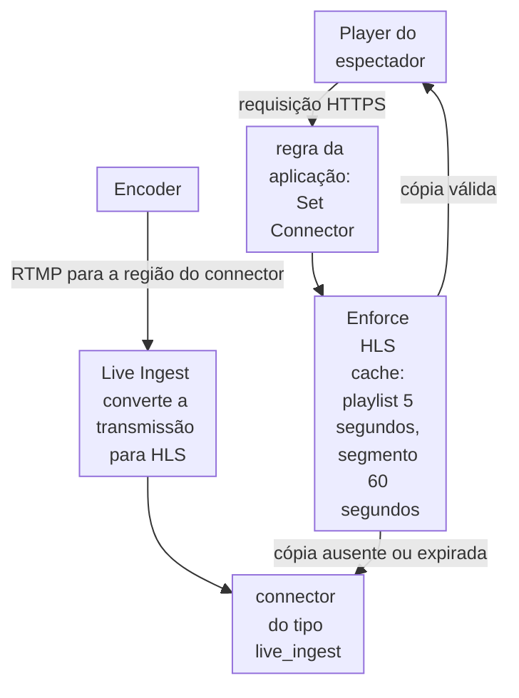

import DocCardGroup from '@aziontech/webkit/doc-card-group'
import DocCard from '@aziontech/webkit/doc-card'
import DocSteps from '@aziontech/webkit/doc-steps'
import DocStep from '@aziontech/webkit/doc-step'
import Tabs from '~/components/webkit/Tabs.vue'

Você cria o connector que leva uma transmissão ao vivo para a Azion e a regra que entrega essa transmissão aos espectadores, pelo Azion Console, pela Azion API ou pela Azion CLI. Para uma transmissão HLS que a sua própria origem produz, consulte [Implemente cache HLS para streaming ao vivo](/pt-br/documentacao/guias/midia-e-streaming/streaming/implementar-cache-hls/).

Seu encoder envia a transmissão por RTMP ao [Live Ingest](/pt-br/documentacao/plataforma/connectors/live-ingest/ingestao-e-entrega/), que a converte para HLS: uma playlist, `.m3u8`, e os segmentos que ela lista, `.ts`. Os espectadores nunca chegam ao Live Ingest diretamente. Eles solicitam a transmissão a uma aplicação, e uma regra dessa aplicação nomeia o connector.



1. O encoder envia a transmissão por RTMP ao Live Ingest, na região do connector.
2. O Live Ingest converte a transmissão para HLS.
3. O player de um espectador solicita a transmissão à aplicação, e o behavior _Set Connector_ de uma regra nomeia o connector.
4. A Azion adiciona o behavior _Enforce HLS cache_ a essa regra, que mantém cada playlist em cache por 5 segundos e cada segmento por 60 segundos.
5. Uma cópia válida em cache responde a todos os espectadores, e só uma cópia expirada ou ausente é buscada pelo connector.

---

## Pré-requisitos

- Uma aplicação servida por um workload, com um hostname que os espectadores solicitam. Para criar os dois, consulte [Primeiros passos com Applications](/pt-br/documentacao/plataforma/applications/primeiros-passos/).
- Um encoder que envia RTMP com autenticação por usuário e senha. A Azion fornece as credenciais e as URLs de ingestão de um endpoint primário e de um endpoint de backup. Para o requisito, consulte [Ingestão](/pt-br/documentacao/plataforma/connectors/live-ingest/ingestao-e-entrega/#ingestao).
- Um [personal token](/pt-br/documentacao/guias/plataforma/conta-e-billing/personal-tokens/), para os procedimentos pela API.
- A [Azion CLI](/pt-br/documentacao/devtools/cli/) instalada e autorizada, para os procedimentos pela CLI.
- Acesso ao Azion Console, para os procedimentos pelo Console. Consulte [Acesse o Azion Console](/pt-br/documentacao/guias/plataforma/conta-e-billing/como-acessar-o-azion-console/).

Este guia não cobre como você obtém as URLs de ingestão e as credenciais, nem o formato da URL da playlist que os espectadores solicitam. Os exemplos usam `my-live-connector` para o connector e `us-east-1` para a região. Substitua-os pelos seus valores.

---

## Crie o connector do Live Ingest

O connector carrega uma configuração, a região onde o Live Ingest recebe a transmissão. Escolha a região mais próxima do encoder, não dos espectadores: ela encurta o caminho que a transmissão percorre antes de a Azion recebê-la. A região aceita `us-east-1`, `us-east-2`, `br-east-1`, `br-east-2` e `br-east-3`.

<Tabs client:visible sharedStore="interface">
<Fragment slot="tab.console">Console</Fragment>
<Fragment slot="tab.api">API</Fragment>
<Fragment slot="tab.cli">CLI</Fragment>

<Fragment slot="panel.console">

Para criar o connector no Azion Console:

<DocSteps>
  <DocStep title="Abra a página Connectors">

  Acesse [Azion Console](https://console.azion.com/) > **Connectors**.

  </DocStep>
  <DocStep title="Inicie um connector">

  A página **Create Connector** é aberta.

  </DocStep>
  <DocStep title="Nomeie o connector">

  Em **General**, insira `my-live-connector` como **Name**.

  </DocStep>
  <DocStep title="Selecione o tipo Live Ingest">

  Em **Connector Type**, selecione _Live Ingest_.

  </DocStep>
  <DocStep title="Selecione a região">

  Em **Region**, selecione `us-east-1`. O campo é obrigatório.

  </DocStep>
  <DocStep title="Selecione Create" />
</DocSteps>

O connector `my-live-connector` existe na sua conta em `us-east-1`.

</Fragment>

<Fragment slot="panel.api">

Para criar o connector, envie o nome, o tipo e a região dele ao endpoint de connectors:

```bash
curl --request POST \
  --url https://api.azion.com/v4/workspace/connectors \
  --header 'Authorization: Token <personal-token>' \
  --header 'Content-Type: application/json' \
  --data '{
  "name": "my-live-connector",
  "type": "live_ingest",
  "attributes": { "region": "us-east-1" }
}'
```

A API responde `202` com `"state": "pending"`, e a leitura do connector retorna `"attributes": {"region": "us-east-1"}`. Anote o `id` dele: a regra nomeia o connector por ele. Uma requisição sem `region` falha com `10059`, e uma região fora dos cinco valores falha com `10039`.

</Fragment>

<Fragment slot="panel.cli">

Para criar o connector com a Azion CLI, salve o corpo dele como `connector.json`:

```json
{
  "name": "my-live-connector",
  "type": "live_ingest",
  "attributes": { "region": "us-east-1" }
}
```

Crie o connector a partir do arquivo. O comando precisa de `--type` mesmo quando o arquivo nomeia o tipo:

```bash
azion create connector --type live_ingest --file connector.json
```

A saída traz o ID do novo connector, que a regra nomeia:

```text
Created Connector with ID <connector-id>
```

</Fragment>
</Tabs>

O connector existe na sua conta, e nenhuma requisição de espectador chega a ele até que uma regra da aplicação o nomeie. Uma mudança em um connector chega à infraestrutura distribuída da Azion em alguns minutos.

No caso de uso [Transmitir eventos ao vivo para grandes audiências](/pt-br/documentacao/casos-de-uso/entregar-midia-e-streaming/transmitir-eventos-ao-vivo-para-grandes-audiencias/), esta seção usa estes valores:

| Configuração | Valor |
| --- | --- |
| **Name** | `live-ingest-br`, que a regra de entrega seleciona |
| **Type** | _Live Ingest_, `live_ingest` na API |
| **Region** | `br-east-1`, a região mais próxima do local do evento |

O connector existe na sua conta em `br-east-1`, e nenhuma requisição de espectador chega a ele até que uma regra da aplicação o nomeie.

---

## Envie as requisições dos espectadores ao connector

Uma regra da Request Phase com o behavior _Set Connector_ envia ao connector as requisições que ela corresponde. Em uma aplicação que serve só a transmissão, a regra corresponde a todos os paths: `${uri}` começa com `/`. Quando várias regras correspondentes carregam _Set Connector_, só a última é executada, então mantenha esta regra depois de qualquer regra que envie todos os paths a outro connector. Uma regra nova fica depois das regras que a aplicação já tem.

<Tabs client:visible sharedStore="interface">
<Fragment slot="tab.console">Console</Fragment>
<Fragment slot="tab.api">API</Fragment>
<Fragment slot="tab.cli">CLI</Fragment>

<Fragment slot="panel.console">

Para criar a regra no Azion Console:

<DocSteps>
  <DocStep title="Abra a aplicação">

  Acesse [Azion Console](https://console.azion.com/) > **Applications** e selecione a aplicação que entrega a transmissão.

  </DocStep>
  <DocStep title="Selecione a aba Rules Engine" />
  <DocStep title="Selecione + Rule" />
  <DocStep title="Nomeie a regra">

  Em **General**, insira `send-to-live-ingest` como **Name**.

  </DocStep>
  <DocStep title="Selecione a fase de requisição">

  Em **Phase**, selecione _Request Phase_.

  </DocStep>
  <DocStep title="Defina o critério">

  Em **Criteria**, selecione a variável `${uri}` e o operador `starts_with`, e insira `/` como argumento.

  </DocStep>
  <DocStep title="Selecione o behavior Set Connector">

  Em **Behaviors**, selecione _Set Connector_.

  </DocStep>
  <DocStep title="Selecione o connector do Live Ingest">

  Em **Connector**, selecione `my-live-connector`. A Azion adiciona o behavior _Enforce HLS cache_ à regra.

  </DocStep>
  <DocStep title="Selecione Save" />
</DocSteps>

A regra aparece na aba **Rules Engine**, sob o título **Request**.

</Fragment>

<Fragment slot="panel.api">

Para criar a regra, envie-a às regras da Request Phase da aplicação. Substitua `<connector-id>` pelo `id` do connector:

```bash
curl --request POST \
  --url https://api.azion.com/v4/workspace/applications/<application-id>/request_rules \
  --header 'Authorization: Token <personal-token>' \
  --header 'Content-Type: application/json' \
  --data '{
  "name": "send-to-live-ingest",
  "active": true,
  "criteria": [[{ "variable": "${uri}", "conditional": "if", "operator": "starts_with", "argument": "/" }]],
  "behaviors": [{ "type": "set_connector", "attributes": { "value": <connector-id> } }]
}'
```

A API responde `202` com `state` igual a `pending` e a regra como a plataforma a armazenou. O _Enforce HLS cache_ não tem um `type` da API para enviar, porque a Azion o adiciona à regra.

</Fragment>

<Fragment slot="panel.cli">

Para criar a regra com a Azion CLI, mantenha-a em um arquivo, porque na linha de comando o shell expandiria `${uri}`. Salve este corpo como `rule.json` e substitua `<connector-id>` pelo ID do connector:

```json
{
  "name": "send-to-live-ingest",
  "active": true,
  "criteria": [[{ "variable": "${uri}", "conditional": "if", "operator": "starts_with", "argument": "/" }]],
  "behaviors": [{ "type": "set_connector", "attributes": { "value": <connector-id> } }]
}
```

Crie a regra na fase de requisição da aplicação:

```bash
azion create rules-engine --application-id <application-id> --phase request --file rule.json
```

A saída traz o ID da nova regra:

```text
Created Rules Engine with ID <rule-id>
```

</Fragment>
</Tabs>

Todas as requisições da aplicação agora chegam à transmissão pelo connector, sob a política de cache de HLS ao vivo. Uma regra nova pode levar alguns minutos para se propagar.

No caso de uso [Transmitir eventos ao vivo para grandes audiências](/pt-br/documentacao/casos-de-uso/entregar-midia-e-streaming/transmitir-eventos-ao-vivo-para-grandes-audiencias/), esta seção usa estes valores:

| Configuração | Valor |
| --- | --- |
| **Name** | `live - send to Live Ingest`, na Request Phase |
| **Criterion** | `${uri}` starts with `/`, porque a aplicação em `live.example.com` serve apenas a transmissão |
| **Behavior** | _Set Connector_, nomeando `live-ingest-br` |

A regra carrega _Set Connector_ e _Enforce HLS cache_.

---

## Deixe o cache da transmissão com o Enforce HLS cache

O _Enforce HLS cache_ ignora as configurações de cache da aplicação e aplica a política de cache que a Azion define para HLS ao vivo. Uma configuração de cache que um behavior _Set Cache Policy_ aplica a essas requisições, portanto, não tem efeito, então não adicione uma. Para confirmar que a regra carrega a política:

<DocSteps>
  <DocStep title="Abra a aba Rules Engine da aplicação">

  Acesse [Azion Console](https://console.azion.com/) > **Applications**, selecione a aplicação e selecione a aba **Rules Engine**.

  </DocStep>
  <DocStep title="Abra a regra send-to-live-ingest" />
  <DocStep title="Leia os behaviors">

  A regra carrega _Set Connector_, nomeando `my-live-connector`, e _Enforce HLS cache_.

  </DocStep>
</DocSteps>

A aplicação mantém cada playlist em cache por 5 segundos e cada segmento por 60 segundos. Uma cópia em cache de um segmento responde a todos os espectadores que o solicitam nesse tempo, então um público grande não envia cada uma das suas requisições ao Live Ingest.

:::note[nota]
O Live Ingest é cobrado por Data Ingestion, o volume de dados de transmissão que a Azion ingere, e uma transmissão de teste é ingerida como uma real. Para o valor, consulte [Preços](/pt-br/documentacao/fundamentos/precos/#live-ingest).
:::

No caso de uso [Transmitir eventos ao vivo para grandes audiências](/pt-br/documentacao/casos-de-uso/entregar-midia-e-streaming/transmitir-eventos-ao-vivo-para-grandes-audiencias/), espere:

- **A regra de entrega carrega a política de cache ao vivo.** A regra `live - send to Live Ingest` na aba **Rules Engine** traz _Set Connector_, nomeando `live-ingest-br`, e _Enforce HLS cache_.

---

## Confirme que a transmissão responde pelo cache

Execute estas requisições enquanto o encoder estiver transmitindo. Cada uma envia o header `Pragma: azion-debug-cache`, que faz a resposta trazer o header `x-cache`. Os exemplos usam `live.example.com` para o hostname que os espectadores requisitam. Substitua-o, `<stream>` e `<segment>` pelos seus valores.

Requisite a playlist duas vezes em até 5 segundos:

```bash
curl -sI -H "Pragma: azion-debug-cache" https://live.example.com/<stream>.m3u8
```

A segunda resposta traz `x-cache: HIT`. A primeira pode trazer `MISS`, enquanto a aplicação busca a playlist pelo connector.

Pegue o nome de um segmento no corpo da playlist e requisite-o duas vezes em até 60 segundos:

```bash
curl -sI -H "Pragma: azion-debug-cache" https://live.example.com/<segment>.ts
```

A segunda resposta traz `x-cache: HIT`. Para saber como ler o header, consulte [Verifique o status de cache de uma resposta](/pt-br/documentacao/guias/performance-e-confiabilidade/cache-e-purge/verificar-tempo-de-cache-da-pagina/).

Estas verificações confirmam o caso de uso [Transmitir eventos ao vivo para grandes audiências](/pt-br/documentacao/casos-de-uso/entregar-midia-e-streaming/transmitir-eventos-ao-vivo-para-grandes-audiencias/).

No caso de uso [Transmitir eventos ao vivo para grandes audiências](/pt-br/documentacao/casos-de-uso/entregar-midia-e-streaming/transmitir-eventos-ao-vivo-para-grandes-audiencias/), espere:

- **Os espectadores conseguem reproduzir a transmissão.** Carregue `https://live.example.com/<stream>.m3u8` em um player HLS, como a configuração do hls.js em [Boas práticas de Connectors](/pt-br/documentacao/plataforma/connectors/boas-praticas/#de-ao-player-um-fallback-para-erros-de-carregamento). O player inicia a transmissão e continua avançando conforme o encoder a envia.

---

## Próximos passos

<DocCardGroup cols={2}>
  <DocCard title="Ingestão e entrega" href="/pt-br/documentacao/plataforma/connectors/live-ingest/ingestao-e-entrega/" label="Como o Live Ingest recebe a transmissão em uma região e como a aplicação a entrega." />
  <DocCard title="Boas práticas de Connectors" href="/pt-br/documentacao/plataforma/connectors/boas-praticas/#live-ingest" label="Endpoints redundantes, configurações do encoder, fallback do player, alertas e um teste de carga antes do evento." />
  <DocCard title="Consulte os usuários conectados do Live Ingest" href="/pt-br/documentacao/guias/plataforma/observabilidade/query-dados-connected-users-com-graphql/" label="Conte as sessões únicas da transmissão por host, durante e depois do evento." />
  <DocCard title="Transmitir eventos ao vivo para grandes audiências" href="/pt-br/documentacao/casos-de-uso/entregar-midia-e-streaming/transmitir-eventos-ao-vivo-para-grandes-audiencias/" label="Um evento ao vivo entregue a partir do Live Ingest a um público grande, com os seus valores e verificações." />
</DocCardGroup>
