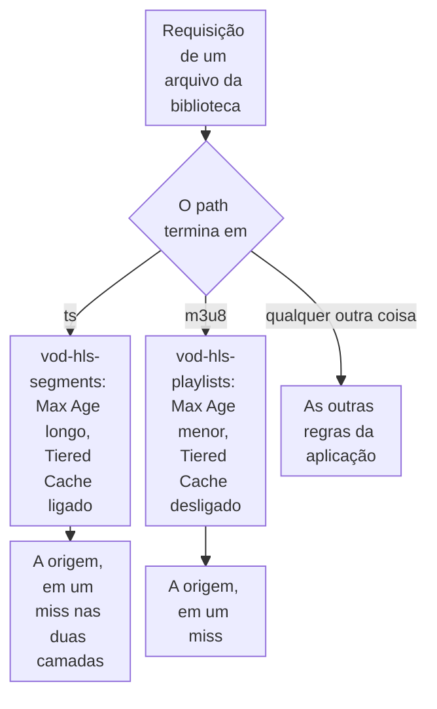

import DocCardGroup from '@aziontech/webkit/doc-card-group'
import DocCard from '@aziontech/webkit/doc-card'
import DocSteps from '@aziontech/webkit/doc-steps'
import DocStep from '@aziontech/webkit/doc-step'
import Tabs from '~/components/webkit/Tabs.vue'

Você dá aos segmentos e às playlists de uma biblioteca HLS sob demanda configurações de cache próprias e aplica cada uma com uma regra na extensão do arquivo, pelo Azion Console, pela Azion API ou pela Azion CLI. Para uma transmissão ao vivo, consulte [Implemente cache HLS para streaming ao vivo](/pt-br/documentacao/guias/midia-e-streaming/streaming/implementar-cache-hls/) quando a sua própria origem a produz, ou [Entregue uma transmissão ao vivo a partir do Live Ingest](/pt-br/documentacao/guias/midia-e-streaming/streaming/entregar-uma-transmissao-ao-vivo-do-live-ingest/) quando o Live Ingest a produz.

Um título HLS é um conjunto de playlists, `.m3u8`, e dos segmentos que elas listam, `.ts`. Um segmento de um título codificado não muda, então pode ficar em cache por muito tempo e usar o [Tiered Cache](/pt-br/documentacao/plataforma/applications/cache/tiered-cache/). Uma playlist pode ser reescrita quando um título é republicado, então recebe um tempo de cache menor e fica fora da camada do Tiered Cache para que um purge por URL a remova.



1. Um path que termina em `.ts` recebe a configuração de cache `vod-hls-segments`.
2. Um path que termina em `.m3u8` recebe a configuração de cache `vod-hls-playlists`.
3. Qualquer outro path fica com as outras regras da aplicação.
4. Um miss chega à origem pelo connector, e a resposta é armazenada em cache sob a configuração que o seu path recebeu.

---

## Pré-requisitos

- Uma aplicação que serve a biblioteca por um connector, para um bucket ou para uma origem HTTP. Para um bucket, consulte [Use um bucket como origem de uma aplicação](/pt-br/documentacao/guias/desenvolvimento-de-aplicacoes/dados/bucket-como-connector/).
- Um [personal token](/pt-br/documentacao/guias/plataforma/conta-e-billing/personal-tokens/), para os procedimentos pela API.
- A [Azion CLI](/pt-br/documentacao/devtools/cli/) instalada e autorizada, para os procedimentos pela CLI.
- Acesso ao Azion Console, para os procedimentos pelo Console. Consulte [Acesse o Azion Console](/pt-br/documentacao/guias/plataforma/conta-e-billing/como-acessar-o-azion-console/).

Os exemplos mantêm os segmentos em cache por `86400` segundos e as playlists por `300` segundos, em uma aplicação servida em `www.example.com`. Substitua-os pelos valores de que a sua biblioteca precisa.

---

## Crie as configurações de cache

Cada tipo de arquivo recebe a sua própria configuração de cache. **Max Age** aceita de 0 a 31.536.000 segundos. Um valor abaixo de 60 exige o [Application Accelerator](/pt-br/documentacao/plataforma/applications/#application-accelerator) na aplicação, ou a API rejeita a configuração com `21021`, então os exemplos ficam em 60 ou mais. O Tiered Cache exige _Override cache behavior_, ou a API rejeita a configuração com `21001`, e um **Max Age** de pelo menos 3 segundos, ou ela falha com `21020`.

As duas configurações substituem o cache do browser por `0` segundos. O Real-Time Purge remove uma cópia das camadas de cache da Azion, e uma cópia que o browser do espectador guarda fica lá até o fim do próprio TTL.

<Tabs client:visible sharedStore="interface">
<Fragment slot="tab.console">Console</Fragment>
<Fragment slot="tab.api">API</Fragment>
<Fragment slot="tab.cli">CLI</Fragment>

<Fragment slot="panel.console">

Para criar a configuração de cache dos segmentos:

<DocSteps>
  <DocStep title="Abra a aba Cache Settings">

  Acesse [Azion Console](https://console.azion.com/) > **Applications**, selecione a aplicação que serve a biblioteca e selecione a aba **Cache Settings**.

  </DocStep>
  <DocStep title="Selecione + Cache" />
  <DocStep title="Nomeie a configuração de cache">

  Em **Name**, insira `vod-hls-segments`.

  </DocStep>
  <DocStep title="Defina o cache do browser">

  Em **Browser Cache**, selecione _Override cache settings_ e defina o TTL como `0`.

  </DocStep>
  <DocStep title="Defina o Max Age">

  Em **Cache**, mantenha _Override cache behavior_ selecionado e defina **Max Age** como `86400`.

  </DocStep>
  <DocStep title="Ative o Tiered Cache">

  Na mesma seção, ative **Tiered Cache** e selecione a região mais próxima em **Tiered Cache Region**.

  </DocStep>
  <DocStep title="Selecione Save" />
</DocSteps>

Crie a configuração de cache das playlists com os mesmos passos: nomeie-a `vod-hls-playlists`, defina **Max Age** como `300` e deixe **Tiered Cache** desativado.

</Fragment>

<Fragment slot="panel.api">

Para criar a configuração de cache dos segmentos, envie o corpo dela às configurações de cache da aplicação:

```bash
curl --request POST \
  --url https://api.azion.com/v4/workspace/applications/<application-id>/cache_settings \
  --header 'Authorization: Token <personal-token>' \
  --header 'Content-Type: application/json' \
  --data '{
  "name": "vod-hls-segments",
  "browser_cache": { "behavior": "override", "max_age": 0 },
  "modules": {
    "cache": {
      "behavior": "override",
      "max_age": 86400,
      "tiered_cache": { "enabled": true, "topology": "nearest-region" }
    }
  }
}'
```

A API responde `201` com a nova configuração em `data`. Anote o `id` dela para a regra:

```json
{"state":"executed","data":{"id":<segments-setting-id>,"name":"vod-hls-segments",...}}
```

Envie a mesma requisição para as playlists, com `"name": "vod-hls-playlists"`, `"max_age": 300` e nenhum objeto `tiered_cache`, e anote o `id` dela também. Sem um objeto `tiered_cache`, o Tiered Cache fica desativado.

</Fragment>

<Fragment slot="panel.cli">

As flags da CLI não definem **Max Age**, o comportamento de cache nem o Tiered Cache, então a CLI lê a configuração de um arquivo. Salve a configuração dos segmentos como `segments.json`:

```json
{
  "name": "vod-hls-segments",
  "browser_cache": { "behavior": "override", "max_age": 0 },
  "modules": {
    "cache": {
      "behavior": "override",
      "max_age": 86400,
      "tiered_cache": { "enabled": true, "topology": "nearest-region" }
    }
  }
}
```

Crie a configuração a partir do arquivo:

```bash
azion create cache-setting --application-id <application-id> --file segments.json
```

O comando imprime o ID da configuração, que a regra nomeia:

```text
Created Cache Settings configuration with ID <segments-setting-id>
```

Salve a configuração das playlists como `playlists.json`, com `"name": "vod-hls-playlists"`, `"max_age": 300` e nenhum objeto `tiered_cache`, e crie-a da mesma forma.

</Fragment>
</Tabs>

As duas configurações aparecem na aba **Cache Settings** da aplicação, e nenhuma se aplica a uma requisição até que uma regra a nomeie.

---

## Aplique cada configuração com uma regra na sua extensão

O operador _matches_ compara o path com uma expressão regular. `\.ts$` escapa o ponto e ancora o padrão no fim do path, então só um path que termina em `.ts` recebe a configuração dos segmentos. `${uri}` guarda o path sem a query string, então um segmento solicitado com uma query string ainda corresponde. A regra usa o behavior _Set Cache Policy_, que não exige outro Product na aplicação.

<Tabs client:visible sharedStore="interface">
<Fragment slot="tab.console">Console</Fragment>
<Fragment slot="tab.api">API</Fragment>
<Fragment slot="tab.cli">CLI</Fragment>

<Fragment slot="panel.console">

Para criar a regra dos segmentos:

<DocSteps>
  <DocStep title="Selecione a aba Rules Engine da aplicação" />
  <DocStep title="Selecione + Rule" />
  <DocStep title="Nomeie a regra">

  Em **General**, insira `cache-vod-segments` como **Name**.

  </DocStep>
  <DocStep title="Selecione a fase de requisição">

  Em **Phase**, selecione _Request Phase_.

  </DocStep>
  <DocStep title="Defina o critério">

  Em **Criteria**, selecione a variável `${uri}` e o operador _matches_, e insira `\.ts$` como argumento.

  </DocStep>
  <DocStep title="Selecione o behavior Set Cache Policy">

  Em **Behaviors**, selecione _Set Cache Policy_ e depois selecione `vod-hls-segments`.

  </DocStep>
  <DocStep title="Selecione Save" />
</DocSteps>

Crie a regra das playlists com os mesmos passos: nomeie-a `cache-vod-playlists`, insira `\.m3u8$` como argumento e selecione `vod-hls-playlists`.

</Fragment>

<Fragment slot="panel.api">

Para criar a regra dos segmentos, substitua `<segments-setting-id>` pelo `id` de `vod-hls-segments`. Em um corpo JSON, a barra invertida da expressão é dobrada:

```bash
curl --request POST \
  --url https://api.azion.com/v4/workspace/applications/<application-id>/request_rules \
  --header 'Authorization: Token <personal-token>' \
  --header 'Content-Type: application/json' \
  --data '{
  "name": "cache-vod-segments",
  "active": true,
  "criteria": [[{ "variable": "${uri}", "conditional": "if", "operator": "matches", "argument": "\\.ts$" }]],
  "behaviors": [{ "type": "set_cache_policy", "attributes": { "value": <segments-setting-id> } }]
}'
```

A API responde `202` com `state` igual a `pending` e a regra como a plataforma a armazenou. Envie a mesma requisição para as playlists, com `"name": "cache-vod-playlists"`, o argumento `"\\.m3u8$"` e o `id` de `vod-hls-playlists`.

</Fragment>

<Fragment slot="panel.cli">

Para criar a regra dos segmentos com a Azion CLI, mantenha-a em um arquivo, porque na linha de comando o shell expandiria `${uri}`. Salve este corpo como `rule-segments.json`, com a barra invertida dobrada, como o JSON exige:

```json
{
  "name": "cache-vod-segments",
  "active": true,
  "criteria": [[{ "variable": "${uri}", "conditional": "if", "operator": "matches", "argument": "\\.ts$" }]],
  "behaviors": [{ "type": "set_cache_policy", "attributes": { "value": <segments-setting-id> } }]
}
```

Crie a regra na fase de requisição da aplicação:

```bash
azion create rules-engine --application-id <application-id> --phase request --file rule-segments.json
```

A saída traz o ID da nova regra:

```text
Created Rules Engine with ID <rule-id>
```

Crie a regra das playlists da mesma forma, com `"name": "cache-vod-playlists"`, o argumento `"\\.m3u8$"` e o ID de `vod-hls-playlists`.

</Fragment>
</Tabs>

Os segmentos ficam em cache por 86.400 segundos no Cache e na camada do Tiered Cache, e as playlists por 300 segundos no Cache. Uma regra nova pode levar alguns minutos para se propagar.

:::caution[Atenção]
Um purge por URL ou por wildcard não chega à camada do Tiered Cache: um purge por cache key é o único tipo que chega. Para remover um segmento guardado nas duas camadas, purgue primeiro o Tiered Cache e depois o Cache, para que a primeira camada não seja reabastecida com uma cópia desatualizada. Para os passos, consulte [Purgue conteúdo em cache](/pt-br/documentacao/guias/performance-e-confiabilidade/cache-e-purge/purgar-conteudo-em-cache/).
:::

No caso de uso [Entregar uma biblioteca de vídeos sob demanda](/pt-br/documentacao/casos-de-uso/entregar-midia-e-streaming/entregar-uma-biblioteca-de-videos-sob-demanda/), esta seção usa estes valores:

| Tipo de arquivo | Cache setting | Max Age | Tiered Cache | Cache do navegador | Regra | Argumento de `${uri}` _matches_ |
| --- | --- | --- | --- | --- | --- | --- |
| Segmentos | `vod-segments` | `31536000` | Ativado, `nearest-region` | Override, `0` | `vod - cache segments` | `\.ts$` |
| Playlists | `vod-playlists` | `3600` | Desativado | Override, `0` | `vod - cache playlists` | `\.m3u8$` |

Os segmentos ficam em cache por 31.536.000 segundos no Cache e na camada do Tiered Cache, e as playlists por 3.600 segundos no Cache. Os navegadores não guardam nenhum dos dois. Uma regra nova leva alguns minutos para se propagar.

---

## Confirme que cada tipo de arquivo responde do cache

O header de requisição `Pragma: azion-debug-cache` faz a resposta carregar o header `x-cache`. Para confirmar a configuração dos segmentos:

<DocSteps>
  <DocStep title="Solicite um segmento com o header de debug">

  ```bash
  curl -sI -H "Pragma: azion-debug-cache" https://www.example.com/<title>/<segment>.ts
  ```

  </DocStep>
  <DocStep title="Execute o mesmo comando de novo">

  O header `x-cache` da segunda resposta começa com `HIT`, porque a Azion respondeu a partir da cópia armazenada. O header também carrega o endereço IP do servidor que respondeu e o protocolo.

  </DocStep>
</DocSteps>

Repita as duas requisições para uma playlist, `https://www.example.com/<title>/<playlist>.m3u8`. A primeira resposta de cada arquivo pode carregar `MISS`, enquanto a Azion o busca na origem. Para cada status que o header pode carregar, consulte [Verifique o status de cache de uma resposta](/pt-br/documentacao/guias/performance-e-confiabilidade/cache-e-purge/verificar-tempo-de-cache-da-pagina/).

No caso de uso [Entregar uma biblioteca de vídeos sob demanda](/pt-br/documentacao/casos-de-uso/entregar-midia-e-streaming/entregar-uma-biblioteca-de-videos-sob-demanda/), espere:

- **Os segmentos respondem pelo cache.** A segunda requisição para `https://videos.example.com/course-101/720p/segment-00001.ts` traz `x-cache: HIT`. A primeira pode trazer `MISS`, enquanto a aplicação lê o segmento do bucket.
- **As playlists respondem pelo cache.** A segunda requisição para a playlist principal traz `x-cache: HIT`.

---

## Próximos passos

<DocCardGroup cols={2}>
  <DocCard title="Cache settings" href="/pt-br/documentacao/plataforma/applications/cache/cache-settings/" label="Cada campo de uma configuração de cache, com o tipo, o padrão, os limites e os erros." />
  <DocCard title="Tiered Cache" href="/pt-br/documentacao/plataforma/applications/cache/tiered-cache/" label="A segunda camada de cache, as topologias, o piso de TTL e como ela é purgada." />
  <DocCard title="Rules Engine para Applications" href="/pt-br/documentacao/plataforma/applications/rules-engine/#operadores" label="Cada variável e operador de critério que uma regra pode usar." />
  <DocCard title="Entregar uma biblioteca de vídeos sob demanda" href="/pt-br/documentacao/casos-de-uso/entregar-midia-e-streaming/entregar-uma-biblioteca-de-videos-sob-demanda/" label="Uma biblioteca HLS guardada no Object Storage e servida com estas duas configurações de cache." />
</DocCardGroup>
