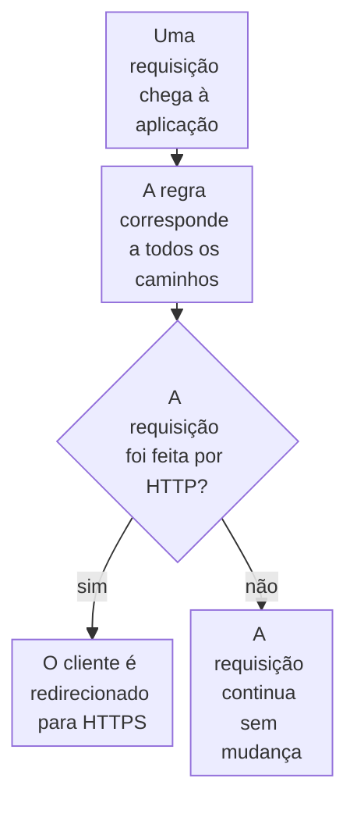

import DocCardGroup from '@aziontech/webkit/doc-card-group'
import DocCard from '@aziontech/webkit/doc-card'
import DocSteps from '@aziontech/webkit/doc-steps'
import DocStep from '@aziontech/webkit/doc-step'
import Tabs from '~/components/webkit/Tabs.vue'

Você redireciona para HTTPS cada requisição feita por HTTP com uma regra na aplicação, pelo Azion Console, pela API ou pela Azion CLI. Para o certificado de que o HTTPS no seu próprio domínio precisa, consulte [Solicite um certificado Let's Encrypt](/pt-br/documentacao/guias/seguranca-de-aplicacoes/tls-e-certificados/como-gerar-um-certificado-lets-encrypt/).

O behavior _Redirect HTTP to HTTPS_ redireciona para HTTPS uma requisição feita por HTTP, e não faz nada com uma requisição já feita por HTTPS. A regra corresponde, portanto, a todos os caminhos, sem condição sobre o esquema. O behavior exige HTTPS ativado nas configurações de protocolo do workload que entrega a aplicação.



1. Toda requisição corresponde à regra, porque o seu critério é `${uri}` _starts with_ `/`.
2. Uma requisição feita por HTTP é redirecionada para HTTPS.
3. Uma requisição feita por HTTPS segue para as regras seguintes, sem mudança.

---

## Pré-requisitos

- Uma aplicação servida por um workload. Para criá-los, consulte [Primeiros passos com Applications](/pt-br/documentacao/plataforma/applications/primeiros-passos/).
- **HTTPS support** ativado em **Protocol Settings** do workload, com um certificado que cubra os domínios do workload. Para a Azion solicitar e renovar um, consulte [Solicite um certificado Let's Encrypt](/pt-br/documentacao/guias/seguranca-de-aplicacoes/tls-e-certificados/como-gerar-um-certificado-lets-encrypt/). Para as portas HTTPS e os campos de TLS, consulte [Configurações de workload](/pt-br/documentacao/plataforma/workloads/configuracoes/#tls).
- Um [personal token](/pt-br/documentacao/guias/plataforma/conta-e-billing/personal-tokens/), para os procedimentos pela API.
- A [Azion CLI](/pt-br/documentacao/devtools/cli/) instalada e autorizada, para os procedimentos pela CLI.

Os exemplos criam a regra na aplicação `<application-id>`, servida em `www.example.com`. Substitua-os pelos seus valores.

---

## Crie a regra de redirecionamento

A regra não exige nenhum Produto na aplicação: `${uri}` lê o caminho sem Application Accelerator, e o behavior não recebe argumento.

<Tabs client:visible sharedStore="interface">
<Fragment slot="tab.console">Console</Fragment>
<Fragment slot="tab.api">API</Fragment>
<Fragment slot="tab.cli">CLI</Fragment>

<Fragment slot="panel.console">

Para criar a regra no Azion Console:

<DocSteps>
  <DocStep title="Vá para a aba Rules Engine">

  Acesse [Azion Console](https://console.azion.com/) > **Applications** > **sua aplicação** e vá para a aba **Rules Engine**.

  </DocStep>
  <DocStep title="Selecione + Rule" />
  <DocStep title="Nomeie a regra">

  Insira um nome que identifique o redirecionamento. Por exemplo: `redirect to HTTPS`.

  </DocStep>
  <DocStep title="Selecione Request Phase" />
  <DocStep title="Corresponda a todos os caminhos">

  Na seção **Criteria**, defina o critério como `${uri}` _starts with_ `/`.

  </DocStep>
  <DocStep title="Na seção Behaviors, selecione Redirect HTTP to HTTPS" />
  <DocStep title="Selecione Save" />
</DocSteps>

A regra aparece na lista **Request** da aba **Rules Engine**.

</Fragment>

<Fragment slot="panel.api">

Os critérios carregam `${uri}`, que um shell expande, então o corpo é enviado de um arquivo. Para criar a regra:

<DocSteps>
  <DocStep title="Escreva a regra em um arquivo">

  Salve o conteúdo a seguir como `rule.json`:

  ```json
  {
    "name": "redirect to HTTPS",
    "active": true,
    "criteria": [[{ "variable": "${uri}", "conditional": "if", "operator": "starts_with", "argument": "/" }]],
    "behaviors": [{ "type": "redirect_http_to_https" }]
  }
  ```

  </DocStep>
  <DocStep title="Envie a requisição de criação">

  ```bash
  curl --request POST \
    --url https://api.azion.com/v4/workspace/applications/<application-id>/request_rules \
    --header 'Accept: application/json' \
    --header 'Authorization: Token <personal-token>' \
    --header 'Content-Type: application/json' \
    --data @rule.json
  ```

  </DocStep>
</DocSteps>

A API responde `202` com `"state": "pending"` e a regra como foi armazenada, com o seu `id` e a sua `order` na fase.

</Fragment>

<Fragment slot="panel.cli">

A CLI lê a regra de um arquivo JSON. Para criar a regra:

<DocSteps>
  <DocStep title="Escreva a regra em um arquivo">

  Salve o conteúdo a seguir como `rule.json`:

  ```json
  {
    "name": "redirect to HTTPS",
    "active": true,
    "criteria": [[{ "variable": "${uri}", "conditional": "if", "operator": "starts_with", "argument": "/" }]],
    "behaviors": [{ "type": "redirect_http_to_https" }]
  }
  ```

  </DocStep>
  <DocStep title="Crie a regra">

  ```bash
  azion create rules-engine --application-id <application-id> --phase request --file rule.json
  ```

  O comando imprime o ID da regra:

  ```text
  Created Rules Engine with ID <rule-id>
  ```

  </DocStep>
</DocSteps>

</Fragment>
</Tabs>

Cada requisição feita por HTTP é redirecionada para HTTPS, e cada requisição HTTPS continua sem mudança. Uma regra nova leva alguns minutos para chegar a todos os data centers.

:::caution[Atenção]
Quando a origem redireciona requisições HTTPS de volta para HTTP, os dois redirecionamentos formam um loop que termina em um erro `500`. Defina **Transport Protocol Policy** do connector como _Force HTTP_, para que a Azion alcance a origem por HTTP, ou remova o redirecionamento. Para as correções, consulte [Códigos de status HTTP](/pt-br/documentacao/fundamentos/codigos-de-status-http/#500-internal-server-error).
:::

No caso de uso [Preparar aplicações web reguladas para auditorias de segurança](/pt-br/documentacao/casos-de-uso/proteger-aplicacoes-e-redes/preparar-aplicacoes-web-reguladas-para-auditorias-de-seguranca/), esta seção usa estes valores:

| Configuração | Valor |
| --- | --- |
| Nome da regra | `audit - redirect to HTTPS`, um nome que um auditor consegue mapear ao controle de criptografia. |
| Critério | `${uri}` _starts with_ `/`, todo caminho de `www.example.com`. |
| Comportamento | _Redirect HTTP to HTTPS_. |

Toda requisição feita por HTTP é redirecionada para HTTPS, e toda requisição HTTPS continua inalterada. Uma regra nova leva alguns minutos para se propagar.

---

## Posicione o redirecionamento antes das regras que encerram o processamento

A plataforma cria uma regra nova no fim da sua fase. Uma regra anterior cujo behavior encerra o processamento, como _Deliver_, _Deny (403 Forbidden)_ ou _Finish Request Phase_, interrompe as regras depois dela, então as requisições a que essa regra corresponde nunca são redirecionadas. Quando a lista tiver uma regra assim, mova a regra de redirecionamento para antes dela.

<Tabs client:visible sharedStore="interface">
<Fragment slot="tab.console">Console</Fragment>
<Fragment slot="tab.api">API</Fragment>
<Fragment slot="tab.cli">CLI</Fragment>

<Fragment slot="panel.console">

Para mover a regra no Azion Console:

<DocSteps>
  <DocStep title="Vá para a aba Rules Engine">

  Acesse [Azion Console](https://console.azion.com/) > **Applications** > **sua aplicação** e vá para a aba **Rules Engine**.

  </DocStep>
  <DocStep title="Mova a regra">

  Na lista **Request**, mova `redirect to HTTPS` para cima de todas as regras que encerram o processamento.

  </DocStep>
</DocSteps>

</Fragment>

<Fragment slot="panel.api">

Para definir a ordem, envie os IDs das regras da fase na nova ordem, a regra de redirecionamento primeiro, no array `order`:

```bash
curl --request PUT \
  --url https://api.azion.com/v4/workspace/applications/<application-id>/request_rules/order \
  --header 'Accept: application/json' \
  --header 'Authorization: Token <personal-token>' \
  --header 'Content-Type: application/json' \
  --data '{ "order": [<redirect-rule-id>, <other-rule-id>] }'
```

A lista nomeia todas as regras da fase, e o campo `order` de cada regra passa então a guardar a sua nova posição, a partir de `0`.

</Fragment>

<Fragment slot="panel.cli">

Para definir a ordem, passe todos os IDs de regra da fase, a regra de redirecionamento primeiro:

```bash
azion update rules-engine-order --application-id <application-id> --phase request --rule-ids "<redirect-rule-id>,<other-rule-id>"
```

O comando confirma a nova ordem:

```text
Ordered Rules Engine of Application with ID <application-id>
```

</Fragment>
</Tabs>

A regra de redirecionamento é executada antes de qualquer regra que encerra o processamento, então cada requisição feita por HTTP chega a ela. Para ver quais regras foram executadas em uma requisição, ative [Debug Rules](/pt-br/documentacao/plataforma/applications/main-settings/#debug-rules).

No caso de uso [Preparar aplicações web reguladas para auditorias de segurança](/pt-br/documentacao/casos-de-uso/proteger-aplicacoes-e-redes/preparar-aplicacoes-web-reguladas-para-auditorias-de-seguranca/), esta seção usa estes valores:

| Configuração | Valor |
| --- | --- |
| Posição | antes de qualquer regra da application cujo comportamento encerra o processamento, para que nenhuma requisição HTTP pule o redirecionamento. |

---

## Confirme o redirecionamento

Uma regra nova leva alguns minutos para chegar a todos os data centers, então repita a requisição até a resposta se manter. Para confirmar o redirecionamento, requisite o domínio por HTTP:

```bash
curl -s -o /dev/null -w '%{redirect_url}\n' http://www.example.com/
```

O comando imprime `https://www.example.com/`.

Estas verificações confirmam o caso de uso [Preparar aplicações web reguladas para auditorias de segurança](/pt-br/documentacao/casos-de-uso/proteger-aplicacoes-e-redes/preparar-aplicacoes-web-reguladas-para-auditorias-de-seguranca/).

---

## Próximos passos

<DocCardGroup cols={2}>
  <DocCard title="Rules Engine para Applications" href="/pt-br/documentacao/plataforma/applications/rules-engine/#redirect-http-to-https" label="O behavior Redirect HTTP to HTTPS e todos os outros behaviors que uma regra executa." />
  <DocCard title="Configurações de workload" href="/pt-br/documentacao/plataforma/workloads/configuracoes/#tls" label="O certificado, a versão mínima de TLS e o cipher suite que um workload apresenta." />
  <DocCard title="Solicite um certificado Let's Encrypt" href="/pt-br/documentacao/guias/seguranca-de-aplicacoes/tls-e-certificados/como-gerar-um-certificado-lets-encrypt/" label="Obtenha para os domínios do workload um certificado que a Azion renova para você." />
  <DocCard title="Preparar aplicações web reguladas para auditorias de segurança" href="/pt-br/documentacao/casos-de-uso/proteger-aplicacoes-e-redes/preparar-aplicacoes-web-reguladas-para-auditorias-de-seguranca/" label="Imponha HTTPS como um dos controles que uma auditoria pede." />
</DocCardGroup>
