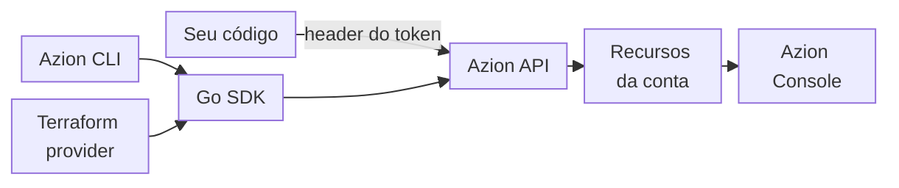

import DocButton from '~/components/webkit/DocButton.vue'
import DocCardGroup from '@aziontech/webkit/doc-card-group'
import DocCard from '@aziontech/webkit/doc-card'

Uma interface de programação de aplicações (API) permite que um programa atue sobre um serviço sem usar a interface web dele. Uma REST API dá a cada objeto do serviço a sua própria URL: o cliente lê o objeto com `GET`, cria com `POST`, altera com `PUT` ou `PATCH` e remove com `DELETE`. Como cada ação é uma requisição HTTP, a mesma chamada roda de um terminal, de um script ou de um pipeline de CI/CD.

**Azion API** expõe os recursos da sua conta Azion como uma REST API sobre HTTPS, na URL base `https://api.azion.com/v4`. Cada requisição leva um personal token, as respostas retornam JSON e cada alteração também aparece no [Azion Console](https://console.azion.com/). Use a Azion API para criar, ler, atualizar e excluir applications, firewalls, functions, network lists, workloads e os demais recursos da sua conta a partir do seu próprio código.

Você também pode gerenciar os mesmos recursos com a [Azion CLI](/pt-br/documentacao/devtools/cli/) ou com o [Azion Terraform Provider](/pt-br/documentacao/devtools/terraform/). Para consultar dados de métricas, eventos, billing e consumo, use a [GraphQL API](/pt-br/documentacao/devtools/graphql/).

<DocButton href="/pt-br/documentacao/devtools/api/primeiros-passos/" label="Primeiros passos" size="medium" />
<DocButton href="https://api.azion.com/" label="Acesse a referência da API" kind="secondary" size="medium" />

---

## Estrutura da requisição

Uma requisição indica o caminho de um recurso sob a URL base e envia o personal token em um header. Esta requisição lista os IDs dos workloads de uma conta:

```bash
curl --request GET \
  --url 'https://api.azion.com/v4/workspace/workloads?page_size=100&fields=id' \
  --header 'Accept: application/json' \
  --header 'Authorization: Token [TOKEN VALUE]'
```

Um `200` retorna uma página de resultados:

```json
{
  "count": 3,
  "total_pages": 1,
  "page": 1,
  "page_size": 100,
  "next": null,
  "previous": null,
  "results": [
    {"id": 1234567890},
    {"id": 1234567891},
    {"id": 1234567892}
  ]
}
```

- **Caminho**: os endpoints de recursos ficam sob `/v4/workspace/`, como `/v4/workspace/workloads` e `/v4/workspace/network_lists`.
- **Header**: `Authorization` leva o personal token com o esquema `Token`.
- **Parâmetros de query**: `page_size=100` pede até 100 resultados na página, e `fields=id` mantém apenas o `id` de cada resultado.
- **Envelope da lista**: `count` é o número de workloads da conta, `total_pages` e `page` situam a página na lista, e `results` contém os workloads. `next` e `previous` são `null` porque a lista tem uma única página.

Se você já chamou uma REST API que retorna JSON, o modelo é o mesmo: um método, uma URL, um header de credencial e um corpo JSON. A [referência da Azion API](https://api.azion.com/) lista cada caminho, método, parâmetro e resposta. A API serve a sua especificação OpenAPI em `https://api.azion.com/v4/openapi/openapi.yaml`.

---

## Clientes da API

O seu código é um entre vários clientes da Azion API. A Azion CLI e o Azion Terraform Provider chegam aos mesmos endpoints por meio do Go SDK.



1. O seu código, ou um cliente HTTP como o `curl`, envia uma requisição para `https://api.azion.com/v4` com o seu personal token no header `Authorization`.
2. A Azion CLI e o Azion Terraform Provider chamam a mesma API por meio do [Go SDK](/pt-br/documentacao/devtools/sdk/).
3. A API autentica o token e, em seguida, cria, lê, altera ou exclui os recursos da sua conta.
4. O Azion Console mostra os mesmos recursos, então uma alteração feita pela API também aparece nele.

---

## Métodos e erros

A maioria dos endpoints aceita os mesmos métodos, divididos entre um caminho de coleção e um caminho de item, e os erros compartilham um único formato de resposta:

- **Métodos**: um caminho de coleção, como `/v4/workspace/network_lists`, aceita `GET` para listar e `POST` para criar. Um caminho de item, como `/v4/workspace/network_lists/<network-list-id>`, aceita `GET`, `PUT`, `PATCH` e `DELETE`. Outro método retorna `405` com o código `10007`, e o header `Allow` da resposta lista os métodos que o caminho aceita.
- **Corpos de sucesso**: uma requisição de um único recurso o retorna dentro de `data`. Um `POST` ou um `PATCH` retorna `"state": "executed"` ao lado de `data`, e um `DELETE` retorna apenas `{"state": "executed"}`.
- **Corpos de erro**: um erro retorna um array `errors`. Cada item traz um `code`, um `title`, um `detail`, um `status` escrito como string e, em geral, um `source` que indica o header ou o campo do corpo com problema. Um `POST` que omite dois campos obrigatórios retorna dois itens, um por campo.

Para os erros que uma requisição pode retornar e como corrigir cada um, consulte [Solucionar problemas da Azion API](/pt-br/documentacao/devtools/api/solucao-de-problemas/).

---

## Autenticação

Cada requisição para a Azion API leva um [personal token](/pt-br/documentacao/fundamentos/personal-tokens/) no header `Authorization`, com o esquema `Token`:

```text
Authorization: Token [TOKEN VALUE]
```

A API também aceita um personal token com o esquema `Bearer`, como `Authorization: Bearer [TOKEN VALUE]`, e aceita o esquema `Token` escrito em minúsculas. Você cria um personal token no Azion Console ou com a Azion CLI, e a Azion mostra o valor dele apenas uma vez, na criação. Para criar um, consulte [Gerencie personal tokens](/pt-br/documentacao/guias/plataforma/conta-e-billing/personal-tokens/).

Uma requisição sem o header retorna `401` com o código `10002`. Uma requisição cujo token a API não aceita retorna `401` com o código `10001`. As duas respostas trazem o header `WWW-Authenticate: Bearer realm="api"`.

---

## Paginação e parâmetros de query

Uma requisição de lista retorna uma página de resultados, e cinco parâmetros de query escolhem qual página e o que cada resultado contém. O número de páginas volta em `total_pages`, e `next` e `previous` são `null` quando não existe uma página seguinte ou anterior. Para ler a página seguinte, envie a mesma requisição com `page` acrescido de um.

| Parâmetro | Efeito |
| --- | --- |
| `page` | Seleciona uma página da lista, contada a partir de `1`. |
| `page_size` | Define o número de resultados por página: 10 por padrão, 100 no máximo. |
| `fields` | Mantém apenas os campos de uma lista separada por vírgulas, como `fields=id,name`. |
| `ordering` | Ordena a lista por um campo, como `ordering=name`. Um `-` antes do campo ordena em ordem decrescente, como em `ordering=-id`. |
| `search` | Restringe a lista aos resultados que correspondem a um termo de busca, como `search=astro`. |

Um valor de `ordering` que não indica nenhum campo é ignorado: a requisição retorna `200` e a lista mantém a ordem padrão por ID. Em um único recurso, `fields` pode retornar mais do que os campos que você indicou: em uma network list, `fields=id,name` também retorna `is_versioned` e `version`. Para os termos que a API usa, consulte [Glossário](/pt-br/documentacao/devtools/api/glossario/).

---

## Versões da API

A Azion API v4 é a versão que estas páginas documentam, servida em `https://api.azion.com/v4`, e a sua especificação OpenAPI declara a versão `4.0.0`. Uma conta passa da API v3 para ela por meio de uma migração. Para os recursos e endpoints que mudam, consulte [Migração para API v4](/pt-br/documentacao/fundamentos/api-v4-migration/). Para verificar a versão da sua conta, consulte [Verifique a versão da API da sua conta](/pt-br/documentacao/guias/seguranca-de-aplicacoes/acesso-e-compliance/verificar-migracao-conta/).

---

## Limites

Dois limites valem para cada requisição de lista, e cada um retorna um erro quando o valor é ultrapassado:

| Limite | Valor | Além do valor |
| --- | --- | --- |
| Resultados por página, `page_size` | 10 por padrão, 100 no máximo | `400`, código `10097` |
| Número da página, `page` | De `1` até o valor de `total_pages` da lista | `404`, código `10004` |

Cada resposta autenticada também traz quatro headers de rate limit. Os headers têm esta forma:

```text
X-RateLimit-Limit: 200
X-RateLimit-Remaining: 199
X-RateLimit-Reset: 2026-10-03T14:18:14.621625
X-RateLimit-Scope: global-default
```

`X-RateLimit-Limit` é `200` e `X-RateLimit-Scope` é `global-default` em todas as respostas. `X-RateLimit-Remaining` faz a contagem regressiva a partir do limite conforme você envia requisições. `X-RateLimit-Reset` informa o horário do próximo reset como um timestamp ISO 8601 sem fuso horário, cerca de um minuto após a requisição.

---

## Próximos passos

<DocCardGroup cols={2}>
  <DocCard title="Primeiros passos com a Azion API" href="/pt-br/documentacao/devtools/api/primeiros-passos/" label="Envie suas primeiras requisições e, em seguida, crie, renomeie e exclua uma network list." />
  <DocCard title="Gerencie personal tokens" href="/pt-br/documentacao/guias/plataforma/conta-e-billing/personal-tokens/" label="Crie o token que autentica cada requisição." />
  <DocCard title="Solucionar problemas da Azion API" href="/pt-br/documentacao/devtools/api/solucao-de-problemas/" label="Corrija uma requisição que falha com 401, 400, 404 ou 405." />
  <DocCard title="Referência da Azion API" href="https://api.azion.com/" label="Consulte o caminho, o método e os campos de qualquer endpoint." />
</DocCardGroup>
