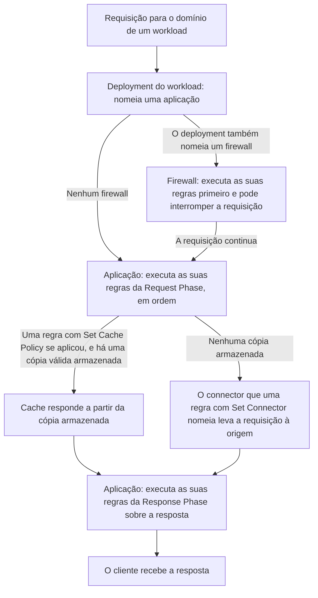

import DocButton from '~/components/webkit/DocButton.vue'
import DocCardGroup from '@aziontech/webkit/doc-card-group'
import DocCard from '@aziontech/webkit/doc-card'

Um proxy reverso é um servidor que recebe requisições no lugar dos servidores que guardam o seu conteúdo, as origens. Ele lê cada requisição antes de uma origem e decide o que acontece com ela. Ele pode responder a partir de uma cópia que armazenou antes, adicionar ou remover um header, executar código, ou passar a requisição a uma origem e repassar a resposta. Os clientes acessam um único domínio, e a lógica que cada origem carregaria de outra forma é executada na frente de todas elas.

**Applications** é o recurso da plataforma que executa esse proxy na infraestrutura distribuída da Azion, perto dos seus usuários, para cada [workload](/pt-br/documentacao/plataforma/workloads/) cujo deployment o nomeia. Uma aplicação age por meio de regras, que são executadas em uma fase de requisição e em uma fase de resposta. As regras dela decidem qual [connector](/pt-br/documentacao/plataforma/connectors/) leva uma requisição até a sua origem, o que é respondido a partir de uma cópia armazenada e qual função é executada. Use Applications para encaminhar cada path à sua origem, armazenar respostas em cache, adicionar ou filtrar headers, reescrever requisições, executar o seu próprio código ou redimensionar e converter imagens sob demanda.

<DocButton href="/pt-br/documentacao/plataforma/applications/primeiros-passos/" label="Primeiros passos" size="medium" />
<DocButton href="/pt-br/documentacao/plataforma/applications/rules-engine/" label="Referência de Applications" kind="secondary" size="medium" />

---

## Estrutura da regra

As regras carregam a lógica de uma aplicação. Uma regra testa cada requisição contra os seus critérios e, quando a requisição corresponde, executa os seus behaviors. Enviada como corpo de `POST /v4/workspace/applications/<application-id>/request_rules`, esta regra entrega toda requisição ao connector que alcança a sua origem:

```json
{
  "name": "send-to-origin",
  "active": true,
  "criteria": [
    [
      {
        "variable": "${uri}",
        "conditional": "if",
        "operator": "starts_with",
        "argument": "/"
      }
    ]
  ],
  "behaviors": [
    {
      "type": "set_connector",
      "attributes": { "value": <connector-id> }
    }
  ]
}
```

- `criteria` guarda grupos de condições, e a primeira condição de um grupo abre com `if`. Aqui, `${uri}`, a URI sem a query string, corresponde a toda requisição com `starts_with` e `/`, porque todo path começa com `/`. A mesma regra sobre `${request_uri}`, que mantém a query string, é recusada com `400` e o erro `25047` enquanto Application Accelerator está desativado.
- `behaviors` lista o que a regra faz com cada requisição que corresponde a ela. `set_connector` entrega a requisição ao connector cujo ID está em `attributes.value`, e o connector guarda o endereço da sua origem.
- `name` e `active` são campos da própria regra. A API responde `202` e retorna a regra com `order` igual a `0`, a sua posição entre as regras da Request Phase da aplicação.
- Azion Console monta a mesma regra na aba **Rules Engine** da aplicação, a partir de **+ Rule**, _Request Phase_, um critério sobre `${uri}` e o behavior _Set Connector_.

Se você já encaminhou tráfego por path em um proxy reverso, o modelo se mantém: os critérios são a condição de correspondência, os behaviors são a ação e um connector é o servidor de backend.

---

## Caminho da requisição

Criar uma aplicação não serve nada. Uma aplicação trata somente as requisições de um workload cujo deployment a nomeia, e só chega a uma origem por meio de uma regra que nomeia um connector.



1. Um workload recebe a requisição, e o deployment dele nomeia a aplicação. No Azion Console, o vínculo é o campo **Application** de **Deployment Settings**, e `azion create workload-deployment` o recebe como `--application-id`. Quando o deployment também nomeia um [firewall](/pt-br/documentacao/plataforma/firewall/), o firewall executa as suas regras primeiro e pode interromper a requisição.
2. A aplicação executa as suas regras da Request Phase, em ordem. Um behavior que encerra o processamento, como _Deny (403 Forbidden)_, responde ao cliente, e nenhuma regra posterior é executada.
3. Quando uma regra com _Set Cache Policy_ aplicou um cache setting e há uma cópia válida armazenada, Cache responde a partir da cópia, e a origem não é consultada.
4. Caso contrário, o connector que uma regra com _Set Connector_ nomeia leva a requisição à origem. Quando várias regras que correspondem à requisição carregam _Set Connector_, somente a última é executada.
5. A aplicação executa as suas regras da Response Phase sobre a resposta, e o cliente a recebe.

Uma aplicação nova tem Cache e Functions ativos, Application Accelerator e Image Processor desativados e nenhuma regra. Até que uma regra nomeie um connector, ela não tem origem para onde enviar uma requisição. Nenhum tempo de propagação é garantido para uma alteração. Um workload novo responde com o `404` de placeholder da Azion até que o seu vínculo com a aplicação se propague, o que levou 5 minutos e 51 segundos em um caso e cerca de 11 minutos em outro. Até lá, as respostas se alternam entre o placeholder e a aplicação, então envie a requisição de novo até que elas concordem. Para as duas fases, a ordem em que as regras e os behaviors são executados e a propagação, consulte [Como Applications funciona](/pt-br/documentacao/plataforma/applications/como-funciona/).

---

## Recursos

Cache, Application Accelerator e Image Processor são Produtos habilitados em uma aplicação, cada um com o seu próprio switch em [Main Settings](/pt-br/documentacao/plataforma/applications/main-settings/#produtos) › **Modules**.

### Cache

Cache responde às requisições seguintes por um objeto a partir de uma cópia da resposta da origem, mantida no data center que a buscou até que o seu tempo de vida (TTL) termine. Use-o para manter arquivos estáticos perto dos seus usuários, entregar arquivos de vídeo grandes em fragmentos, continuar a responder enquanto a origem está fora do ar ou remover uma cópia no momento em que a origem muda. Cache vem ativo em toda aplicação nova, mas não armazena nada até que uma regra com _Set Cache Policy_ aplique um cache setting, o objeto que guarda os TTLs.

Para saber por quanto tempo uma cópia vive e o que a encerra antes do prazo, e para os campos, as keys, os purges e a segunda camada de cache por trás dela, consulte [Expiração e atualização](/pt-br/documentacao/plataforma/applications/cache/expiracao-e-atualizacao/), [Cache settings](/pt-br/documentacao/plataforma/applications/cache/cache-settings/), [Cache keys](/pt-br/documentacao/plataforma/applications/cache/cache-keys/), [Real-Time Purge](/pt-br/documentacao/plataforma/applications/cache/real-time-purge/) e [Tiered Cache](/pt-br/documentacao/plataforma/applications/cache/tiered-cache/). Para armazenar em cache a sua primeira resposta, consulte [Primeiros passos com Cache](/pt-br/documentacao/plataforma/applications/cache/primeiros-passos/).

### Application Accelerator

Application Accelerator decide o que, além da URL, torna duas requisições diferentes, como um argumento de query string, um cookie, o device group ou o método da requisição, e Cache então mantém uma cópia separada para cada um. Ative-o quando uma URL tem mais de uma resposta correta, como uma página personalizada, uma resposta de API que muda com uma query string, um catálogo que difere por dispositivo ou uma resposta a um `POST`. O switch dele vem desativado em uma aplicação nova, e ativá-lo também libera o cache de `POST` e `OPTIONS`, um **Max Age** menor que 60 segundos, mais sete behaviors do Rules Engine e as variáveis `${request_uri}` e `${device_group}`.

Para saber o que cada variação custa e como um purge a alcança, e para os campos que a definem, consulte [Variação de cache](/pt-br/documentacao/plataforma/applications/application-accelerator/variacao-de-cache/) e [Configurações do Application Accelerator](/pt-br/documentacao/plataforma/applications/application-accelerator/configuracoes/). Para variar um primeiro cache setting, consulte [Primeiros passos com Application Accelerator](/pt-br/documentacao/plataforma/applications/application-accelerator/primeiros-passos/).

### Image Processor

Image Processor constrói uma imagem derivada a partir da imagem de origem que está no servidor de origem, conforme a query string `ims` da requisição, como `?ims=fit-in/400x400`, e nunca salva o resultado como um ativo da conta. Ative-o quando as páginas precisam de uma imagem em vários tamanhos, recortes, qualidades ou formatos, como WEBP para os browsers que o aceitam, sem armazenar ou fazer upload de um arquivo para cada variante. O switch dele vem desativado em uma aplicação nova, e ativá-lo não processa nada por si só: uma regra da Request Phase com _Optimize Images_ decide quais requisições chegam a ele.

Para saber como o formato entregue é escolhido e como o cache mantém as imagens derivadas separadas, as operações que `ims` aceita e os headers e behaviors envolvidos, consulte [Entrega de imagens](/pt-br/documentacao/plataforma/applications/image-processor/entrega-de-imagens/), [Parâmetros de URL](/pt-br/documentacao/plataforma/applications/image-processor/parametros-de-url/) e [Configurações do Image Processor](/pt-br/documentacao/plataforma/applications/image-processor/configuracoes/). Para requisitar a sua primeira imagem derivada, consulte [Primeiros passos com Image Processor](/pt-br/documentacao/plataforma/applications/image-processor/primeiros-passos/).

---

## Escopo e limites

- **Fases**: uma regra é executada na Request Phase, sobre a requisição antes que exista uma resposta, ou na Response Phase, sobre a resposta entregue ao usuário. A fase é definida quando a regra é criada e não pode mudar, e a escolha da origem e do cache setting acontece somente na Request Phase. Para as variáveis e os behaviors de cada fase e o Produto de que cada um precisa, consulte [Rules Engine para Applications](/pt-br/documentacao/plataforma/applications/rules-engine/#fases).
- **Origens**: o registro da aplicação não nomeia nenhuma origem, então duas regras com dois connectors podem enviar `/api/` para um servidor e todos os outros paths para outro. Por trás de um connector, a origem pode ser servidores web na sua infraestrutura, um serviço em cloud ou um bucket do [Object Storage](/pt-br/documentacao/plataforma/object-storage/), como mostra [Use um bucket como origem de uma aplicação](/pt-br/documentacao/guias/desenvolvimento-de-aplicacoes/dados/bucket-como-connector/). Um connector pode distribuir o tráfego entre várias origens por meio de [Load Balancer](/pt-br/documentacao/plataforma/connectors/#load-balancer). Azion Console informa que as origens foram redesenhadas como connectors.
- **Functions**: uma aplicação executa o seu código por meio de uma [instância de função](/pt-br/documentacao/plataforma/applications/functions-instances/), que vincula uma função de [Functions](/pt-br/documentacao/plataforma/functions/) à aplicação com os seus próprios argumentos. Uma regra com _Run Function_ invoca a instância, e uma instância que nenhuma regra nomeia nunca é executada. **Functions** vem ativo em uma aplicação nova. Para a Response Phase, o formulário de instância no Azion Console informa `Only Lua functions can be used in the Response phase.` Para vincular a sua primeira função, consulte [Instancie uma função em uma aplicação](/pt-br/documentacao/guias/desenvolvimento-de-aplicacoes/primeiros-passos/instanciar-functions/).
- **Cache e imagens em código**: Cache não executa código, então uma função que lê e grava entradas em cache usa a [Cache API](/pt-br/documentacao/devtools/runtime/api-reference/cache/). Uma função que processa imagens por conta própria usa a biblioteca WASM Image Processor, uma superfície diferente de Image Processor, como explica [Onde Image Processor para](/pt-br/documentacao/plataforma/applications/image-processor/entrega-de-imagens/#onde-image-processor-para).
- **Dispositivos**: um [device group](/pt-br/documentacao/plataforma/applications/device-groups/) nomeia os dispositivos cujo header `User-Agent` corresponde a uma expressão regular. Uma regra o testa por meio de `${device_group}`, e um cache setting pode manter uma cópia por grupo, ambos com Application Accelerator ativo. Para uma expressão que corresponda somente aos dispositivos que você pretende alcançar, consulte [Boas práticas de Applications](/pt-br/documentacao/plataforma/applications/boas-praticas/#defina-um-device-group-pelas-palavras-que-so-esse-dispositivo-envia).
- **WebSocket**: [WebSocket Proxy](/pt-br/documentacao/plataforma/applications/websocket/) transporta uma conexão WebSocket, aberta com os headers `Upgrade: websocket` e `Connection: upgrade`, entre os seus usuários e a origem por meio de uma aplicação. Ele está disponível com Business, Enterprise ou Mission-Critical Support, ou com um contrato de Reserved Capacity ou Saving Plan, mediante solicitação ao [suporte técnico](/pt-br/documentacao/suporte/). A Azion recicla as conexões keepalive aproximadamente a cada 15 minutos, então o cliente reabre uma conexão WebSocket que se fecha.
- **Workloads**: domínios, protocolos e certificados pertencem ao workload que serve a aplicação, então uma aplicação não carrega configurações de entrega próprias. _Redirect HTTP to HTTPS_ precisa de HTTPS no workload. A página de erro que um cliente vê quando o connector recebe uma resposta 4xx ou 5xx da sua origem é definida por [Custom Pages](/pt-br/documentacao/plataforma/workloads/#custom-pages) no workload. Para requisitar uma aplicação no seu próprio domínio a partir de um dispositivo antes de alterar os registros DNS dele, consulte [Teste uma aplicação pelo arquivo hosts](/pt-br/documentacao/guias/desenvolvimento-de-aplicacoes/primeiros-passos/testar-edge-application-atraves-do-arquivo-hosts/).
- **Interfaces**: você cria e gerencia aplicações na página **Applications** do [Azion Console](https://console.azion.com). Cada aplicação tem as abas **Main Settings**, **Device Groups**, **Cache Settings**, **Functions Instances** e **Rules Engine**. **Clone**, uma ação de linha da lista **Applications**, cria uma aplicação separada que começa com as configurações da original, como mostra [Clone uma aplicação](/pt-br/documentacao/guias/desenvolvimento-de-aplicacoes/primeiros-passos/clonar-applications/). [Azion API](https://api.azion.com/) serve as aplicações em `/v4/workspace/applications`, e [Azion CLI](/pt-br/documentacao/devtools/cli/) as gerencia com comandos como `azion create application`, `azion update application` e `azion create rules-engine`. [`azion.config.js`](/pt-br/documentacao/devtools/cli/azion-config-js/), [Azion Lib](/pt-br/documentacao/devtools/azion-lib/application/) e [Azion Terraform provider](/pt-br/documentacao/devtools/terraform/) também criam e configuram aplicações. Uma conta que não migrou para a API v4 segue [Applications | v3](/pt-br/documentacao/plataforma/applications/v3/).
- **Observabilidade**: com **Debug Rules** ativo em [Main Settings](/pt-br/documentacao/plataforma/applications/main-settings/#debug-rules), [Real-Time Events](/pt-br/documentacao/plataforma/real-time-events/) e [Data Stream](/pt-br/documentacao/plataforma/data-stream/) mostram as regras que cada requisição executou, no campo `$traceback`. A configuração vem desativada em uma aplicação nova. A resposta a uma requisição enviada com `Pragma: azion-debug-cache` informa o seu status de cache, como `HIT` ou `MISS`, no header `x-cache`. [Real-Time Metrics](/pt-br/documentacao/plataforma/real-time-metrics/) mostra o tráfego de Cache e de Tiered Cache. Para as ferramentas e as consultas, consulte [Solucionar problemas de Applications](/pt-br/documentacao/plataforma/applications/solucao-de-problemas/) e [Solucionar problemas de Applications](/pt-br/documentacao/plataforma/applications/solucao-de-problemas/).
- **Limites**: uma aplicação guarda até 200 regras somando as duas fases. Uma regra carrega de 1 a 5 grupos de 1 a 10 critérios, e de 1 a 10 behaviors. Uma conta guarda 10 aplicações no Developer Support, 50 no Business, 200 no Enterprise e um número personalizável no Mission-Critical. Um cache setting aceita um **Max Age** de no mínimo 60 segundos sem Application Accelerator, e um único objeto em cache pode chegar a 10 GB. Para cada limite, a resposta quando ele é ultrapassado e os limites de cada Produto, consulte [Limites de Applications](/pt-br/documentacao/plataforma/applications/limites/).
- **Cobrança**: Cache é cobrado por purges, Application Accelerator por transferência de dados e Image Processor por imagens processadas, e ativar um Produto pode gerar custos relacionados ao uso. Cada plano inclui uma quantidade de cada um, como 1.000 purges por mês no Hobby e 2.000 no Pro. Para as quantidades, consulte [Limites de Applications](/pt-br/documentacao/plataforma/applications/limites/#uso-incluido-por-plano), e para os valores, consulte [Preços](/pt-br/documentacao/fundamentos/precos/).
- **Termos**: o [glossário de Applications](/pt-br/documentacao/plataforma/applications/glossario/) define as palavras às quais as páginas de Applications dão um significado específico, como regra, fase, behavior, cache setting, cache key e imagem derivada.

---

## Próximos passos

<DocCardGroup cols={2}>
  <DocCard title="Primeiros passos" href="/pt-br/documentacao/plataforma/applications/primeiros-passos/" label="Envie cada requisição de uma aplicação nova para a sua origem." />
  <DocCard title="Como funciona" href="/pt-br/documentacao/plataforma/applications/como-funciona/" label="Acompanhe uma requisição por uma aplicação e veja onde cada Produto age sobre ela." />
  <DocCard title="Rules Engine para Applications" href="/pt-br/documentacao/plataforma/applications/rules-engine/" label="Consulte uma variável, um operador ou um behavior, e o Produto de que ele precisa." />
  <DocCard title="Guias e tutoriais" href="/pt-br/documentacao/plataforma/applications/guias/" label="Conclua uma tarefa específica, de um device group a um template de framework." />
  <DocCard title="Limites" href="/pt-br/documentacao/plataforma/applications/limites/" label="Consulte um limite, a resposta quando ele é ultrapassado ou o que um plano inclui." />
  <DocCard title="Solução de problemas" href="/pt-br/documentacao/plataforma/applications/solucao-de-problemas/" label="Encontre a causa quando as requisições nunca chegam à origem ou uma regra não age." />
</DocCardGroup>
