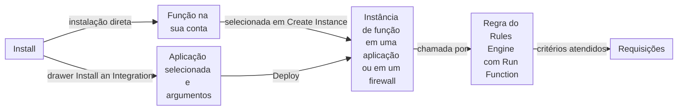

import FrameBox from '@aziontech/webkit/frame-box'
import ItemList from '@aziontech/webkit/item-list'
import DocItem from '@aziontech/webkit/doc-item'

Um catálogo de software permite adicionar à sua própria configuração um código que outra pessoa desenvolve e mantém, em vez de escrevê-lo você mesmo. Você leva uma listagem para a sua conta e decide onde ela é executada, com quais configurações e quando passar para uma versão mais recente.

O [Azion Marketplace](/pt-br/documentacao/plataforma/marketplace/) é esse catálogo no [Azion Console](https://console.azion.com/). A Azion e vendedores terceiros, os fornecedores independentes de software (ISVs), publicam nele dois tipos de listagem. Uma integração é uma função que você instala na sua conta e depois executa em uma aplicação ou em um firewall. Um template é um projeto pré-configurado que você implanta para criar uma aplicação e os recursos ao redor dela. A publicação de uma listagem é um processo separado; para ela, consulte [Requisitos e taxas para vendedores](/pt-br/documentacao/plataforma/marketplace/marketplace-seller-guide/).

As seções acompanham uma integração desde a instalação até a requisição em que ela é executada e, em seguida, tratam de versões, licenças, do que um template implanta e das permissões que uma instalação solicita.

---

## Integrações

Uma integração do Marketplace é uma função com duas partes. O código define o que a integração faz, e você não pode modificá-lo. Os argumentos, os **Args**, definem os valores que o código lê, e você os personaliza para o seu uso.

Selecionar **Install** na página de uma integração no Azion Console segue um de dois fluxos, dependendo da integração:

- **Instalação direta.** A instalação adiciona a função da integração à sua conta, e nada mais. A página da integração passa a exibir "Successfully installed!" e "Latest version installed!". Nenhuma requisição chega à função até que você mesmo crie uma instância de função e uma regra, como descrito abaixo. A/B Testing é instalada dessa forma.
- **O drawer Install an Integration.** Uma integração que inclui um template de instalação abre esse drawer. Em **Select an Application**, você escolhe a aplicação na lista **Application** ou cria uma com **Create New**. Em seguida, o drawer exibe um formulário com os argumentos da integração, que variam de uma integração para outra, e os privilégios que a instalação solicita. A implantação a partir do drawer instancia a integração na aplicação selecionada.

Depois de uma instalação direta, executar a integração sobre o tráfego exige três objetos na aplicação ou no firewall:

- **O módulo Functions.** Você o ativa na seção **Modules** da aba **Main Settings** do recurso.
- **Uma instância de função.** Você a cria na aba **Functions Instances** do recurso. O drawer **Create Instance** pede um **Name** e uma **Function**, onde a integração instalada aparece, e preenche **Arguments** com os argumentos padrão da integração em JSON. O texto de ajuda do drawer diz "Customize the arguments in JSON format. Once set, they can be called in code using EVENT.ARGS('ARG_NAME')."
- **Uma regra do Rules Engine com o comportamento Run Function.** Os critérios da regra decidem quais requisições executam a instância.

Por exemplo, depois que você instala A/B Testing, a função aparece como _A/B Testing [Global]_ na lista **Function** do drawer **Create Instance** de uma aplicação. Selecioná-la preenche **Arguments** com os valores padrão, que você ajusta para essa aplicação.

Este diagrama acompanha uma integração desde a instalação até as requisições em que ela é executada, por qualquer um dos fluxos:

1. Em uma instalação direta, a função da integração fica disponível na sua conta. Em uma aplicação ou em um firewall com o módulo **Functions** ativo, você cria uma instância de função que seleciona a integração e define os argumentos.
2. No fluxo do drawer, você seleciona uma aplicação e preenche os argumentos da integração. A implantação cria a instância de função nessa aplicação.
3. Uma regra do Rules Engine cujo comportamento é **Run Function** chama a instância.
4. Cada requisição que atende aos critérios da regra executa o código da integração com os argumentos da instância.

Um firewall acrescenta uma condição: ele inspeciona requisições somente quando a implantação de um workload o nomeia. Uma integração em um firewall que nenhuma implantação nomeia não é executada em nenhuma requisição. Para mais informações, consulte [Como Firewall funciona](/pt-br/documentacao/plataforma/firewall/como-funciona/).

O fluxo direto mantém a instalação separada da instância e da regra, então a instalação nunca altera o seu tráfego, e você escolhe depois onde a integração é executada. Os argumentos ficam na instância, então dois recursos podem executar a mesma integração com argumentos diferentes. O custo é que uma instalação direta sozinha não faz nada: uma integração sem instância, ou sem uma regra que a execute, nunca é executada. O fluxo do drawer vincula a instalação a uma aplicação desde o início. Para os passos dos dois fluxos, consulte [Instale uma integração](/pt-br/documentacao/guias/desenvolvimento-de-aplicacoes/integracoes/instalar-uma-integracao/).

### Integrações de aplicação e de firewall

Cada integração é executada em um de dois Platform Resources. Uma integração de aplicação processa dados e executa serviços perto dos seus usuários, dentro do caminho da requisição de uma [aplicação](/pt-br/documentacao/plataforma/applications/). Uma integração de firewall cuida de segurança de rede, autenticação e controle de tráfego em um [firewall](/pt-br/documentacao/plataforma/firewall/).

Os dois tipos não se misturam. Em um firewall, a lista **Function** do drawer **Create Instance** mostra apenas funções de firewall, como _Bot Manager Lite v0.2.0_. A aba **Functions Instances** do firewall também só aparece quando o módulo **Functions** está ativo. Para ver onde cada integração é executada, consulte [Integrações do Marketplace](/pt-br/documentacao/plataforma/marketplace/integracoes/).

---

## Versões

A Azion e seus parceiros atualizam as integrações do Marketplace quando adicionam funcionalidades. Quando existe uma versão mais recente de uma integração instalada, a página da integração no Azion Console habilita o botão **Get New Version**. Na lista de aplicações do drawer de instalação, a tag _Update Available_ marca uma aplicação que pode receber a versão mais recente. Quando a versão instalada é a mais recente, a página exibe "Latest version installed!".

Obter uma versão não sobrescreve a versão que uma aplicação executa. O Azion Console avisa que "Updating will create a new instance of the integration's function." A sua instância de função existente mantém a versão até que você selecione a mais recente na lista **Function** da instância. Esse controle tem um custo: uma atualização só chega ao seu tráfego quando você altera cada instância.

Por exemplo, você pode selecionar a versão mais recente primeiro em uma aplicação de teste. Depois que ela passar na sua validação, você a seleciona na aplicação que atende a produção. Para os passos, consulte [Atualize uma integração](/pt-br/documentacao/guias/desenvolvimento-de-aplicacoes/integracoes/atualizar-uma-integracao/).

---

## Licenças

A licença de uma integração do Marketplace decide como você a obtém. A página da integração mostra a licença em um card ao lado da ação que a instala:

| Licença | O que o card oferece | O que você fornece |
| --- | --- | --- |
| **Free License** | "Install this integration using the available free model." e o botão **Install** | Nada além da instalação. Você paga somente quando usa a integração, sujeito aos termos de uso dela |
| **Bring Your Own License** | O uso de uma licença que você comprou antes | Credenciais válidas do provedor da integração, que autenticam a sua conta e conectam a Azion ao provedor |
| **Buy to Subscribe** | Um contato com o Azion Sales Team | A assinatura que você combina com Azion Sales |

Com Free License e Bring Your Own License, a Azion cobra pelos serviços da Azion que o seu uso da integração gera. Uma integração de terceiros precisa de credenciais válidas do provedor, então tenha-as antes de instalar. Para saber como os vendedores definem esses modelos e as cobranças, consulte [Requisitos e taxas para vendedores](/pt-br/documentacao/plataforma/marketplace/marketplace-seller-guide/).

---

## Templates

Um template do Marketplace funciona de forma diferente de uma integração. Em vez de adicionar uma função a recursos que você já tem, a implantação de um template cria os recursos sobre os quais um projeto é executado:

- **Uma aplicação** que reúne todas as configurações do template.
- **Um domínio da Azion** que dá acesso à aplicação. Você também pode [adicionar um domínio personalizado](/pt-br/documentacao/guias/plataforma/migracao/configurar-dominio/).
- **A configuração de que o caso de uso precisa**, definida pelo template.
- **Uma função**, em alguns templates, com os argumentos e as dependências de que ela precisa.
- **Um repositório no GitHub** com os arquivos do template, incluindo a função e uma GitHub Action. Depois que você ativa a action, cada alteração é implantada continuamente, e o repositório mantém um histórico de implantações rastreável.

Após a implantação, todos esses recursos são seus, e você pode alterar qualquer configuração no Azion Console. Alguns templates baseados em frameworks também podem começar pela Azion CLI. Para mais informações, consulte [Primeiros passos com a Azion CLI](/pt-br/documentacao/devtools/cli/primeiros-passos/).

Um template também pode trazer custos e contas. Alguns templates precisam de produtos da Azion que você ativa separadamente no Azion Console, e esses produtos podem gerar custos de uso; para os valores, consulte [Preços](/pt-br/documentacao/fundamentos/precos/). Alguns templates se integram a um serviço de terceiros, o que exige uma conta nesse serviço e a configuração inicial dele, e o serviço pode cobrar pelo uso. Todos os templates e os guias deles estão listados em [Templates do Marketplace](/pt-br/documentacao/plataforma/marketplace/templates/).

---

## Permissões

Uma integração que altera uma aplicação precisa de privilégios sobre ela. Quando uma instalação abre o drawer **Install an Integration** e você seleciona uma aplicação, o Azion Console lista esses privilégios com a mensagem "Azion Marketplace requires the following privileges on the selected Application." e um link para **Marketplace's Permissions**.

Os privilégios cobrem os módulos de **Main Settings** da aplicação que a integração usa, como **Functions**, e as regras do Rules Engine dela, onde o comportamento **Run Function** chama a integração. Uma integração executada em um firewall precisa de mais privilégios do que uma aplicação concede. Para cada privilégio e o motivo pelo qual uma integração o solicita, consulte [Permissões do Marketplace](/pt-br/documentacao/plataforma/marketplace/permissoes-marketplace/).

---

## Recursos relacionados

<FrameBox>
<ItemList>
  <DocItem title="Integrações do Marketplace" href="/pt-br/documentacao/plataforma/marketplace/integracoes/">Todas as integrações, o que cada uma faz, se é executada em uma aplicação ou em um firewall e o guia dela.</DocItem>
  <DocItem title="Instale uma integração" href="/pt-br/documentacao/guias/desenvolvimento-de-aplicacoes/integracoes/instalar-uma-integracao/">Os passos que instalam uma integração e a executam com uma instância de função e uma regra.</DocItem>
  <DocItem title="Primeiros passos com o Marketplace" href="/pt-br/documentacao/plataforma/marketplace/primeiros-passos/">Um primeiro percurso pelo catálogo, de encontrar uma listagem até instalá-la.</DocItem>
  <DocItem title="Templates do Marketplace" href="/pt-br/documentacao/plataforma/marketplace/templates/">Todos os templates, o que cada um implanta e o link do Console que inicia a implantação.</DocItem>
</ItemList>
</FrameBox>
