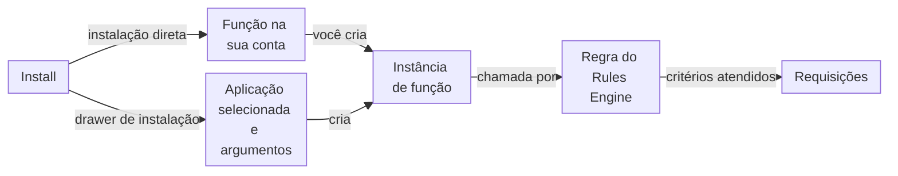

import DocButton from '~/components/webkit/DocButton.vue';
import DocCardGroup from '@aziontech/webkit/doc-card-group'
import DocCard from '@aziontech/webkit/doc-card'

Um catálogo de software lista códigos que outras equipes criam e mantêm, para que você os adicione à sua própria configuração em vez de escrevê-los. Você escolhe uma listagem, leva para a sua conta e decide onde ela é executada e com quais configurações. O publicador mantém o código, e você mantém a configuração.

O **Azion Marketplace** é esse catálogo no [Azion Console](https://console.azion.com/). A Azion e vendedores terceiros, que são fornecedores independentes de software (ISVs), desenvolvedores de software e comunidades de código aberto, publicam nele dois tipos de listagem. Uma integração é uma função que é executada em uma das suas aplicações ou firewalls. Um template é um projeto pré-configurado que você implanta para criar uma aplicação. Use o Marketplace para bloquear bots, validar tokens, e-mails e números de telefone, executar testes A/B, centralizar redirecionamentos ou iniciar um projeto a partir de um framework.

<DocButton href="/pt-br/documentacao/plataforma/marketplace/primeiros-passos/" label="Primeiros passos" size="medium" />
<DocButton href="/pt-br/documentacao/plataforma/marketplace/guias/" label="Guias do Marketplace" kind="secondary" size="medium" />

---

## Integrações e templates

O catálogo no Azion Console abre com um campo **Search on Marketplace**, as seções **Featured** e **New releases** e **Categories** como _Security_ e _Performance_. Cada listagem tem a própria página, com **Overview**, **Usage**, **Changelog**, detalhes de **Support** e um card de licença ao lado da ação que a instala.

- **Uma integração** traz um código que você não pode modificar e argumentos, os **Args**, que você personaliza. Cada integração é executada em uma aplicação ou em um firewall, nunca nos dois. Todas as integrações, o que cada uma faz e onde é executada estão em [Integrações do Marketplace](/pt-br/documentacao/plataforma/marketplace/integracoes/).
- **Um template** cria recursos em vez de adicionar algo a recursos existentes: uma aplicação, um domínio Azion, a configuração do caso de uso, uma função em alguns templates e um repositório no GitHub com os arquivos do template. Todos os templates e seus guias estão em [Templates do Marketplace](/pt-br/documentacao/plataforma/marketplace/templates/).

Cada listagem tem um guia com suas configurações e dependências. Os guias estão em [Guias e tutoriais do Marketplace](/pt-br/documentacao/plataforma/marketplace/guias/). O vocabulário da seção está no [Glossário](/pt-br/documentacao/plataforma/marketplace/glossario/).

---

## Caminho de uma integração

Instalar uma integração nem sempre altera o seu tráfego. Dependendo da integração, **Install** segue um de dois fluxos, e uma integração é executada em uma requisição somente quando uma regra do Rules Engine chama a instância de função dela.

1. Em uma instalação direta, **Install** adiciona a função da integração à sua conta, e nada mais. A/B Testing é instalada dessa forma.
2. Em uma aplicação ou em um firewall com o módulo **Functions** ativo, você cria uma instância de função que seleciona a integração. A instância guarda os argumentos, preenchidos com os valores padrão da integração.
3. Uma integração que inclui um template de instalação abre o drawer **Install an Integration**. Você seleciona uma aplicação, preenche os argumentos da integração, e o drawer instancia a integração nessa aplicação.
4. Uma regra do Rules Engine com o comportamento **Run Function** chama a instância. Cada requisição que atende aos critérios da regra executa o código da integração com os argumentos da instância.

Como os argumentos ficam na instância, dois recursos podem executar a mesma integração com valores diferentes. Para o modelo completo, incluindo versões e o que um template implanta, consulte [Como o Marketplace funciona](/pt-br/documentacao/plataforma/marketplace/como-funciona/). Para os passos dos dois fluxos, consulte [Instale uma integração](/pt-br/documentacao/guias/desenvolvimento-de-aplicacoes/integracoes/instalar-uma-integracao/).

---

## Escopo e limites

- **Recursos da plataforma**: uma integração de aplicação processa dados e executa serviços no caminho da requisição de uma [aplicação](/pt-br/documentacao/plataforma/applications/). Uma integração de firewall cuida de segurança de rede, autenticação e controle de tráfego em um [firewall](/pt-br/documentacao/plataforma/firewall/), que só é executado quando a implantação de um workload o nomeia.
- **Licenças**: a página de uma integração oferece uma de três licenças. **Free License** instala com **Install**, e você paga apenas quando usa a integração, sujeito aos termos de uso dela. **Bring Your Own License** executa a integração com uma licença ou credenciais que você já tem, e **Buy to Subscribe** leva à equipe de vendas da Azion. Consulte [Licenças](/pt-br/documentacao/plataforma/marketplace/como-funciona/#licencas).
- **Credenciais de terceiros**: uma integração de um provedor terceiro precisa de credenciais válidas desse provedor, que autenticam a sua conta e conectam a Azion ao provedor. Algumas exigem uma conta ou uma configuração inicial do lado do provedor.
- **Permissões**: uma integração que altera uma aplicação solicita privilégios sobre os módulos de **Main Settings** e as regras do Rules Engine dela, e o Azion Console os lista antes da instalação. Uma integração de firewall precisa de mais privilégios do que uma aplicação concede. Consulte [Permissões do Marketplace](/pt-br/documentacao/plataforma/marketplace/permissoes-marketplace/).
- **Custos**: a Azion cobra pelos serviços Azion que o uso de uma integração gera. Um template pode exigir produtos Azion que você ativa separadamente, e um serviço terceiro que ele usa pode cobrar pelo uso. Para os valores, consulte [Preços](/pt-br/documentacao/fundamentos/precos/).
- **Versões**: uma versão mais recente de uma integração instalada não substitui a versão que as suas instâncias executam. Atualizar cria uma nova instância da função da integração, e você mesmo migra cada instância. Consulte [Atualize uma integração](/pt-br/documentacao/guias/desenvolvimento-de-aplicacoes/integracoes/atualizar-uma-integracao/).
- **Interfaces**: você navega, instala e atualiza listagens no [Azion Console](https://console.azion.com/). Alguns templates baseados em frameworks também podem ser iniciados pela [Azion CLI](/pt-br/documentacao/devtools/cli/).
- **Venda**: a Azion revisa cada vendedor e cada produto antes de publicá-los e cobra dos vendedores uma taxa de listagem escalonada sobre cada transação. Consulte [Requisitos e taxas para vendedores](/pt-br/documentacao/plataforma/marketplace/marketplace-seller-guide/) e o [Marketplace Agreement](/en/documentation/agreements/marketplace-agreement/).

Se tiver algum problema ao instalar ou usar uma listagem do Marketplace, consulte as [Diretrizes de suporte](/pt-br/documentacao/suporte/).

---

## Próximos passos

<DocCardGroup cols={2}>
  <DocCard title="Primeiros passos" href="/pt-br/documentacao/plataforma/marketplace/primeiros-passos/" label="Instale a integração Hello World em uma aplicação e veja a resposta dela." />
  <DocCard title="Como o Marketplace funciona" href="/pt-br/documentacao/plataforma/marketplace/como-funciona/" label="Acompanhe uma integração da instalação até as requisições em que ela é executada." />
  <DocCard title="Integrações do Marketplace" href="/pt-br/documentacao/plataforma/marketplace/integracoes/" label="Encontre uma integração para um caso de uso e veja onde ela é executada." />
  <DocCard title="Templates do Marketplace" href="/pt-br/documentacao/plataforma/marketplace/templates/" label="Inicie um projeto a partir de um template e veja o que ele implanta." />
  <DocCard title="Guias e tutoriais do Marketplace" href="/pt-br/documentacao/plataforma/marketplace/guias/" label="Configure uma integração ou um template específico, passo a passo." />
  <DocCard title="Torne-se um vendedor no Marketplace" href="/pt-br/documentacao/plataforma/marketplace/isv-signup/" label="Publique o seu próprio produto no catálogo." />
</DocCardGroup>
