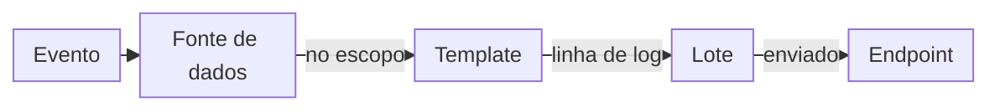

import DocButton from '~/components/webkit/DocButton.vue';
import DocCardGroup from '@aziontech/webkit/doc-card-group'
import DocCard from '@aziontech/webkit/doc-card'

Log streaming é uma forma de coletar os registros que uma plataforma escreve sobre o tráfego e a conta dela. A plataforma envia cada registro, no momento em que ele acontece, para um destino que você opera, como um SIEM (um sistema de gerenciamento de informações e eventos de segurança), um data warehouse ou um processador de streams. Você analisa os registros nas suas próprias ferramentas e não consulta uma API repetidamente para coletá-los.

**Data Stream** envia os logs de eventos do [Activity History](/pt-br/documentacao/fundamentos/activity-history/), de [aplicações](/pt-br/documentacao/plataforma/applications/), de [functions](/pt-br/documentacao/plataforma/functions/) e do WAF para um endpoint por stream. Cada stream formata os eventos com um template e os envia em lotes. Use Data Stream para [alimentar um SIEM com eventos do WAF](/pt-br/documentacao/guias/seguranca-de-aplicacoes/firewall-e-waf/integrar-siems/), [manter logs de requisições em um data warehouse](/pt-br/documentacao/guias/plataforma/observabilidade/google-bigquery-endpoint/), auditar as mudanças feitas na sua conta ou [depurar functions](/pt-br/documentacao/guias/plataforma/observabilidade/debugging-functions-data-stream/).

<DocButton href="/pt-br/documentacao/plataforma/data-stream/primeiros-passos/" label="Primeiros passos" size="medium" />
<DocButton href="/pt-br/documentacao/plataforma/data-stream/configuracoes-do-stream/" label="Configurações do stream" kind="secondary" size="medium" />

---

## Objeto do stream

Um stream é um objeto JSON. Este envia todos os eventos do Activity History para um bucket pelo protocolo S3:

```json
{
  "name": "activity-to-bucket",
  "active": true,
  "inputs": [{ "type": "raw_logs", "attributes": { "data_source": "activity_history" } }],
  "transform": [
    { "type": "sampling", "attributes": { "rate": 100 } },
    { "type": "render_template", "attributes": { "template": 251 } }
  ],
  "outputs": [
    {
      "type": "s3",
      "attributes": {
        "host_url": "https://s3.us-east-005.azionstorage.net", "region": "us-east-005",
        "bucket_name": "<your-bucket>", "object_key_prefix": "activity",
        "access_key": "[ACCESS KEY]", "secret_key": "[SECRET KEY]",
        "content_type": "plain/text"
      }
    }
  ]
}
```

- `inputs` guarda a fonte de dados, pelo slug dela na API. `activity_history` é *Activity History* no Azion Console.
- `transform` guarda o escopo do stream, que é exatamente um entre um item `sampling` e um item `filter_workloads`. Um `rate` de `100` envia todos os eventos.
- `transform` também guarda o template que renderiza cada evento como uma linha de log. O template `251` é o template predefinido *Activity History Collector*.
- `outputs` guarda o único endpoint para o qual o stream envia. O Console rotula esse campo como **Connector**.

O formulário do Console escreve o mesmo objeto, e as seções **General**, **Input**, **Transform**, **Render Template**, **Output** e **Status** dele correspondem a essas chaves. Para cada campo, consulte [Configurações do stream](/pt-br/documentacao/plataforma/data-stream/configuracoes-do-stream/#objeto-do-stream).

---

## Caminho de entrega

Um stream não envia cada linha de log quando o evento dela acontece. Ele renderiza os eventos como linhas de log, agrupa as linhas em um lote e envia o lote.



1. Um evento acontece: uma requisição chega a uma aplicação, uma function escreve uma mensagem de log, WAF analisa uma requisição ou alguém altera a conta.
2. A fonte de dados registra o evento. O stream mantém o evento somente quando ele fica dentro do escopo que o sampling ou o filtro de workloads define.
3. O template renderiza o evento como uma linha de log. O data set dele mapeia cada chave da linha para uma variável, como `"status": "$status"`.
4. A linha de log entra em um lote, que fecha com 2.000 linhas de log ou após 60 segundos, o que acontecer primeiro. Uma linha de log pode esperar até um minuto antes de sair.
5. O stream envia o lote fechado para o endpoint. Data Stream verifica cada endpoint uma vez por minuto e descarta as linhas de log de um intervalo quando o endpoint está indisponível.
6. [Real-Time Events](/pt-br/documentacao/plataforma/real-time-events/fontes-de-dados/#data-stream) registra cada envio, com o status HTTP que o endpoint retornou.

Salvar um stream verifica o formato dos campos dele, não o endpoint, então os primeiros registros de entrega no Real-Time Events são o teste de um stream. Para cada etapa, consulte [Como o Data Stream funciona](/pt-br/documentacao/plataforma/data-stream/como-funciona/).

---

## Escopo e limites

- **Fontes de dados**: um stream coleta de uma entre quatro fontes de dados: *Activity History*, *Applications*, *Functions* ou *WAF Events*. *WAF Events* precisa do [Firewall](/pt-br/documentacao/plataforma/firewall/) com WAF. Para as variáveis de cada uma, consulte [Fontes de dados e variáveis](/pt-br/documentacao/plataforma/data-stream/fontes-de-dados-e-variaveis/).
- **Endpoints**: um stream envia para um entre 11 tipos de endpoint: *Standard HTTP/HTTPS POST*, *Apache Kafka*, *Simple Storage Service (S3)*, *Google BigQuery*, *Elasticsearch*, *Splunk*, *AWS Kinesis Data Firehose*, *Datadog*, *IBM QRadar*, *Azure Monitor* e *Azure Blob Storage*. Enviar os mesmos eventos para dois endpoints exige dois streams. Para os campos de cada tipo, consulte [Endpoints](/pt-br/documentacao/plataforma/data-stream/endpoints/).
- **Templates**: a Azion fornece cinco [templates predefinidos](/pt-br/documentacao/plataforma/data-stream/templates-e-payload/#templates-predefinidos), e você escreve um [template personalizado](/pt-br/documentacao/plataforma/data-stream/templates-e-payload/#templates-personalizados) para escolher as variáveis de cada linha de log.
- **Lotes**: um lote guarda 2.000 linhas de log ou 60 segundos de eventos. Um endpoint *AWS Kinesis Data Firehose* recebe lotes de 500 linhas de log ou 60 segundos, e um lote *Standard HTTP/HTTPS POST* também fecha ao atingir o **Payload Max Size** dele. Os logs chegam à sua infraestrutura em até 3 minutos.
- **Escopo**: um stream carrega uma taxa de sampling ou um filtro de [workloads](/pt-br/documentacao/plataforma/workloads/) escolhidos, nunca os dois. Salvar um stream ativo com sampling desativa todos os outros streams da conta, enquanto streams com filtro de workloads rodam lado a lado. Para as duas opções, consulte [Configurações do stream](/pt-br/documentacao/plataforma/data-stream/configuracoes-do-stream/#transform).
- **Interfaces**: você cria, visualiza, edita e exclui streams no [Azion Console](https://console.azion.com/) e pela [Azion API](https://api.azion.com/v4), em `/v4/workspace/stream/streams`. Azion CLI não tem comando de stream. Para alterar ou remover um stream, consulte [Edite, pare ou exclua um stream](/pt-br/documentacao/guias/plataforma/observabilidade/deletar-data-stream/).
- **Permissões**: **View Data Stream** mostra os streams da conta, e **Edit Data Stream** é necessária para criar, editar ou excluir um stream. Para saber como elas são concedidas, consulte [Permissões de equipes](/pt-br/documentacao/fundamentos/teams-permissions/).
- **Registros de entrega**: Real-Time Events registra cada envio com o status, as linhas de log e os bytes dele. A aba **Data Stream** dos [dashboards de Observe do Real-Time Metrics](/pt-br/documentacao/plataforma/real-time-metrics/dashboards-observe/#data-stream) soma os envios ao longo do tempo.
- **Uso por plano**: Data Stream não exige etapa de ativação: um stream é executado assim que você o salva. Ele é cobrado por Requests e Data Transfer, e cada plano inclui uma quantidade mensal dos dois, listada em [Limites de Data Stream](/pt-br/documentacao/plataforma/data-stream/limites/#uso-incluido-por-plano). Para os valores, consulte [Preços](/pt-br/documentacao/fundamentos/precos/#data-stream).
- **Falhas**: quando um endpoint está indisponível ou responde com um erro, as linhas de log daquele envio não chegam a ele. Para as causas e as correções, consulte [Solucionar problemas de Data Stream](/pt-br/documentacao/plataforma/data-stream/solucao-de-problemas/).

Data Stream não armazena nem consulta logs. Real-Time Events mantém os eventos brutos dos seus produtos por 7 dias e os eventos do Activity History por 2 anos, enquanto o seu endpoint mantém o que o stream envia pelo tempo que você decidir.

---

## Próximos passos

<DocCardGroup cols={2}>
  <DocCard title="Primeiros passos" href="/pt-br/documentacao/plataforma/data-stream/primeiros-passos/" label="Envie os seus primeiros logs para um bucket agora." />
  <DocCard title="Como funciona" href="/pt-br/documentacao/plataforma/data-stream/como-funciona/" label="Acompanhe um evento da fonte de dados dele até o seu endpoint." />
  <DocCard title="Endpoints" href="/pt-br/documentacao/plataforma/data-stream/endpoints/" label="Encontre os campos do seu SIEM ou da sua plataforma de dados." />
  <DocCard title="Guias e tutoriais de Data Stream" href="/pt-br/documentacao/plataforma/data-stream/guias/" label="Conclua uma tarefa específica com um stream." />
</DocCardGroup>
