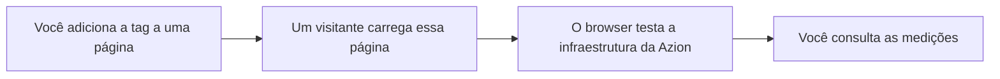

import DocButton from '~/components/webkit/DocButton.vue'
import DocCardGroup from '@aziontech/webkit/doc-card-group'
import DocCard from '@aziontech/webkit/doc-card'

Real User Monitoring (RUM) é um modelo de monitoramento passivo que captura dados do dispositivo de uma pessoa que está de fato usando um site. Um script que a página carrega roda dentro desse browser, mede como foi a visita e envia o resultado de volta. O modelo responde como o seu conteúdo chegou até pessoas reais, nas condições em que essas pessoas estavam, em vez do que um teste agendado de outro lugar encontraria. Para saber como o setor usa o termo e como ele se compara ao monitoramento sintético, consulte [Real-time monitoring](https://www.azion.com/en/learning/observability/what-is-real-time-monitoring/).

**Edge Pulse** executa esse modelo nas páginas que você publica e monitora em tempo real a performance e a qualidade do acesso dos seus visitantes às suas aplicações web. Você coloca a [tag JavaScript do Edge Pulse](/pt-br/documentacao/plataforma/edge-pulse/tag-javascript/) em cada página que você quer medir. O browser de cada visitante que carrega uma delas mede navegação, disponibilidade, latência e largura de banda contra a infraestrutura distribuída da Azion. Use Edge Pulse para ver o que os seus visitantes experimentaram, encontrar onde a entrega de conteúdo é ineficiente e melhorar a experiência que o próximo visitante recebe.

<DocButton href="/pt-br/documentacao/plataforma/edge-pulse/primeiros-passos/" label="Primeiros passos" size="medium" />
<DocButton href="/pt-br/documentacao/plataforma/edge-pulse/tag-javascript/" label="Tag JavaScript do Edge Pulse" kind="secondary" size="medium" />

---

## Caminho da medição

As duas pontas da cadeia são suas. Você decide quais páginas carregam a tag e você decide quando pedir o resultado. Edge Pulse devolve as medições como uma consulta, não como uma visualização.

1. Você copia a tag JavaScript do Edge Pulse no Azion Console e cola na página, antes da tag `body` de fechamento. Uma tag cobre uma página e nenhum objeto da plataforma muda.
2. Um visitante abre a página e o browser dele executa a tag. O momento em que ela executa depende de qual das duas tags você colou.
3. A tag roda um teste contra três endereços da infraestrutura distribuída da Azion e depois fica em silêncio nesse browser por 30 minutos.
4. Os resultados viajam do browser até os servidores de processamento da Azion.
5. Você os lê de volta com a API GraphQL que [Real-Time Events](/pt-br/documentacao/plataforma/real-time-events/) serve.

Para saber o que um único teste mede, como um visitante é distinguido de outro e para onde um resultado vai depois, consulte [Como o Edge Pulse funciona](/pt-br/documentacao/plataforma/edge-pulse/como-funciona/).

---

## Escopo e limites

- **Coleta**: a tag JavaScript do Edge Pulse é a única forma de coletar uma medição e ela vai em cada página que você quer monitorar. Marcar uma página de um site mede apenas aquela página, e uma página sem tag não produz medição nenhuma.
- **Tags**: Azion Console fornece duas formas da tag, a **Default Tag** e a **Pre-loading Tag**. A segunda forma existe para páginas cujas configurações de Content Security Policy impedem o JavaScript inline. Para saber onde cada forma vai e quando ela executa, consulte [Tag JavaScript do Edge Pulse](/pt-br/documentacao/plataforma/edge-pulse/tag-javascript/).
- **Coleta fixa**: a tag não tem configuração. Não existe taxa de amostragem, nem campo para excluir, nem forma de deixar o seu próprio tráfego fora. Ela também mede o carregamento em que roda e não observa trocas de rota posteriores, então uma single-page application é medida uma vez por carregamento completo.
- **Cadência**: um único teste cobre três endereços da infraestrutura distribuída da Azion, e um visitante contribui com um teste a cada 30 minutos. A cadência limita o que o dispositivo do visitante gasta para ser medido.
- **Configurações do browser**: o valor `navigator.doNotTrack` no browser do visitante governa o tempo de vida do identificador que Edge Pulse atribui a esse visitante. Para os dois valores e o que cada um faz, consulte [Tag JavaScript do Edge Pulse](/pt-br/documentacao/plataforma/edge-pulse/tag-javascript/).
- **Interfaces**: você pega a tag no [Azion Console](https://console.azion.com), atrás de um botão **Copy to Clipboard**. É só isso que o Azion Console tem para Edge Pulse: não existe tela que exiba as medições em gráfico ou em lista. Você as lê com a API GraphQL que Real-Time Events serve, e nem a versão 4 nem a versão 3 da API REST expõe Edge Pulse, então toda leitura é uma consulta. Para obter um token e enviar uma primeira consulta, consulte [Primeiros Passos API GraphQL](/pt-br/documentacao/devtools/graphql/primeiros-passos/).
- **Disponibilidade**: toda conta Azion já tem Edge Pulse ativado, então não há produto a criar nem configuração a ativar. Os planos **Hobby**, **Pro** e **Enterprise** incluem o produto sem custo adicional, conforme [Preços](/pt-br/documentacao/fundamentos/precos/#edge-pulse).

Edge Pulse responde como uma visita foi do lado do visitante. Ele não conta o que a Azion entregou, requisição por requisição, que é [Real-Time Metrics](/pt-br/documentacao/plataforma/real-time-metrics/). Para saber onde as medições de usuários reais se situam entre as outras formas de medir a velocidade com que uma aplicação responde, consulte [Testar a velocidade de uma aplicação](/pt-br/documentacao/fundamentos/testar-a-velocidade/). Para os termos que estas páginas usam, consulte [Glossário](/pt-br/documentacao/plataforma/edge-pulse/glossario/).

---

## Próximos passos

<DocCardGroup cols={2}>
  <DocCard title="Primeiros passos com Edge Pulse" href="/pt-br/documentacao/plataforma/edge-pulse/primeiros-passos/" label="Copie a tag e comece a coletar medições das suas páginas." />
  <DocCard title="Como o Edge Pulse funciona" href="/pt-br/documentacao/plataforma/edge-pulse/como-funciona/" label="Acompanhe uma medição da página com a tag até o teste e a consulta." />
  <DocCard title="Tag JavaScript do Edge Pulse" href="/pt-br/documentacao/plataforma/edge-pulse/tag-javascript/" label="As duas formas da tag, onde cada uma vai e o que ela coleta." />
  <DocCard title="Campos da API GraphQL do Real-Time Events" href="/pt-br/documentacao/devtools/graphql/campos-gql-real-time-events/" label="Os campos que o dataset pulseEvents carrega e o formato de uma consulta." />
</DocCardGroup>
