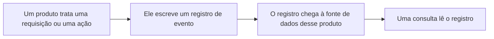

import DocButton from '~/components/webkit/DocButton.vue'
import DocCardGroup from '@aziontech/webkit/doc-card-group'
import DocCard from '@aziontech/webkit/doc-card'

Um sistema que serve tráfego pode escrever um registro para cada unidade de trabalho que executa: o endereço de onde uma requisição veio, o caminho que ela pediu, o status com que ela foi respondida e o tempo que ela levou. Esses registros são mantidos por um período fixo e consultados campo a campo, então uma pergunta feita depois do fato é respondida pelo que foi escrito, e não pelo que alguém lembra. No fim do período, os registros são removidos, e a pergunta que eles responderiam não pode mais ser feita.

**Real-Time Events** é o recurso da plataforma que guarda esses registros na infraestrutura distribuída da Azion e os entrega de volta. Cada produto Azion escreve os próprios registros em uma fonte de dados própria, e cada fonte de dados carrega o conjunto de variáveis pré-organizadas que esse produto preenche. Use Real-Time Events para consultar os registros do tráfego passado, inspecionar um possível ataque, depurar uma [function](/pt-br/documentacao/plataforma/functions/), medir a performance de uma [aplicação](/pt-br/documentacao/plataforma/applications/) ou verificar o que mudou em uma conta.

<DocButton href="/pt-br/documentacao/plataforma/real-time-events/primeiros-passos/" label="Primeiros passos" size="medium" />
<DocButton href="/pt-br/documentacao/plataforma/real-time-events/guias/" label="Guias de Real-Time Events" kind="secondary" size="medium" />

---

## Estrutura da consulta

Uma consulta nomeia o dataset que ela lê, o período que ela cobre, os valores que a reduzem e os campos que ela retorna. Esta consulta pede ao dataset `workloadEvents` a requisição mais recente que respondeu `400` dentro de uma janela de dez minutos:

```graphql
{
  workloadEvents(
    limit: 1
    filter: {
      tsRange: { begin: "2026-09-20T16:00:00", end: "2026-09-20T16:10:00" }
      statusIn: [400]
    }
    orderBy: [ts_DESC]
  ) {
    ts
    requestId
    host
    status
  }
}
```

A linha que ela retorna:

```json
{
  "ts": "2026-09-20T16:03:51Z",
  "requestId": "1123d5bf29651faaaaf6e09dbafcc4e3",
  "host": "<your-workload-domain>",
  "status": 400
}
```

- `workloadEvents` é o dataset que guarda os registros da fonte de dados HTTP Requests. Toda fonte de dados tem um.
- `filter` carrega `tsRange`, que delimita o período, e um argumento para cada valor em que a busca é reduzida, como `statusIn`.
- `orderBy` define a ordem em que as linhas voltam e `limit` limita quantas delas voltam.
- O selection set nomeia os campos que a resposta carrega, e um campo que ele não nomeia não é retornado.

A API é GraphQL, então o que você sabe sobre selection sets, argumentos e input objects aninhados se aplica a uma consulta. Uma busca no [Azion Console](https://console.azion.com) faz as mesmas escolhas pelos próprios controles e chama cada campo de um registro de variável, em vez de campo.

---

## Caminho do registro

Real-Time Events não observa nada por conta própria. Um registro existe porque um produto o escreveu, então uma aplicação que não serve nenhuma requisição e uma conta em que ninguém mexe não produzem registro nenhum.



1. Um produto trata uma unidade de trabalho: uma requisição, uma consulta DNS, uma entrega a um endpoint configurado ou uma ação na conta.
2. O produto escreve um registro de evento para essa unidade, com um valor para cada variável que a fonte de dados dele define.
3. O registro é escrito na fonte de dados do produto que o produziu e em nenhuma outra, então uma busca seleciona uma fonte de dados antes de selecionar qualquer outra coisa.
4. Uma consulta nomeia essa fonte de dados, um período e os filtros, e lê os registros que correspondem. Um registro fica consultável pouco depois do evento, e não no instante dele.
5. O registro é removido no fim do período de retenção dele, tenha alguém o lido ou não.

Uma variável não é um evento próprio. Um evento produz um registro, e as variáveis são os campos desse registro. Para o caminho completo, o atraso até um registro responder a uma busca e o que uma consulta lê antes de retornar uma linha, consulte [Como Real-Time Events funciona](/pt-br/documentacao/plataforma/real-time-events/como-funciona/).

---

## Escopo e limites

- **Fontes de dados**: oito, uma para cada produto que escreve registros. São HTTP Requests, Functions, Functions Console, Image Processor, Tiered Cache, Edge DNS, Data Stream e Activity History. Cada uma carrega as próprias variáveis, porque cada produto escreve um registro diferente. Para cada fonte de dados, o dataset que a guarda e as variáveis que ela carrega, consulte [Fontes de dados](/pt-br/documentacao/plataforma/real-time-events/fontes-de-dados/).
- **Interfaces**: você lê os registros no **Azion Console** e com a API GraphQL do Real-Time Events, em `https://api.azion.com/v4/events/graphql`. Esse endereço também serve o GraphiQL Playground em um navegador. Para obter um token e enviar uma primeira consulta, consulte [Primeiros passos da API GraphQL](/pt-br/documentacao/devtools/graphql/primeiros-passos/). Para os campos que cada dataset carrega, consulte [Campos da API GraphQL do Real-Time Events](/pt-br/documentacao/devtools/graphql/campos-gql-real-time-events/).
- **Retenção**: um registro de evento é mantido por 7 dias, equivalentes a 168 horas, e depois é removido. Os registros de Activity History são mantidos por 2 anos. Um período que alcança mais longe que a retenção não retorna nada para a parte que fica fora dela, porque não resta nada lá para ler.
- **Limites de consulta**: uma consulta é limitada nas linhas que ela retorna, nos campos que ela seleciona e no tamanho do payload dela. A API GraphQL limita a taxa com que aceita requisições, e o banco de dados de logs limita as linhas que uma consulta lê antes de responder. Uma busca sem filtros sobre um período amplo alcança esse último limite e falha, em vez de retornar um resultado parcial. Para cada valor e a resposta que uma consulta que o ultrapassa recebe, consulte [Limites](/pt-br/documentacao/plataforma/real-time-events/limites/).
- **Cobrança**: Real-Time Events é cobrado por duas métricas, Storage e Data Scan, ambas por GB. Storage mede o volume de registros mantidos e Data Scan mede o volume que uma consulta lê, e não o volume que ela retorna, conforme [Preços](/pt-br/documentacao/fundamentos/precos/).

Real-Time Events responde a perguntas sobre registros individuais e não os agrega. Os contadores agregados sobre o mesmo tráfego são [Real-Time Metrics](/pt-br/documentacao/plataforma/real-time-metrics/), e um fluxo contínuo desses mesmos registros para um endpoint seu é [Data Stream](/pt-br/documentacao/plataforma/data-stream/).

---

## Próximos passos

<DocCardGroup cols={2}>
  <DocCard title="Primeiros passos com Real-Time Events" href="/pt-br/documentacao/plataforma/real-time-events/primeiros-passos/" label="Faça uma primeira busca e leia o registro que ela retorna." />
  <DocCard title="Como Real-Time Events funciona" href="/pt-br/documentacao/plataforma/real-time-events/como-funciona/" label="Acompanhe um registro do produto que o escreve até a consulta que o lê." />
  <DocCard title="Fontes de dados" href="/pt-br/documentacao/plataforma/real-time-events/fontes-de-dados/" label="Descubra qual produto escreve o registro de que você precisa e as variáveis que ele carrega." />
  <DocCard title="Limites" href="/pt-br/documentacao/plataforma/real-time-events/limites/" label="Consulte um período de retenção, um limite de consulta ou o que uma consulta recusada recebe." />
</DocCardGroup>
